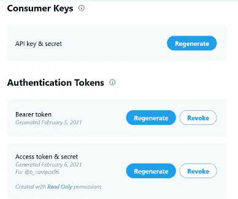
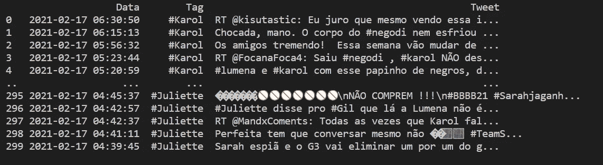
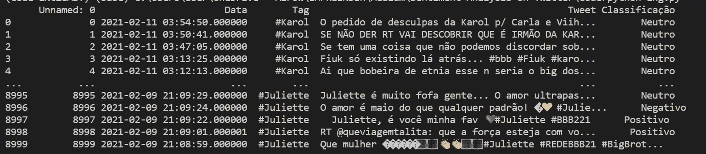

# 如何在 Twitter 上为自己喜欢的话题做情感分析

> 原文：<https://medium.com/analytics-vidhya/how-to-make-a-sentiment-analysis-for-your-favorite-topics-on-twitter-ce6427f4d5b?source=collection_archive---------22----------------------->

在我的例子中，我将使用巴西最大的媒体节目——BBB 或“老大哥巴西”,它目前已经是第 21 届了。


巴西收视率最高的电视节目之一的 20 名参与者

受到其他教程的启发(在帖子的最后给它们命名)，我决定使用 Python、Twitter 的 API tweepy 和其他一些我在这个过程中需要的 NLP 库来制作自己的教程。

我这样做是作为一个有趣的项目，其他人可能也想这样做，但请记住，这是一个简化的项目，使用预先训练的模型。

# 安装

首先，我在我的机器上创建了一个新的虚拟环境。当你像我一样，试图同时做大量的事情时，虚拟环境有助于让事情井然有序

*   在提示符下键入 *pipenv shell* 来启动虚拟环境

之后，我们将导入我们要使用的库:

*   tweepy——Twitter 的 API
*   熊猫——使用数据框架
*   NLTK——自然语言工具包，NLP 项目中使用的公共库
*   Sklearn — Sci-kit learning，用于机器学习项目
*   re-正则表达式，用于清理文本

```
import tweepy
import pandas as pd
from nltk import word_tokenize
import nltk
import re
import pandas as pd
from sklearn.feature_extraction.text import CountVectorizer
from sklearn.naive_bayes import MultinomialNB
from sklearn import svm
from sklearn import metrics
from sklearn.model_selection import cross_val_predict
from nltk.tokenize import TweetTokenizer
```

这是我们将要使用的所有库和导入。**您可能需要在您的虚拟环境中安装这些库，因此您需要 *pipenv 安装“库”***

为了使用他们的 API，你还需要创建一个 Twitter 开发者账户。它非常快，您可以从这里开始:

[](https://developer.twitter.com/en/apply-for-access) [## 申请访问——Twitter 开发者

### 申请准入。Twitter APIs 和工具入门。所有新开发人员必须申请一个开发人员帐户…

developer.twitter.com](https://developer.twitter.com/en/apply-for-access) 

我在申请访问权限时遇到了一些奇怪的问题，比如页面不允许我填写表格，但在解决这些问题后，事情就变得非常简单了。通过这样做，你将从 Twitter 的开发 API 中获得 4 样东西:



*   消费者 _ 密钥
*   消费者 _ 秘密
*   访问令牌
*   访问令牌密码

请记住，你不应该显示这个，因为它们是你进入 Twitter API 的个人密码。

# 获取推文

完成所有设置后，我们将开始从 Twitter 获取推文。

首先设置密钥和 tweepy 的身份验证:

```
consumer_key= 'insert key here'
consumer_secret= 'insert key here'
access_token='insert key here'
access_token_secret='insert key here'
auth = tweepy.OAuthHandler(consumer_key, consumer_secret)
auth.set_access_token(access_token, access_token_secret)
api = tweepy.API(auth, wait_on_rate_limit=True)
```

现在我要设置三个空列表来包含我们的数据。在这种情况下，我决定搜索包含参与者姓名、推文文本和创建日期的特定推文。

```
tweet_pessoa, tweet_text, tweet_date = ([],[],[])
lista = ["#Karol", "#Fiuk", "#Juliette"]
```

现在，下面的代码将遍历列表中的每个参与者，对于每个参与者，它将使用 tweepy 的 api 搜索，并将名称作为搜索参数。我还补充道:

*   *既然=那么我可以选择开始日期*
*   lang =所以它专注于葡萄牙语推文
*   tweet_mode = extended 带给我完整的推文
*   。items(500) =每位参与者的最大推文数。您可以添加更多，但这会增加处理时间

```
for participante in lista: for tweet in tweepy.Cursor(api.search , q=participante, since='2021–02–01',lang="pt", tweet_mode="extended").items(500): if tweet is not None:
            tweet_pessoa.append(participante)
            tweet_text.append(tweet.full_text)
            tweet_date.append(tweet.created_at)
```

在此之后，我们将获得三个列表 *tweet_pessoa、tweet_text 和 tweet_date* ，将它们保存到一个 dataframe 中并删除重复的值。

```
df = pd.DataFrame(zip(tweet_date,tweet_pessoa, tweet_text))
df.columns =[‘Data’,’Tag’,’Tweet’]
df.drop_duplicates(['Tweet'], inplace=True)
```

运行这个程序后，我们得到了这个结果:



我对每个搜索查询测试了 100 个项目，因为这样加载更快

# 清理文本并导入模型

正如我之前所说，我们将导入一个数据库，其中包含推文及其分类，如正面、负面或中性。

```
dataset = pd.read_csv('Tweets_Mg.csv', encoding='utf-8')
tweets = dataset["Text"].values
classes = dataset["Classificacao"].values#here we're setting our scraped tweets
testes = df["Tweet"].values
```

为了清理文本，我将使用这个函数来清理推文中常见的 *@、#* 和 *https* 等内容。我们还将使用 nltk 的词干分析器。关于词干的更多信息可以在这里找到。

```
def Preprocessing(instancia):
    stemmer = nltk.stem.RSLPStemmer()
    instancia = re.sub(r"http\S+", "", instancia).lower().replace('.','').replace(';','').replace('-','').replace(':','').replace(')','').replace('rt','')
    instancia = re.sub(r"#(\w+)", ' ', instancia, flags=re.MULTILINE)
    instancia = re.sub(r"@(\w+)", ' ', instancia, flags=re.MULTILINE)
    stopwords = set(nltk.corpus.stopwords.words('portuguese'))
    palavras = [stemmer.stem(i) for i in instancia.split() if not i in stopwords]
    return (" ".join(palavras))
```

清理测试数据库和我们收集的 tweets:

```
tweets = [Preprocessing(i) for i in tweets]testes = [Preprocessing(i) for i in testes]
```

下一部分将首先创建一个[矢量器，](/@paritosh_30025/natural-language-processing-text-data-vectorization-af2520529cf7)然后将其应用于我们之前的 tweets 数据库(不是我们搜集的，而是我们导入的)，并使用[朴素贝叶斯作为我们的模型](https://scikit-learn.org/stable/modules/generated/sklearn.naive_bayes.MultinomialNB.html)，我们*训练*它。

```
vectorizer = CountVectorizer(ngram_range = (1, 2))
freq_tweets = vectorizer.fit_transform(tweets)
modelo = MultinomialNB()
modelo.fit(freq_tweets, classes)
```

所以在这之后，我们可以对我们抓取的 tweets 做同样的程序，但不是。适合，我们用。预测

```
freq_testes = vectorizer.transform(testes)
df["Classificacao"] = modelo.predict(freq_testes)
```

最后，如果您愿意，可以将生成的数据帧导出到 excel 文件中。

```
df.to_excel("output_tweets.xlsx", index=True)
```



结果推文分类

# 完整代码

```
import tweepy
import pandas as pd
from nltk import word_tokenize
import nltk
import re
import pandas as pd
from sklearn.feature_extraction.text import CountVectorizer
from sklearn.naive_bayes import MultinomialNB
from sklearn import svm
from sklearn import metrics
from sklearn.model_selection import cross_val_predict
from nltk.tokenize import TweetTokenizerconsumer_key= 'insert key here'
consumer_secret= 'insert key here'
access_token='insert key here'
access_token_secret='insert key here'
auth = tweepy.OAuthHandler(consumer_key, consumer_secret)
auth.set_access_token(access_token, access_token_secret)
api = tweepy.API(auth, wait_on_rate_limit=True)def Preprocessing(instancia):
    stemmer = nltk.stem.RSLPStemmer()
    instancia = re.sub(r"http\S+", "", instancia).lower().replace('.','').replace(';','').replace('-','').replace(':','').replace(')','').replace('rt','')
    instancia = re.sub(r"#(\w+)", ' ', instancia, flags=re.MULTILINE)
    instancia = re.sub(r"@(\w+)", ' ', instancia, flags=re.MULTILINE)
    stopwords = set(nltk.corpus.stopwords.words('portuguese'))
    palavras = [stemmer.stem(i) for i in instancia.split() if not i in stopwords]
    return (" ".join(palavras))tweet_pessoa, tweet_text, tweet_date = ([],[],[])
lista = ["#Karol", "#Fiuk", "#Juliette"]for participante in lista: for tweet in tweepy.Cursor(api.search , q=participante, since='2021–02–01',lang="pt", tweet_mode="extended").items(500): if tweet is not None:
            tweet_pessoa.append(participante)
            tweet_text.append(tweet.full_text)
            tweet_date.append(tweet.created_at)df = pd.DataFrame(zip(tweet_date,tweet_pessoa, tweet_text))
df.columns =[‘Data’,’Tag’,’Tweet’]
df.drop_duplicates(['Tweet'], inplace=True)dataset = pd.read_csv('Tweets_Mg.csv', encoding='utf-8')
tweets = dataset["Text"].values
classes = dataset["Classificacao"].values#here we're setting our scraped tweets
testes = df["Tweet"].valuestweets = [Preprocessing(i) for i in tweets]testes = [Preprocessing(i) for i in testes]vectorizer = CountVectorizer(ngram_range = (1, 2))
freq_tweets = vectorizer.fit_transform(tweets)
modelo = MultinomialNB()
modelo.fit(freq_tweets, classes)freq_testes = vectorizer.transform(testes)
df["Classificacao"] = modelo.predict(freq_testes)df.to_excel("output_tweets.xlsx", index=True)
```

# 要考虑的事项和来源

如果你仔细看看结果，大多数推文被标记为中性，你会发现推文被错误地分类。这意味着我们需要重新训练我们的模型来改进它。但是像这样做情感分析有几个问题:

*   我们使用葡萄牙语，大部分关于情感分析的数据都是英文的
*   推文本身已经很具体了，那些关于“BBB”的甚至更复杂。电视节目有自己的语言，像“天使”和“xepa”这样的词在游戏中有自己的意思。

提高准确性的一种方法是翻译推文，然后应用模型。另一种方法是创建你自己的正确分类的推文数据库，然后用它来分类其他推文。

但请记住，这是作为一个学习项目，因为这是我第一次涉足这样的东西。

以下是我用来建立这个的来源:

[](https://github.com/minerandodados/mdrepo/blob/master/Classifica%C3%A7%C3%A3o_tweets.ipynb) [## minerandodos/MD repo

### 博客和博客笔记的资料库。-minerandodos/MD repo

github.com](https://github.com/minerandodados/mdrepo/blob/master/Classifica%C3%A7%C3%A3o_tweets.ipynb) [](https://www.kaggle.com/leandrodoze/sentiment-analysis-in-portuguese) [## 葡萄牙语情感分析

### 使用 Kaggle 笔记本探索和运行机器学习代码|使用来自 MG/BR 的推文数据

www.kaggle.com](https://www.kaggle.com/leandrodoze/sentiment-analysis-in-portuguese) 

在搜索这个主题的时候出现了大量的网站。