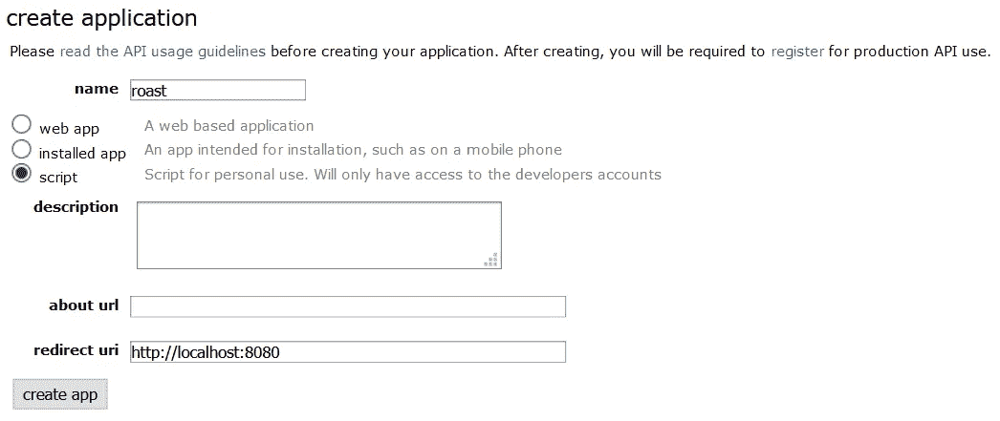

# 如何使用机器学习的无监督加扩展学习方法，Flask，Vuejs(Quasar Framework)制作一个基于 reddit 数据的 web app

> 原文：<https://medium.com/analytics-vidhya/how-to-make-a-web-app-based-on-reddit-data-using-unsupervised-plus-extended-learning-methods-of-79d9443780d5?source=collection_archive---------30----------------------->

## 在这篇文章中，我将通过一个完整的网站项目，尝试基于机器学习方法自动生成 r/RoastMe 子编辑文本

# 介绍

reddit 等社交媒体平台上有很多信息。这有很大的创造力和创造有趣、有回报的项目的潜力。我们经常在网上看到很多关于如何拥有这样一个项目的零碎信息，但通常没有一个完整的工作版本和文档。

在这里，我将展示我最近做的一个项目，将所有这些零碎的东西结合起来。该描述将有四个主要部分:

1.  如何从 reddit 获取数据
2.  对数据执行机器学习
3.  设置 Vuejs 前端
4.  设置烧瓶后端

你可以访问网站并使用网络应用程序[这里](https://teaandroast.herokuapp.com/)在我的 [GitHub](https://github.com/hessikaveh/teaandjudgement) 上看到完整代码。

# 首先:从 reddit 检索信息

这里我们将使用一个名为 PRAW 的库从 reddit 中检索数据。这个库有一些限制，但是作为一个概念证明，它工作得很好。

为了能够使用 PRAW，我们需要有一个**客户端 id(Reddit 上的用户名)、密码**和**用户代理(您在下面的表格中为应用程序选择的名称)**，您可以通过简单地点击下面[链接](https://www.reddit.com/prefs/apps)上的“创建应用程序”来获得密码。命名您的应用程序，并选择脚本单选按钮。

有了上面提到的信息，你可以开始从你选择的子编辑中检索信息。这里我们从 r/RoastMe 中读取信息，并将其保存到 reddit.csv 文件中。

我们将需要两个主要的信息，上传图片的 url(这是一个用户提交的图片，所以人们可以对其进行评论)和投票最多的评论(这是其他用户投票选出的最佳评论)

在第 44 行，我们选择投票最多的第一条评论。

在第 45 行添加 html 标签，这样当你保存它为。html 的第 57 行，并在网络浏览器中打开它，你可以看到图像加载。

请注意，您可以通过 PRAW 获得的提交数量受到 reddit API 的限制。

# 第二:使用 Keras VGG16 提取特征进行无监督学习，使用 KMeans 无监督算法进行分类

在下面的代码中，您可以看到将无监督的机器学习算法应用到我们在上一步中从 reddi 中提取的数据。

为此，我整合了一个预先训练好的著名 CNN，它与 Keras 打包在一起，名为 [vgg16](https://keras.io/api/applications/vgg/) 。使用一个复杂的预训练模型的原因是让聪明人做出的许多特征工程对你来说不需要太多努力。这将有助于我们在后续步骤中应用 KMeans 算法来获得更有意义的结果。

input_processing 方法下载图像并将它们转换成正确大小的数组。

在第 37 行，我定义了我想要的 VGG16 模型，并限制了图像的大小，以匹配我之前在 input_processing 方法中选择的那个(选择的大小受到我使用的机器上可访问的 RAM 的限制)。

在第 65 行，我将提取的特征提供给 KMeans 算法，然后在接下来的几行中，我将训练好的模型应用于整个数据集。

# 第三:使用基于 Vuejs 的 Quasar 框架制作一个简单的前端

为了设置一个快速的前端，我使用了基于 Vuejs 的 Quasar 框架。这是快速和可扩展的，你也将有可能出口移动应用程序。

要建立一个项目，很简单，只需跟随这个[链接](https://quasar.dev/quasar-cli/installation)，然后用下面的代码替换 src/pages 子文件夹中的 Index.vue:

在第 76 行，我给出了在本地机器上运行的后端的地址。这应该与您在烧瓶侧选择的设置相对应。

# **第四:一个简单的后端，用烧瓶来评估上传图像的 ML 算法**

Flask 是用于 web 应用后端的最简单的框架之一，在这里我只用几行代码就创建了后端。其中用户上传的数据保存在第 38 行的上传文件夹中。使用 VGG16 模型的预处理应用于第 41 行。最后，选择一个烤文本，并在第 50-54 行作为对前端的响应。

# 结论

你可以看到，只需几个非常简单的脚本，我们就可以在后端使用 ML，使用来自社交媒体的数据，制作一个完整的 web 应用程序。

我鼓励你在 [GitHub](https://github.com/hessikaveh/teaandjudgement) 上检查完整的项目，并在这个[链接](https://teaandroast.herokuapp.com)上试用。