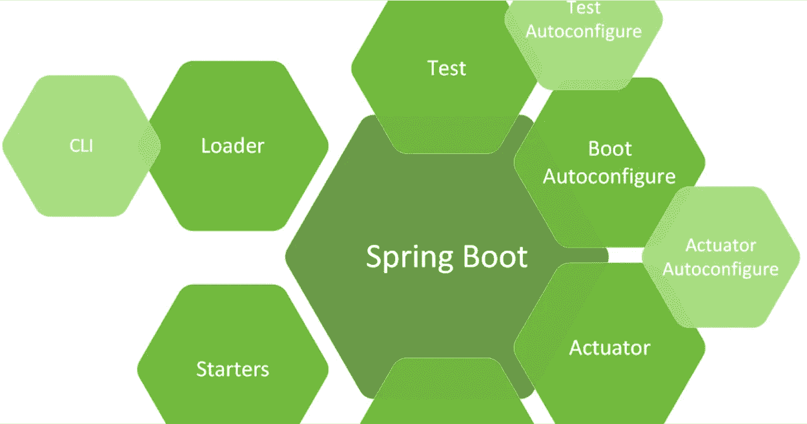
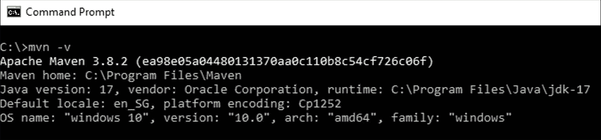
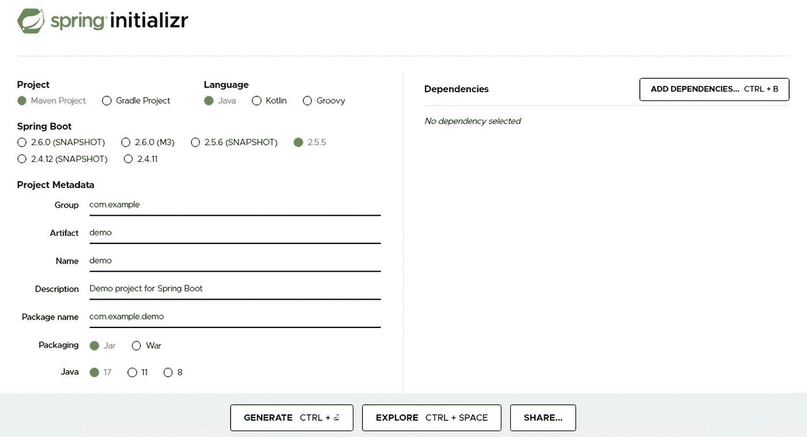
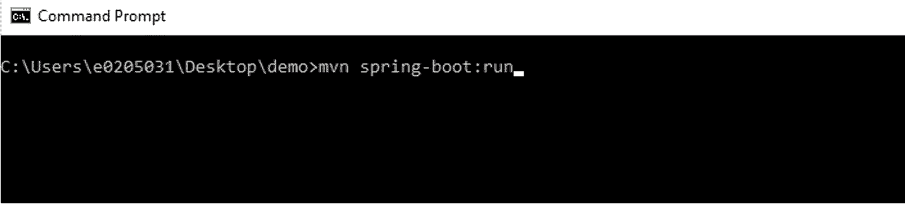
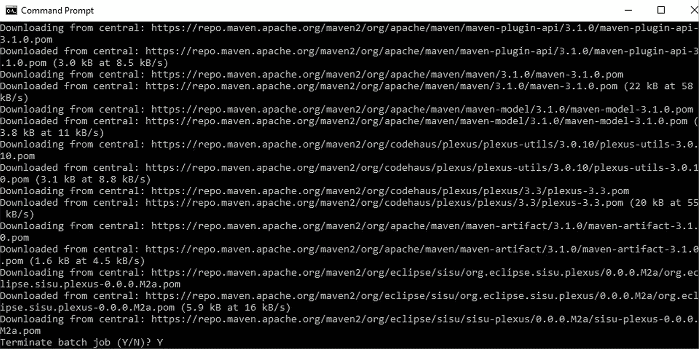
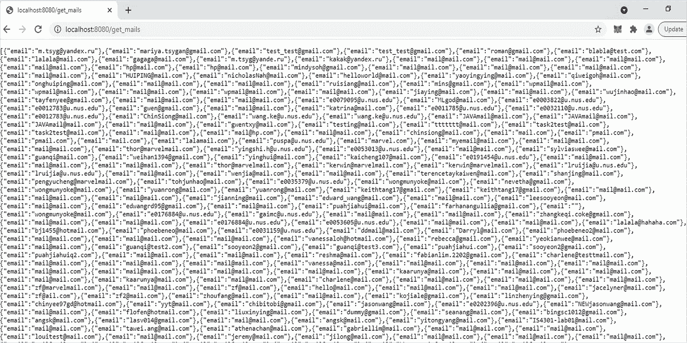
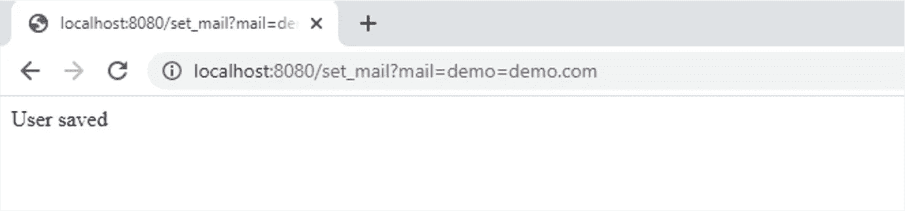
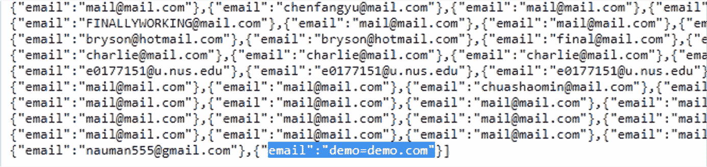
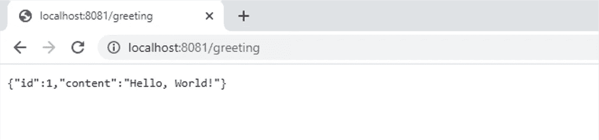

# 如何使用 Spring Boot 制作应用程序(服务器端)

> 原文：<https://medium.com/analytics-vidhya/how-to-make-a-web-application-using-spring-boot-4c89c8e7053e?source=collection_archive---------1----------------------->

*Spring Boot* 是一个基于 *Java* 的框架，支持敏捷软件开发并加速商业价值交付。



# **简介**

*Spring Boot* 是快速开发任何 *Spring* 应用的便捷工具。它简化了开发独立的、生产级的基于 Spring 的应用程序的过程。它有预设的配置，可以节省您的时间，并避免维护大量的样板代码。

在本教程中，我们开发了一个`*Hello World*`应用程序，并尝试了一些微服务选项。

# **工具准备**

根据您的操作系统下载并安装下面提供的工具。

1.  **Java 开发工具包**
    *Spring Boot* 需要`*Java JDK*`来编译和执行 *Spring Boot* 代码。关于如何下载和安装 *JDK* 、[的详细说明，点击这里](https://www.oracle.com/java/technologies/downloads/)。
2.  **Maven**
    *Maven*是 *Spring Boot* 的自动化包管理工具。有关如何下载和安装 *Maven* 、[的详细说明，请点击此处](https://maven.apache.org/install.html)。

***注意:不要忘记配置 Java 和 Maven 环境变量。完整的安装说明和环境变量的设置，*** [***点击这里***](https://maven.apache.org/install.html) ***。***

成功安装 *Java* 和 *Maven* 并正确指定环境变量的路径后，在*命令提示符/终端/控制台*上运行`mvn -v`并检查输出。



Java 和 Maven 在 Windows 环境下成功安装

Spring Boot 代码由多个提供广泛功能的包组成，减轻了开发人员实现 web 服务的负担。因此，开发人员可能会专注于他们的应用程序的设计和部署机制。因此，在本教程中，我们将通过运行一个小型 web 应用程序来演示它是如何工作的。

## 任务-I:开始和终止项目

*   转到`[*Spring Initializr*](https://start.spring.io)`。
*   用*Spring Boot*(*2 . 5 . 5*)和 *Java* ( *JDK 17* )生成一个 *Maven 项目*。保持*项目元数据*的默认值如下。



Spring initializr 生成项目

*   将文件解压缩到任何目录。在本教程中，目录名是`*demo*`。
*   看看`*pom.xml*`中的依赖管理。
*   打开*命令提示符/终端/控制台*。
*   导航到*路径*你解压文件并进入目录`*demo*`。
*   使用命令`mvn spring-boot:run`运行应用程序。



导航到解压缩后的文件“demo”并运行应用程序

*   按`*CTRL + C*`终止正在运行的应用程序。



终止应用程序运行

## 任务二:添加控制器

程序中的`*DemoApplication*`对象启动了应用程序的执行，但是它还没有完成任何操作。为了完成这个过程，我们构建了一个处理请求的`*Controller*`和一个处理响应的`*json*`文件。按照如下说明继续操作:

*   将以下依赖关系添加到`*pom.xml*`文件:

*pom.xml* 的依赖关系

*   将`*Greeting.java*`、`*GreetingController.java*`和`*MailUser.java*`文件移动到`*demo/src/main/java/com/example/demo*` 目录。
*   将`*json*`文件移动到`*demo/src/main/resources*`目录。
*   导航到目录`*demo*`的*路径*。
*   使用命令`mvn spring-boot:run`运行应用程序。
*   打开您的默认浏览器并使用以下网络链接。

```
[http://localhost:8080/get_mails](http://localhost:8080/get_mails)[http://localhost:8080/set_mail?mail=demo@demo.com](http://localhost:8080/set_mail?mail=mail@mail.com)
```

*   *localhost* web-link `*get_mails*`将显示数据库中记录的电子邮件，而`s*et_mail*`将在数据库中添加一个新的电子邮件`*demo@demo.com*`。



接收邮件



设置邮件



搜索新添加的邮件

*   按`*CTRL + C*`终止应用程序运行。

## 任务三:更改 Spring Boot 的配置

*Spring Boot* 支持多种配置选项。现在，我们将更改*端口*配置，使普通用户无法访问某些服务。

*   导航到`*demo/src/main/resources*`目录。
*   将以下代码添加到 *application.properties* 中。

```
server.port=8081management.port=8082
```

*   使用命令`mvn spring-boot:run`运行应用程序。
*   打开您的默认浏览器并使用下面的 web 链接。

```
[http://localhost:8081/greeting](http://localhost:8081/greeting)
```



问候信息

**恭喜**！你用 *Spring Boot* 构建了一个简单的 web 应用程序，并了解了它如何显著加快你的开发速度。此外，您还尝试了一些功能来测试它们的实用性。本教程简要回顾了 *Spring Boot* 的能力。

# 结论

在本教程中，我们学习了如何使用 *Spring Boot* 来初始化和配置一个简单的 web 应用程序。我希望你在实践中体验过它的灵活性。

任务一、任务二、任务三的所有代码文件都可以在 [*GitHub*](https://github.com/muhammadnaumanshahid/spring_boot_application.git) 获得。

> 感谢阅读！如果你喜欢这首曲子，快速👏对我来说意味着一切。订阅我的个人资料，随时了解最新动态，不要犹豫发表评论或联系我们。快乐阅读！