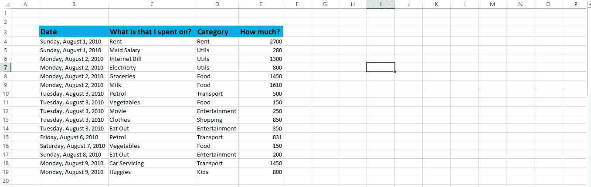
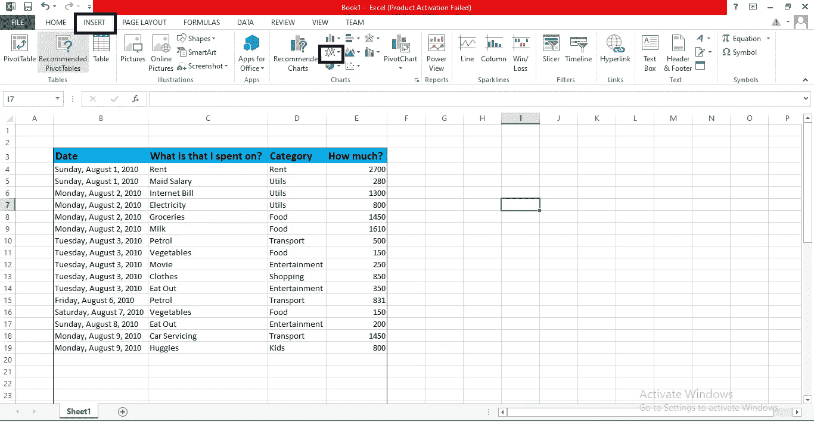
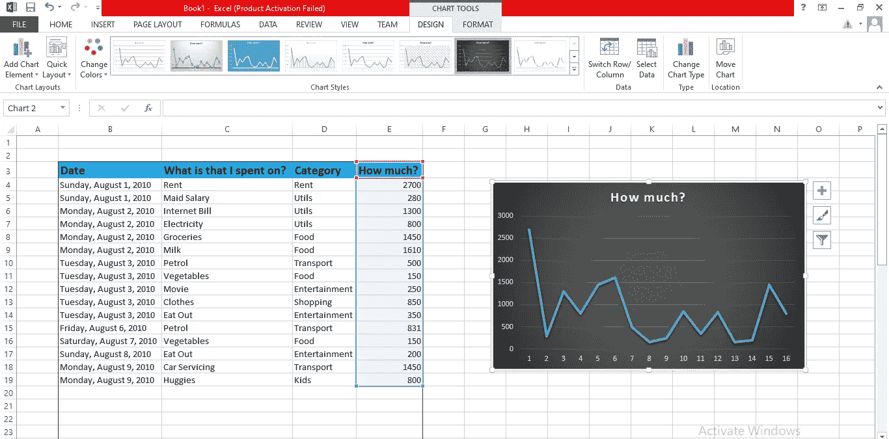
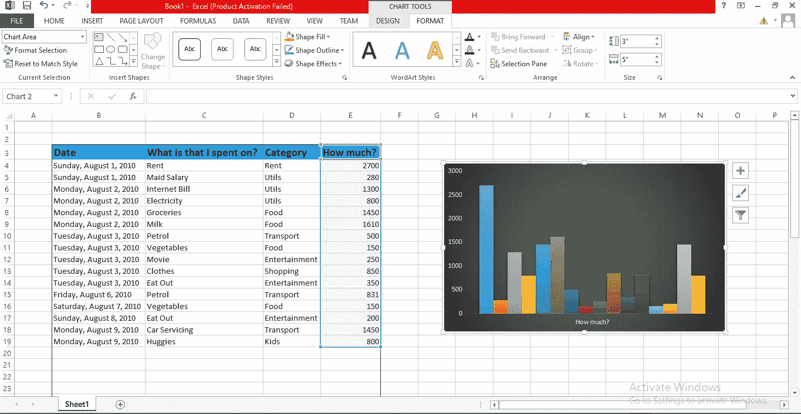

# 如何在 Excel 中制作图表

> 原文：<https://medium.com/analytics-vidhya/how-to-make-charts-in-excel-1e43f69fa5de?source=collection_archive---------15----------------------->

在 excel 中制作图表使我们能够轻松地进行分析，以便从数据中获得进一步的见解。

考虑以下数据可用于在 excel 中创建图表。

用于分析的数据

在 Excel 中插入图表的步骤:

选择柱形图->点击插入->选择折线图

上图显示了在 excel 中绘制图表需要选择的内容。

最终图表

我们可以使用格式来改变图表的颜色，甚至删除网格线，以使图表清晰可见。

让我们用柱形图试试

右键单击图表并选择“更改图表类型”选项。然后，将图表类型更改为饼图、条形图、柱形图等。

也可以创建其他类型的图表，我们可以进行所需的分析。正如我们所知，图表表达了数据的洞察力，我们有必要了解哪种图表最适合我们的数据。