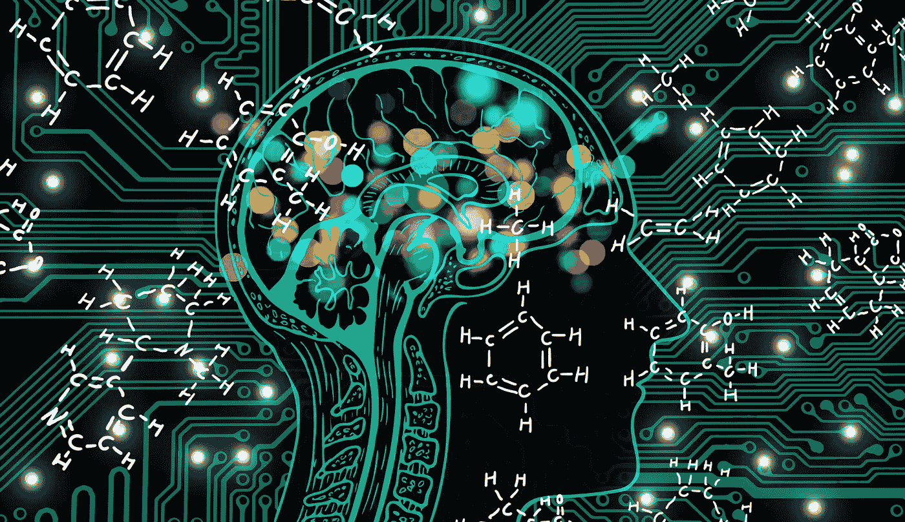

# 如何使用人工智能优势让你的化学合成变得绝对简单

> 原文：<https://medium.com/analytics-vidhya/how-to-make-your-chemical-synthesis-absolutely-easier-using-ai-advantage-aab69ccd5c52?source=collection_archive---------16----------------------->

## 在你的下一次合成中获得更有效而快速的结果

来源:作者的封面图片

> “计算机能否思考的问题并不比潜艇能否游泳的问题更有趣。”— [埃德格·w·迪杰斯特拉](https://en.wikipedia.org/wiki/Edsger_W._Dijkstra)