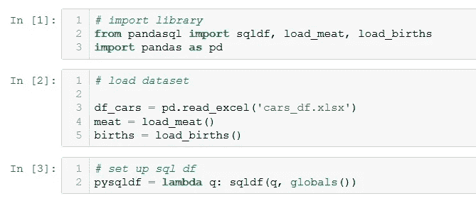
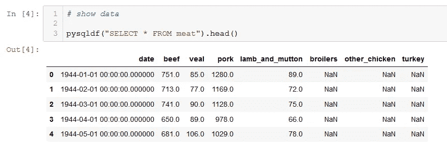
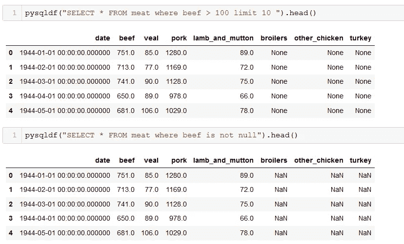
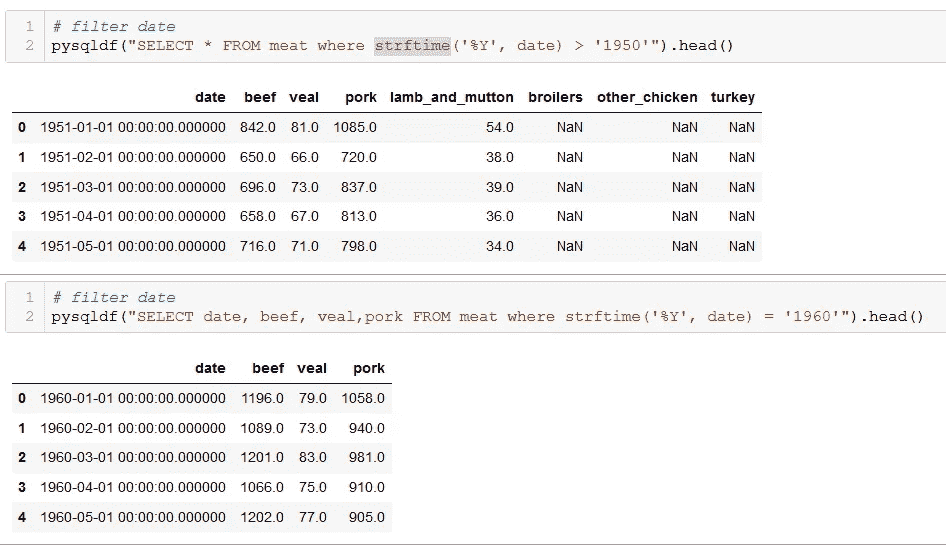
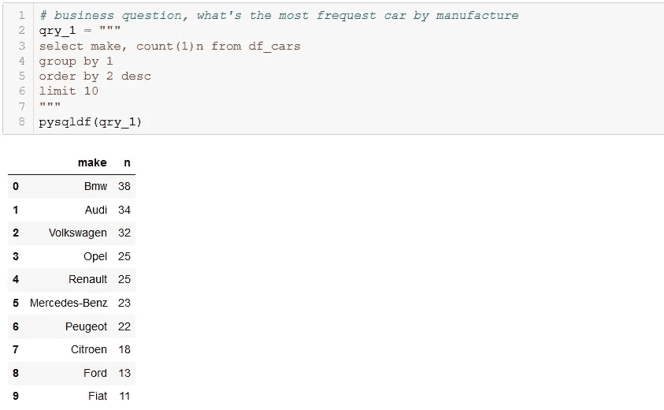
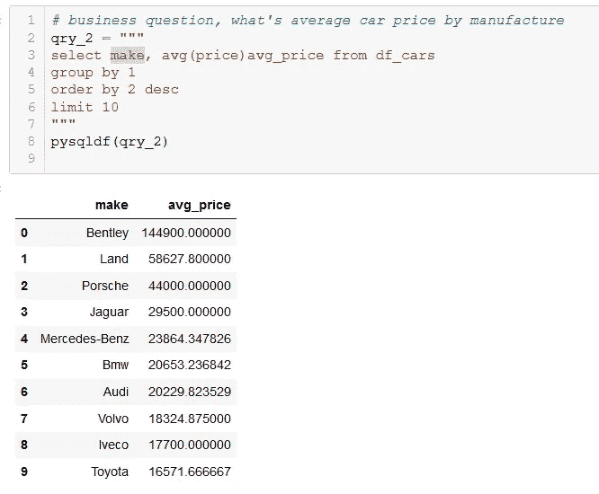
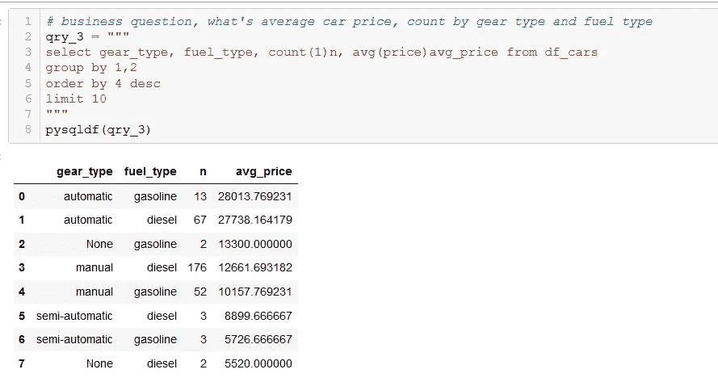
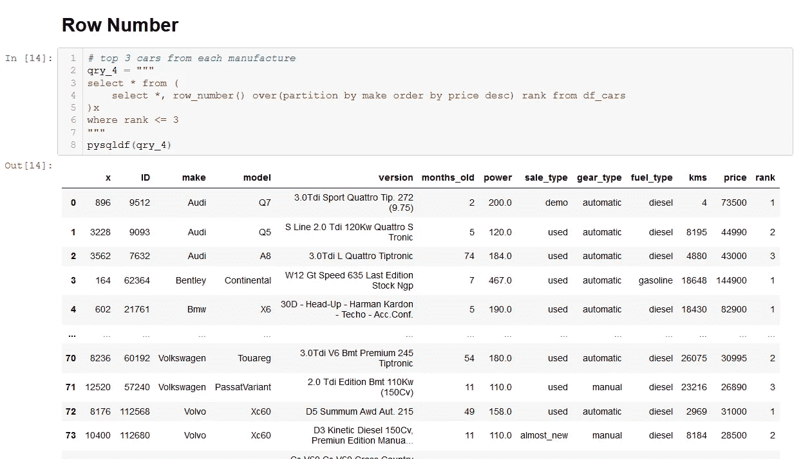
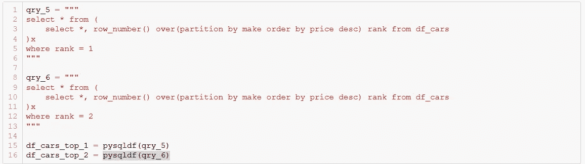
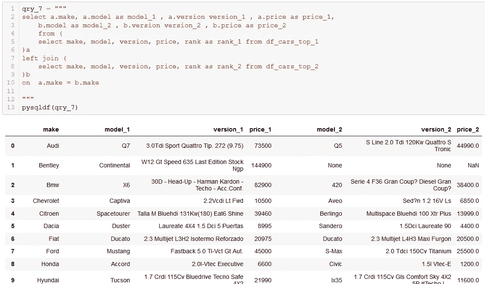

# 如何使用 SQL 代码掌握熊猫数据争论

> 原文：<https://medium.com/analytics-vidhya/how-to-master-pandas-data-wrangling-using-sql-code-6a6ff5ddb4b8?source=collection_archive---------6----------------------->

在这个故事中，我假设你是一个人专家/熟悉 SQL，并了解一点 python。

**简介**

SQL 是一种从数据库中提取信息的编程语言。而且 SQL 在 python 和 r 之前就以分析著称，Python 是一种编程语言。它可以做很多事情。python 的能力之一是使用 pandas 进行数据处理。pandassql 是您可以在 panda 内部使用 sql 查询的地方。

先安装 panda SQL【https://pypi.org/project/pandasql/】T3
和

让我们编码

1.  导入一些数据集和库设置

2.图像数据

使用 sql 中的“select”来浏览数据和。head()限制熊猫的搜索结果。

3.过滤数据

使用 sql 中的“where”来过滤数据。

4.日期过滤器

使用“strftime”过滤 sql 中的数据。

5.数据聚合

对聚合数据使用 group by，对结果进行排序。

6.行号

行号函数在分组值内执行排序过程。

7.加入

完整代码[此处](https://github.com/adamaulia/pandasql_tutorial)

结论，
我希望这篇简短的教程能帮助你理解在 pandas 中使用 sql 代码的数据争论。