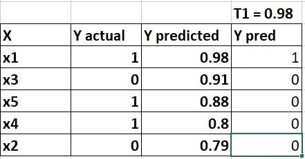
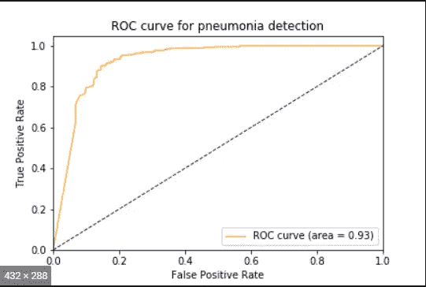

# 如何衡量一个模特的表现？

> 原文：<https://medium.com/analytics-vidhya/how-to-measure-the-performance-of-a-model-f3e1c52d78b0?source=collection_archive---------2----------------------->

每当我们开发一个模型时，我们都要做一个性能指标来决定是否继续开发这个模型。如果你们中的任何人不知道何时以及为什么使用什么模型。请从头到尾检查一遍。

在你读完这篇文章后，你将会对一些著名的性能指标及其使用案例有足够的了解，赞成的和反对的。

在进入细节之前，我们需要了解性能模型是为了了解我们的模型执行得有多好，换句话说，通过检查测试数据或未见过的数据，我们的结果有多准确！因此，要理解我们的专家正在从事几十年的研究，并且仍然在研究更好的方法和模型，以获得他们期望的准确结果。

在这里我要解释一下

1.  准确(性)
2.  混淆矩阵
3.  精确度和召回率
4.  F1 分数
5.  ROC 和 AUC
6.  原木损失
7.  决定系数。

让我们深入我们的主题——

# **1。准确度:**

这是一个著名的和简单的老学校类型的措施，以了解我们的模型的质量。也就是我们的模型正确预测或分类我们的数据点的百分比。

由[维托达·克莱恩](https://unsplash.com/@little_klein?utm_source=medium&utm_medium=referral)在 [Unsplash](https://unsplash.com?utm_source=medium&utm_medium=referral) 上拍摄的照片

*   让我们把这个公式化-

我们有 100 只动物，其中包括 70 只猫和 30 只狗。假设在 70 只猫中，我们的模型正确地分类了 60 只猫，而 10 只猫被错误地分类为狗。假设在 30 只狗中，我们的模型对 20 只狗进行了正确分类，而 10 只狗被错误分类为猫。

在这个场景中——准确度=**[(60+20)/(100)]* 100 = 80%**(由此我们可以说出错的几率为 20%)

*   准确性度量的主要缺点之一是它在不平衡数据中表现很差。假设我们有 90% +数据点和 10% -ve 数据点，它将给出新查询点“x”(假设是-ve 数据点)有 90%的机会是+ve 的解决方案，即使它是-ve 数据点。
*   因此**当数据不平衡时，不要使用准确性作为绩效衡量标准**

让我们看看另一个场景

*   模型 1 1 和模型 2 是产生概率分数的两个不同的模型。
*   从上述观点和结果中，我们可以清楚地注意到，对于相同的模型，预测的类别是相同的，并且我们将从精度测量中得到结论，即两个模型表现相同，因为模型 1 和模型 2 具有相同的精度。但是很明显，我们可以说模型 1 比模型 2 表现得更好。在建议最佳模型时，准确性未能考虑概率得分。

# **2。混乱矩阵:**

让我们深入了解这个度量中的实际理解和依赖的概念。

假设我们有**个二元分类任务**(意味着我们有两个类【0，1】)。让我们把 0 作为负类，1 作为正类。

从那我们将得到蓝色矩阵的下面-

广义表示

让我们在开始计算之前定义符号

*   **TN** —真负值(表示预测值为真)
*   FN —假阴性(意味着预测值是假的)
*   FP —假阳性(意味着预测值是假的)
*   **TP** —真阳性(表示预测值为真)
*   P —数据集 D 中的正类总数，N—D 中的负类总数
*   总数据点' D' = P+N
*   真阳性率 **TPR = TP/P** 也称为灵敏度
*   真阴性率 **TNR = TN/N** 也就是所谓的特异性
*   **FPR = FP/N，FNR = FN/P**

所以我们希望积极的类被归类为积极的，消极的被归类为消极的。这意味着我们需要**高 TPR & TNR** 值和**低 FPR & FNR** 值。因此，我们需要根据我们的需求选择最佳的模型。

*   该指标的一个主要缺点是，我们需要比较 4 个不同的指标(TPR、FPR、TNR、FNR)来选择最佳模型。
*   因此，如果我们得到高 TN & TP 值(对角线元素)，那么我们可以说模型是好的。矩阵的精度可以通过取对角元素的平均值来计算
*   就像准确性一样，在选择最佳模型时，它也不考虑概率得分。它简单地计算按模型分类的点数，并给出最佳模型。

请自己尝试一些随机的示例案例，以获得更好的理解和亲身感受。

# **3。精确，回忆& F1 分数:**

精确度和召回率只是混淆矩阵概念的一个可解释的扩展。

在所有来自模型的预测阳性点中， **Precision** 表示其中实际阳性的百分比

> **精度= TP / (TP +FP)**

→因此，对于好的模型，我们希望精度高**高**

然而，在实际上属于一个类别的所有点中，回忆告诉我们有多少点从我们的模型中被检测到是那个类别。所以这是真正的正利率

> **召回= TPR = TP/P**

→因此，对于好的模型，我们希望召回也是高的

*   这样做的主要缺点是它只关心一个类

# **4。F1 得分:**

**F1 分数**无非是两者的精确组合&回忆。这是一个**无法解释的**单一优雅的措施，它告诉双方精度&召回。

*   当查准率和查全率都很高时，我们可以说我们的模型是最好的，如果查全率很高但查准率不高，反之亦然，那该怎么办？这个问题的解决方案是 F1 分数，它以不间断的方式平衡了精确度和召回率

> **F1 分数的公式=激素平均值(精确度、召回率)**

*   看，它试图平衡精确度和召回率。我们可以不用两个指标(精确率和召回率)来比较两个模型。

# 5.ROC 和 AUC:

这是业界著名且广泛使用的性能指标之一，尤其是在二进制分类任务中。

**ROC** —受试者工作特征曲线， **AUC** —曲线下面积

顾名思义，它是在第二次世界大战期间为电子工程目的设计和开发的，特别是为军用雷达系统的操作员。如果你对历史感兴趣，请浏览这个[链接](https://en.wikipedia.org/wiki/Receiver_operating_characteristic)。

让我们理解这个概念，以及它如何帮助衡量我们的模型的性能。

假设我们有这样一个场景—

数据点‘X’= { x1，x2，x3，x4，X5 }；类别标签“Y”= { 0，1}

步骤 1:对值进行排序

第二步:保持阈值 **T**

这里假设 T1 = 0.98，如果 y 预测> = T1，则将其标记为 1，否则为 0

像这样我们得到 **T1，T2，T3，T4，…Tn** 阈值(这里 n = 5)及其相应的 TPR 和 FPR 值

ROC 只不过是 FPR 和 TPR 之间的图，AUC 是位于 0 到 1 之间的曲线下的面积

如果 AUC = 0，那么它是糟糕的，AUC = 1 是最佳模型。

图像来源—研究门户

*   这样做的主要缺点是，对于不平衡的数据，AUC 可能非常高，并且它不依赖于 Y 预测的分数，它只是基于分数的排序起作用。因此，因为具有相同分数顺序的两个模型将给出相同的 AUC，但是一个模型可能比其他 wrt 分数更好。
*   0.5 比 1 的 AUC 分数可以说是好模型和< 0.5 is dumb model.

# **6。日志丢失:**

与我们迄今为止看到的其他度量不同，这是最强大的性能度量之一，它利用概率分数并相应地得出最佳模型。它在概率得分的帮助下捕捉结果中的每一个微小偏差。

如果你熟悉一些机器学习算法，目标函数的主要直觉是最小化损失。损耗越低，模型性能越好。

从数学上讲，对数损失是平均负对数(正确分类标签的概率)

二元类分类的对数损失

多类分类的对数损失

*   如果你想比较两个模型，我们可以用这个来得出结论，损失较少的模型比其他模型表现更好。

# **7。决定系数或 R :**

在回归任务中广泛使用的著名度量之一。在深入核心之前，让我们理解一些有助于开发 R 的基本概念。

回归任务中，X ∈ {x1，x2，…xi}及其对应的实际值 **yi ∈ IR** 。假设 **ŷi** 是模型的预测值。

点 i = y 实际值— y 预测值的残差→ **ei =(易- ŷi)**

误差平方和公式

因此，决定系数(R)不是因变量中方差的比例，它可以从自变量中预测出来。

由此我们可以说，

*   这种模式的主要缺点是，如果其中一个误差' **(yi-ŷi)'** )非常大，将会对 r 产生严重影响。因此，我们可以说，当数据中有异常值时，这种模式不会有很好的表现。

如有任何疑问，请随时联系我。快乐学习:)