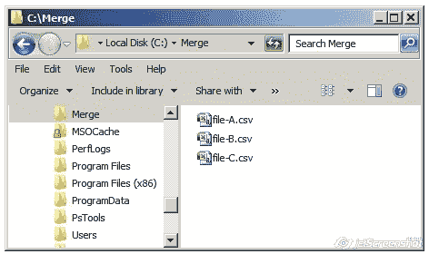
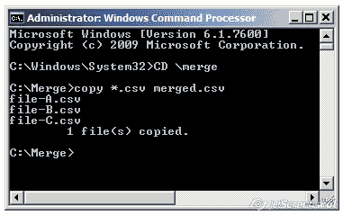

# 如何将多个 csv 文件合并成一个文件

> 原文：<https://medium.com/analytics-vidhya/how-to-merge-multiple-csv-files-in-to-one-file-5eb6ef8e579b?source=collection_archive---------1----------------------->

使用 cmd 提示符将多个 csv 转换为单个 csv

逗号分隔值(CSV)文件是包含数据列表的纯文本文件。这些文件通常用于在不同的应用程序之间交换数据。例如，数据库和联系人管理器通常支持 CSV 文件。

这些文件有时被称为字符分隔值或逗号分隔文件。他们通常使用逗号字符来分隔数据，但有时也使用其他字符，如分号。其思想是，您可以将复杂的数据从一个应用程序导出到一个 CSV 文件，然后将该 CSV 文件中的数据导入到另一个应用程序中。

## CSV 文件的结构

CSV 文件的结构相当简单。这是用逗号分隔的数据列表。例如，假设您在联系人管理器中有几个联系人，您将它们导出为 CSV 文件。

它们可以更复杂，可以包含数千行、每行更多条目或长文本串。有些 CSV 文件甚至可能在顶部没有标题，有些可能使用引号将每个数据位括起来，但这是基本格式。

简单是一个特征。CSV 文件旨在成为一种轻松导出数据并将其导入其他程序的方式。生成的数据是人类可读的，可以用记事本等文本编辑器或 Microsoft Excel 等电子表格程序轻松查看。

## 如何使用命令提示符合并多个 csv 文件

步骤 1:复制存储多个 csv 文件的文件夹路径

步骤 2:转到命令提示符

步骤 3:使用 cd 更改目录..直到您到达您的文件夹(其中您有多个*。csv 文件)

第四步:在命令提示符
**copy *中键入如下内容。csv filename.csv
按回车键**

文件名可以是你选择的所有数据从多个 csv 文件被合并。

第五步:去检查你的文件夹，你可以看到文件名与所有数据合并为一个 csv 文件

示例—包含多个 csv 的文件夹

示例— cmd 提示符显示单个合并的. csv 文件

# 结论:

在这篇文章中，我试图用简单的步骤解释如何使用命令提示符将多个 csv 文件合并成一个文件，还有其他几种使用不同编程语言和工具的方法。

通过 [Linkedin](https://www.linkedin.com/in/sureshhp/) 和 [Medium](https://hpsuresh12345.medium.com/about) 与我联系，获取新文章和博客。

— — — * — — — * — — — * — — — * — — — * — — — * — — — * —

*“培养学习热情。如果你这样做了，你将永远不会停止成长*

— — — * — — — * — — — * — — — * — — — * — — — * — — — * —