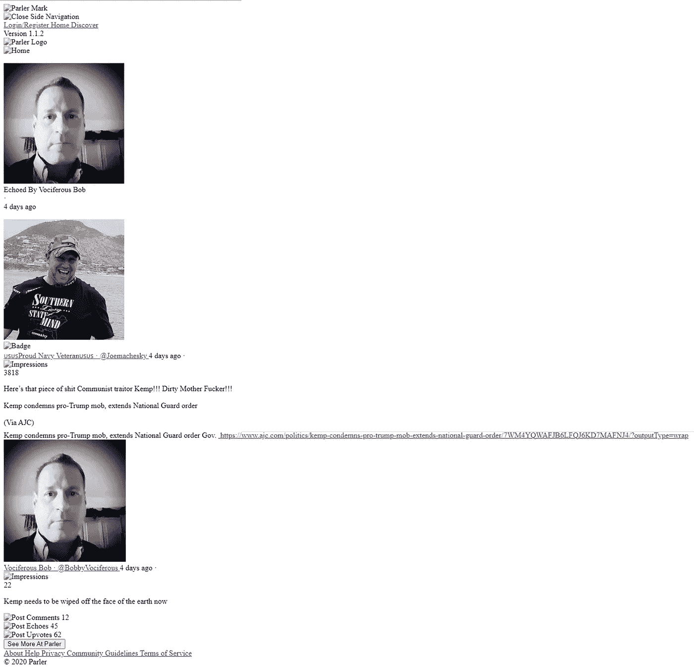
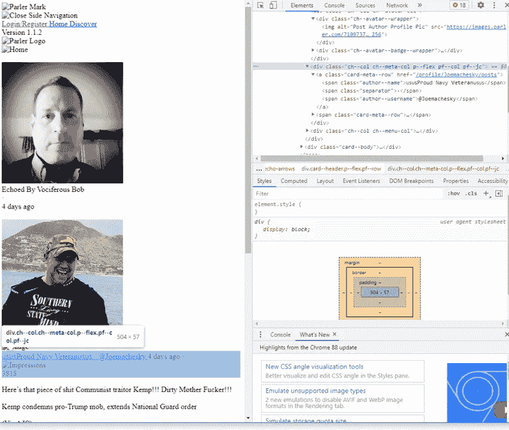
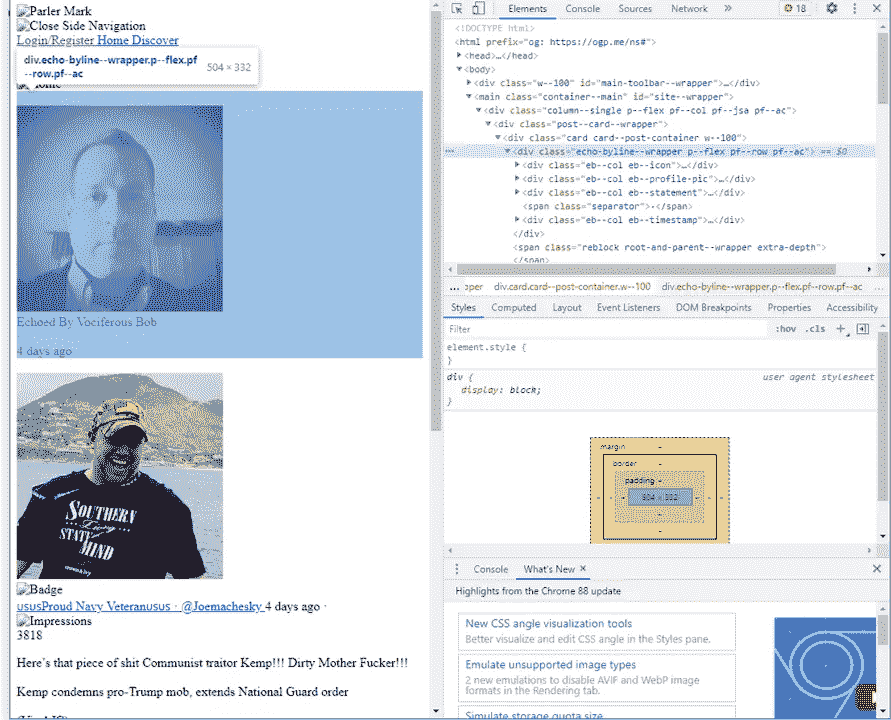
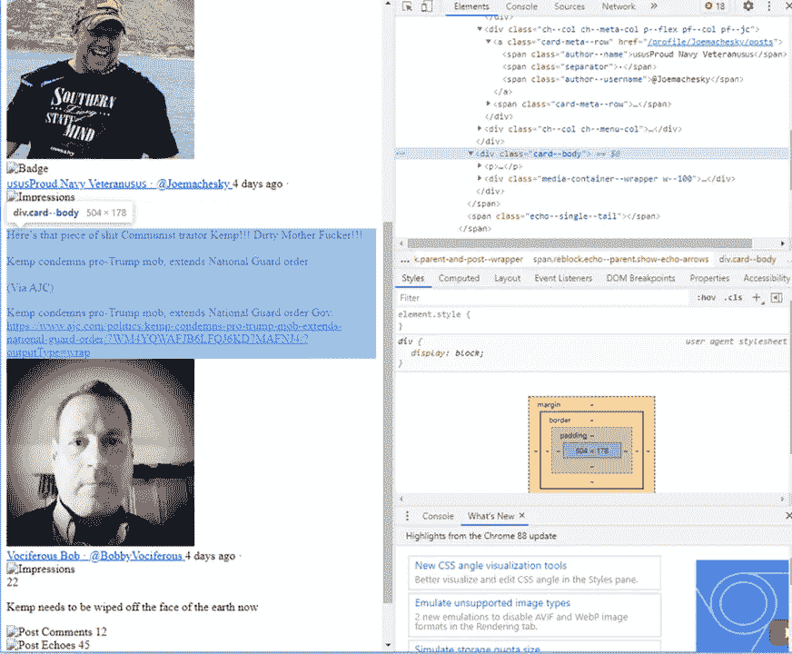
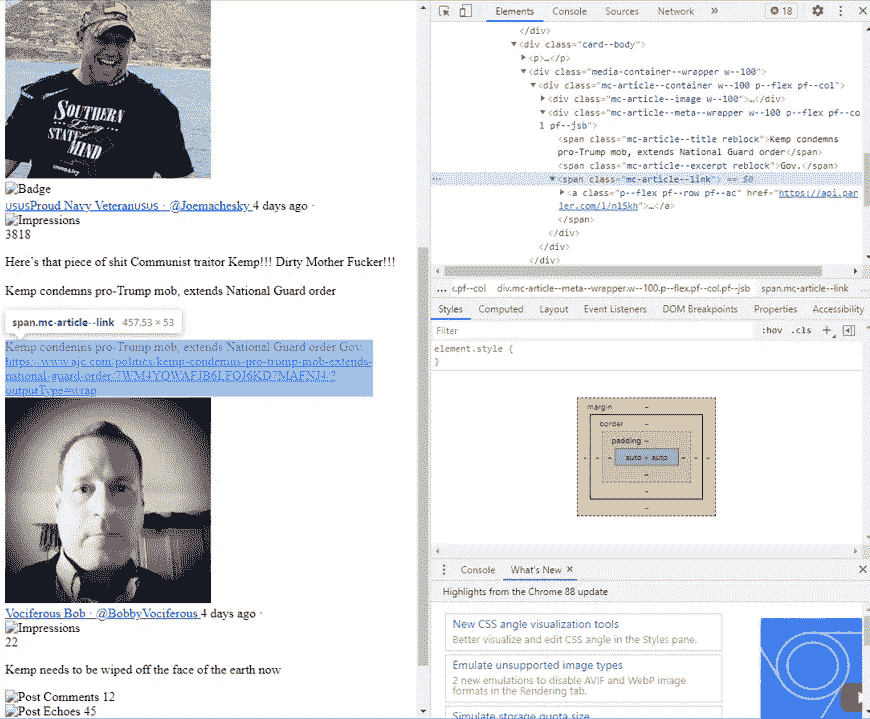
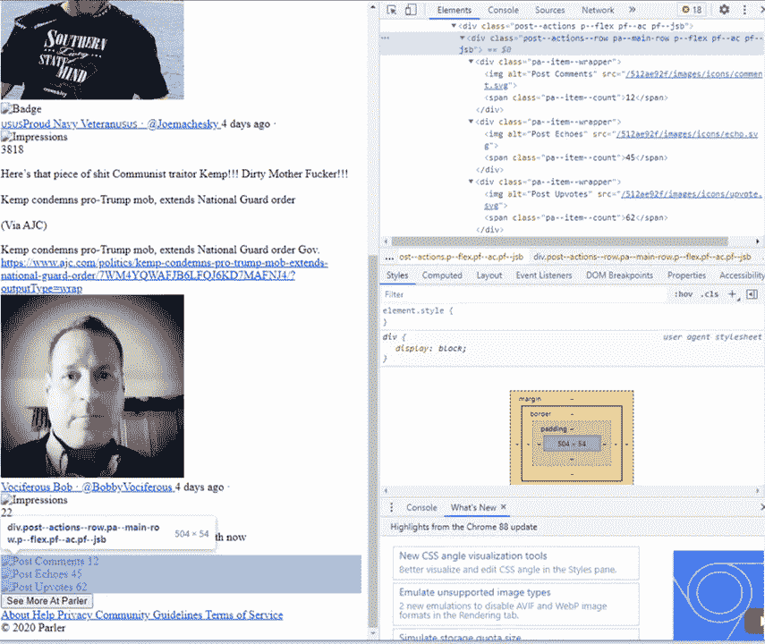

# 如何解析来自 Parler 的 Parley 数据

> 原文：<https://medium.com/analytics-vidhya/how-to-parse-parley-data-from-parler-2b6a39cfe86?source=collection_archive---------9----------------------->

如何从“Parleys”中解析出信息来分析来自社交媒体网站的数据。


图片来自 https://parler.com

在这篇文章中，我将演示如何解析来自社交媒体网站 Parler 的 parleys 数据以进行分析。在这个练习中，我将使用 Python 和 1 月 6 日美国国会大厦事件后最近从 Parler 废弃的数据(可在[这里](https://ddosecrets.com/wiki/Parler)获得)。

## 什么是帕勒？

对于那些不知道的人来说， [Parler](https://company.parler.com/) 是一个社交媒体平台，它“建立在尊重隐私和个人数据、言论自由、自由市场以及道德、透明的公司政策的基础之上”众所周知，它也有大量包含极右内容、反犹太主义和阴谋理论(如 QAnon)的帖子，因此对于那些有兴趣研究这些现象的人来说，它是一个有价值的研究资料来源

## 谈判

Parler 用户通常通过使用“ [parley](https://pamelahazelton.medium.com/parler-101-how-to-use-the-free-speech-social-media-platform-dd55e88cd064) ”来相互通信这些谈判就像任何其他社交媒体网站上的帖子一样，可以收到向上投票、评论或回应(类似于 Twitter 上的转发或引用)。parley 的内容可以包括许多东西，例如文本、图像、多媒体数据和外部网站的链接。parley 的所有这些元素都呈现为一个 HTML 页面。下图给出了本文所用数据集中的一个谈判的例子



例子谈判。自从撰写了这篇文章，Parler 已经重新上线，所以一些图片和链接被渲染。

## 从谈判中解析出数据

由于 parleys 是 HTML，我们将不得不遍历 parleys 中的各种标签来提取重要的信息。为了检查 HTML，我使用了 Chrome 的开发工具。我们将从导入一些将在整个解析过程中使用的代码开始。

```
import re, pandas as pd
from bs4 import BeautifulSoup
from zipfile import ZipFile
```

接下来，我们将通过每一个谈判和工艺代码来获得重要的元素。首先，我们注意到几乎所有的 parley 内容都包含在类的一个分部中:

```
<div class=‘card card — post-container w — 100’>
```

该部门之外的所有内容都只是标准的 Parler 页眉和页脚。为了开始解析所有的 parleys，我们首先打开包含 parleys 的目录(在本例中，是一个压缩文件)，在目录中创建一个文件列表，然后开始将每个文件读入 [BeautifulSoup](https://www.crummy.com/software/BeautifulSoup/bs4/doc/) 来解析 HTML。我们将把 parleys 中的各种数据元素存储到一个 Python dict 对象中。

```
with ZipFile(zipped_files, 'r') as f:
    file_list = f.namelist()
    for i in range(len(file_list)):
        post = BeautifulSoup(f.read(file_list[i]),'html.parser')  
        parsed_post = {}
        parsed_post['id'] = file_list[i]
```

现在，我们将从解析出用户帐户信息开始。对于任何给定的谈判，我们都可以获得关于原始谈判的用户信息和关于回应谈判的用户的信息(如果是回应的话)。作者信息由两个元素组成，一个是“作者姓名”，它是用户可以给自己取的自由文本名称，另一个是“作者用户名”，它是用户的唯一用户名(即他们的“@”名称或句柄)。



下面的代码块首先检查是否有作者姓名——因为有时您可能会在谈判中遇到麻烦，导致数据丢失——然后解析出该信息。

```
try:

    parsed_post['author_user_name'] = post.find_all("span", {'class': "author--username"})[0].string
    parsed_post['author_name'] = post.find_all("span", {'class': "author--name"})[0].string
except:
    continue
```

接下来，我们想要得到所有的回应信息，如果这是一个回应的谈判。特别是，我们希望获得回显作者信息，回显的时间，以及回显作者是否给出了任何附加的回显文本(比如 Twitter 上的引用)。



下面的代码从 Parley 中解析出所有的 echo 信息。您会注意到 echo 作者的用户名实际上并不在 echo 块中，但是可以在 HTML title 部分找到。

```
echoed = post.find_all("div", {'class': "eb--col eb--statement"})
if len(echoed) >0:
    parsed_post['echoed_by_author'] = list(echoed[0].children)[1].string[10:]
    parsed_post['echoed_by_author_user_name'] = post.title.get_text().split()[0]
    echoed_time = post.find_all("div", {'class': "eb--col eb--timestamp"})
    parsed_post['when_echoed'] = list(echoed_time[0].children)[1].string
    echo_comment = post.find("span", {'class': "reblock post show-under-echo"})
    if echo_comment is not None:
         parsed_post['echo_comment'] = echo_comment.find("div", {"class": 'card--body'}).get_text().strip()
    else:
         parsed_post['echoed_by_author'] =None
         parsed_post['echoed_by_author_user_name'] = None
         parsed_post['when_echoed'] =None
```

已经从 parley 获得了用户和可能的社交网络(即，谁回应谁)数据，我们现在转向 parley 的内容数据。特别是，我们希望解析出任何文本数据、parley 的印象计数(parley 被放在多少新闻提要中)，以及任何社交媒体工件，如标签或提及。



下面的代码解析出内容，还解析出文本中出现的任何提及或标签。

```
parsed_post['impressions_count'] = int(post.find_all("span", {'class': "impressions--count"})[0].string)
main_body = post.find("div", {'class': "card--body"})
parsed_post['text'] = main_body.p.get_text()
parsed_post['hashtags'] = re.findall("#(\w+)", parsed_post['text'])
parsed_post['mentions'] = re.findall("@([a-zA-Z0-9]{1,15})", parsed_post['text'])
```

现在，内容的另一个重要部分是媒体内容，如图像或视频，以及在 Parley 中共享的任何外部网站。每种类型的外部内容都有不同的 HTML 标签与之相关联。因此，我们将需要检查每一种不同类型的内容标签，并解析出内容(如果存在的话)。在我们的例子中，我们有一个共享的外部网站。



下面的代码将检查 parley 中是否有任何共享的图像、媒体或外部网站，然后解析出它们。

```
external_urls =[]
externals = post.find_all("span", {'class': "mc-article--link"})
externals = externals + post.find_all("span", {'class': "mc-iframe-embed--link"})
externals = externals + post.find_all("span", {'class': "mc-website--link"})
if len(externals) > 0:
   for url in externals:
       external_urls.append(list(url.a.children)[-1].strip())parsed_post['external_urls'] = external_urls

image_urls =[]
images = post.find_all("div", {'class': "mc-image--wrapper"})
if len(images) > 0:
   for image in images:
       image_urls.append(image.img['src'])

parsed_post['internal_image_urls'] = image_urls

media_urls =[]
video_hashes =[]
medias = post.find_all("span", {'class': "mc-video--link"})
if len(medias) > 0:
   for media in medias:
       media_urls.append(list(media.a.children)[-1].strip())
       video_hashes.append(media_urls[-1].split('/')[-1].replace('.mp4', ''))parsed_post['internal_media_urls'] = media_urls
parsed_post['internal_video_hash'] = video_hashes
```

请注意，我还解析出了媒体链接的哈希值。这些相同的散列可以与这些 parleys 附带的媒体数据集一起使用，以便将任何抓取的媒体数据链接回其 parleys。

最后，我们还想获得关于 Parley 的元数据，比如它的投票数和评论数。请注意，虽然这个数据集确实有 Parley 上的评论计数，但它实际上没有评论本身。这只是这个数据集的一个局限，也许是将来要探索的东西。



以下代码可用于解析页脚信息，以获得有关 parley 的辅助信息。请注意，有时 parleys 会遗漏这个信息，所以我将它包装在一个 try-except 块中。

```
footer =post.find("div", {'class': "post--actions--row pa--main-row p--flex pf--ac pf--jsb"})
try:
    footer_counts = footer.find_all("span", {'class': "pa--item--count"})
    parsed_post['comments_count'] = int(footer_counts[0].string)
    parsed_post['echoes_count'] = int(footer_counts[1].string)
    parsed_post['upvotes_count'] = int(footer_counts[2].string)
except:
    parsed_post['comments_count'] = None
    parsed_post['echoes_count'] = None
    parsed_post['upvotes_count'] = None
```

现在已经建立了解析 parley 的所有必要成分，我们可以把所有东西放在一起了。具体来说，我选择将所有的 HTML 解析打包到一个生成器函数中，然后可以将该函数提供给类似 Pandas DataFrame 的东西，以便获得所有 Parler 帖子的一个良好的、结构化的、可分析的版本。所以，把所有的东西放在一起，我们有如下:

```
def parse_parler_archive(zipped_files):
    with ZipFile(zipped_files, 'r') as f:
        file_list = f.namelist()
        for i in range(len(file_list)):
            post = BeautifulSoup(f.read(file_list[i]), 'html.parser')

            parsed_post = {}
            parsed_post['id'] = file_list[i]
            try:
                '''
                Check for a bad scrape
                '''
                parsed_post['author_user_name'] = post.find_all("span", {'class': "author--username"})[0].string
                parsed_post['author_name'] = post.find_all("span", {'class': "author--name"})[0].string
            except:
                continue

            parsed_post['timestamp'] = post.find_all("span", {'class': "post--timestamp"})[0].string

            echoed = post.find_all("div", {'class': "eb--col eb--statement"})
            if len(echoed) >0:
                parsed_post['echoed_by_author'] = list(echoed[0].children)[1].string[10:]
                parsed_post['echoed_by_author_user_name'] = post.title.get_text().split()[0]
                echoed_time = post.find_all("div", {'class': "eb--col eb--timestamp"})
                parsed_post['when_echoed'] = list(echoed_time[0].children)[1].string
                echo_comment = post.find("span", {'class': "reblock post show-under-echo"})
                if echo_comment is not None:
                    parsed_post['echo_comment'] = echo_comment.find("div", {"class": 'card--body'}).get_text().strip()
            else:
                parsed_post['echoed_by_author'] =None
                parsed_post['echoed_by_author_user_name'] = None
                parsed_post['when_echoed'] =None

            parsed_post['impressions_count'] = int(post.find_all("span", {'class': "impressions--count"})[0].string)
            main_body = post.find("div", {'class': "card--body"})
            parsed_post['text'] = main_body.p.get_text()
            parsed_post['hashtags'] = re.findall("#(\w+)", parsed_post['text'])
            parsed_post['mentions'] = re.findall("@([a-zA-Z0-9]{1,15})", parsed_post['text'])

            external_urls =[]
            externals = post.find_all("span", {'class': "mc-article--link"})
            externals = externals + post.find_all("span", {'class': "mc-iframe-embed--link"})
            externals = externals + post.find_all("span", {'class': "mc-website--link"})
            if len(externals) > 0:
                for url in externals:
                    external_urls.append(list(url.a.children)[-1].strip())
            parsed_post['external_urls'] = external_urls

            image_urls =[]
            images = post.find_all("div", {'class': "mc-image--wrapper"})
            if len(images) > 0:
                for image in images:
                    image_urls.append(image.img['src'])
            parsed_post['internal_image_urls'] = image_urls

            media_urls =[]
            video_hashes =[]
            medias = post.find_all("span", {'class': "mc-video--link"})
            if len(medias) > 0:
                for media in medias:
                    media_urls.append(list(media.a.children)[-1].strip())
                    video_hashes.append(media_urls[-1].split('/')[-1].replace('.mp4', ''))
            parsed_post['internal_media_urls'] = media_urls
            parsed_post['internal_video_hash'] = video_hashes

            footer =post.find("div", {'class': "post--actions--row pa--main-row p--flex pf--ac pf--jsb"})
            try:
                footer_counts = footer.find_all("span", {'class': "pa--item--count"})
                parsed_post['comments_count'] = int(footer_counts[0].string)
                parsed_post['echoes_count'] = int(footer_counts[1].string)
                parsed_post['upvotes_count'] = int(footer_counts[2].string)
            except:
                parsed_post['comments_count'] = None
                parsed_post['echoes_count'] = None
                parsed_post['upvotes_count'] = None

            yield parsed_postzipped_files = '''path to your data'''

parler_data = pd.DataFrame(parse_parler_archive(zipped_files))
```

这段代码也可以在我的 GitHub 页面上找到([https://github.com/ijcruic/Parse-Parler-Data](https://github.com/ijcruic/Parse-Parler-Data))。我希望你喜欢这篇文章，并喜欢在你的研究中使用 Parler 数据！-骗子