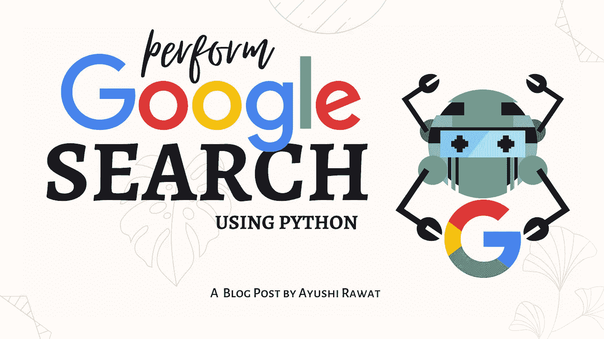
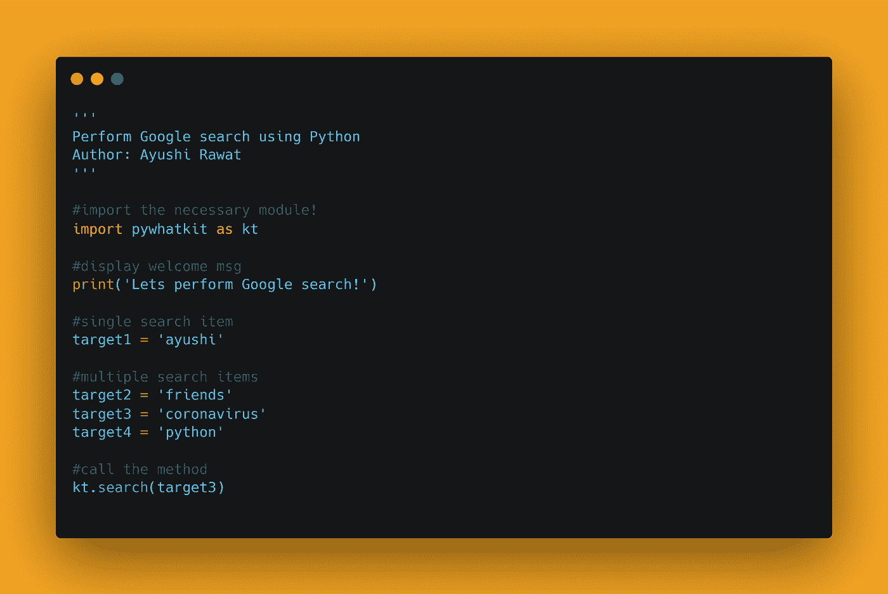

# 如何使用 Python 执行谷歌搜索

> 原文：<https://medium.com/analytics-vidhya/how-to-perform-google-search-using-python-3f2348067e1c?source=collection_archive---------0----------------------->

你好，世界！



我们在日常生活中使用谷歌搜索。你有没有想过可以用编程语言实现同样的功能，在这篇博客文章中，我们将学习如何进行谷歌搜索。我们将看到 Python 中的实现。

[查看 python 的终极资源库](https://github.com/ayushi7rawat/Ultimate-Python-Resource-Hub)。发现有用就掉颗星！有什么要补充的吗？开个 PR 就一样了！

你可以参考我的 YouTube 视频教程来看一个工作教程，以便更好地理解和一步一步的指导。

# 这个博客将会涵盖什么

```
1\. What is Google search?
3\. Basics of pywhatkit Module
4\. Performing a Google search using Python
```

*我们开始吧！*

# 什么是谷歌搜索？：

我不认为谷歌搜索需要在这里介绍，但对于那些不知道的人来说，谷歌搜索，或简称谷歌，是由谷歌有限责任公司开发的网络搜索引擎。它是跨所有平台的万维网上使用最多的搜索引擎。

如果你想了解更多，可以参考[谷歌的维基百科页面](https://en.wikipedia.org/wiki/Google)。

# 使用的模块:pywhatkit 模块:

PyWhatKit 是一个 Python 库，具有各种有用的特性。这是一个易于使用的库，不需要您做一些额外的设置。

这个模块还有很多其他很酷的特性。请随意探索它们，或者如果你愿意，我可以写一篇关于它们的文章。

如果你想了解更多，可以参考 [pywhatkit 模块文档](https://github.com/Ankit404butfound/PyWhatKit)。

现在，您已经熟悉了 *Google 搜索*的基础知识，并掌握了 *pywhatkit 模块的基础知识，*我们可以前进到*编码部分。*

# 该编码了！

你可以在我的 [GitHub 库](https://github.com/ayushi7rawat/Youtube-Projects/tree/master/Perform%20Google%20search)找到所有代码。发现有用就掉颗星。



为了访问 Python 库，需要将其安装到 Python 环境中

```
pip install pywhatkit as kt
```

现在，我们需要在 python 脚本中导入包。使用以下命令来完成此操作。

```
import pywhatkit as kt
```

现在我们已经使用命令`import pywhatkit as kt`导入了库，让我们继续。

让我们显示一条欢迎信息。同样，我们将使用`print`方法。

```
print("Let's perform Google search!")
```

确定你想搜索什么，一旦你决定了，让我们把它储存在`target1`。

```
target1 = 'coronavirus'
```

最后，我们来调用`search`方法。

`kt.search(target1)`

注意:如果您的浏览器窗口已经打开并正在运行，它将在一个新的选项卡中执行搜索，否则将打开一个新窗口。让我们看看输出的搜索结果。


让我们看看另一个例子，这次我们为搜索操作设置多个目标项。在 post 成功运行后，`n`个新标签将被打开，其中`n`是 python 脚本中列出的搜索项目的数量。

就这样，结束了！通过这些步骤，我们已经成功地使用 python 执行了 Google 搜索。就是这样！你可以使用`pywhatkit`库，甚至探索更多的特性。你可以在我的 [GitHub 库](https://github.com/ayushi7rawat/Youtube-Projects/tree/master/Perform%20Google%20search)中找到所有代码。发现有用就掉颗星。

很简单，不是吗？希望这篇教程有所帮助。我强烈推荐你去看看 YouTube 上的视频[还有别忘了订阅我的频道。](https://www.youtube.com/watch?v=JO_2EjW0jSM)

我写关于职业、博客、编程和生产力的文章，如果你对此感兴趣，请与你的朋友和关系人分享这篇文章。你也可以订阅我的时事通讯，在我每次写东西的时候得到更新！

谢谢你的阅读，如果你已经到目前为止，请喜欢这篇文章，它会鼓励我写更多这样的文章。请分享您的宝贵建议，感谢您的真诚反馈！

我很乐意在[Twitter](https://twitter.com/ayushi7rawat)|[LinkedIn](https://www.linkedin.com/in/ayushi7rawat/)与你联系。

你绝对应该看看我的其他博客:

*   [Python 3.9:你需要知道的一切](https://ayushirawat.com/python-39-all-you-need-to-know)
*   [终极 Python 资源枢纽](https://ayushirawat.com/the-ultimate-python-resource-hub)
*   [GitHub CLI 1.0:你需要知道的一切](https://ayushirawat.com/github-cli-10-all-you-need-to-know)
*   [成为更好的程序员](https://ayushirawat.com/become-a-better-programmer)
*   [如何制作自己的谷歌 Chrome 扩展](https://ayushirawat.com/how-to-make-your-own-google-chrome-extension-1)
*   [使用 Python 从任何 pdf 创建您自己的有声读物](https://ayushirawat.com/create-your-own-audiobook-from-any-pdf-with-python)
*   [你很重要&你的心理健康也很重要！](https://ayushirawat.com/you-are-important-and-so-is-your-mental-health)

# 资源:

*   【en.wikipedia.org/wiki/ASCII 
*   [pypi.org/project/pywhatkit](https://pypi.org/project/pywhatkit/)
*   [github.com/Ankit404butfound/PyWhatKit](https://github.com/Ankit404butfound/PyWhatKit)

在我的下一篇博客文章中再见，保重