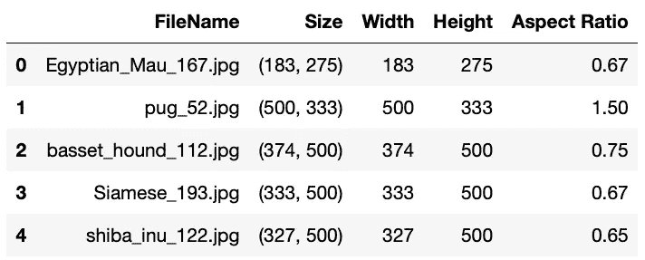
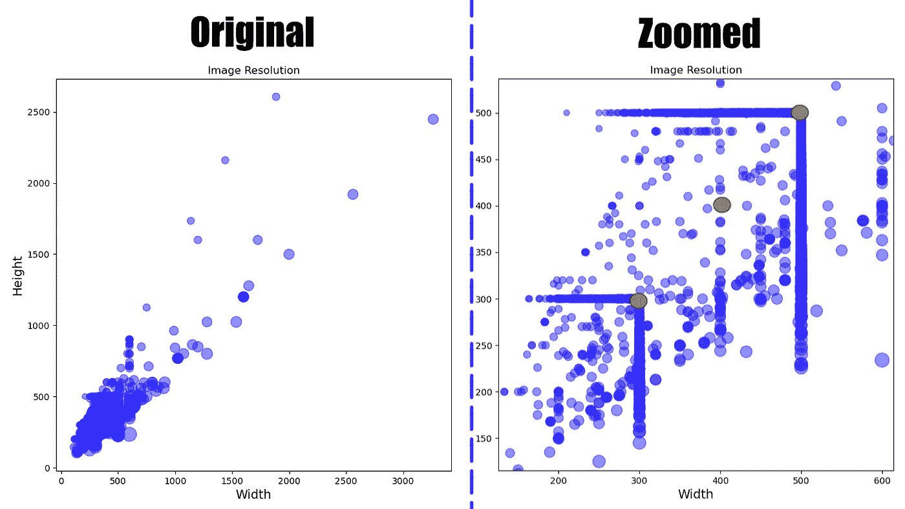

# 如何选择训练卷积神经网络的最佳图像尺寸？

> 原文：<https://medium.com/analytics-vidhya/how-to-pick-the-optimal-image-size-for-training-convolution-neural-network-65702b880f05?source=collection_archive---------0----------------------->

## 在自定义数据集上训练卷积神经网络时，选择正确的图像至关重要。这将影响模型的训练时间和性能。此外，我们将学习如何识别数据集是否有任何问题。

照片由 [Szabolcs Varnai](https://unsplash.com/@szabolcs?utm_source=unsplash&utm_medium=referral&utm_content=creditCopyText) 在 [Unsplash](https://unsplash.com/s/photos/image-size?utm_source=unsplash&utm_medium=referral&utm_content=creditCopyText) 上拍摄

# 为什么？

在我们跳到如何部分之前，让我们讨论选择错误尺寸的负面后果。在我们选择一个固定的**宽度**和**高度**之后，标准的程序是将所有的图像调整到这个固定的尺寸。所以，现在每个图像都落入两个桶中的一个。

*   *缩小:*更大的图像将被缩小，这使得 CNN 更难了解分类或检测所需的特征，因为存在重要特征的像素数量将显著减少。
*   *向上扩展:*当小图像被向上扩展并用零填充时，那么 NN 必须学习填充的部分对分类没有影响。较大的图像训练起来也较慢，可能需要更多的 VRAM。

所以我们必须选择我们的毒药，我们越接近最佳图像尺寸，它就越好。

# 最佳图像尺寸

我们都知道选择合适的大小取决于数据集，但问题是如何做到这一点？想象图像的大小。

数据集:[牛津-IIIT Pet 数据集](https://www.robots.ox.ac.uk/%7Evgg/data/pets/)

图像元数据

该数据集包含 7000 多幅不同大小和分辨率的图像。

图像分辨率图

从第一张图来看，似乎大多数图像的分辨率都小于 500 x 500。放大后，我们可以清楚地看到图像聚集在 300 或 500 大小的周围。我对这个数据集的建议是，开始用图像大小 300 训练神经网络，然后逐渐增加到 400，最后用大小 500 结束。通过这种方式，该模型应该能够很好地概括不同的图像分辨率。

# 奖金

1.  如果我们可以在检查情节中的点时看到底层图像，这不是很好吗？这可以帮助我们识别以下潜在问题。

*   标签错误的数据:会混淆模型。
*   某些类别图像的分辨率很高或很低:可能会使模型有偏差。

2.检查后，如果我们认为应该删除一些数据点，那么使用[套索选择器](https://matplotlib.org/stable/gallery/widgets/lasso_selector_demo_sgskip.html)来实现。

交互式绘图