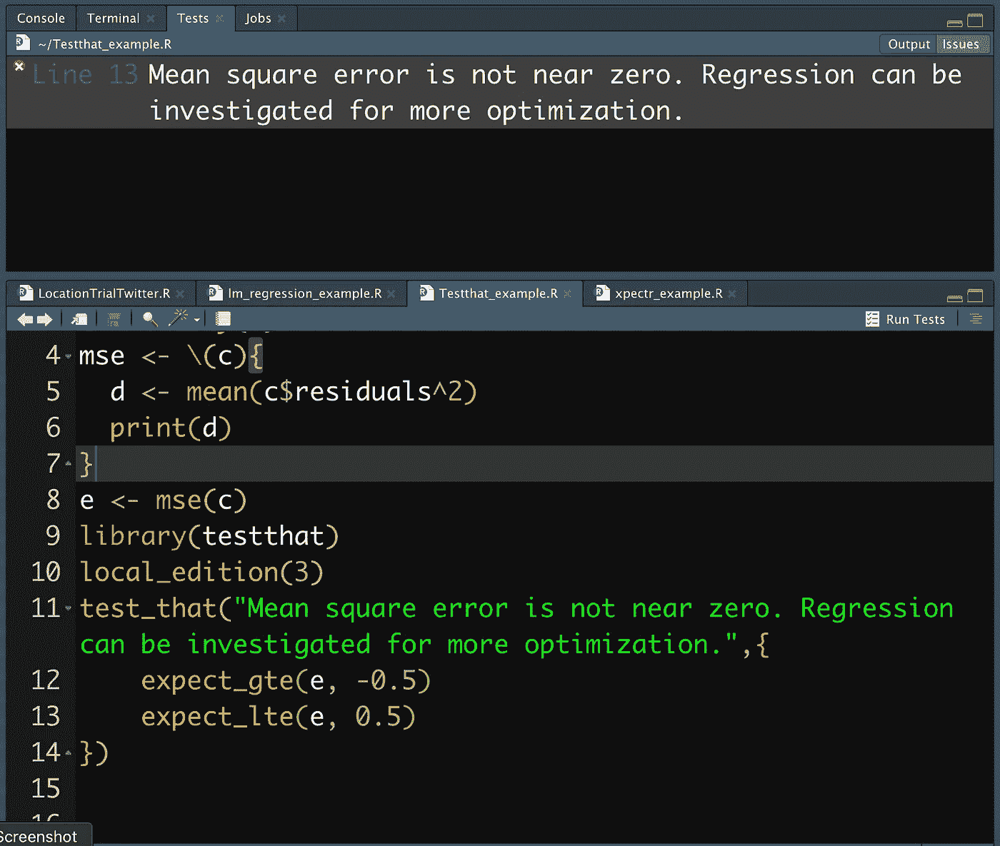

# 如何在 R 编程中规划单元测试(R 4.1)

> 原文：<https://medium.com/analytics-vidhya/how-to-plan-unit-tests-in-r-programming-r-4-1-7e1787dd27bd?source=collection_archive---------8----------------------->

## **单元测试可以设置自动检测来改进 R 脚本、数据模型和闪亮的应用程序**

在 R 编程中，数据工程师和数据科学家很自然地只关注脚本中的函数，为计算或打包做准备。当您计划您的编程时，您可能更喜欢测试…