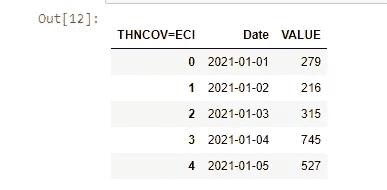
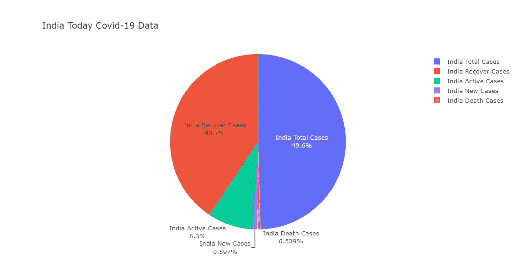
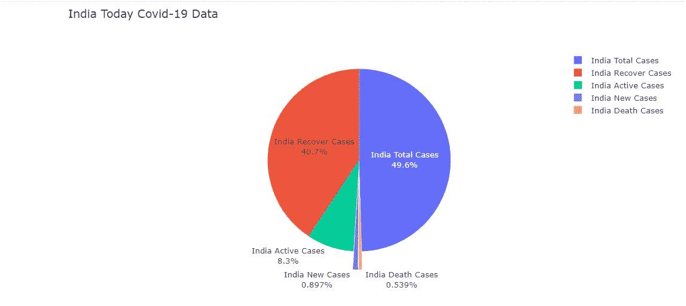

# 如何用 Plotly Python 绘制财务数据图表

> 原文：<https://medium.com/analytics-vidhya/how-to-plotting-financial-data-chart-with-plotly-python-d8b21a210f59?source=collection_archive---------2----------------------->

关于[路孚特开发者社区](https://developers.refinitiv.com/)的原始文章可从[这里](https://developers.refinitiv.com/en/article-catalog/article/plotting-financial-data-chart-with-plotly-python-on-classic-jupy)获得。

# 概观

**更新**:2021 年 6 月

随着数据科学家、财务编码员或交易员(又名公民开发者)的兴起，数据可视化是如何向读者(财务团队、营销团队等)呈现数据、信息及其上下文的重要部分。).好的数据分析本身不能与好的图形表示一起使用。

Matplotlib Pyplot 是一个事实上的库，用于在 Python 和数据科学家的世界中进行交互式绘图和数据可视化。然而， [Matplotlib](https://matplotlib.org/) 是一个巨大的库，包含了几个接口、功能和 1000 多页文档。

还有很多其他可供选择的绘图库比如[Seaborn](https://seaborn.pydata.org/)(Matplotlib 的高级接口) [Spotify](https://www.spotify.com/us/home/) 的 [Chartify](https://github.com/spotify/chartify) 、 [Bokeh](https://docs.bokeh.org/en/latest/) 、 [Plotly Python](https://plotly.com/python/) 等。

这个示例项目演示了如何使用 Plotly Python 库绘制各种类型的图形。演示应用程序使用来自 [Eikon 数据 API](https://developers.refinitiv.com/en/api-catalog/eikon/eikon-data-api) 的冠状病毒疾病(新冠肺炎)、环境、社会和治理以及财务数据作为数据集的示例。

# Plotly Python 简介

[Plotly Python](https://plotly.com/python/) 是一个[免费](https://plotly.com/python/is-plotly-free/)和[开源](https://github.com/plotly/plotly.py)的 Python 交互式图形库。该库构建在 [plotly.js](https://plotly.com/javascript/) JavaScript 库( [GitHub](https://github.com/plotly/plotly.js) )之上。Plotly Python 和 Plotly JavaScript 都是 [Plotly](https://plotly.com/) 的 Dash 和 Chart Studio 应用套件的一部分，为数据科学家和企业提供交互式的科学数据可视化库/解决方案。

本文将重点介绍 Plotly Python 开源库版本 **4.14.3** 、 **5.0.0** 和 **4.5.2** (4.5.2 仅针对码本环境)。

## Plotly Python 和 Jupyter 安装

Plotly Python 在 [PyPi](https://pypi.org/project/plotly/) 和 [Conda](https://anaconda.org/conda-forge/plotly) 库上都可用，所以可以用下面的 Python pip 命令安装这个库。

```
$> pip install plotly
```

要将 Plotly Python 与经典 Jupyter Notebook(不是 JupyterLab)一起使用，可以使用以下 conda 命令安装 Notebook 和 ipywidgets 包:

```
$> conda install "notebook>=5.3" "ipywidgets>=7.5"
```

*注*:

*   如果您想将 Plotly Python 与 JupyterLab 一起使用，请参考 [Plotly Python — JupyterLab 支持](https://plotly.com/python/getting-started/#jupyterlab-support)页面，了解如何设置 JupyterLab、JupyterLab 扩展( [Node.js](https://nodejs.org/en/) 是必需的)。
*   如果您是[路孚特工作区](https://www.refinitiv.com/en/products/refinitiv-workspace)或 [Eikon](https://www.refinitiv.com/en/products/eikon-trading-software) 用户，您可以从应用程序访问 [*码本*](https://www.refinitiv.com/en/products/codebook) ，这是一个云托管的 Jupyter 笔记本开发环境，用于 Python 脚本编写。密码本已经为你准备了 Plotly *版本 4.5.2* 。

## Plotly Python 示例[](http://localhost:8888/notebooks/plotly_dapi.ipynb#Plotly-Python-Example)

Plotly Python 的示例代码如下:

```
import plotly.express as pxfig = px.line(x=["a","b","c"], y=[1,3,2], title="sample figure")
fig.show()
```


# Eikon 数据 API 简介

[艾康数据 API](https://developers.refinitiv.com/en/api-catalog/eikon/eikon-data-api) (又名 DAPI)通过无缝工作流程提供对路孚特艾康/路孚特工作区数据的访问，桌面上运行的所有应用程序使用相同的数据。该 API 允许开发人员通过一个具有本地 Python 支持的现代 API 来利用各种社区工具。


如果您不熟悉 Eikon Data API 或 Python，强烈建议您在继续下一步之前阅读以下资源。

*   [搭建 Python 开发环境](https://developers.refinitiv.com/en/api-catalog/eikon/eikon-data-api/tutorials#setting-up-a-python-development-environment)。
*   [Eikon 数据 API 快速入门](https://developers.refinitiv.com/en/api-catalog/eikon/eikon-data-api/quick-start)。

*注*:

*   本文基于 Eikon 数据 API 版本 **1.1.10** 和 **1.1.6.post3** (在码本应用中)。
*   关于 API 数据覆盖范围和数据限制，请参见 [Eikon 数据 API 使用和限制指南](https://developers.refinitiv.com/en/api-catalog/eikon/eikon-data-api/documentation#eikon-data-api-usage-and-limits-guideline)。

# 先决条件

此示例需要下列依赖项软件和库。

1.  可访问 Eikon 数据 API 的路孚特 Eikon 或路孚特 Workspace 应用程序。
2.  Python [Anaconda](https://www.anaconda.com/distribution/) 或 [MiniConda](https://docs.conda.io/en/latest/miniconda.html) 分发/包管理器。
3.  [经典 Jupyter 笔记本](https://jupyter.readthedocs.io/en/latest/install/notebook-classic.html)或 [JupyterLab](https://jupyterlab.readthedocs.io/en/stable/getting_started/installation.html) 应用
4.  互联网连接。

*注:*

*   这个项目已经通过了 Python 版本 3.8.8 和 Conda 版本 4.10.1 的认证

请联系您的路孚特代表，以帮助您获得路孚特 Workspace/Eikon 证书。您可以按照 [Eikon 数据 API 快速入门](https://developers.refinitiv.com/en/api-catalog/eikon/eikon-data-api/quick-start)页面中的步骤生成/管理 AppKey。

# 获取数据的代码演练

我们通过导入 Eikon 数据 API、Pandas、Plotly 和其他所需的库来启动代码，然后启动 Data Eikon 数据 API 会话。

```
# Eikon and Application Librariesimport eikon as ek
import datetime
import numpy as np
import pandas as pd
import plotly.express as pxek.set_app_key('<YOUR_APP_ID_HERE>')
```

# 新冠肺炎数据

让我们从新冠肺炎数据开始，该数据可通过以下仪器模式在路孚特工作空间/路孚特艾肯平台中获得:

*   *【国家代码】CCOV=ECI* :新冠肺炎病例总数
*   *【国家代码】NCOV=ECI* :新冠肺炎新增病例
*   *【国家代码】ACOV=ECI* :新冠肺炎现行案例
*   *【国家代码】RCOV=ECI* :新冠肺炎恢复病例
*   *【国家代码】DCOV=ECI* :新冠肺炎死亡病例

因此，美国新冠肺炎数据的示例仪器有 *USCCOV=ECI* 、 *USNCOV=ECI* 、 *USACOV=ECI* 、 *USRCOV=ECI* 和 *USDCOV=ECI* 仪器。


您可以从 Workspace/Eikon 经济指标(“ECONNID”)应用程序中找到每个国家的新冠肺炎数据，然后选择国家和指标值。


新冠肺炎数据为用户提供了以下字段的详细信息:

*   *DSPLY_NMLL* :显示名称
*   *国家*:国家代码
*   *CF_DATE* :公告日期
*   *ECON_ACT* :实际值
*   *ECON _ 先前*:先前值

我们将使用泰国 2021 年 1 月 1 日至 2021 年 5 月 3 日的新病例历史数据，并使用 Eikon 数据 API **get_timeseries** 函数作为 Plotly 的示例数据。

```
# Thailand New CasesRIC = 'THNCOV=ECI'df_thailand_historical_new_cases = ek.get_timeseries(RIC, start_date='2021-01-01', end_date='2021-05-03', interval='daily')df_thailand_historical_new_cases.head()
```


# 用 Plotly Python 绘制图形

与 Matplotlib 一样，Plotly 也提供了各种低级、高级助手接口，用于根据开发人员的偏好创建、操作和呈现图形，如图表、绘图、地图、图表等。

Plotly Python 图形由[树状数据结构](https://plotly.com/python/figure-structure/)表示，这些数据结构会自动序列化到 JSON，以便由 **Plotly.js** JavaScript 库进行渲染。Plotly 提供了[图形对象](https://plotly.com/python/graph-objects/)作为将图形包装成 Python 类的底层接口，并提供了 [Plotly Express](https://plotly.com/python/plotly-express/) 作为创建图形的高层接口。

# Plotly Express

Plotly Express 包是 Plotly Python 库的推荐入口点。它是数据可视化的高级接口。 **plotly.express** 模块(通常导入为`px`)包含可以一次创建完整图形的功能，被称为 Plotly Express 或 PX。Plotly Express 是 **plotly** 库的内置部分，是创建最常见图形的推荐起点。

```
import plotly.express as px
```

Plotly Express 提供了 30 多种功能来创建不同类型的图形。这些函数的 API 被精心设计成尽可能的一致和易于学习。

我们将从线图界面开始。

## 用 Plotly Express 绘制线图

[线图](https://plotly.com/python/line-charts/)界面是使用 **px.line()** 函数创建 2D 线图的易用函数。

我们将绘制泰国新冠肺炎新病例历史数据的单线图，以**日期**值作为 X 轴，以**值**作为 y 轴。我们需要重新构建 [Pandas Dataframe](https://pandas.pydata.org/docs/reference/api/pandas.DataFrame.html) 来包含日期索引作为数据列。

```
# Reset index to include Date as a data columndf_thailand_historical_new_cases.reset_index(level=0, inplace=True)
df_thailand_historical_new_cases.head()
```



我们用 Plotly Express**px . line()**函数为折线图创建 Plotly 图形对象。我们将**日期**列作为 x 轴，**值**列作为 y 轴，并将图表标题信息传递给函数。

然后我们使用 Figure **update_traces()** 方法更新线条颜色等图形轨迹，使用 **update_yaxes()** 方法更新图形的 y 轴信息。

最后，我们调用 Figure **show()** 函数在 Jupyter 笔记本上绘制图表。请注意，我们将**‘Notebook’**传递给函数，以针对经典 Jupyter 笔记本环境强制使用经典 Jupyter 笔记本渲染器。如果你正在使用 JupyterLab，你可以只使用 **fig.show()** 语句。

```
fig = px.line(df_thailand_historical_new_cases, x="Date", y="VALUE", title='Thailand Covid-19 New Cases')fig.update_yaxes(title_text='Number of cases') #Update Y-Axis title
fig.update_traces(line_color='#FF0000') #Update Chart colo
fig.show()
```

结果将如下所示:


## 多线图

Plotly Express 线也支持多线图形。我们使用美国、印度、巴西、法国和俄国的新冠肺炎新病例数据作为示例数据来展示从 2021 年 1 月 1 日到 2021 年 5 月 3 日的新病例趋势。

#定义 RICs 列表

rics = ['USNCOV=ECI '，' INNCOV=ECI '，' BRNCOV=ECI '，' FRNCOV=ECI '，' RUNCOV=ECI']

#调用 Eikon 数据 API get_timeseries 函数

df _ historical _ total _ cases = ek . get _ time series(RICS，start _ date = ' 2021–01–01 '，end _ date = ' 2021–04–29 '，interval='daily ')

df _ 历史 _ 总计 _ 案例


当前的列名是 RIC 名( *USNCOV=ECI* 、 *INNCOV=ECI* 等。)很难阅读，所以我们需要首先将列名重命名为可读的国家名称。

```
df_historical_total_cases.rename(
    columns= {'USNCOV=ECI':'USA',     'INNCOV=ECI':'India','BRNCOV=ECI':'Brazil','FRNCOV=ECI':'France','RUNCOV=ECI':'Russia'},
    inplace = True
)
df_historical_total_cases.head()
```


然后我们重置 Dataframe 索引，将日期作为数据列包含进来。

```
df_historical_total_cases.reset_index(level=0, inplace=True)
```

为了绘制多条线图，我们调用 **px.line()** 函数，将列名列表作为 y 轴值传递。

```
fig = px.line(df_historical_total_cases,
    x="Date",
    y=['USA','India','Brazil','France','Russia'],
    title='World COVID-19 2021 News Cases')fig.update_yaxes(title_text='Number of cases')
fig.show()
```


请在以下资源中查看有关 Plotly Express 折线图的更多详细信息:

*   [Python 中的折线图](https://plotly.com/python/line-charts/)页面。
*   [Plotly Express Line API 参考](https://plotly.com/python-api-reference/generated/plotly.express.line.html#plotly.express.line)页面。
*   [在 Python](https://plotly.com/python/creating-and-updating-figures/#updating-figures) 页面中创建和更新图形。
*   [Plotly 图 API 参考](https://plotly.com/python-api-reference/generated/plotly.graph_objects.Figure.html)页面。

## 带有 Plotly Express 的饼图

[饼状图](https://plotly.com/python/pie-charts/)界面是使用 **px.pie()** 函数创建循环统计图的易用函数。

我们将详细调查印度新冠肺炎今天的所有数据(总病例数、新增病例数、活跃病例数、痊愈病例数、死亡病例数)，并将数据绘制成饼状图。

```
# India COVID-19 Data All Ricsrics_india_today = ['INCCOV=ECI','INNCOV=ECI','INACOV=ECI','INRCOV=ECI','INDCOV=ECI']fields = ['DSPLY_NMLL', #Display Name
    'COUNTRY',    #Country code
    'CF_DATE', #Announcement Date
    'ECON_ACT', #Actual value
    'ECON_PRIOR' #Previous value
]df_india_today, err = ek.get_data(rics_india_today, fields)
df_india_today
```


在某些情况下，根据执行 **get_data** 函数的日期和时间(很可能是一周的第一天)，今天的数据( *ECON_ACT* 字段)可能会返回(可为空的整数)。

为了处理这种情况，我们需要检查*ECON _ 行为*列中的所有值是否为空。

```
is_ECON_ACT_null = df_india_today['ECON_ACT'].isnull().all()
is_ECON_ACT_null# If **is_ECON_ACT_null** is **True**, we will plot a Pie Chart with *ECON_PRIOR* value.plot_value = 'ECON_ACT'
if is_ECON_ACT_null:
    plot_value = 'ECON_PRIOR'
```

返回的 DataFrame 对象看起来不错，但有点难以阅读，因此我们将在 DataFrame 对象中添加一个名为 *Description* 的新列，其中包含有关每个仪器定义的信息。

```
# Dictionary Definitiion Pattern
covid19_rics_pattern = {
    'CCOV=ECI': 'Total Cases',
    'NCOV=ECI': 'New Cases',
    'RCOV=ECI': 'Recover Cases',
    'ACOV=ECI': 'Active Cases',
    'DCOV=ECI': 'Death Cases'
}# Get a List of readable Country Name and Event for adding new DataFrame columndef get_events_descriptions(list_rics):
    list_result = []
    for ric in list_rics:
        event = ric[2:]
        list_result.append('India {event}'.format(event = covid19_rics_pattern[event]))
    return list_resultdf_india_today['Description'] = get_events_descriptions(rics_india_today)
df_india_today
```


最后，我们调用 **px.pie()** 函数为饼图创建一个 figure 对象，其值为 **ECON_ACT** (实际值)字段和**描述**列名。

对于这个饼图，我们使用 Figure **update_traces()** 方法来更新图上的文本显示格式。

```
fig = px.pie(df_india_today,
    values= plot_value,
    names= 'Description',
    title= 'India Today Covid-19 Data',
    hover_data=['CF_DATE'],
    labels={'CF_DATE':'As Of'}
)fig.update_traces(textposition='auto', textinfo='percent+label')
fig.show()
```

## 对于码本用户！！

请注意，CodeBook 应用程序有一个较旧版本的 Plotly Python(版本 *4.5.2* 截至 2021 年 5 月)，因此用于 CodeBook 的 **px.pie()** 函数将略有不同。

```
# codebook_plotly_dapi.ipynbfig = px.pie(df_india_today,
    values= plot_value,
    names= 'Description',
    title= 'India Today Covid-19 Data'
)fig.update_traces(textposition='auto', textinfo='percent+label')fig.show() # CodeBook is based on JupyerLab
```



请在以下资源中查看有关 Plotly Express 饼图的更多详细信息:

*   [Python 中的饼状图](https://plotly.com/python/pie-charts/)页面。
*   [Plotly Express 饼状图 API 参考](https://plotly.com/python-api-reference/generated/plotly.express.pie)页面。

# Plotly 图形对象

[Plotly Graph Object](https://plotly.com/python/graph-objects/)(**Plotly . Graph _ objects**，通常作为 **go** 导入)是一个底层接口，让开发人员与 Plotly Graph 和 IPYWidgets 进行交互，兼容绘制图形和管理数据细节。虽然 Plotly Express 提供了一种创建和定制图形的简单方法，但 Plotly Graph 对象允许开发人员创建和定制更高级的图形，如组条形图、烛台图、不同类型的子图等。

```
# Import plotly.graph_objects moduleimport plotly.graph_objects as go
```

## 带有 Plotly 图形对象的“爆炸式”饼图

上面的饼图有一些难以阅读的部分，所以我们将使用 Plotly Graph 对象重新创建饼图，以从图表中提取一些扇区。

```
fig = go.Figure(data = [ go.Pie(
    labels=df_india_today['Description'],
    values=df_india_today[plot_value],
    pull=[0, 0.2, 0, 0,0.2] #pull only some of the sectors
)])fig.update_traces(textposition='auto', textinfo='percent+label')
fig.update_layout(title = 'India Today Covid-19 Data') # Set Title
fig.show()
```



请注意，使用 Graph 对象时，可以通过 **fig.update_layout** 函数的 **title** 属性设置图表标题。

请参阅以下资源中有关 Plotly Graph 对象条形图的更多详细信息:

*   [Plotly Graph 对象饼状图](https://plotly.github.io/plotly.py-docs/generated/plotly.graph_objects.Pie.html)页面。
*   [Plotly Graph 对象图 API 参考](https://plotly.com/python-api-reference/generated/plotly.graph_objects.Figure.html)页面。

## 带有 Plotly 图形对象的条形图

我们将使用电信公司的环境、社会和公司治理(ESG)数据作为条形图示例的示例数据。

通过在菜单中查询 *<公司名称> ESG* ，可以在 Eikon/路孚特 Workspace 桌面应用程序中获得 ESG 数据。


您可以从 Eikon/路孚特工作区数据项浏览器(“DIB”)应用程序中找到 ESG 数据字段，然后选择“环境、社会和公司治理”内容分类。


首先，我们从 *TR 中获取 ESG 得分数据。通过 Eikon 数据 API **get_data()** 函数调用 TRESGScore* 字段。

```
# Define RICs list
universe = ['VOD.L','TEF.MC','TEL.OL','DTEGn.DE']df_esg,eff = ek.get_data(universe, ['TR.TRESGScore'])
df_esg
```


然后我们用`go.Figure`界面和`go.Bar()`类为条形图创建一个 Plotly 图形，然后传递 DataFrame *Instrument* 列为 x 轴， *ESG Score* 列为 y 轴。

请注意，现在我们使用 Figure `update_layout()`方法来更新图表标题的 Figure 布局。

```
colors = ['#E60000','#003145','#00ACE7','#E10075']fig = go.Figure(go.Bar(x=df_esg['Instrument'],
    y=df_esg['ESG Score'],
    marker_color = colors
)) # Create Figurefig.update_xaxes(title_text='Company') # Set X-Axis title
fig.update_yaxes(title_text='ESG Score') # Set &-Axis title
fig.update_layout(title = 'Telecommunication Companies: ESG Score')fig.show()
```


但是，如果不与 EST 争议评分进行比较，就不能单独使用 ESG 评分数据(字段 *TR)。tresgcontractionsscore*)和 ESG 综合得分(field *TR。tresgscore*)。

我们将要求公司名称( *TR。CompanyName* )，将 ESG 得分绘制成小组条形图。

```
df_esg,eff = ek.get_data(universe, ['TR.CompanyName',
    'TR.TRESGScore',
    'TR.TRESGCControversiesScore',
    'TR.TRESGCScore',
    'TR.TRESGCScoreGrade'])df_esg
```


然后我们创建多个 **go。Bar** 对象的每个 ESG 分数，并将其传递给 **go。图**。请注意，我们需要通过**fig . update _ layout(bar mode = ' group ')**语句将布局设置为组条形图。

```
fig = go.Figure(data=[
    go.Bar(name='ESG Score', x=df_esg['Company Name'], y=df_esg['ESG Score']), 
    go.Bar(name='ESG Controversies Score', x=df_esg['Company Name'], y=df_esg['ESG Controversies Score']),
    go.Bar(name='ESG Combined Score', x=df_esg['Company Name'], y=df_esg['ESG Combined Score'])
])fig.update_layout(barmode='group') # Change the bar mode
fig.update_xaxes(title_text='Company')
fig.update_yaxes(title_text='Environmental, Social and Corporate Governance')
fig.update_layout(title = 'Telecommunication Companies: ESG Scores')fig.show()
```


请参阅以下资源中有关 Plotly Graph 对象条形图的更多详细信息:

*   [Plotly Graph 对象条形图](https://plotly.com/python-api-reference/generated/plotly.graph_objects.Bar.html)页面。

## 带有 Plotly 图形对象的烛台图表

最后一个例子是使用 Plotly Graph 对象的[烛台](https://plotly.com/python/candlestick-charts/)图表。我们将使用比特币/美元外汇即期汇率作为适合烛台图表的示例数据集。

比特币/美元外汇即期汇率数据在 Eikon/Workspace 和路孚特实时系统中以 **BTC=** 工具名称提供。


我们通过 Eikon 数据 API **get_timeseries** 函数请求 BTC 的 180 个每日历史数据。

```
df_bitcoin = ek.get_timeseries(rics = 'BTC=',interval = 'daily',count = 180)df_bitcoin.head()
```


然后，我们重新构建 DataFrame 索引，将 *Date* 列从索引列更改为数据列。

```
df_bitcoin.reset_index(level=0, inplace=True)
df_bitcoin.head()
```


最后，我们使用 **go。烛台**对象从 Dataframe 创建烛台图表，并将其传递给 **go。图**创建一个 Plotly 图形对象来绘制一个图形。

```
fig = go.Figure(data=[go.Candlestick(x=df_bitcoin['Date'],
    open=df_bitcoin['OPEN'],
    high=df_bitcoin['HIGH'],
    low=df_bitcoin['LOW'],
    close=df_bitcoin['CLOSE'])])fig.update_xaxes(title_text='Date')
fig.update_yaxes(title_text='Prices')
fig.update_layout(xaxis_rangeslider_visible=True, 
     title = 'Bitcoin/US Dollar FX Spot Rate'
) # Set Set Range Slider Bar and Titlefig.show()
```


我们也可以与图表范围滑动条交互。


请参阅以下资源中有关 Plotly Graph 对象烛台图的更多详细信息:

*   [Python 中的烛台图表](https://plotly.com/python/candlestick-charts/)页面。
*   [烛台图表 API 参考](https://plotly.com/python-api-reference/generated/plotly.graph_objects.Candlestick.html)页面。
*   [Plotly Graph 对象图 API 引用](https://plotly.com/python-api-reference/generated/plotly.graph_objects.Figure.html)页面。

# Eikon 数据 API 设置

请在 [Eikon 数据 API 快速启动页面](https://developers.refinitiv.com/en/api-catalog/eikon/eikon-data-api/quick-start)按照逐步指南设置您的 Eikon 数据 API 和 AppKey。

# 如何运行示例笔记本

请注意，路孚特工作空间/Eikon 应用程序集成了一个数据 API 代理，作为 Eikon 数据 API Python 库和 Eikon 数据平台之间的接口。因此，当您使用 Eikon 数据 API Python 库时，路孚特工作空间/Eikon 应用程序必须处于运行状态。

第一步是将示例项目文件夹从 [GitHub](https://github.com/Refinitiv-API-Samples/Article.EikonAPI.Python.PlotlyChart) 解压缩或下载到您选择的目录中，然后按照 GitHub 资源库中的分步指南进行操作:

*   [如何使用 Classic Jupyter Notebook](https://github.com/Refinitiv-API-Samples/Article.EikonAPI.Python.PlotlyChart#how-to-run-this-example-with-the-classic-jupyter-notebook) 部分运行此示例，并为 Classic Jupyter Notebook 环境打开*plotly _ DAPI . ipynb*Notebook 文件。
*   [如何使用 JupyterLab](https://github.com/Refinitiv-API-Samples/Article.EikonAPI.Python.PlotlyChart#how-to-run-this-example-with-the-jupyterlab) 部分运行此示例，并为 JupyterLab 环境打开*JupyterLab _ plotly _ DAPI . ipynb*笔记本文件。
*   [如何使用 CodeBook](https://github.com/Refinitiv-API-Samples/Article.EikonAPI.Python.PlotlyChart#how-to-run-this-example-with-the-codebook) 部分运行此示例，然后上传并打开 Eikon/Workspace CodeBook 环境的*code book _ plotly _ DAPI . ipynb*笔记本文件。

# 解决纷争

有时经典的 Jupyter 笔记本会遇到这样的问题:当您关闭笔记本窗口并重新打开它时，您的绘图会显示为空白。


您可以在笔记本应用程序的右上角菜单上检查笔记本文档**是否可信**。


请单击该按钮以启用 JavaScript 在此笔记本中显示。


作为最后的手段，你可以从内核菜单中“重启并清除输出”,然后重新运行你的笔记本。您可以在 [Jupyter Classic 笔记本问题](https://plotly.com/python/troubleshooting/#jupyter-classic-notebook-problems)和[故障排除](https://plotly.com/python/troubleshooting/#)页面找到更多详细信息。

# 结论

数据可视化是数据分析给读者的第一印象。数据科学家、财务编码人员和开发人员花在数据可视化过程上的时间比他们获取数据的时间还要长。这意味着数据可视化/图表库需要易于使用、灵活并且有一个好的文档。

[Plotly Python](https://plotly.com/python/) 提供易于使用的/高级和低级接口，以支持广泛的开发人员技能。开发人员可以选择符合他们要求的 Plotly 图表对象(线条、条形图、散点图、蜡烛图等)，检查 Plotly 示例代码和社区页面，以创建一个源代码可读且易于维护的漂亮图表。

与 Matplotlib Pyplot(图表库中的主要播放器)相比，Plotly 的优点和缺点如下:

## 赞成的意见

1.  使用几行代码来创建和定制图表。
2.  为开发人员提供 30 多种易于使用的各种图表对象类型。
3.  有经验的开发人员可以使用低级图表对象类型来创建更强大、更灵活的图表。
4.  简化文档和示例代码。
5.  为个人和企业开发者提供专门的[付费支持计划](https://plotly.com/get-pricing/)。

## 骗局

1.  经典 Jupyter 笔记本和 Jupyter Lab 的一些 API 接口和安装流程是不一样的。
2.  Matplotlib Pyplot 基于开发者社区网站(如 [StackOverflow](https://stackoverflow.com/) )拥有更大的用户。这意味着很多 Pyplot 问题，问题会比 Plotly 更容易找到答案或解决方案。
3.  Matplotlib Pyplot 拥有来自官方和用户网站的更大的文档、教程和分步指南资源。
4.  当您重新打开 classic Jupyter 笔记本时，这些图有时会显示为空白(参见[故障排除页面](https://plotly.com/python/troubleshooting/#jupyter-classic-notebook-problems)

同时， [Eikon 数据 API](https://developers.refinitiv.com/en/api-catalog/eikon/eikon-data-api) 让开发人员能够通过几行易于理解和维护的代码快速访问路孚特 Eikon/路孚特工作区数据和我们最新的平台功能。

# 参考

您可以从以下资源中找到有关 Plotly、Eikon 数据 API 和相关技术的更多详细信息:

*   [路孚特 Eikon 数据 API 页面](https://developers.refinitiv.com/en/api-catalog/eikon/eikon-data-api)在[路孚特开发者社区](https://developers.refinitiv.com/)网站上。
*   [剧情官方页面](https://plotly.com/)。
*   [Plotly Python 页面](https://plotly.com/python/)。
*   [Plotly GitHub 页面](https://github.com/plotly/plotly.py)
*   [剧情直通车页面](https://plotly.com/python/plotly-express/)
*   [Plotly 图形对象页面](https://plotly.com/python/graph-objects/)
*   [在 Python 页面中创建和更新图形](https://plotly.com/python/creating-and-updating-figures/#updating-figures)
*   [Plotly 图 API 参考页面](https://plotly.com/python-api-reference/generated/plotly.graph_objects.Figure.html)
*   [我选择 Plotly 作为我的主要可视化库的 4 个原因](https://towardsdatascience.com/4-reasons-why-im-choosing-plotly-as-the-main-visualization-library-dc4a961a402f)
*   [Eikon 数据 API 快速入门指南页面](https://developers.refinitiv.com/en/api-catalog/eikon/eikon-data-api/quick-start)。
*   [Eikon 数据 API 教程页面](https://developers.refinitiv.com/en/api-catalog/eikon/eikon-data-api/tutorials)。
*   [Eikon API 的 Python Quants 视频教程系列](https://community.developers.refinitiv.com/questions/37865/announcement-new-python-quants-video-tutorial-seri.html)。
*   [Eikon Data APY Python 参考指南](https://developers.refinitiv.com/en/api-catalog/eikon/eikon-data-api/documentation#eikon-data-ap-is-for-python-reference-guide)。
*   [Eikon 数据 API 故障排除文章](https://developers.refinitiv.com/en/article-catalog/article/eikon-data-api-python-troubleshooting-refinitiv)。
*   [用 Eikon 数据 API(Python)获得最新的冠状病毒案例和时间序列统计数据](https://github.com/Refinitiv-API-Samples/Article.EikonAPI.Python.CoronavirusStatistic)

关于这个例子或 Eikon 数据 API 的任何问题，请使用开发者社区 [Q & A 论坛](https://community.developers.refinitiv.com/spaces/92/eikon-scripting-apis.html)。

# 开源代码库

[用 Plotly Python GitHub 库绘制金融数据图表。](https://github.com/Refinitiv-API-Samples/Article.EikonAPI.Python.PlotlyChart)