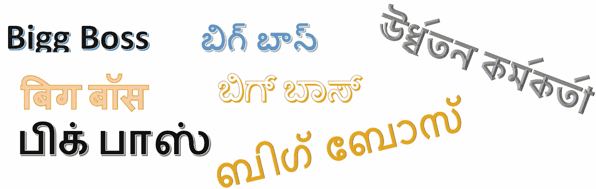
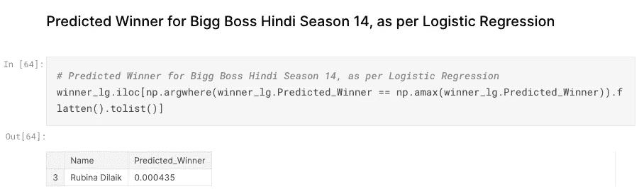
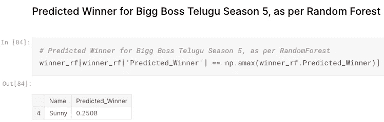

# 如何预测最大老板赛季冠军？

> 原文：<https://medium.com/analytics-vidhya/how-to-predict-bigg-boss-season-winner-a5fe03916e13?source=collection_archive---------7----------------------->

当我看 BiggBoss(泰卢固语第一季)时，我有以下问题，

I)我们是否可以通过任何方式预测 Big Boss/Big Brother 赛季的冠军？

ii)如何预测其他(印度)语言 Bigg Boss 的赛季冠军？

iii)如果是，是否有现成的数据集？

我在互联网上没有找到任何#BiggBoss 数据集，所以开始收集数据。



```
*As of December 2022, total 48 Bigg Boss seasons completed and 4 seasons are running.*
```

在最初的 Bigg Boss 数据集中，2017 年，只有 15 个特征/列。并不断添加新的变量/列，目前，数据集有 31 个预测变量和 930+行。*获胜者*列是目标/响应变量。

# 您可以在[https://www . ka ggle . com/datasets/thirumani/bigg-boss-India-Hindi-Telugu-Tamil-kannada](https://www.kaggle.com/datasets/thirumani/bigg-boss-india-hindi-telugu-tamil-kannada)访问数据集

[](https://www.kaggle.com/datasets/thirumani/bigg-boss-india-hindi-telugu-tamil-kannada) [## Bigg Boss 印度-印地语泰卢固语泰米尔卡纳达语

### 比格博斯泰卢固语/泰米尔语/卡纳达语/马拉雅拉姆语/印地语/马拉地语/孟加拉语数据集

www.kaggle.com](https://www.kaggle.com/datasets/thirumani/bigg-boss-india-hindi-telugu-tamil-kannada) 

2019 年，开始编写 Python 代码来进行探索性数据分析(EDA)，后来扩展了代码，以包括机器学习模型。

每种印度语言中的季节数。

```
bigg_boss.groupby('Language')['Season Number'].nunique().nlargest(10)Language   #Seasons
Hindi        18
Kannada      10
Tamil         7
Telugu        7
Malayalam     4
Marathi       4
Bengali       2
```

**关于比格老板/老大哥印度季节的琐事**

*   与其他印度语言相比，北印度语有许多季节。所以，印度人的室友数量更多。
*   在比格老板印度赛季，大多数舍友(85%)在第一天/第一周进入。其余 15%的参与者是通配符条目。
*   与其他行业相比，进入大老板公司的电影女演员人数更多。
*   萨尔曼·可汗举办了最多的赛季(在比格博斯印地语中)，苏迪普紧随其后。
*   没有外卡进入舍友赢得比格老板比赛。
*   在所有大 Boss 语言中，在所有季节中，女性选手都更多。7 名跨性别者(LGBT)参与了所有印度语言。
*   139 名选手通过外卡参赛，但只有 24 人成功进入决赛。
*   4 名再次参赛选手赢得了 Bigg Boss 称号。
*   4 季仅在 OTT 平台播出。

印度所有 BB 赛季获胜者/参与者赢得的奖金总额。

```
from babel.numbers import format_currency
print(format_currency(bigg_boss['Prize Money (INR)'].sum(), 'INR', locale='en_IN'))
₹ 24,06,00,000 (24 *crores and 6 lakh rupees)*
```

我创建了 big Boss(印度)数据集，包括 Bigg Boss India 版本和季节的所有汇编，使用各种语言，如印地语、卡纳达语、泰卢固语、泰米尔语、马拉地语、孟加拉语和马拉雅拉姆语。

以下是 Bigg Boss India 数据集中的特征/列:

*   语言——节目播出/设计所用的语言
*   季节编号—季节编号
*   姓名—参与者的姓名。原始参赛者按字母顺序排列(无嘉宾)
*   职业——进入 Bigg Boss 前室友职业
*   性别 BiggBoss 参赛者的性别，例如男性、女性、LGBT
*   进入日期——进入房屋的日期
*   淘汰日期——淘汰/驱逐的日期
*   淘汰周数—(上一次)驱逐周数
*   通配符—是否通过通配符输入
*   季节长度—季节的天数
*   室友数量—整个赛季的室友总数，包括通配符条目
*   季节开始日期—季节开始日期
*   季节结束日期-季节最后一天或结束日或停止日期
*   主持人姓名—主持人的姓名(主持大多数周末剧集)
*   来宾主机名—来宾/临时主机的名称
*   奖金(印度卢比)——总奖金，以印度卢比为单位
*   播出者—播出该季的电视频道名称(在印度)
*   OTT 平台— OTT 平台谁首播了这一季(在印度)
*   平均 TRP —当季的平均电视 TRP
*   最受欢迎的州——最受欢迎的印度州
*   房屋位置 bigg boss house 物理位置
*   OTT 季——这一季是否只在 OTT 首播/直播？
*   面临的驱逐数量 Bigg Boss 室友面临的驱逐数量
*   当选为队长的次数—当选为队长的次数/周数
*   再次进入的次数——同一季节再次进入房屋的次数(非虚假驱逐和密室)
*   散步—由于健康/个人原因，走出 BB 屋，离开时没有被淘汰(0 —否，1 —是)
*   因违规/法律问题被逐出 BB house，退出时未被淘汰(0-否，1-是)
*   在密室中—是否待在密室中(0 —否，1 —是)
*   社交媒体受欢迎程度—演出期间社交媒体的受欢迎程度(1 —最低，10 —最高)
*   决赛选手—无论是否进入最后一周，还是进入决赛(0-否，1-是)
*   赢家-赢家与否(1-赢家，0-否则)，谁拿了最高奖金

[](https://github.com/satya-thirumani/bigg-boss-data-set) [## GitHub-satya-thirumani/bigg-boss-数据集

### 比格博斯泰卢固语/泰米尔语/卡纳达语/印地语/马拉雅拉姆语/马拉地语/孟加拉语数据集。比格老板印度-所有老大哥数据集…

github.com](https://github.com/satya-thirumani/bigg-boss-data-set) 

您可以使用任何机器学习(ML)算法或深度学习(DL)算法来预测下一个/当前 Bigg Boss(印地语、卡纳达语、泰卢固语、泰米尔语、马拉雅拉姆语、孟加拉语、马拉地语)赛季冠军。

比格博斯印地语第一季 1/2/3/4/5/6/7/8/9/10/11/12/13/14/15/16 和哈拉博尔，奥特

比格老板卡纳达第 1/2/3/4/5/6/7/8/9 季

比格老板泰卢固语第 1/2/3/4/5/6 季不停

大老板泰米尔第一季 1/2/3/4/5/6 和终极版

比格老板马拉雅拉姆第 1/2/3/4 季

比格博斯马拉地第 1/2/3/4 季

Bigg Boss Bangla 第 1/2/3 季

探索性数据分析(EDA)的所有比格老板(老大哥)印度赛季是在

[](https://www.kaggle.com/code/thirumani/biggboss-hindi-telugu-tamil-kannada-marathi-bangla) [## BiggBoss 印地语泰卢固语泰米尔语卡纳达语马拉地语孟加拉语

### 使用 Kaggle 笔记本探索和运行机器学习代码|使用来自多个数据源的数据

www.kaggle.com](https://www.kaggle.com/code/thirumani/biggboss-hindi-telugu-tamil-kannada-marathi-bangla) 

每种印度语言的独立机器学习模型可从以下网址获得:

[预测 Bigg Boss Hindi 第 16 季冠军](https://www.kaggle.com/thirumani/predicting-bigg-boss-hindi-season-15-winner)

[预测比格老板卡纳达第九季冠军](https://www.kaggle.com/thirumani/predicting-bigg-boss-kannada-season-8-winner)

[预测比格博斯泰卢固语第六季冠军](https://www.kaggle.com/thirumani/predicting-bigg-boss-telugu-non-stop-season-winner)

[预测大老板泰米尔第六季冠军](https://www.kaggle.com/thirumani/predicting-bigg-boss-tamil-ultimate-season-winner)

[预测大老板马拉雅拉姆第四季冠军](https://www.kaggle.com/thirumani/predicting-bigg-boss-malayalam-season-3-winner)

[预测比格博斯马拉第四季冠军](https://www.kaggle.com/thirumani/predicting-bigg-boss-marathi-season-4-winner)

我使用了逻辑回归和随机森林 ML 算法来预测当前赛季的最大赢家。

**例如:**

下面的预测是在大结局前四周完成的。



**预测 Bigg Boss 印地语第 14 季冠军**

下面的预测是在大结局前一周完成的。



# . . .

比格博斯印度数据集可视化/信息图在 **Tableau** 公开-

[http://public . tableau . com/app/profile/satya . thirumani/viz/bigbossindia _ 16434338263440/bb story](https://public.tableau.com/app/profile/satya.thirumani/viz/BiggBossIndia_16434338263440/BBStory)

[](https://public.tableau.com/views/BiggBossIndia_16434338263440/BBStory?:language=en-US&:display_count=n&:origin=viz_share_link) [## BiggBoss 印度数据集的信息图

### BiggBoss 印度数据集的信息图

BiggBoss 印度数据 setpublic.tableau.com 的信息图表](https://public.tableau.com/views/BiggBossIndia_16434338263440/BBStory?:language=en-US&:display_count=n&:origin=viz_share_link)