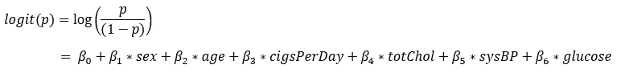

# 如何用 Logistic 回归预测冠心病风险？

> 原文：<https://medium.com/analytics-vidhya/how-to-predict-coronary-heart-disease-risk-using-logistic-regression-c069ab95cbec?source=collection_archive---------3----------------------->

**心脏病**是全球**死亡的首要原因**，占 2019 年死亡人数的三分之一。心脏病病例在此期间增加了近一倍，从 1990 年的 2.71 亿增加到 2019 年的**5.23 亿**，而**心脏病死亡人数**从 1210 万上升到**1860 万。**


**冠心病**由于心脏动脉中斑块的堆积，导致流向心肌的血液减少。

最具挑战性的任务之一是确定这种疾病的原因并尽可能地预防它。医疗诊断推理正在成为**机器学习**的流行应用，其中专家系统和基于模型的方案提供了用于开发假设的机制，然后将使用建模和模拟技术或统计分析对其进行测试。

心脏病的预测被认为是健康领域中最重要的课题之一。利用机器学习算法和大量数据，可以推断出可以帮助医生做出更准确预测的信息。

考虑到获得准确结果所需的专业技能和知识水平，预测**冠心病**是一项非常复杂的挑战。根据世卫组织的一项调查，医学专家可以正确预测心脏病，但准确率只有 67%。

在本文中，在训练阶段将使用多个自变量，如**性别、年龄、吸烟日、总胆固醇、sysBP** 和**葡萄糖**以及因变量( **TenYearCHD** class)来建立分类模型。**分类目标**是预测患者未来 10 年是否有患冠心病*或冠心病* (CHD)的风险。

**好了，我们开始吧！**

# **步骤 1。导入所需的库**

```
import pandas as pd
import numpy as np
import statsmodels.api as sm
import scipy.stats as st
import matplotlib.pyplot as plt
import seaborn as sn
from sklearn.metrics import confusion_matrix
import matplotlib.mlab as mlab
%matplotlib inline
```

# **步骤二。数据准备**

数据集来自 Kaggle 网站([弗雷明汉心脏研究数据集](https://www.kaggle.com/amanajmera1/framingham-heart-study-dataset))。数据集提供了患者的信息。它包括 4000 多条记录和 15 个属性，如下所述。

```
df = pd.read_csv('framingham.csv')
df.drop(['education'],axis=1,inplace=True)
df.rename(columns={'male':'sex_male'},inplace=True)
df.head()
```


**输入变量:**

1.  **性别**:男或女(名义)
2.  **年龄**:患者年龄(连续)
3.  **当前吸烟者**:患者是否是当前吸烟者(名义上)
4.  **烟/日**:一个人平均一天吸的烟的数量(连续)
5.  **BPMeds** :患者是否在服用降压药(标称)
6.  **中风**:患者之前是否有中风史(名义上)
7.  **患病率类型**:患者是否为高血压(正常)
8.  **糖尿病**:患者是否患有糖尿病(标称)
9.  **总胆固醇**:总胆固醇水平(连续)
10.  **sysBP** :收缩压(持续)
11.  **diaBP** :舒张压(持续)
12.  **身体质量指数**:体重指数(连续)
13.  **心率**:心率(连续)
14.  **葡萄糖**:葡萄糖水平(持续)
15.  **十年冠心病** : 10 年冠心病风险(二进制:1(是)，0(否))

# **第三步。处理缺失值**

```
df.isnull().sum()
```


```
count = 0
for i in df.isnull().sum(axis=1):
    if i > 0:
        count = count+1
print('Total number of rows with missing values is', count)
```


从上面的输出中，我们得到缺少值的行的总数是 **489。**在这种情况下，因为它只占整个数据集的 **12 %** ，所以具有缺失值的行被排除。

我们从排除过程中获得数据，如下所示:

```
df.dropna(axis=0, inplace=True)
df.info()
```


# **步骤四。探索性视觉分析**

这一步的目的是查看每个数据的分布。

```
def draw_histograms(dataframe, features, rows, cols):
    fig=plt.figure(figsize=(20,20))
    for i, feature in enumerate(features):
        ax=fig.add_subplot(rows,cols,i+1)
        dataframe[feature].hist(bins=20,ax=ax,facecolor='red')
        ax.set_title(feature+"Distribution", color='blue')
    fig.tight_layout()
    plt.show()
draw_histograms(df, df.columns, 6, 3)
```


从上面的直方图中，我们可以更好地理解数据的分布。

下一步是看看有多少病人有患冠心病的风险。

```
sn.countplot(x='TenYearCHD', data=df)
```


从上图中，我们可以得出结论，是否有 **3179** 患者没有**冠心病**和 **572** 患者有**冠心病风险。**

# 第五步。咱们造型吧！

> **逻辑回归** n 是一种机器学习**分类算法**，用于预测**分类因变量**的概率。这是分类问题的线性回归模型的扩展。与输出连续数值的线性回归不同，逻辑回归使用**逻辑 sigmoid** 函数转换其输出，以返回**一个概率值**，该概率值可以映射到两个或更多个**离散类。**

就建模过程而言，我们要做的第一步是向清理后的数据集添加一个常数值。

```
from statsmodels.tools import add_constant as add_constant
df_constant = add_constant(df)
df_constant.head()
```


下一步，我们将尝试查看逻辑回归模型的参数和结果:

```
st.chisqprob = lambda chisq, df: st.chi2.sf(chisq, df)
cols = df_constant.columns[:-1]
model = sm.Logit(df.TenYearCHD, df_constant[cols])
result = model.fit()
result.summary()
```


上面的结果显示，一些属性的 P 值高于首选的α值(5%)，这表明这些属性与冠心病(CHD)的概率有**低的统计显著性关系。**

为了解决这个问题，**我们使用了一种*反向剔除*** 方法，一次移除一个具有最高 P 值的属性，然后重复运行回归，直到所有属性的 P 值都小于 0.05。

**特征选择:反向消除( *P 值*逼近)**

因变量和列名列表，重复运行回归**删除 P 值高于 alpha (5%)的要素** **一次一个**并返回所有 P 值低于 alpha (5%)的回归汇总。

```
def back_feature_elem (data_frame, dep_var, col_list):
    while len(col_list)>0 :
        model = sm.Logit(dep_var,data_frame[col_list])
        result = model.fit(disp=0)
        largest_pvalue = round(result.pvalues,3).nlargest(1)
        if largest_pvalue[0]<(0.05):
            return result
            break
        else:
            col_list = col_list.drop(largest_pvalue.index)
result = back_feature_elem(df_constant, df.TenYearCHD, cols)
result.summary()
```


最后，我们得到了 p 值小于α(5%)的属性:

*   **性**
*   **年龄**
*   **香烟日**
*   托彻尔
*   **sysBP**
*   **葡萄糖**

我们得到这个逻辑回归方程:



# **第六步。解释:比值比、置信区间和 P 值**

下一步，我们将使用以下代码解释比值比、置信区间和 P 值:

```
params = np.exp(result.params)
conf = np.exp(result.conf_int())
conf['OR'] = params
pvalue = round(result.pvalues,3)
conf['pvalue'] = pvalue
conf.columns = ['CI 95%(2.5%)','CI 95%(97.5%)', 'Odds Ratio', 'pvalue']
print((conf))
```


**对上面输出的解释是:**

*   **男性**【性别=1】比女性**【性别=0】被诊断为**冠心病**的几率为 exp(0.5815) = **1.788687** 。就百分比变化而言，我们可以说男性被诊断的几率比女性高 **78.8%。********
*   **年龄**系数说，如果我们要看被诊断为冠心病的可能性，通过看年龄增加一岁的参数，大约是 exp(0.0655) = **1.067644** 或者它在 **7%左右。**
*   一个人每多吸一支烟，被诊断为 CDH 病的几率就增加**2%****(exp(0.0197)=**1.019895**)。**
*   ****收缩压**每增加一个单位，优势就增加**1.7%**(exp(0.0174)=**1.017552**)。**
*   ****葡萄糖水平每增加一个单位，患 CDH 病的几率增加**0.7%**(exp(0.0076)=**1.007628)**。****

# **第七步。拆分数据:训练和测试**

```
import sklearn
new_features =  df[['age','sex','cigsPerDay','totChol','sysBP','glucose','TenYearCHD']]
x = new_features.iloc[:,:-1]
y = new_features.iloc[:,-1]
from sklearn.model_selection import train_test_split
x_train, x_test, y_train, y_test = train_test_split(x,y,test_size=.20, random_state=5)from sklearn.linear_model import LogisticRegression
logreg = LogisticRegression()
logreg.fit(x_train, y_train)
y_pred = logreg.predict(x_test)
```

# **第八步。模型评估**

**模型评估旨在评估模型对未来(未知/样本外)数据的泛化精度。**

## **1.准确(性)**

**精确度描述了一个模型正确分类的精确度。**正确预测的数量占所有预测的比例**。我们使用 sklearn 模块来计算分类任务的准确度。**

```
sklearn.metrics.accuracy_score(y_test,y_pred)
```

****

**从该输出，我们可以解释我们得到的模型的准确度在验证集上是否大约为 **87.5%** 。**

## ****2。混乱矩阵****

**混淆矩阵检测分类器预测中的 **TP** (真阳性)、 **TN** (真阴性)、 **FP (** 假阳性)、 **FN** (假阴性)的计数。**

**从混淆矩阵中，我们可以导出**准确度**，其由**校正预测的总和**除以**预测总数**给出:**

*   ****准确度= TP+TN/TP+FP+FN+TN****

**另一个标准的绩效衡量标准是:**

*   ****灵敏度**或**召回= TP / TP + FN** 或**真阳性率(TPR)****
*   ****特异性= TN / TN + FP** 或**真阴性率(TNR)****
*   ****精度= TP / TP + FP** 或**正向预测值****
*   ****假阳性率(FPR) = FP / FP + TN****
*   ****假阴性率(FNR) = FN / FN + TP****
*   ****F1 得分= 2*(召回率*精确度)/(召回率+精确度)****

**对于好的分类器， **TPR 和 TNR** 都应该更接近 **100%** 。类似的情况还有**精度**和**精度**参数。相反， **FPR 和 FNR** 都应尽可能接近 **0%** 。**

```
from sklearn.metrics import confusion_matrix
cm = confusion_matrix(y_test, y_pred)
conf_matrix = pd.DataFrame(data=cm, columns=['Predicted:0','Predicted:1'],index=['Actual:0','Actual:1'])
plt.figure(figsize = (8,5))
sn.heatmap(conf_matrix, annot=True, fmt='d', cmap='YlGnBu')
```

****

**上面的混淆矩阵显示了 652+5 = 657 个正确的预测和 87+5= 92 个错误的预测。**

*   ****真阳性(TP) :** 5**
*   ****真底片(TN) :** 652**
*   ****误报****(FP):**7(I 型错误)**
*   ****假阴性** **(FN) :** 87(第二类错误)**

```
TN = cm[0,0]
TP = cm[1,1]
FN = cm[1,0]
FP = cm[0,1]sensitivity = TP/float(TP+FN)
specificity = TN/float(TN+FP)print('The acuuracy of the model = TP+TN/(TP+TN+FP+FN) = ',(TP+TN)/float(TP+TN+FP+FN),'\n','The Missclassification = 1-Accuracy = ',1-((TP+TN)/float(TP+TN+FP+FN)),'\n','Sensitivity or True Positive Rate = TP/(TP+FN) = ',TP/float(TP+FN),'\n','Specificity or True Negative Rate = TN/(TN+FP) = ',TN/float(TN+FP),'\n','Positive Predictive value = TP/(TP+FP) = ',TP/float(TP+FP),'\n','Negative Predictive Value = TN/(TN+FN) = ',TN/float(TN+FN),'\n','Positive Likelihood Ratio = Sensitivity/(1-Specificity) = ',sensitivity/(1-specificity),'\n','Negative Likelihood Ratio = (1-Sensitivity)/Specificity = ',(1-sensitivity)/specificity)
```

****

1.  **模型的准确率为 87.48 %**
2.  **误分类率 = 12.52 %**
3.  ****敏感度或真阳性率(TPR) =** 54.35 %**
4.  ****特异性或真阴性率(TNR) =** 98.94 %**
5.  ****精度或阳性预测值=** 41.67 %**
6.  ****阴性预测值=** 88.23 %**
7.  ****阳性似然比= 5.12****
8.  ****负似然比= 0.96****

**从上面的统计数据可以清楚地看出，该模型是**高度特异性的**而非**敏感性的。** **预测负值****比预测正值**更准确**。****

# **第九步。预测概率**

**0(冠心病:否)和 1(冠心病:是)用于测试数据，默认分类阈值为 0.5**

```
y_pred_prob = logreg.predict_proba(x_test)[:,:]
y_pred_prob_df = pd.DataFrame(data=y_pred_prob, columns=['Prob of no hearts disease(0)','Prob of Heart Disease (1)'])
y_pred_prob_df.head()
```

****

## **下限阈值**

**从混淆矩阵中，我们可以得出结论，如果**假阴性(FN)**(II 型错误)的数量非常大，则可以将其归类为**中度危险**，因为这意味着在实际存在一个或**真**的情况下忽略疾病的概率。**

**因此为了**增加灵敏度**，可以降低**阈值**。**

```
from sklearn.preprocessing import binarize
for i in range(1,5):
    cm2=0
    y_pred_prob_yes=logreg.predict_proba(x_test)
    y_pred2=binarize(y_pred_prob_yes,i/10)[:,1]
    cm2=confusion_matrix(y_test,y_pred2)
    print ('With',i/10,'threshold the Confusion Matrix is ','\n',cm2,'\n',
            'with',cm2[0,0]+cm2[1,1],'correct predictions and',cm2[1,0],'Type II errors( False Negatives)','\n\n',
          'Sensitivity: ',cm2[1,1]/(float(cm2[1,1]+cm2[1,0])),'Specificity: ',cm2[0,0]/(float(cm2[0,0]+cm2[0,1])),'\n\n\n')
```

********

## ****3。ROC 曲线****

**ROC 曲线下的面积是用于测量*二元分类器*区分正类和负类的能力的性能度量。 **ROC** 是概率曲线， **AUC** 代表可分性的度量。它告诉我们模型在多大程度上能够区分不同的类。**

```
from sklearn.metrics import roc_curve
fpr, tpr, thresholds = roc_curve(y_test, y_pred_prob_yes[:,1])
plt.plot(fpr,tpr)
plt.xlim([0.0, 1.0])
plt.ylim([0.0, 1.0])
plt.title('ROC curve for Heart disease classifier')
plt.xlabel('False positive rate (1-Specificity)')
plt.ylabel('True positive rate (Sensitivity)')
plt.grid(True)
```

****

## ****曲线下面积(AUC)****

**ROC 曲线下的面积量化了模型分类的准确性；**面积越大，真阳性和假阳性之间的差异越大，**并且模型在对训练数据集的成员进行分类时越强。0.5 的面积对应于执行不比随机分类更好的模型，并且好的分类器尽可能远离随机分类。面积为 1 是理想的。AUC 越接近 1 越好。**

```
sklearn.metrics.roc_auc_score(y_test,y_pred_prob_yes[:,1])
```

****

# **结论:**

*   **在排除过程之后选择的所有属性显示出低于 5%的 P 值，从而表明已经选择的属性在冠心病(CHD)预测中具有重要作用。**
*   **男性似乎比女性更容易患心脏病。年龄、每天吸烟量和收缩压的增加也表明患心脏病的几率增加。**
*   **模型预测的准确率为 87.5%。该模型更具体而非敏感。**
*   **ROC 曲线下的面积是 73.5，这多少令人满意。**
*   **总体模型可以用更多的数据来改进。**

# ****参考文献:****

**[](https://www.tandfonline.com/doi/full/10.1080/23311916.2020.1723198) [## 冠心病预测中的机器学习:结构方程建模方法

### 摘要本研究是机器学习在医学领域的应用。这项研究的目的是…

www.tandfonline.com](https://www.tandfonline.com/doi/full/10.1080/23311916.2020.1723198) [](https://dl.acm.org/doi/10.1145/3342999.3343015) [## 利用机器学习预测冠心病

### 医学分析领域通常被认为是丰富信息的宝贵来源。冠心病…

dl.acm.org](https://dl.acm.org/doi/10.1145/3342999.3343015) [](https://www.kaggle.com/neisha/heart-disease-prediction-using-logistic-regression) [## 使用逻辑回归预测心脏病

### 使用 Kaggle 笔记本探索和运行机器学习代码|使用来自弗雷明汉心脏研究数据集的数据

www.kaggle.com](https://www.kaggle.com/neisha/heart-disease-prediction-using-logistic-regression) [](https://heartbeat.fritz.ai/introduction-to-machine-learning-model-evaluation-fa859e1b2d7f) [## 机器学习模型评估简介

### 机器学习继续成为我们生活中不可或缺的一部分，无论我们是将这些技术应用于…

heartbeat.fritz.ai](https://heartbeat.fritz.ai/introduction-to-machine-learning-model-evaluation-fa859e1b2d7f) [](/swlh/confusion-matrix-in-machine-learning-920eda3d2cb6) [## 机器学习中的混淆矩阵

### 在这篇博客中，我将试着解释混淆矩阵的所有基本术语以及如何计算它们，用…

medium.com](/swlh/confusion-matrix-in-machine-learning-920eda3d2cb6) [](https://antoniocastiglione-9550.medium.com/machine-learning-algorithms-for-coronary-heart-disease-prediction-ec25f4d7ee42) [## 用于冠心病预测的机器学习算法

### 简介:

antoniocastiglione-9550.medium.com](https://antoniocastiglione-9550.medium.com/machine-learning-algorithms-for-coronary-heart-disease-prediction-ec25f4d7ee42)**