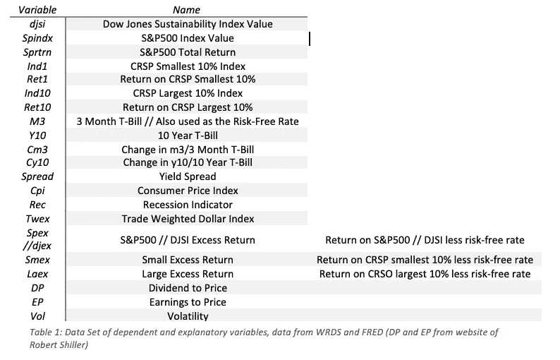

# 如何预测指数回报

> 原文：<https://medium.com/analytics-vidhya/how-to-predict-index-returns-d4f83c594046?source=collection_archive---------12----------------------->

之前的许多研究表明股票或指数回报是可预测的。在本文中，我们测试了多种计量经济学和机器学习模型来预测标准普尔& P500 和 DJSI 指数的未来回报。在转移到 SVM 和随机森林之前，检查二元概率单位和逻辑单位模型。在提交给投资者的报告中，我们关注模型的准确性，并建议未来应该采用哪些模型。我们还简要比较了标准普尔 500 指数和 DJSI 的未来预测，以建议投资者应该在哪里投资。

## 文献评论

寻找能够预测金融市场回报的模型是一个高度研究的主题，尽管存在一些关键的相关挑战。金融资产的收益是动态的、非线性的和混沌的；因此，它们可以被认为是极难预测的金融时间序列。

继续预测回报，有一个模型在关键文献中占有重要地位，最常用的预测模型包括支持向量机和神经网络。已经确定的是，研究主题仍然相关，使用发展中市场的数据是一个很大的研究机会，但对于发达市场，这一领域已经得到充分探索。在似乎正在崭露头角的最新技术中，机器学习模型似乎是研究得最深入的一些，因为它有能力识别各种应用中的复杂模式，从而准确预测未来的回报。当着眼于发达市场时，肯定开始向二元依赖动态概率单位模型(Nyberg，2011)转变。

机器学习领域的大量文献致力于涵盖各种不同的算法、输入和概念，实际上很少有论文试图系统地回顾和比较现有的模型(Ryll & Seidans，2019)。atsalakis & Valvanis(2009 年)提出了一系列计算方法，这些方法在许多研究论文中使用，这些论文关注交易算法以及如何实现回报最大化。由于分析范围有限，他们的研究主要作为被动参考，然而，他们得出结论，计算算法代表了一种合理的预测方法。

一个非常普遍的观点和一篇非常受重视的论文是“计算智能和金融市场:调查和未来方向”(Cavalcante 等人，2016 年)，他们在 2009 年至 2015 年的研究中概述了机器学习对金融数据的各种应用。本文建立了一个框架来构造这些算法，产生了很大的影响。有许多类似的结果，这些结果表明，机器学习算法通常比等效的统计或计量经济学方法具有更高的准确性。然而，大多数研究都否定了绝对优势的证据，可能是因为像这样的结果会产生的影响。

在这份报告中，我们主要关注 S&P500 和 DJSI，这两个指数都位于美国，但具有不同的资格标准和目标。S&P500“…衡量大盘部分的表现。该指数被视为美国股票市场的代表，由 500 家成份股公司组成。(S&P 环球，2020)；鉴于 DJSI“……于 1999 年推出，作为首个全球可持续发展基准，从经济、环境和社会标准方面跟踪全球领先公司的股票表现。”(S&P 环球，2019)。有大量的文献研究指数的回报，如家族企业是否比竞争对手表现更好(Anderson & Reeb，2003)；油价变化对指数的影响(Mollick & Assefa，2013)；与环境绩效相关的财务绩效(Cohen 等人，1995 年)。在比较 DJSI 和其他指数时，Lee 和 Faff (2009)发现，DJSI 的指数回报明显低于同等的道琼斯和非企业社会责任投资组合；这得到了 Consolandi 等人(2009)的支持，他们也注意到 DSJI 的表现低于类似的指数。

Leung 等人(2000 年)发现，“基于分类的模型，包括二元概率单位模型”，在试图根据统计拟合优度测试和根据预测建立的投资策略的盈利能力来预测市场方向时，优于更传统的预测回归模型。Nyberg (2011)使用动态概率单位模型来预测月度回报，并找到了支持迹象可预测性的证据。

## 数据

在这份报告中，我们使用了 DJSI 和 S&P500 的月度回报数据，涵盖了 20 年的数据。数据跨度从 1999 年 1 月到 2019 年 12 月；由于 DJSI 于 1999 年启动，这是现有数据的最大限度。我们决定着眼于指数的整体回报，而不是单个成份股的回报；给我们总共 255 个数据点(我们有 2010 年 10 月、11 月和 12 月的两个数据点)。

表 1:因变量和解释变量的数据集，数据来自 WRDS 和弗雷德(DP 和 EP 来自罗伯特·希勒的网站)

我们使用的多元数据集涵盖了所有这些变量:

在数据中，我们还有一个名为 spi 的变量，如果 spex > 0，它的值为 1；数据中有 105 个阳性结果和 150 个阴性结果。我们为 DJSI 也为 dji 这样做。然而，我们确实希望改变这个变量，因为我们正在构建一个预测，因此希望构建未来的指标。当我们将 DJSI 和 S&P500 的月度回报进行对比时，我们可以从图 1 中看到，虽然这两个指数的回报似乎遵循相同的模式，但 S&P500 通常更不稳定。图 1 的另一个非常明显的特征是，我们看到的大幅上涨达到了 0.22 的月回报率和 0.15 的月亏损。总的来说，从图 1 中很难判断哪一个指数在这 21 年中表现最好。

图 2 是图 1 的扩展，更深入地展示了 DJSI 和 S&P500 之间的关系。这个 pairplot 由来自指数值的数据组成，而不是由回报组成，我们可以看到两个指数之间有很强的关系，两者都遵循很强的正相关性。当我们查看直方图时，我们可以看到两个索引中明显的弱正偏斜；显示两个变量的平均值和中值都高于众数。

## 方法学

本报告中使用的主要方法将集中在概率单位模型上，因为我们的主要兴趣是研究方向概率。我们研究中的因变量是二进制符号返回指示器(或 SPI)；当 spex > 0 时取值为 1。因此，spi 是一个二值随机过程。

使用二元概率单位模型的主要好处是，它使用的是收益的方向，而不是序列，因为序列太嘈杂，无法预测值，而且概率单位模型还允许我们一次联合估计几个响应变量，并将其应用于协方差矩阵。

对于概率单位模型，当 y 为 0 或 1 时，我们定义 Pr(yᵢ = 1|xᵢ) = pᵢ。

另一个计量经济学模型，Logit 模型，将用于模拟条件概率 Pr(Y = 1|X = x ),作为 X 的函数，函数中的任何未知参数将通过其最大似然估计；当 Y 是二进制输出时。Logit 模型可以用下面的等式来解释(为了清楚起见，省略了下标):

支持向量机(SVM)，一种线性分类模型，将被使用，因为它提供了分离超平面的改进拟合。这种受监督的机器学习模型分析用于分类和回归分析的数据。侧重于分类。

使用两种非线性分类模型，非线性 SV 和随机森林。非线性支持机器分类模型使用核函数 x - > K(x₁,.将点 *x* 映射到核空间)对于该报告，将特别使用高斯核:

我们的 X 值将是 spex、djex、DP、EP、CPI 和 twex。我们本来打算包括 m3 和 y10，但经过一些初步测试后，这导致预测不太准确，所以决定省略这些变量。

## 结果

图 3 显示了对 spex、twex、CPI、DP 和 EP 相对于滞后 S&P500 回报进行概率回归的结果。虽然我们没有非常重要的预测指标；DP 和 spex 的 p 值都低于 0.05。所有其他变量都不显著。

这留下了一个混乱矩阵:

所以我们可以看到，回归准确地预测了指数回报的 112 次上涨和 51 次下跌。这意味着，使用概率回归模型，我们可以成功地预测 S&P500 指数 64%的时间回报方向。

当我们运行 djex 的 Probit 回归模型时，我们发现 DP 是预测未来回报的一个非常重要的因素，EP 也达到了 0.05 的显著水平。DP 已被证明是两个指数的重要预测因子，而 spex 和 EP 对一个指数也是重要的。图 3 和图 4 显示，CPI 是最不重要的指标，分别为 0.999 和 0.865。

DJSI 混淆矩阵的概率单位回归如下:

因此，总共有 164 个正确的预测，导致 65%的准确性，非常类似于 S&P500 的回归概率单位。

移动到回报增加的 Logit 模型，我们看到滞后 3 的显著结果，具有 7.08 的高系数。这意味着我们可以预期今天的回报率会比 3 个月前高(或低)7%。没有其他结果对 5%水平有意义，特别是滞后 1 和 2，这意味着该模型不能使用 1 或 2 个月前的数据准确预测未来回报。这个模型的混淆矩阵看起来像:

导致 58%的准确率，低于概率单位模型的准确率，同样分析 DJSI 数据。

当通过 logit 模型运行 S&P500 数据时，我们发现没有显著的结果，时滞 3 实际上是所有结果中最不显著的。该模型的混淆矩阵为:

导致 63%的准确度。有趣的是，从这个矩阵中可以清楚地看出，logit 模型在预测指数回报何时下降方面要好得多，有 152 个正确的预测，而只有 2 个不正确的预测；但是当试图预测它何时会增加时，该模型是非常不准确的，仅获得 9/86 的正确预测。这给出了一个比 DJSI 的 Logit 更准确的整体模型；但与概率单位模型相比，两种 Logit 模型在准确性方面表现更差(这在通读文献后是可以预料的)。

接下来，我们转移到支持向量机，使用岭和套索回归。对于套索回归 S&P500，我们返回的成功率为 63%，相比之下，使用岭回归的成功率为 59%。在分析 DJSI 的数据时，这两个数字分别为 66%和 37%。这种低成功率，而使用岭回归仅在 DJSI 数据中就达 160 次失败，这是这种线性分类模型的难以置信的低准确度。我们可以将核应用到支持向量机模型中，如方法中所述，并且发现成功率保持在 63%的水平，但是失败次数略微下降到 94；与线性 SVM 相比，这是一个比预期小的改进。

DJSI 的 Lasso 回归比 S&P500 稍微精确一些，成功率为 65%，只有 89 个错误。岭回归的成功率要高得多，为 63%(之前发现的成功率为 37%)，表明两种线性 SVM 模型都更适合 DJSI 的数据，并且可以为该指数提供更准确的数据。当使用 SVM 的非线性回归时，我们发现错误率等于对 37%的 S&P500 进行相同测试时的错误率，因此成功率为 63%。

运行一个有 200 棵树的随机森林，我们得到了非常低的误差值，S&P500 为 0.01，DJSI 为 0，这两个指数的误差率都非常低。

到目前为止，我们只是看了模型在用于估计它们的样本中的拟合程度，我们现在进入交叉验证。这将使我们能够使用模型尚未看到的数据来预测未来。为此，我们将数据分成 K 组，并保留其中一组进行测试。剩余的 K-1 组用于拟合模型。我们这样做是因为我们没有测试数据，因此更容易使用一倍作为测试。交叉验证可以用下面的公式来解释:

在本报告中，使用的 K 值为 10(测试样本中为 10%)。

这些统计数据表明，为了获得最准确的预测，我们应该使用带有套索惩罚的 SVM。该表还展示了随机森林模型是如何过度拟合的，尤其是在这个样本中；一般来说，非线性模型也会过度拟合。

## 讨论

理想情况下，投资者希望以最低的风险获得最高的回报；因为这通常是不可能的，他们需要妥协以获得相对于风险的最高回报。这取决于什么类型的投资者，你会建议什么样的策略，但是对于大多数投资者来说，良好的可预测性是好的，因为它可以让他们最小化风险。

本报告研究了文献中以前的空白，着眼于 S&P500 指数和 DJSI 之间的差异和相似之处，旨在向投资者推荐其中一种指数。然而，文献表明，当试图预测指数的结果时，动态概率单位模型将优于其他方法，Nyberg (2011)和 Leung 等人(2000)；我们只发现它们的预测和其他分类模型一样好，因为大多数模型在预测回报方面的平均成功率约为 60–65%。

根据文献，我们发现 S&P500 确实优于 DJSI (Cohen 等人，1995 年)，(Lee 和 Faff，2009 年)和(Consolandi 等人，2009 年)；其中一个原因可能是 S&P500 的流动性较高，或者是尽管可持续公司的表现并没有超过其更不可持续的竞争对手，但 DJSI 指数仍将表现不佳(Sokolovska & keeljevi，2019)。

就采用哪种模型而言，对投资者的建议。我会签名雇用他们所有人；因为没有一个数据集是相同的，大多数数据集都提供了关于他们正在研究的股票/指数的有价值的信息。但是，如果我要建议一个模型，在这个模型中，使用套索回归和概率单位模型的 SVM 将是一个更高的权重。由其他文献支持的这两个模型似乎提供了最成功的预测，也具有最小的错误计数。我相信这两个模型相互配合，投资者将能够比使用其他方法更准确地预测股票/指数的方向。

就投资哪种指数而言，S&P500 是显而易见的选择，它不仅在几乎所有分析中都优于 DJSI，而且风险最小，因为它不仅在 DJSI，而且在全球大多数其他指数上都享有盛誉。通过我们的模型预测 S&P 和预测 DJSI 一样准确，因此我推荐 S&P500。(聪明的投资者会分散投资组合，同时投资这两个指数，根据本文提供的证据，我建议这两个指数以 75/25 的比例组合——随着新闻和事件的发生定期调整，比如新冠肺炎。)

## 结论

在本文的过程中，我们进行了文献综述，以寻找最受重视的方法来预测两个指数，S&P500 和 DJSI 的未来回报。我们采用机器学习和计量经济学模型来帮助我们预测未来的回报，并分析模型的准确性和成功率。经过数据分析，我们得出的结论是，投资者应该使用的最佳模型是使用 Lasso 回归和 Probit 模型的 SVM，以及将大部分资金投资于 S&P500，但要确保分散投资，并将小部分资金投资于 DJSI，因为这两个指数都显示出积极的增长迹象。

尚未触及但与这项研究相关的元素是深度学习模型；深度学习模型可以极大地提高拟合度，增强理解。但是它们涉及更多参数，因为每个感知器的每个输入都有自己的集合。这是金融实践中的一个主要增长领域。