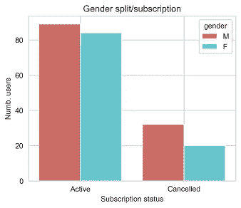

# 如何在大数据上用 PySpark 预测用户流失

> 原文：<https://medium.com/analytics-vidhya/how-to-predict-user-churn-with-pyspark-on-big-data-f5922865d72b?source=collection_archive---------4----------------------->

[https://databricks.com/glossary/pyspark](https://databricks.com/glossary/pyspark)

想象你正在为世界上最大的(虚构的)音乐流媒体公司 **Sparkify** 工作。一切都很顺利，直到你开始失去付费客户。然而，该公司一直在为其用户保留详细的日志，包括他们的活动，每次会话花费的时间和人口统计数据等。

“这是我的时刻”，你可能会说。熊猫、Matplotlib 和 scikit 的时候到了——学会展现自己的价值，为剩下的用户提供准确的流失(取消)预测。我们开始吧！

> 但是等一下，这个数据集有超过 1 亿行。
> 
> 哦不。

Udacity 数据科学

# 项目概述

考虑到如此大量的数据，没有一台机器能够在合理的时间内(如果有的话)产生有意义的输出。所以，我们需要一个新的解决方案:进入**阿帕奇火花**。

Spark 和它的 Python API， **PySpark，**可以通过在分布式机器集群上工作来解决这个问题，比如 AWS Elastic Map-Reduce (EMR)服务。

它可以操纵大型和现实的数据集，以设计预测客户流失的相关功能。此外，Spark MLlib 可以利用大型数据集构建机器学习模型，远远超过 scikit-learn 等非分布式技术所能做到的。

## 问题陈述

给定一个音乐流媒体服务的大量用户日志，预测哪些用户对该服务*满意或* *不满意*。这被定义为**用户流失，**因为了解为什么会发生这种情况以采取纠正措施很重要。

数据集包含用户日志，其中包含有关用户及其行为的信息，如唯一 id、时间戳、会话信息、订阅类型和用户操作。

## 项目细分:

1.  **数据预处理:**加载并清理数据，检查无效或缺失的条目(即没有用户 id)。
2.  **探索性数据分析:**定义流失，比较流失用户与未流失用户的行为。
3.  **特征工程:**在探索用于训练模型的数据之后构建特征。
4.  **模型实现和验证:**将数据集拆分成 train/val/test 集，比较几种 ML 方法，评估性能(精度和 F1 分数)。

# 数据预处理

数据集以 JSON 格式存储，具有 **18** **字段**(特性)，并包含用户日志，其中包含有关用户及其行为的信息，如唯一 id、时间戳、会话信息、订阅类型和用户操作，具体如下所示:

火花化数据集架构

此外，`page`字段特别重要，因为它描述了用户采取的动作，这些动作是从访问过的页面得到的。这些被定义为`user events` ，如下所示:

带有计数的页面事件的类型

删除指定的行后，数据集还剩下 278154 行，其中包含 18 个要素。

第一步是确保数据没有问题。特别是，如果一行缺少`userID`或`sessionID`，那么它就不能链接到用户，并且会被删除。

因为目标是预测客户流失，所以必须定义这个特性。一个新的列`Churn`被用作未来模型的标签，它由`Cancellation Confirmation`事件定义，这些事件对付费和免费用户都发生。如果注册了这样的事件，用户将获得正的`Churn`值 1，否则为 0。这样，问题就变成了一个二元分类问题。

# **探索性数据分析**

随后，生成了许多可视化效果，首先比较活动用户和取消用户之间的**订阅类型(级别)****(订阅状态)**。正如所料，这两个类的免费用户数量都更多:

接下来是根据订阅状态比较性别分布，如下图所示:

下图显示了一个重要的亮点，其中由`page`列定义的事件根据订阅状态进行了比较。可以观察到，最终取消的用户有更负面的体验:

对于被搅动的用户来说，特别重要的似乎是:

*   **显示的广告数量(滚动广告)**；比未搅拌的高得多
*   **点赞数(竖起大拇指)**；低于未搅拌的
*   **不喜欢的数量(拇指向下)**；高于未搅拌的

然后，为两个订阅计算基于小时播放的歌曲数量的分布。最终取消的用户在下午听了更大比例的歌曲，尤其是在 15-20:

最后，在前半个月，被搅动的用户注册的页面事件的平均数量**也明显高于**，之后会显著下降。这与活跃用户不同，活跃用户在一个月内的行为更加一致:

# **特色工程**

在熟悉数据之后，有必要为机器学习模型建立一些特征来进行训练，因为原始数据不能直接使用。因此，功能分为两类:

*用户统计:*

*   播放的歌曲数量、艺术家数量、平均收听时间、总收听时间、用户寿命、用户性别、用户订阅类型

*用户事件:*

*   平均值。每次会话的歌曲数量、错误数量、给出的喜欢数量、给出的不喜欢数量、添加到播放列表的歌曲数量、显示的广告数量、帮助页面访问量。

*标签:* `Churn`每个用户的值。

ML 型号的工程特性

然后使用 PySpark 的`VectorAssembler`对新要素进行矢量化(无标签)，并使用`StandardScaler`进行缩放，因为要素之间的值差异很大；例如点赞数:21；总收听时间:94008。

# **模型实施和验证**

在训练模型之前，新特征数据集按照以下比例被随机分为训练、验证和测试:`[0.7, 0.1, 0.2]`。

## 韵律学

对于评分，使用两个指标，**准确度**和 **F1 分数**。F1 尤其相关，因为与其他用户相比，搅动的用户子集相当小。指标定义如下:

准确性度量定义

F1 得分指标定义

使用网格搜索和三重交叉验证(CV)来训练和测试三个不同的机器学习模型，以找到超参数的最佳组合和最佳执行模型:

## 逻辑回归:

测试的第一个模型类型是逻辑回归(logit)。它是一种预测分析，可以解释因变量(输出变量)和一组自变量(输入变量)之间的关系。对于 Sparkify，这会导致二元逻辑回归问题(流失与无流失),其特征如下:

*   `maxIter=10`
*   网格搜索:`regParam=[.0, .05, .1]`
*   测试结果(最佳模型):精度:0.7611；F1: 0.6824

## 神经网络(多层感知器):

多层感知器分类器，通常称为前馈神经网络，是另一种类型的分类器，由多层节点组成。每一层都完全连接到网络中的下一层，其中第一层中的节点表示输入数据，其余节点将输入映射到输出层:

*   层:`[14, 10, 6, 2]`，在那里麻木。特征是 14，输出是 2(二进制分类)。
*   `blockSize=32`
*   `solver="l-bfgs"`
*   网格搜索:`stepSize=[.01, .1]`
*   Sigmoid 激活和 Softmax 最终层
*   测试结果(最佳模型):精度:0.8059；F1: 0.7890

## 梯度增强树:

最终开发的分类器基于一种*集成*技术，梯度增强树(GBT)。在实践中，该模型由多个决策树组成，这些决策树被迭代训练以最小化损失函数，具有梯度下降的版本(类似于神经网络):

*   `maxIter=10`
*   网格搜索:`maxDepth=[4, 5]`
*   测试结果(最佳模型):精度:0.8060；F1: 0.7950

# 结果

基于以上结果，**梯度增强树(GBT)模型**被选为性能最好的模型。最终验证结果是:

*   `maxIter=10`
*   `maxDepth=5`
*   **GBT 精度:0.8059；F1: 0.7950**

## 正当理由；辩解

GBT 模型的另一个优势是能够通过使用梯度值来说明最有价值的要素。下图说明并证实了 exploration 部分所做的假设，因为预测每个用户流失的最有价值的特征是访问帮助页面的次数**，其次是显示的广告数量**，添加到播放列表中的歌曲数量**和不喜欢的数量******

********

****这些信息对整个公司来说可能非常有价值，因为它证明了 ***为什么*** 用户对服务*不满意，而不仅仅是* ***谁*** *对*不满意*。*****

# ****结论****

****总而言之，当数据量对于单台机器来说太大时，Spark 是一个很好的工具，因为它可以在分布式集群中分配工作负载。****

****在给定的 Sparkify 场景中，成功开发了一个**梯度提升树**模型来预测可能会取消订阅(流失)的用户，而**功能重要性分数**则提供了一个关于哪些功能与预测最相关的清晰画面。****

## ****改进****

****根据模型结果，下一步是将系统部署到 AWS 的 EMR，并从大型数据集(12 GB)中获取结果。此外，可以部署一个 web 应用程序来以交互方式展示结果。****

****感谢阅读！****

******提比略-伊万·萨特马里******

****iosz@demant.com****

****链接到 [GitHub](https://github.com/tioans/spark-user-churn) 。****