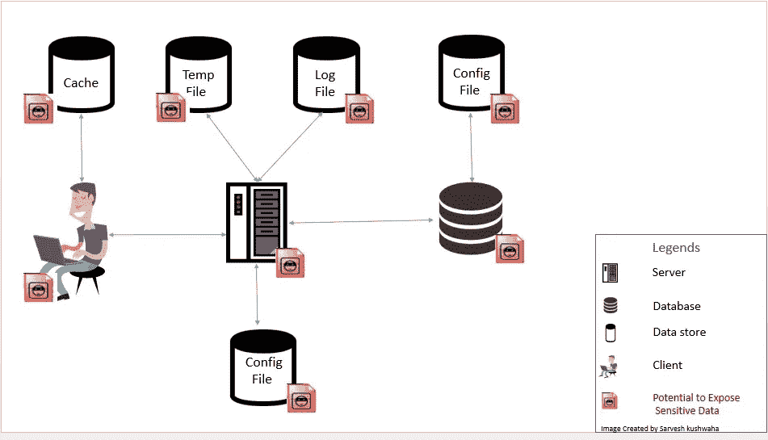

# 如何防止敏感数据泄露(OWASP 十大问题)

> 原文：<https://medium.com/analytics-vidhya/how-to-prevent-sensitive-data-exposure-owasp-top-10-fd05550e0ac2?source=collection_archive---------4----------------------->

**照片由** [**菲利普**](https://unsplash.com/@fantasyflip?utm_source=unsplash&utm_medium=referral&utm_content=creditCopyText) **上** [**下**](https://unsplash.com/?utm_source=unsplash&utm_medium=referral&utm_content=creditCopyText)

# 介绍

您是否面临敏感数据泄露的问题？

在本文中，我将向您介绍 OWASP 十大列表、敏感数据暴露以及保护您的敏感数据免遭此类泄露。

OWASP 是一个非营利组织，旨在提高软件安全意识。OWASP 基金会为开发人员和技术人员提供了保护软件的基础。

OWASP 维护一个列表，其中列出了最突出的软件安全风险。它叫做 [OWASP 前 10 名](https://www.perforce.com/blog/kw/what-is-owasp-top-10)。该列表告诉您在尝试提高应用程序安全性时，应该关注应用程序的哪些部分。

敏感数据是指应该受到保护的机密数据，未经允许人们无法访问。敏感数据包括人们的家庭住址、工资、客户信息、信用卡/借记卡数据等信息。以及任何其他在发生数据泄露时应受到保护的数据。

# 敏感数据暴露

[来源](https://www.codeproject.com/Articles/783229/Hack-proof-your-ASP-NET-applications-from-Sensitiv)

敏感数据泄露在 OWASP 十大威胁列表中排名第三。这是关于敏感数据的暴露。例如，假设您有一个类似 PayPal 的应用程序，它保存了许多用户的信用卡详细信息和家庭地址。这种应用程序需要得到很好的保护，以免暴露敏感数据。

导致敏感数据暴露的最常见的错误之一是没有首先加密敏感数据。即使采用加密，也往往存在薄弱的密钥生成和管理以及薄弱的加密算法。

当数据在传输中时，服务器端的弱点很容易被攻击者检测和利用。

# 敏感数据暴露攻击场景

1.  假设您有一个应用程序需要在数据库中保留借记卡的详细信息。因此，您使用自定义数据库加密来加密借记卡信息。但是，当这些数据从数据库中传输出来时，它会自动被解密，从而使应用程序暴露于一个 SQL 注入缺陷，该缺陷可能会将借记卡的详细信息暴露给攻击者。
2.  我们都知道密码是不能和其他人分享的。因此，在每个应用程序中，对密码进行哈希处理是很常见的。但是，如果服务器端使用简单的散列来存储密码，密码将暴露在预先计算的散列的彩虹表中。GPU 可以轻松破解从简单哈希函数中获得的哈希。

# 如何防止敏感数据暴露

1.  **使用谷歌云服务:**

*   谷歌云提供身份和访问系统  ( [IAM](https://cloud.google.com/iam) )，有助于限制对存储敏感数据的数据库的访问。借助谷歌云的 IAM，系统开发人员能够选择哪种类型的用户能够访问哪些数据。
*   此外，它使每个用户通过安全的身份验证过程来访问数据。
*   使用谷歌云的数据丢失预防(DLP) API，开发人员可以自动对敏感数据进行分类和过滤，并将其安全存储。

**2。使用强密码:**

*   [密码](https://en.wikipedia.org/wiki/Cipher)就是执行数据加密和解密的算法。视情况而定，它们是加密数据或解密数据所遵循的有组织步骤的串联。
*   当应用程序使用弱密码时——加密的步骤一点也不复杂——攻击者很容易就能破解数据。
*   拥有强大的密码可以帮助您保护敏感数据，因为破译它们几乎是不可能的。

**3。分类数据:**

*   构建软件时，所有数据不必都是敏感数据。在这种情况下，可以对数据进行分类，以确保未经授权的用户不会访问敏感数据。
*   假设您正在构建一个像 Pinterest 这样的应用程序，所有经过身份验证的用户都可以查看图片并访问一些功能，如发帖、点赞等。但是，并非所有经过身份验证的用户都可以访问应用程序中所有注册用户的列表。这些数据是为管理员保留的。这就是分类的意义所在，将应用程序的部分数据划分给保留的用户。

**4。加密所有敏感数据:**

*   这是最常用的预防措施之一。它必须将数据从原始的人类可读形式转换成密文，这样只有拥有加密密钥的人才能访问数据。这样，如果数据在传输过程中被拦截，拦截器就无法使用它。
*   此外，您必须始终确保采用高度加密。攻击者可以轻松破解弱加密。

**5。不要保留敏感数据:**

*   这很容易采用。在敏感数据被用于预期目的后，您不应该继续保留这些数据。如果您的应用程序需要用户的信用卡详细信息来购买产品，您应该在购买产品后删除信用卡数据。另一个选择是将你的数据存储外包给一个更值得信赖的组织。

**6。使用安全测试工具**:

*   有许多工具可以对您的应用程序执行安全性测试。这看起来像是一笔大投资，但它节省了您在安全缺陷出现时被动纠正它们所需的人力。如果你找到一个好的工具，它可以成为一种资产。它可以帮助你获得并保持用户的信任。

# 结论

在本文中，我讨论了什么是敏感数据暴露，以及可以用来更充分地保护数据的准则。

关于我提供的 6 条指导方针，你必须研究你的项目，知道哪一条最适合你的项目。如果你从这篇文章中只学到一件事，那就是——除非绝对必要，否则不要存储敏感数据。

希望这已经消除了您在敏感数据暴露方面的一些困惑，您可以继续构建非常安全且没有此类漏洞的应用程序。