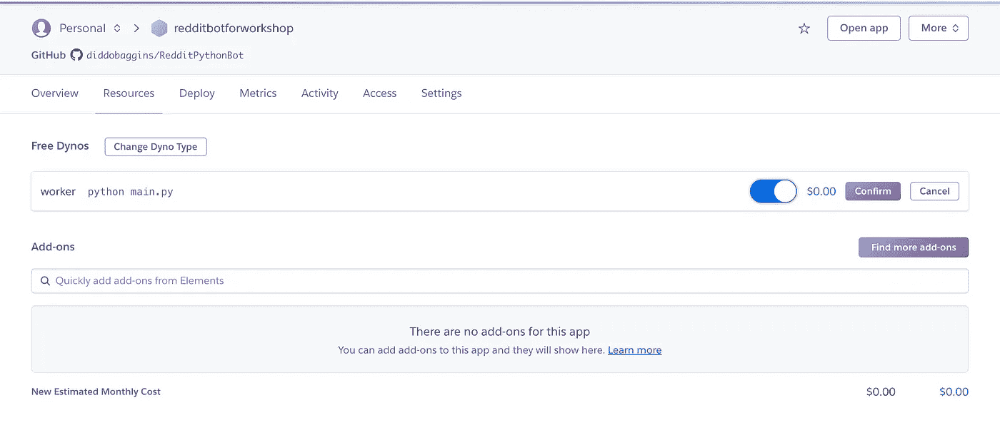

# 如何使用 Python 编写 Reddit 机器人

> 原文：<https://medium.com/analytics-vidhya/how-to-program-a-reddit-bot-using-python-6d15ee57f964?source=collection_archive---------2----------------------->

在这个工作坊中，你可以学习如何制作一个自动化的 Reddit 机器人来做你想让它做的事情。我将向你展示如何使机器人回应提及以及关键字。然而，可能性是无限的。如果你了解你的 Python，你可以让机器人做更大的事情。但是今天，我们将关注如何让一个简单的机器人运行起来。

这个工作坊的重点是如何让一个机器人只使用浏览器资源。这意味着你将需要使用你在 repl.it 上制作的 repl.it 程序，尽管它不是私有的。因为您需要在 repl.it 代码中输入允许访问您的 bot 的信息，所以您的 bot 将可以公开访问。如果你想把它变成私有的，你所要做的就是在本地文件夹和你的计算机外壳里做所有的事情。然而，因为我想让这个程序为没有计算机权限的人工作，我将向你展示如何在 repl.it 上做所有的事情

# 建立

在你制作一个机器人之前，你需要做几件事。

首先，你必须阅读机器人礼仪。如果你不遵守 bottiquette，你会得到你的机器人被禁止，也许你的 IP 列入黑名单。

[机器人礼仪](https://www.reddit.com/wiki/bottiquette)

接下来，你需要一个 Reddit 账户。你可以将你的机器人链接到你通常的 Reddit 帐户，或者你可以创建一个新的帐户。如果你正在使用免费的 repl.it，你将需要一个新的，因为你将不得不输入你的帐户凭证，这些凭证将对公众可见。(注意:如果您不想注册，可以不通过电子邮件注册。)

[Reddit 注册](https://www.reddit.com/register/)

您还需要为您的机器人创建一个应用程序“注册”。使用下面的链接。

[创建 app](https://www.reddit.com/prefs/apps/)

一旦你打开链接，点击“你是开发者吗”。它应该会引导您进入这样一个页面:


给你的机器人取个名字。选择脚本。在“重定向 uri”中输入 [http://127.0.0.1](http://127.0.0.1) 。(这是 Reddit 让你做的事情。)点击“创建应用”，会弹出一个页面，告诉你你的“个人使用脚本”和“秘密”。把这两根弦记录下来。记住，如果你使用的是 repl.it，那么这些将和你的整个文件一起公开。

最后，您需要访问 repl.it 来编程。有了 repl.it，你不需要下载任何东西到你的实际设备上。没有账号也可以使用 repl.it。

[repl.it](repl.it)

点击链接后，点击“开始编码”，用 Python 创建一个 repl.it。然后，您应该会打开一个类似如下的页面:


接下来，您必须单击 control(Mac 上的 command)+shift+p，这应该会在右下角打开一个命令行 shell。将下面一行代码复制到 shell 中，然后按 enter 键。

```
pip install praw
```

这应该会提示您的机器导入 praw，这是 bot 所需的一个包。导入完成后，您就完成了所有的设置要求！接下来，我们将开始编码。

# 编写机器人代码

现在我们可以开始编写代码了！在 repl.it 上打开 main.py，键入或复制以下内容。

```
import praw
r = praw.Reddit(username = "yourreddituser",
                password = "yourredditpw",
                client_id = "yourclientid",
                client_secret = "yourclientsecret",
                user_agent = "yourbotname by /u/yourredditaccount")
```

让我们想想我们刚刚做了什么。第一行导入了我们的包。第二个代码块启动了我们的 praw 实例。Reddit 对象基本上充当了我们的机器人，稍后我们需要控制它来使我们的机器人工作。根据你自己的信息填写每一行。客户 id 和密码应该已经被记录下来。你的 user_agent 基本上是帮助 Reddit 在需要的时候识别你的程序。所以一定要有描述性！

现在我将向你展示你可以让你的机器人做的两件事。第一个是回复提及，第二个是回复关键词。这些是互斥的，因为它们依赖于不同事物的自动流。这意味着你必须从两者中选择一个，你不能在一个机器人中做两件事。

# 提及

许多 Reddit 机器人在被标记后会执行一个操作。这些种类的机器人更受欢迎，因为它们只在被**调用**时做事情。这不太可能让你被禁赛和列入黑名单。要获得基本代码，请在 repl.it 中，在启动 Reddit 对象的代码下面键入或复制以下内容。请阅读注释(a #后面的单词),这样您就可以了解一些命令的功能。

```
messages = r.inbox.stream() # creates an iterable for your inbox and streams it
for message in messages: # iterates through your messages
  try:
    if message in r.inbox.mentions() and message in r.inbox.unread(): # if this messasge is a mention AND it is unread...
        message.reply("hello") # reply with this message
        message.mark_read() # mark message as read so your bot doesn't respond to it again...
  except praw.exceptions.APIException: # Reddit may have rate limits, this prevents your bot from dying due to rate limits
    print("probably a rate limit....")
```

# 关键词

这个机器人可以检查某些评论，如果评论中有关键字，就会采取行动。让关键字成为人们常说的东西可能会让你被封禁。我建议加个“！”在你的关键字前面，这样机器人只有在被调用时才会响应。要获得基本代码，请将以下内容键入或复制到 repl.it 中，位于启动 Reddit 对象的代码下方。请记住，此代码不应与“提及”部分下的代码放在同一个位置。请阅读注释(a #后面的单词),这样您就可以了解一些命令的功能。

计算机编程语言

```
subr = r.subreddit('copypasta') # this chooses a subreddit you want to get comments from
for comment in subr.stream.comments(skip_existing=True): # this iterates through the comments from that subreddit as new ones are coming in
  try:
    if "!bot" in comment.body: # "!bot" is the keyword in this case. replace "bot" with your keyword
      comment.reply("hello world...") # this is what your bot replies to the comment that has the keyword
  except praw.exceptions.APIException: # Reddit may have rate limits, this prevents your bot from dying due to rate limits
    print("probably a rate limit...")
```

现在你的代码都是好的，你只需要运行它！因为你的程序将是流式的，除非你让它停止，否则它不会停止。

您可能已经注意到，目前，您的 bot 仅在您的 repl.it 程序运行时运行，这仅在您的选项卡保持打开时运行。因此，许多人将他们的机器人托管在外部服务器上，这样机器人就真正实现了自动化。我将向你展示如何在云平台上运行你的机器人，Heroku。

如果您对没有托管您的机器人感到满意，那么恭喜您，您已经完成了研讨会！

如果你想更进一步，继续前进！

# 主办；主持

要托管，你需要一个 GitHub 账户，我假设你有，和一个 Heroku 账户，我们稍后会处理。

让我们回到我们在 repl.it 上的程序。记住前面的内容，你必须有一个 repl.it 帐户才能托管。首先，让我们创建一个新文件，将其命名为“Procfile ”,并在其中键入:

```
worker: python main.py
```

这是它在您的 repl.it 页面上的外观:


Procfile 基本上告诉 Heroku 你想让它运行什么。

现在我们需要创建一个 requirements.txt 来告诉 Heroku 我们的应用程序的依赖项是什么。创建 requirements.txt 是一个很好的实践。我们需要做的就是再次按 control+shift+p 键，然后在 shell 中键入:

`pip freeze > requirements.txt`

应该会弹出一个名为 requirements.txt 的新文件，看起来有点像这样:


接下来，你需要去侧边栏的版本控制，连接你的 GitHub。它会提示您授予权限。您需要授予 repl.it 访问所有 GitHub 库的权限。完成后，您应该能够看到如下内容:


点击“创建 Git Repo”。你可以给它起任何你想要的名字，但是记住这个名字。它可以是公共的，也可以是私有的，不过要记住，由于 repl.it，你的机器人无论如何都不会是完全私有的。但是，如果您使用自己的隐私环境，请将存储库设为私有，这样人们就看不到您的凭证。现在，一切都应该与 GitHub 上的一个回购相关联。接下来，你需要注册一个 Heroku 账户。

[注册 Heroku](https://signup.heroku.com/)

创建帐户后，您需要“创建应用程序”。你可以给它起任何你想要的名字，只要它是可用的。一旦你的应用被创建，进入“部署”部分，点击“GitHub”。


搜索您刚刚创建的存储库。如果您输入了正确的名称，它将显示您的存储库。点击“连接”。


转到最底部，并单击“部署分支”。


将会出现一个显示日志的小窗口。等待一分钟左右后，您将看到消息“…部署到 Heroku”。现在，您可以进入“参考资料”部分，在那里您将看到您的免费 dynos。Dynos 基本上是运行你的应用程序的容器。单击铅笔图标进行编辑，打开 dyno，然后单击确认。



还有…就是这样！恭喜你，你的机器人现在由 Heroku 自动运行，并且会按照你的程序去做！

需要注意的一点是，Heroku 上的免费账户每月只能运行有限时间的应用程序。所以使用 Heroku 意味着你的机器人每个月都会死一段时间。