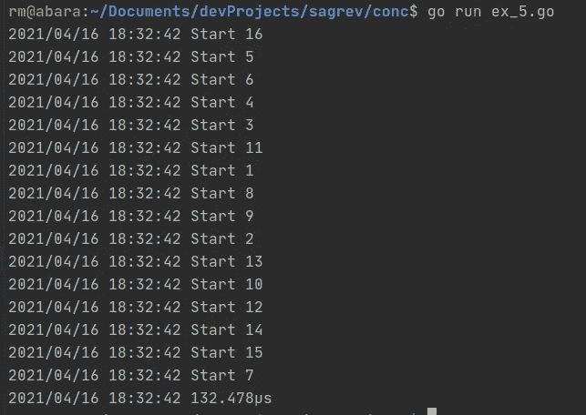
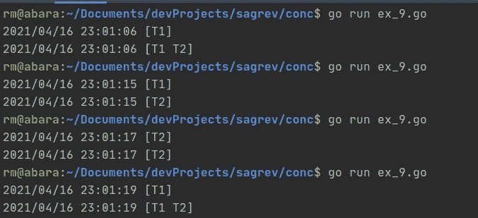
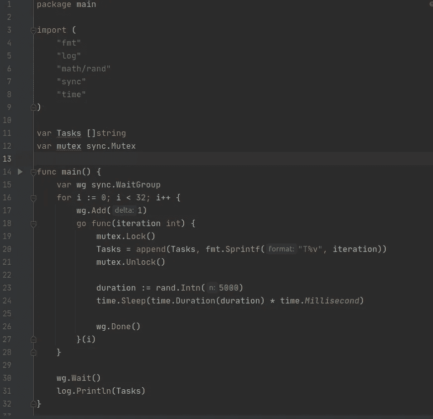

# 如何用 Golang 正确处理并发和并行

> 原文：<https://medium.com/analytics-vidhya/how-to-properly-handle-concurrency-and-parallelism-with-golang-89dd054b739f?source=collection_archive---------4----------------------->

用线程编程总是很棒的，你可以更快地得到结果，同时处理更多的事情，并尽可能让服务器保持忙碌，不幸的是，这产生了几个问题，当你不习惯使用线程时，这些问题并不那么明显。


古老而珍贵

在这篇短文中，我将向你介绍我认为最常见的问题，以及我通常是如何解决这些问题的。

在整个教程中，我们将使用相同的基本练习，运行从 0 到 15 的数字，并将它们打印在屏幕上，在每一步之后，我们将逐渐增加新的功能，但计数到某个极限的主要机制将持续存在，该代码可能不是您见过的最好的 Go 代码或最惯用的代码，但它的编写方式使我们试图解决的问题变得非常明显。

我们将从例 1 开始。开始:

```
package main

import (
   "log"
   "time"
)

func main() {
   start := time.Now()
   var counter = 0
   for i := 1; i <= 16; i++ {
      log.Println("Start", counter)
      counter++
   }
   elapsed := time.Since(start)
   log.Println(elapsed)
}
```

这只是按顺序排列的数字:


这表示你写的任何程序都是按顺序工作的，它执行任务 0，一旦完成就执行任务 1，依此类推。

现在，我们将介绍我们的第一个线程机制，这是一个“go 例程”，它将在不同的线程中运行任何代码(这不是真正的线程，但现在让我们假设它们是同一件事)，我们通过在函数前使用 go 关键字来启动 go 例程，它可以是匿名函数或命名函数，在这里我只做一个匿名函数。


ex_2 .去吧

现在我们已经将计数/打印语句发送到一个新线程，其行为与第一次运行时略有不同:


它确实跑得更快了…但是它没有打印出任何数字！

当我们启动一个新线程时，主线程继续运行，忽略了新线程上发生的事情，然后到达主线程的末尾(第 18 行)并停止执行，因为没有任何信息告诉它另一个线程正在运行，它就关闭了。

因此，我们现在将做一个小小的调整，天真地等待所有线程完成:


ex_3 .去吧

这一次我们在主线程中添加了睡眠，我们希望所有的 goroutines 都在这 2 秒内完成:


好了，我们现在变得更好了，我们有 16 行，但它们都显示 0，如果我们查看日志时间，它们都运行在第二:47，没有显示在:48，然后它在:49 完成执行，所以我们等待线程完成的天真等待产生了两个新问题:

*   计数器值没有正确更新
*   我们空闲了一段时间

如果我多次运行相同的代码，会出现一个有趣的现象:


其中一个任务是报告 11(您可能会得到另一个不同的数字)，这是因为我们有一个数据竞争条件，所有线程几乎同时启动，并且它们都共享计数器变量，因此它们都以 0 值开始，递增 1，然后打印出来，对于其中一些线程，当它们启动时值是 0，但当它们递增时，它是不同的，这就是这里导致 11 的原因。

为了解决这个问题，我们将做一件非常基本但不太精确的事情(我们将在以后用更好的方法解决这个问题):


ex_4.go

首先，我们将在迭代中进行计数，而不是在线程中，我们让线程打印值，因为做增量比旋转新线程更快，我们还将复制 counter 的值，并将其作为参数发送给 goroutine，该副本将被读取为“thisCounter”:


因此，数据竞争的情况似乎已经得到了解决，至少在这个简单的例子中，counter++比创建新线程更快，我们现在认为这是一个胜利，以后会适当地解决它，但是让我们转到线程化时产生的另一个问题:等待任务完成。


去吧

这一次我们将为我们的程序引入另一个组件:WaitGroup，这是一种同步所有线程的机制。

我们在第 12 行声明了我们的 waitgroup，然后在每次迭代中，我们会在第 15 行告知我们正在向我们的 waitgroup 添加一个新线程，delta 参数会告诉 waitgroup 最后要等待多少个任务，在这里，我会在每次循环迭代中将 wait group 的大小增加 1，但我们也可以在循环之外这样做，比如说 16， 在循环内部这样做将使我们的代码在处理下一级 waitgroups 时更具可移植性，所以我们现在将 delta=1，在 goroutine 内部，您会注意到一个“wg”。 Done()"调用，这样做的目的是将 waitgroup 最后需要同步的任务量减一，所以 wg。添加会增加 it 和 wg。完成减少它，然后在第 22 行，我们有一个工作组。Wait，它只是等待 waitgroup 内部的一个内部计数器达到 0，直到它达到 0，它将永远阻止执行，如果你从来没有调用足够的 wg。Done()，那么我们将永远闲置，或者直到外部因素中断执行。



这一次，程序在所有任务完成后立即结束:)

因此，我们还有另一个不明显的问题，因为这是一个小例子，但是，如果我们有数千个任务要运行，并且它们都做了一些繁重的处理，我们将同时启动一千个 goroutines，这取决于可用的资源，我们可能会使系统崩溃，因为所有的东西都在同时工作，为此，我们有一个小机制来控制有多少工作同时排队:SizedWaitGroup。


去吧

我们将使用 remeh 的 sizedwaitgroups 包，您会注意到语法与常规 waitgroup 非常相似:

这一次，在创建 sizedwaitgroup 时，我们需要指定一个限制，即在生成新线程之前并行运行的最大任务量，这将给我们带来并行化的好处，而没有破坏服务器的风险。向我们的 sizedwaitgroups 计数器添加()一个任务，在这个实现中，我们不需要指定我们要添加多少任务，它被强制以 1 为增量，这是因为如果 sizedwaitgroup 已满(在我们的示例中为 6)，函数将阻塞主线程，因此循环的前 6 次迭代将正常进行，然后在第 7 次迭代时，因为 sizedwaitgroup 已满(并且还没有任务报告. Done())， 它将等待，直到组中有一个可用的槽，一旦有，线程将启动，循环将继续，直到它完成所有的工作，或者由于我们的等待池已满而再次被阻塞。 Done()函数的行为方式与 waitgroup 中的以及。Wait()函数。


这一次，我们看到任务是以 6 个块为单位工作的，因为我们在完成一个线程之前的延迟是 2 秒，这就是释放一个槽所需要的时间。

既然我们已经有了几种运行任务的机制，那么让我们把注意力集中在我们已经推迟了一段时间的问题上:数据竞争条件。

我们将从编写程序的一个小变体开始，但是这个变体使问题变得非常明显:


ex_7 .走

这一个有我们已经谈论了一段时间的大部分组件，但问题在于我们正在写入计数器变量的事实，到我们必须写入它的时候，可能已经发生了更多的变化(通过时间嘲笑。Sleep)，因此该值不是恒定的/可预测的:


代码可能看起来很傻，但这一点已经被证明了

为此，我们将使用名为“通道”的工具，这是线程间共享数据的首选方式。


我们从第 9 行开始，创建一个名为“counterChan”的通道，它将包含“int”类型的数据(您也可以指定缓冲区大小，但这将在另一篇文章中讨论)。

然后，在第 11 行和第 18 行启动两个相同的线程，每个线程最多运行 8 次，通过通道发送值 1 并休眠 100 ms，然后主线程将运行 16 次迭代(每个线程 8+8 次)，并将从计数器中取出一个值，并将其与计数器变量相加。

该通道的行为有点像一个项目队列(简化描述)，您可以使用以下格式写入任何内容:

**频道** < -数值

将以线程安全的方式写入该“队列”，然后当您试图从中读取时:

可变频道

如果通道是空的，这将阻止执行，一旦一个值被放在它上面，然后它被发送到变量，执行被解锁(至少直到它到达另一个通道读取)。

在本例中，我们写了一个硬编码的值 1，然后有一个循环，它将监听 16 次来自通道的值，并将该值添加到计数器变量中。

如果通道已经有一个我们还没有读取的值，执行将被阻塞，直到它为空，所以我们应该总是非常小心地尽可能快地读取/写入通道，并将任何其他代码推迟到另一个线程。


由于计数器是在单个线程中聚合的，所以数字是排序的

我们现在将使用不同的解决方案来处理相同的问题:互斥体


ex_9 .走

这一次，我们有一个字符串片段和两个将向其写入的线程，我们有相同的数据竞争条件，这在您多次运行该程序后会更加明显:



在第一次和最后一次运行中，它按照我们的预期工作，一个项目被添加到切片中，然后另一个项目被添加到切片中，数据被正确打印，每个线程都有一个项目，在第二次运行中，每个线程都将切片读取为空，线程一添加了一个值并打印出该值，然后线程二做了同样的事情，在第三次运行中，来自第一个线程的数据被添加但没有被打印。 然后第二个线程加了一个值，第一个线程打印它，然后第二个线程打印它(如果让你困惑的话，想象一下计算机会有多困惑！ ).

为了解决这个问题，我们将使用众所周知的 mutex(互斥)原语，这是一个可以在将被多个线程共享的东西上设置的锁，一次只有一个线程可以处理它。


走吧

第 9 行将定义我们的互斥体，然后在第 16/25 行，使用一个. Lock()来启动一个对资源的独占访问块，一旦值被添加到任务片，锁就立即被移除，以便不同的线程也可以使用该片。


现在，无论我们运行多少次，数据都会是我们期望的样子。

下一个例子将非常相似，只是这一次我们将做更多的并发线程:



走吧


即使每次运行后数据排序不同，所有数据点都是唯一的，这是我们所期望的。

我们的最后一个例子是一个设计模式，我用它来尽可能地保持资源可用(并且只在需要的时候)。


未完待续…

我们执行典型的循环，然后在随机休眠后对每个数字调用函数“Add ”,最后的 for 将保持程序持续运行，在我的用例中，程序总是有工作要做/正在监听 rabbitMQ 队列。


…续

Add func 获取发送的项目，通过互斥锁阻止对任务片的访问，并将其附加到片上，如果片的长度为 10 个项目，则这些项目将被发送到不同的进程“转储”,该进程可以对它们进行任何操作，这 10 个项目将从片上删除，这样它们就不会被重新处理。如果由于任何原因，切片少于 10 个项目，那么我们启动一个定时器，它将等待 5 秒钟，如果定时器到期并且切片中有数据，那么将使用任何可用的数据来调用 Dump func，这样我们就可以继续向前推送数据，要么是因为我们的“任务缓冲区”已满，要么是因为已经过了足够长的时间而没有对它执行任何操作，我们应该清除它以保持另一部分忙碌。


前 3 行将因缓冲区已满而被触发，最后一行是因为定时器到期，如果您注意时间，则从第一次添加开始运行 5 秒，触发的定时器是来自 T24 数据点的定时器，它发生在该项被转储之前，一旦定时器到期，其他行将跳过转储，因为这两个剩余值已经离开缓冲区。