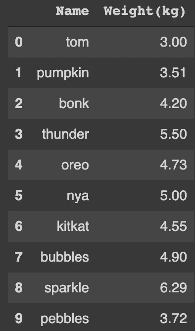
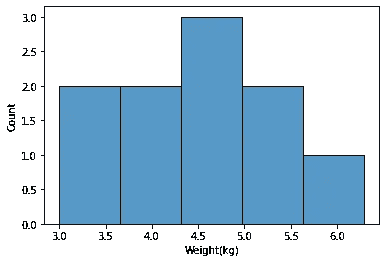
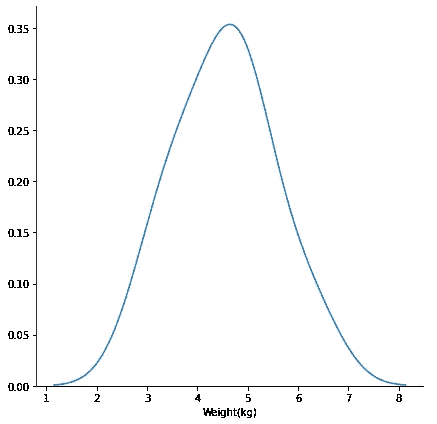
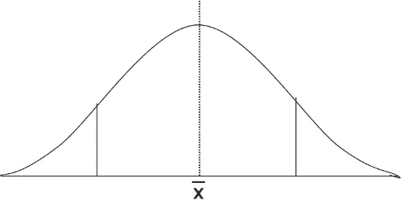
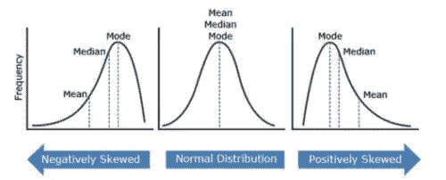
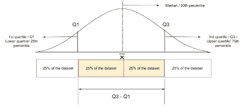
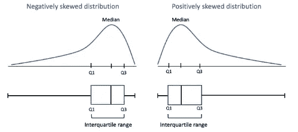
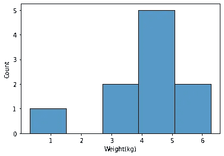
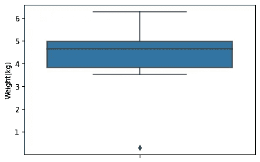

# 如何证明你的猫很胖(用统计学和 python)

> 原文：<https://medium.com/analytics-vidhya/how-to-prove-that-your-cat-is-fat-with-statistics-and-python-88ff7d8cda68?source=collection_archive---------33----------------------->


你有一只非常非常胖非常懒的猫，叫博格拉。他太懒了，经常在饭碗里睡着。你一直对他大喊大叫，让他不要吃那么多金枪鱼，但是他根本不理会你，也不知道他有多胖。所以你决定用统计证据来教训他。你称了他的体重，天哪，他已经有 6 公斤了。

你在网上查查怎么统计证明你的猫太胖。他们写道，你必须收集更多的“数据”，为此，你需要知道其他一些猫的体重。所以你开始通过给其他猫的父母打电话来收集信息。您编写了一个小 python 脚本，其中使用了“pandas”库来将成对的猫名和它们的体重转换成类似行列的结构:

```
#Import pandas library
import pandas as pd

# initialize list of lists
height_data = [['tom', 3.0], ['pumpkin', 3.51], ['bonk', 4.2], ['thunder', 5.5], ['oreo', 4.73], ['nya', 5], ['kitkat', 4.55], ['bubbles', 4.9], ['sparkle', 6.29], ['pebbles', 3.72]]
 # Create the pandas DataFrame
df_weight = pd.DataFrame(height_data, columns = ['Name', 'Weight(kg)'])
 # print dataframe.
df_weight
```



现在，您认为需要将数据放入名为'**直方图**'的某种类型的图形中。要制作直方图，你需要理解**桶**或**桶**的概念。箱就像一个组。例如，当你想到一个人的年龄时，如果这个人在 13 岁以下，你就叫他 kid 如果他在 13 到 19 岁之间，你称他为青少年，如果他超过 19 岁，你通常称他为成年人。这里，0-12 岁、13-19 岁和 19 岁以上的年龄范围可以被认为是区间。

为了制作你朋友的猫的重量直方图，你决定制作 5 个箱子。最轻的猫是汤姆，3 斤，最重的是闪闪，6.29 斤。所以所有的猫都“分布”在这个 3 到 6.29 公斤的范围内。如果您想在这个(6.29–3)或 3.29 千克的范围内制作 5 个相等的箱子，每个箱子的重量大约为(3.29/5)或 0.658 千克。因此，3 公斤的汤姆将在第一个箱子里。南瓜(3.51 kg)也在这个范围内，因为第一个 bin 的范围从 3 到 3.658 kg。第二个箱子将从 3.658 到(3.658+0.658)或 4.316 公斤，你可以看到，第三只猫 Bonk，4.20 公斤，将在第二个箱子中。用同样的方法，你把所有这些猫放进箱子里，数一数每个箱子里有多少只猫。你看，箱子 1，2，3，4 和 5 包含 2，2，3，2 和 1 只猫。你可以写一个小的 python 脚本来完成整个过程。

```
import seaborn as sns
sns.histplot(data=df_weight, x="Weight(kg)", bins=5)
#sns.histplot(data=df_weight, x="Weight(kg)", bins='auto')  automatically decides How many bins you need
```



你看，大多数猫(在这种情况下，3 只猫)的体重在第三个箱子中，其范围为 4.316 至(4.316+0.658)或 4.974 千克。

外面有更多的猫，不是吗？可能有体重不足 3 公斤的猫等等。如果你能从你掌握的数据来假设其他猫胖的概率，那就太好了。这里，一只猫的重量是一个“**随机变量**，所有猫的重量是“**样本空间**”。随机变量的所有可能值(在这种情况下，是猫的重量)和猫的所有可能重量，特定结果出现的频率(例如，一只重 6 kg 的猫)可以用“**分布**来表示。现在让我们试着写几行代码来看看数据集的分布。

```
sns.FacetGrid(df_weight, size=6) \
  .map(sns.kdeplot, "Weight(kg)") \
  .add_legend()
```



从这张图中，你可以清楚地看到曲线的最高点在 4 到 5 公斤附近，这意味着你家附近的大多数猫都在这个范围内。

这里你看到的曲线(几乎)是一个'**正态分布**'。实际的正态分布是关于平均值对称的，有点像钟形(🔔)，这意味着平均值保持在曲线的中心，左右两侧看起来都像镜像。这是一张正态分布的图片:



你可能已经知道均值、中值和众数的含义。Mean 是所有数据的平均值，median 是分隔数据集上半部分和下半部分的数据的中间点，mode 是出现次数最多的数字。在正态分布中，这三者都在同一点上，这个点在我们的图像中用虚线标出。

现在的问题是，你的分布曲线并不完全对称。曲线有时会向左或向右倾斜。我们称这种不对称为“**偏斜**”。偏斜度可以是负的，也可以是正的，这取决于它们的平均值和中值。如果平均值大于中值(mean > median，或者，mean 在图中位于中值的右侧)，则偏斜度为正。在负偏态分布的情况下，平均值小于中值(平均值<中值，或者，平均值在中值的左侧)。



对于我们的数据集:

```
import numpy as np
from scipy import stats

mean = np.mean(df_weight['Weight(kg)'])
median = np.median(df_weight['Weight(kg)'])

print(mean, median)
```

这里的平均值是 4.54，中值是 4.64，所以用平均值< median. So the data is negatively skewed.

Anyway, you now know from the graph that your cat is somewhat fat. How fat exactly is he? Here comes the concept of ‘ **百分位**来拯救你的一天。什么是百分位数？假设有一只 4.95 公斤的猫，他比 75%的猫都要胖。这里，值 4.95 是“第 75 百分位”。(第 75 个四分位数—第 25 个四分位数)的值称为四分位数间距。



现在让我们来看看有多少只猫的体重比你的猫低。

```
import numpy as np
sum(np.abs(df_weight["Weight(kg)"]) < 6) / float(len(df_weight["Weight(kg)"]))
```

哇，0.9！这意味着你的猫比 90%的猫都要胖。

你终于知道如何在统计中吼你的猫，但你的旅程并不顺利。在收集数据时，你不小心把汤姆的体重写成了“0.3”，而不是“3.0”，所有的图表都被弄乱了。



你不知道为什么直方图中会有一些空白。那次你上网查了一下，碰到了'**离群值**'这个概念。离群值就是与其他数据不同的数据。为了检查数据中的异常值，您使用了箱线图。在箱线图中，事件发生的最可能范围(在这种情况下，最常见的猫体重)显示在一个方框中，其他较低和较高(但仍可接受)值使用触须显示。不可接受的值用圆点表示。

```
sns.boxplot(y='Weight(kg)', data=df_weight)
```



由此可以看出，有一个值不属于您的数据集。你可以用我前面提到的四分位数范围(IQR)来找到这个值。如果第 25 百分位的值是 Q1，第 75 百分位的值是 Q3，则任何高于 Q3 + 1.5 x IQR 或低于 Q1-1.5 x IQR 的值都是异常值。

```
Q1 = np.percentile(df_weight['Weight(kg)'], 25, interpolation = 'midpoint')
Q3 = np.percentile(df_weight['Weight(kg)'], 75, interpolation = 'midpoint')
IQR = Q3 - Q1

low = Q1 - 1.5 * IQR
up = Q3 + 1.5 * IQR

outlier =[]
for x in df_weight['Weight(kg)']:
   if ((x> up) or (x<low)):
       outlier.append(x)
print('outlier in the dataset is', outlier)
```

这就是为什么你知道你在写汤姆的体重时犯了一个错误。

现在去吼你的猫吧。

*原载于 2021 年 2 月 23 日*[*https://dev . to*](https://dev.to/orthymarjan/how-to-prove-your-cat-is-fat-with-statistics-and-python-1a6)*。*