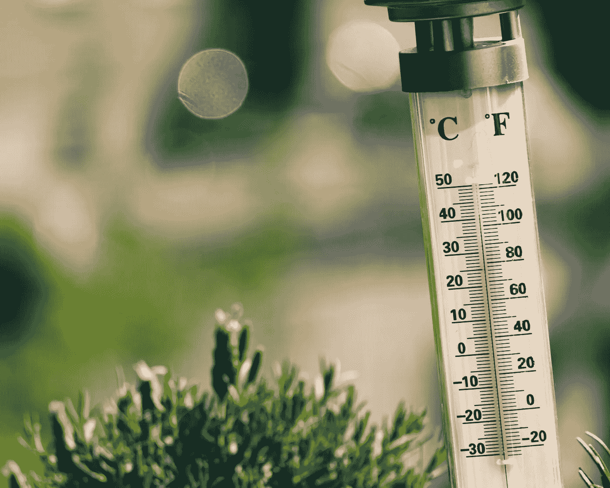

# 如何使用 Raspberry Pi 和 Python 实时接收水温数据

> 原文：<https://medium.com/analytics-vidhya/how-to-receive-water-temperature-data-in-real-time-using-raspberry-pi-and-python-3df7f8aaa038?source=collection_archive---------5----------------------->

## **第二部分:设置自动水温监控系统，并将实时数据保存在 Google Sheets 中**

由[雅罗斯瓦夫·科查扎](https://unsplash.com/@sumekler?utm_source=unsplash&utm_medium=referral&utm_content=creditCopyText)在 [Unsplash](https://unsplash.com/s/photos/thermometer?utm_source=unsplash&utm_medium=referral&utm_content=creditCopyText) 上拍摄的照片

你好，我的盐水爱好者和读者们，你们对建立一个自动水温监控系统感兴趣！正如在[我的](/analytics-vidhya/how-to-receive-water-temperature-data-in-real-time-using-raspberry-pi-and-python-f185ac30d010)中承诺的…