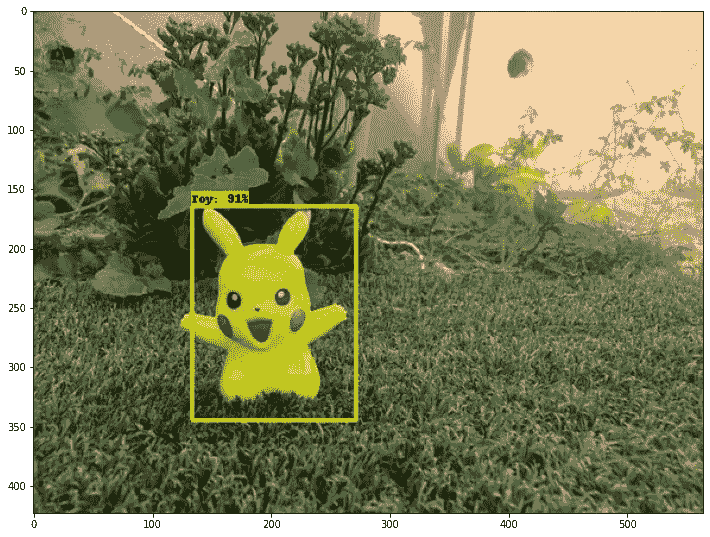
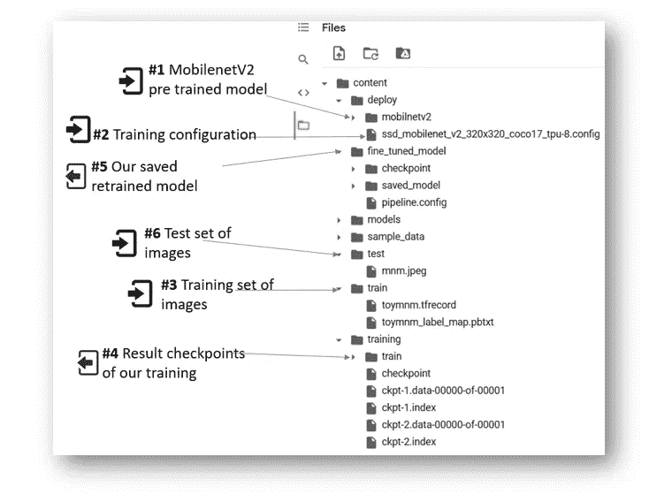

# 如何使用自定义训练集重新训练对象检测模型

> 原文：<https://medium.com/analytics-vidhya/how-to-retrain-an-object-detection-model-with-a-custom-training-set-c827aa3eb796?source=collection_archive---------3----------------------->

## 本教程将展示如何在 15 分钟内使用一组自定义图像重新训练 mobilenetV2 模型。



从头开始训练对象检测模型将需要长时间的模型训练。为了节省时间，最简单的方法是使用已经训练好的模型，并重新训练它来检测您的自定义对象。这个过程被称为“[迁移学习”。](/practical-deep-learning/a-complete-transfer-learning-toolchain-for-semantic-segmentation-3892d722b604)

# 为什么选择 mobilenetV2？

对象检测模型的性能持续提高。截至 2020 年，MobilenetV2 是可以在 web 浏览器中运行的最快的对象检测模型。

还有其他模型的对象检测，如 YOLO 和更多。你可以在这里找到[详细的物体探测模型评论。](/analytics-vidhya/a-review-of-object-detection-models-f575c515655c)

# 关于 Google Colab

MobilenetV2 是基于 TensorFlow 的模型，因此我们将在 google colab 环境中使用基于 TensorFlow 的开源 API 执行命令。Google colab 是免费的，但是它很快就会删除你的输出文件，这是一个不幸的缺点。

> 您可以创建自己的 Linux 服务器/docker，运行已经安装了所有库的`*object_detection*` API。详情请看这篇[博客](https://towardsdatascience.com/tensorflow-object-detection-with-docker-from-scratch-5e015b639b0b)。

# 本教程的议程

在本教程中，我们将重新训练 mobilenetV2 模型来检测 Pickachu 玩具。我们将执行这 10 个步骤:

*   **步骤 1:** 在您的 colab 笔记本中克隆对象检测 API 库
*   **步骤 2 至 4** :安装物体检测 API，导入其函数
*   **步骤 5:** 将您的训练图像集导入 colab
*   **第六步:**设置培训配置
*   **步骤 7:** 加载预训练的 mobilenetv2 模型及其权重和最新的检查点
*   **步骤 8:** 用我们的定制训练集训练我们的新模型
*   **第九步:**将我们训练好的模型导出为“SavedModel”格式
*   **步骤 10:** 使用我们的模型检测测试图像中的 Pickachu。

[在这里](https://gist.github.com/KostaMalsev/5d08cecc99f7a7ce72893060a06aba71?short_path=fb0f527)你可以找到完整的笔记本，只需在 colab 中运行即可(运行所有步骤大约需要 15 分钟)。

# colab 环境中的文件系统映射

使用对象检测 API 库的棘手部分是跟踪所有的输入和输出文件。

为了让生活变得简单一点，这里有一个 colab 环境的文件图，包含了我们将在本教程中使用的所有文件。

> 文件夹根据执行顺序进行编号，图标指示该目录是培训过程的输入部分还是输出部分。
> 
> 文件将根据本教程的执行步骤加载，因此并非所有文件从一开始就在那里。



# 执行步骤

在 colab 笔记本中运行以下步骤(完整笔记本可在此[获得](https://gist.github.com/KostaMalsev/5d08cecc99f7a7ce72893060a06aba71?short_path=fb0f527))。

**步骤 1:** 将 TensorFlow2 对象检测 API 文件夹克隆到您的 colab:

**第二步:**在 colab 中安装对象检测 API:

> 注意:不幸的是，由于某种原因，您需要运行该步骤两次来修复安装中的错误。

**步骤 3:** 将 TensorFlow 库导入 colab:

**步骤 4:** 运行该命令，测试`object detection API`是否安装正确:

```
!python /content/models/research/object_detection/builders/model_builder_tf2_test.py
```

**步骤 5:** 准备用于训练的定制图像集。在这个例子中，我使用 [Roboflow](https://roboflow.com/) 从训练图像中创建 [TFRecord](https://www.tensorflow.org/tutorials/load_data/tfrecord) 文件。

> 你也可以用可用的开源库创建一个带标签的训练数据集。
> 
> Roboflow 为您提供有限的免费访问权限，让您尝试其自动化过程，这一过程简单明了。
> 
> TFRecord 文件的一个例子可以在[我的 git 库](https://github.com/KostaMalsev/RetrainModelExample/blob/main/TrainingSet/Picka/Pickachu.v1.tfrecord.zip)找到。
> 
> 在本教程中，我只用了 10 张图片来训练模型。在大多数情况下，将图像添加到训练集将改善检测。

下载的文件会放在 colab 环境下的`/content/train/`文件夹中。

**第六步:**设置训练模型的配置参数:

**步骤 7:** 从 TensorFlow 站点加载训练好的模型权重，以及我为此示例准备的自定义配置文件:

`[*https://raw.githubusercontent.com/KostaMalsev/RetrainModelExample/main/ssd_mobilenet_v2_320x320_coco17_tpu-8.config*](https://raw.githubusercontent.com/KostaMalsev/RetrainModelExample/main/ssd_mobilenet_v2_320x320_coco17_tpu-8.config)`

> **注意**:确保文件名、文件夹和路径使用短名称。如果在配置文件中使用长路径名，训练过程将失败！
> 
> 以下是关于`pipeline_file`配置文件(`[*ssd_mobilenet_v2_320x320_coco17_tpu-8.config*](https://raw.githubusercontent.com/KostaMalsev/RetrainModelExample/main/ssd_mobilenet_v2_320x320_coco17_tpu-8.config)*)*`的一些注意事项:

```
#Choose type ssd_mobilenet_v2_keras
feature_extractor {                             
  type: **"ssd_mobilenet_v2_keras"**
..#Training batch size: if you have more memory on server,by increasing batch_size will run the training faster.
**batch_size: 16**#The path to pretrained model checkpoint:(choose short names) **fine_tune_checkpoint:** **"/content/deploy/mobilnetv2/checkpoint/ckpt-0"**#Number of training steps:
**num_steps: 1800**#Type of checkpoint when loading from pretrained model: fine_tune_checkpoint_type: **"detection"**#Defines the location of train set of images TFRecords and label maps
train_input_reader {                                        label_map_path: **"/content/train/Toy_label_map.pbtxt"**                         tf_record_input_reader {                                    input_path: **"/content/train/Toy.tfrecord"**                         }
..
```

**第 8 步:** **运行培训流程:**

以下参数和`pipeline_file`配置将在培训过程中使用。

`pipline_file ([*ssd_mobilenet_v2_320x320_coco17_tpu-8.config*](https://raw.githubusercontent.com/KostaMalsev/RetrainModelExample/main/ssd_mobilenet_v2_320x320_coco17_tpu-8.config)*)*` 中的配置值将覆盖行内参数。

```
**pipeline_file**: defined above in writing custom training configuration. ([*ssd_mobilenet_v2_320x320_coco17_tpu-8.config)*](https://raw.githubusercontent.com/KostaMalsev/RetrainModelExample/main/ssd_mobilenet_v2_320x320_coco17_tpu-8.config)**model_dir**: the location where logs and saved model checkpoints will save to.**num_train_steps**: how long to train for.**num_eval_steps:** perform eval on validation set after this many steps
```

> **注意**:训练过程需要几分钟，取决于你的机器。
> 
> 在大多数情况下，训练时间越长，检测结果越好。
> 
> 在这个例子中，我用`loss=0.159`得到了 1100 步的声音结果。在 colab 运行了大约 10 分钟。

在`/content/training/train`文件夹中查找检查点(`ckpt`)文件。

如果损失函数结果满足您的要求，您可以停止训练过程。损失函数结果可以在笔记本日志中找到，请查找以下行:

```
Step 1100 per-step time 0.478s loss=0.159
```

从我的经验来看，值低于`0.2`的损失函数结果对于一个演示应用来说已经足够了。

**步骤 9:** 保存重新训练的模型:

导出的模型将存储在`output_directory.`中。在本例中，模型将导出到`/content/fine_tuned_model.`

**就这样**。

现在你有了一个重新训练的模型`.pb` 文件和`checkpoint`文件，你以后可以用它来进行物体检测。

# 测试我们的再培训模型:

为了测试我们重新训练的模型，执行 4 个额外的步骤:

**步骤 A** :将需要测试的图像导入到`/content/test`文件夹中。我用了 Pinterest 上的 Pickachu 图片。

```
#Import your test images to colab. 
#I use Pinterest to store the the images.%mkdir /content/test/%cd /content/test/!curl -L "https://i.pinimg.com/564x/f5/46/c4/f546c47505e1f5f8d17f8458d641b262.jpg" > test.jpeg;
```

**步骤 B** :导入可视化库和对象检测功能:

**步骤 C:** 导入我们重新训练的模型，它的**最后一个**训练检查点和地图对象标签。对于这个例子，我选择了`ckpt-2`(第二个检查点)。

**步骤 D:** 对测试图像进行目标检测:

结果如下:)


你可以在这里找到完整的笔记本。

# 摘要

*   在本教程中，我们使用对象检测 API 库和我们选择的训练图像来重新训练对象检测模型“mobilenetV2”。
*   重新训练的模型被导出为冻结格式`.pb`文件，也称为“保存模型”格式。
*   我们在测试图像上测试了新的重新训练的对象检测模型。使用 Roboflow 平台将训练和测试图像转换为 TFRecord 格式。

# 后续步骤

我们可以使用重新训练的 mobilenetV2 在网络浏览器中的直播摄像机上执行对象检测，有关教程，请参见[我在这里的文章](https://kostya-malsev.medium.com/build-custom-object-detection-web-application-using-tensorflow-js-d1664f96a18b)。

感谢您的阅读！

# 参考资料:

1.  [物体检测 API](https://github.com/tensorflow/models/tree/master/research/object_detection) 。
2.  [张量流站点](https://www.tensorflow.org/)。
3.  [用 Roboflow 例子](https://colab.research.google.com/drive/1sLqFKVV94wm-lglFq_0kGo2ciM0kecWD)再培训 YOLO 模式。
4.  [git 上的 MobilenetV2 模型](https://github.com/tensorflow/models/tree/master/research/slim/nets/mobilenet)。
5.  [本教程完整笔记本](https://gist.github.com/KostaMalsev/5d08cecc99f7a7ce72893060a06aba71)。
6.  [本教程中使用的关于 Roboflow 的训练图像。](https://app.roboflow.com/ds/3BEuFXmB2K?key=Xpbcwj23it)