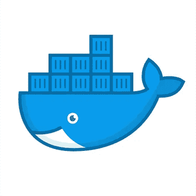
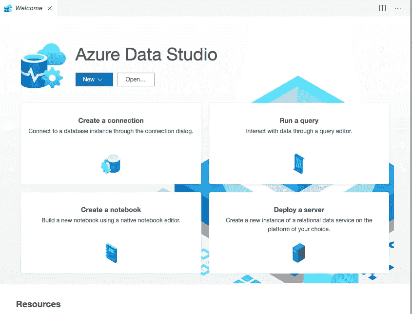
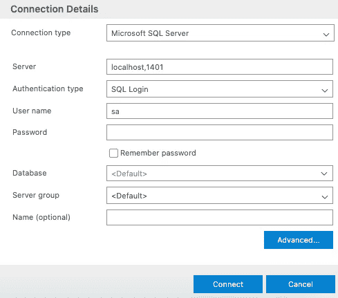
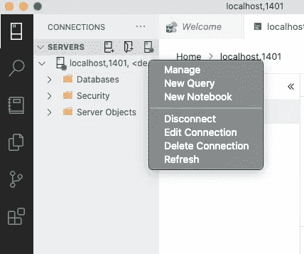
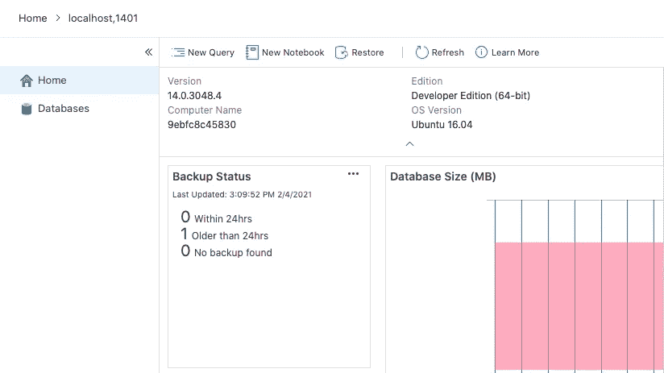
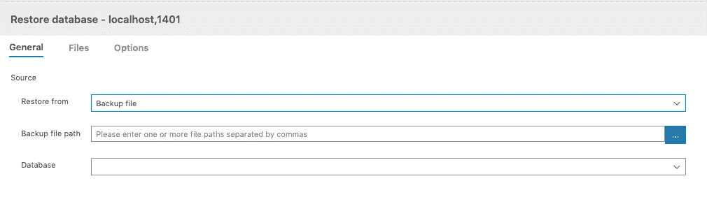
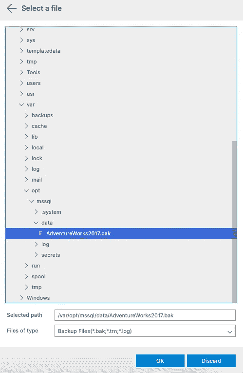
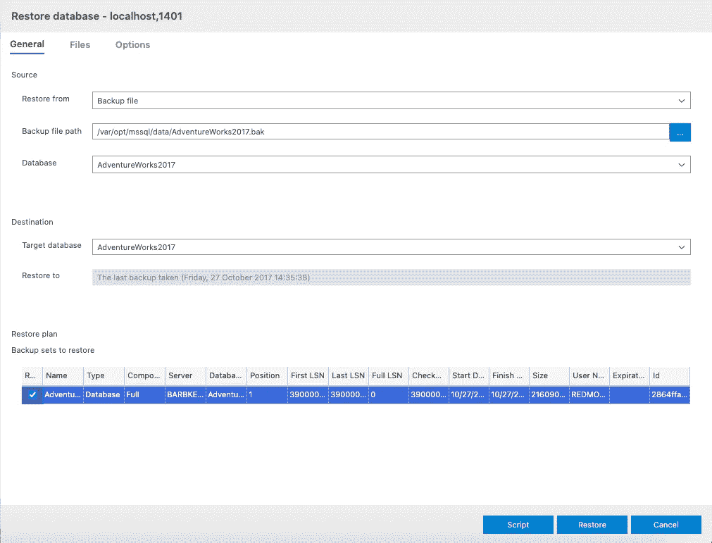
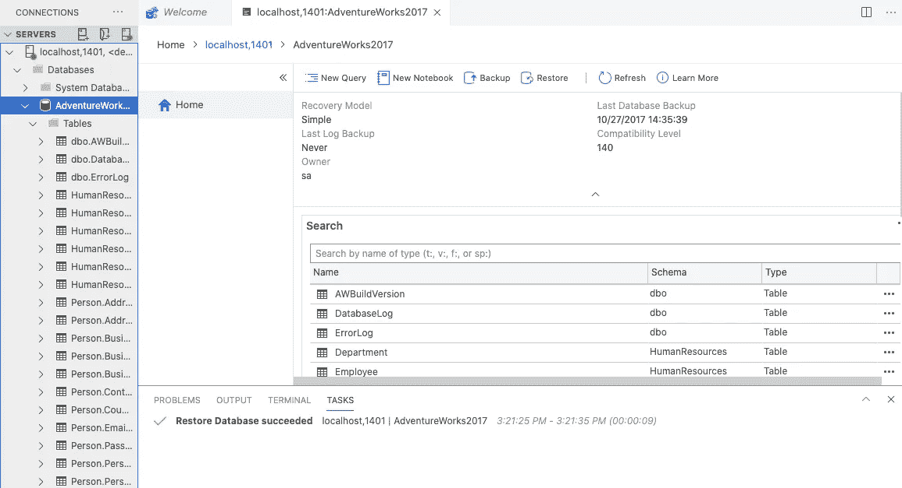

# 如何在 Mac 上使用 Azure Data Studio 运行 AdventureWorks

> 原文：<https://medium.com/analytics-vidhya/how-to-run-adventureworks-using-azure-data-studio-on-mac-1863207bb8db?source=collection_archive---------6----------------------->

如果你试图在 Mac 上探索 Microsoft SQL Server，并需要一步一步地了解如何访问数据库，我想我会为你写这篇博客。在我们开始之前，请使用提供的链接下载 [Docker](https://docs.docker.com/docker-for-mac/install/) 、 [Azure Data Studio](https://docs.microsoft.com/en-us/sql/azure-data-studio/download-azure-data-studio?view=sql-server-ver15) 和 [AdventureWorks](https://docs.microsoft.com/en-us/sql/samples/adventureworks-install-configure?view=sql-server-2017&tabs=ssms) 。如果你需要帮助，请在评论中联系我们。



图片来自推特上的@Docker

你下载了所有的东西？是的。我们继续。

## 我们的第一步是通过您的终端获取 SQL Server。

```
sudo docker pull mcr.microsoft.com/mssql/server:2017-latest
```

一旦您获取了 SQL Server，现在您就可以在本地计算机上运行它了。在下面的代码中，用您已经创建并将在 Azure Data Studio 中使用的密码替换<yourstrongpassword>。</yourstrongpassword>

```
docker run -e "ACCEPT_EULA=Y" -e "SA_PASSWORD=<YourStrongPassword>" -p 1433:1433 --name sql1 -d mcr.microsoft.com/mssql/server:2017-latest
```

现在，通过在同一个终端中键入以下命令，检查您的容器是否正在运行。

```
docker ps
```


你应该是上面那种(不好意思很小)。查看“Status ”,您应该看到“Up ”,然后是一段时间，这意味着您的 SQL Server 正在本地运行。如果显示 exited，请随意访问本页底部的资源[1]以获得更多帮助。

## 现在让我们转到 Azure Data Studio



当我打开我的 Azure Data Studio 时，上面显示的是主屏幕，根据您的版本可能会略有不同。查找“创建连接”或“新连接”并单击。右侧将打开一个连接详细信息面板。



您需要输入以下信息:

服务器:**本地主机**

用户名: **sa**

密码:**之前在终端步骤中设置的密码**

填写完这些信息后，单击“连接”。您现在已连接。现在我们需要将 AdventureWorks 复制到 Docker 容器中。让我们回到我们的终点站。

## 将 AdventureWorks 复制并连接到 Docker 容器中

我将 AdventureWorks 保存在下载下，您可能需要将文件路径更改为您在 Mac 上保存 AdventureWorks 的位置。在终端的一行中键入以下内容。

```
docker cp ~/Downloads/AdventureWorks2017.bak <containerID>:/var/opt/mssql/data/
```

现在，您已经将 AdventureWorks 复制到 Docker 容器中，并返回到 Azure Data Studio。为了确保您在正确的屏幕上找到服务器下的本地主机，右键单击并选择“管理”。



在右边你应该会看到一个写着“恢复”的按钮，点击它。



当下一个屏幕打开时，将“Restore from”从数据库更改为备份文件。然后单击“备份文件路径”旁边带有三个白点的蓝色方块



选择一个文件将出现，向下滚动到我们在上面输入的相同的 containerID。如果你跟着我，那么它是 var → opt → mysql → data →然后选择 AdventureWorks 并点击 OK。



选择“确定”后，您将返回到上一个屏幕，但您应该会看到 AdventureWorks 在页面底部突出显示。单击恢复



现在你应该会自动返回主页。在 localhost 下，您应该能够展开数据库并看到 AdventureWorks。双击 AdventureWorks，选择“新查询”并开始您的探索！



感谢阅读！

资源:

[1]—[https://docs . Microsoft . com/en-us/SQL/Linux/quick start-install-connect-docker？view = SQL-server-ver 15&pivots = CS1-bash](https://docs.microsoft.com/en-us/sql/linux/quickstart-install-connect-docker?view=sql-server-ver15&pivots=cs1-bash)