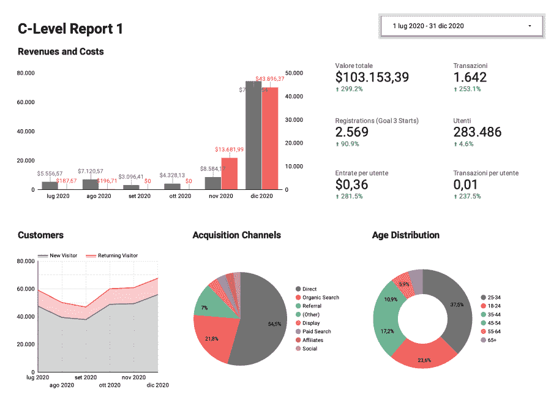
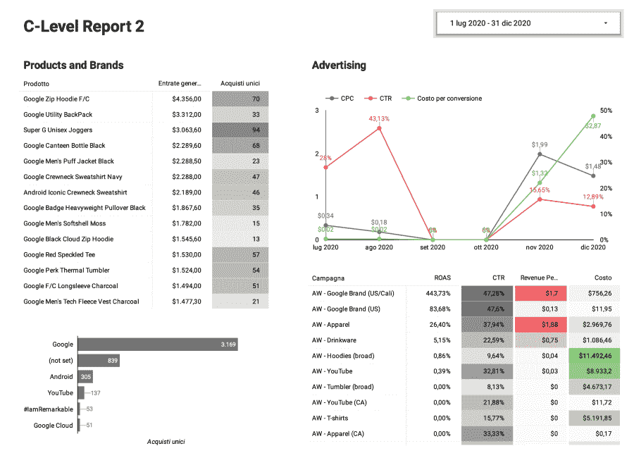
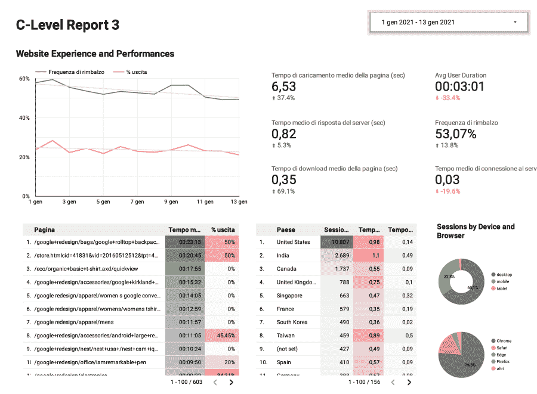
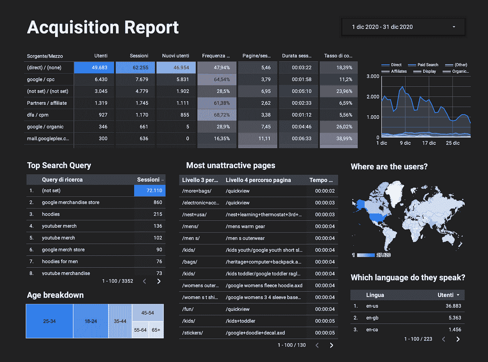
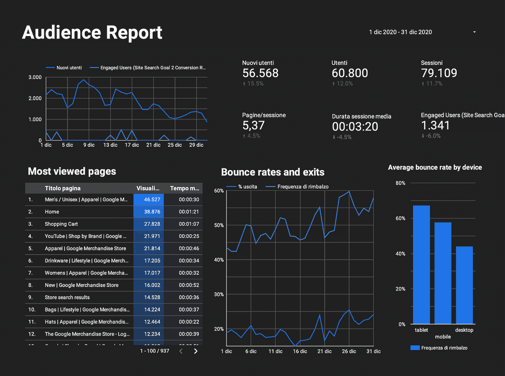
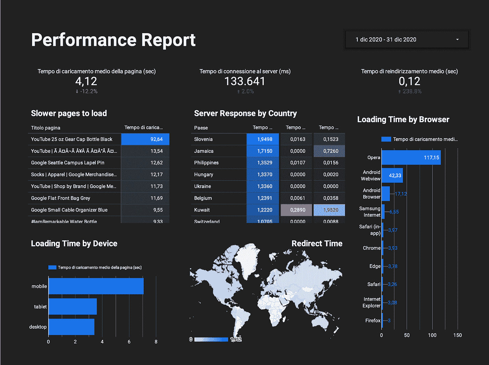

# 👔如何在每一个组织层面开一个有效的会议并改进报告

> 原文：<https://medium.com/analytics-vidhya/how-to-run-an-effective-meeting-and-improve-reporting-at-every-organisational-level-d09696a90546?source=collection_archive---------11----------------------->

# 会议可能会失灵。

*你有没有过这样的感觉:你参加了* ***的无用工作会议*** *，浪费了许多你本可以用在紧急任务上的时间？也许你甚至因为你的同事忘记解决他们说她会解决的问题而感到沮丧。你想知道如何开一个有效的会议吗？*

为什么会这样？我认为，会议混乱背后的一个原因是，经理们很容易忘记如何做到有效和切中要点。**保持团队合作有效和熟练的一个简单框架是 4DX 方法**，这是一套四条规则，帮助组织管理日常任务并专注于广泛的基本目标。你的会议是在那之后吗？

特别是，4DX 方法基于**四个学科**。如果你不熟悉其中的一些，我已经写了一篇关于它们的文章。

1.  *关注广泛重要的*。你的会议是关于你组织的目标吗？你是如何实现这些目标的？或者他们更多的是组织圣诞晚会？
2.  *对先行措施采取行动*。你会议的主题是你相关的 KPI 和成功的衡量标准吗？它们定义了你的公司是否正在交付成果？或者是关于对正在发生的事情的感觉和看法？
3.  保持一个引人注目的记分牌。开会时你会看记分牌吗？你是在讨论为什么销售额在下降，还是在利用网站流量的增长？人们可以访问这个记分牌吗？
4.  创造问责的节奏。会议是定期的吗？紧急-不重要的事实的旋风是允许的吗，防止服务员被集中注意力？会议持续时间呢？会议是否短于 30 分钟？经理在开始前澄清时间表了吗？是否有一份清晰的任务清单，列出了在本周剩余时间内要完成的任务？它是否遵循客户审核计划结构？

擅长会议管理的另一个基本要素是意识到你必须保留的细节。在组织中，管理者不得不寻找更宽泛的衡量标准和目标，而不是可操作的东西。因此，会议的范围和时间框架往往是不同的。

# 一个实际案例:如何开一个有效的会议

在下面的章节中，我**想象了一个由同一家公司的两组人**召开的会议:第一组是高层管理人员，第二组是技术人员。“想象一次会议”，我指的是创建会议的 PowerPoint 演示文稿，以及在观看每张幻灯片时提出的意见/讨论。

用于示例的公司是[谷歌商品商店](https://www.googlemerchandisestore.com/)，我们之前用[来生成销售预测收入](https://alessandromarchesin.com/2021/06/12/how-to-run-sales-revenue-analysis-and-forecasting-with-r/)，因为它[友好地共享其所有分析](https://support.google.com/analytics/answer/6367342?hl=en#zippy=%2Cin-this-article)。数据已经连接到一些[谷歌数据工作室仪表板](https://www.google.com/url?sa=t&rct=j&q=&esrc=s&source=web&cd=&cad=rja&uact=8&ved=2ahUKEwikxNC08tryAhVEKuwKHb7jA-UQFnoECAIQAQ&url=https%3A%2F%2Fmedium.com%2F%40alessandromarchesin%2Fcreate-your-personal-finance-system-build-your-spending-dashboard-and-forget-about-spreadsheets-f27091e57cda&usg=AOvVaw3dE0L5l_EgJts2T6sv894w)以更好地可视化正在发生的事情。

在这一页的底部，你会发现两份完整的报告和分析；以下是一些摘录:

# 高级别报告

C-Level 经理人的兴趣应该围绕几个关键词:**收入、成本、用户体验、产品和性能**。此外，有两个仪表板:他们应该有一个长期的愿景，另一个基于两周，以了解目前的情况。

*   12 月的结果相当显著。成功的因素是什么？它们是可重复的吗？
*   此外，支出大幅增加。它仍然有利可图吗？有可能保持这样的投资水平吗？
*   总的来说，在转化率方面有很多改进。如何让他们坚持下去？
*   有机搜索和 Direct 似乎是我们最大的吸引渠道。成功因素是什么？

*   9 月和 10 月没有广告数据，是不是有什么东西不起作用，或者只是没有支出？
*   为什么随着支出的增加，活动的转化率变得越来越差？
*   一些 0% roa 的活动正在进行，那里发生了什么？
*   为什么这笔钱没有分配到大多数高性能驱动器上？

*   希望跳出率和退场率会稍微下降。
*   许多性能指标的增长令人担忧(页面负载、服务器响应、页面下载)。检查我们的服务会很有帮助。
*   表现不经常到访的国家似乎合适。
*   为什么许多用户在一些页面上停留了很长时间？内容漂亮吗？他们不知道如何导航或继续冲浪吗？

# 专家报告

如前所述，员工应专注于改善更具体的领域，如下所示:

*   直接获取的用户呈现增长趋势。为什么会有这样的上升趋势？
*   通过联营关系获得的子公司跳出率很高。检查合作伙伴是如何促销商品的会很好。
*   此外，通过付费搜索获得的用户似乎在网站上停留的时间很短。广告是否传递了错误的信息？
*   有些页面似乎没有留住用户。应该对它们进行检查。

*   新用户似乎在减少，主要是因为直接流量。
*   参与用户和平均会话持续时间正在下降，网站看起来不那么引人注目了。
*   跳出率有令人担忧的上升趋势。
*   平板电脑用户似乎更经常从网站上掉线。

*   重定向时间的增长令人担忧。可能有些页面重定向不正确？
*   有些页面需要很长时间才能加载。你应该检查一下。
*   它似乎在 Opera 和 Android web view 上工作得很糟糕。
*   移动负载在移动设备上比在平板电脑和台式机上慢得多。
*   别忘了查看 PageSpeed Insights。

# 结论

无聊的会议肯定是 21 世纪的斗争，但在使用 4DX 方法上付出一点努力可以从根本上改变组织的有效性。如果你想查看更多资料，可以看看 [C-Level 学期报告](https://drive.google.com/open?id=1P8NjP_gavXQVyAbuygZjjcdLnd66_Nj6)、 [C-Level 月报](https://drive.google.com/open?id=1UGhf40x0wNKl5uSq_I0HYQ_fjxcsxo9F)、[专科报告](https://drive.google.com/open?id=1tqUM9sbhGFRvAYd9aeTF4FF8vjRec7fg)和[全分析](https://drive.google.com/open?id=1lNPmuMowY3nDAyCjpzjol1d4t6OMBb0v)。