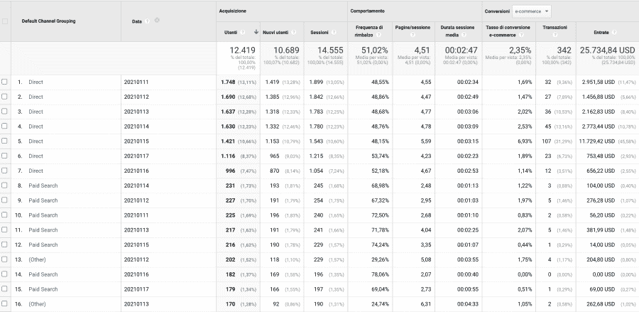
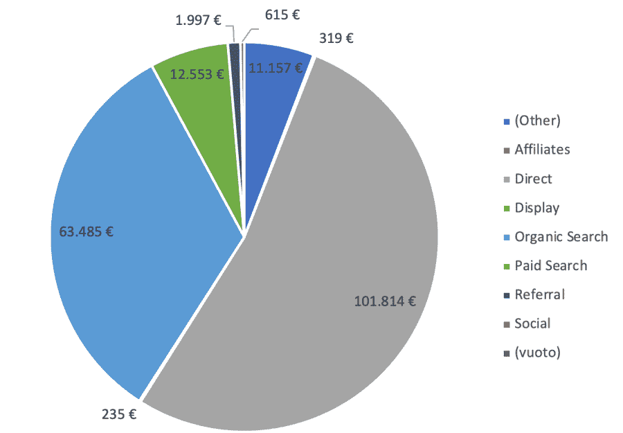
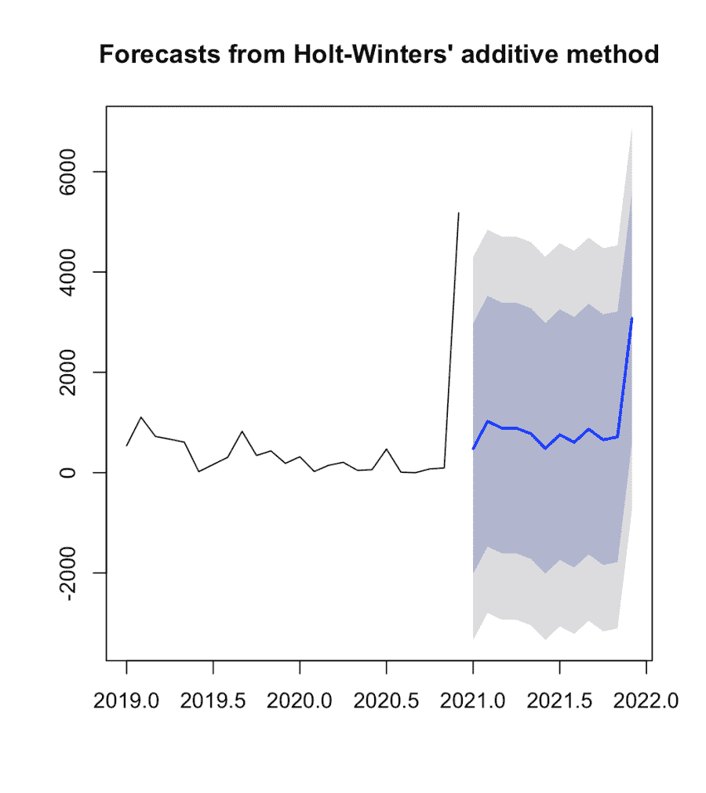
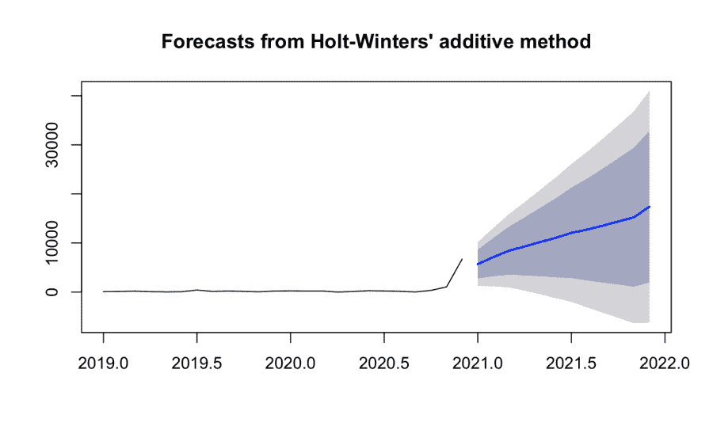
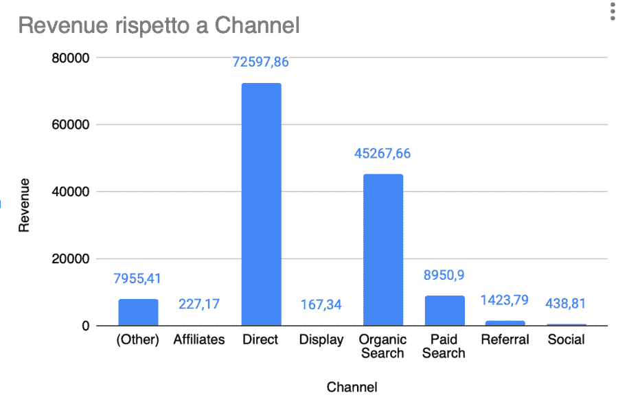

# 🛒如何用 r 运行销售收入分析和预测

> 原文：<https://medium.com/analytics-vidhya/how-to-run-sales-revenue-analysis-and-forecasting-with-r-48b1aa89adc1?source=collection_archive---------7----------------------->


我可能会是第一百万个写这篇文章的博主。然而，这是不可能否认的:数据驱动的决策对于每个希望提高生活和商业效率、生产力和回报的个人或组织来说都是必不可少的。

怎么会？让我们考虑一个简单的例子:一个典型的书商通常知道其最后顾客的以下事实:他们买了哪些书，花了多少钱。另一方面，亚马逊等大数据驱动的零售商让他们的在线客户在一次购买中产生大量线索:

*   他们在找什么。
*   他们如何浏览网站。
*   他们是否以及在多大程度上被促销、特定的页面布局、评论等等所吸引。

我相信没有必要告诉你如何更有效地赢得客户。

你猜怎么着？你不需要成为价值 1.69 万亿美元的公司的[来操纵数据和产生有意义的见解，以做出更好的决策。我将试图通过分析谷歌商品商店的数据来证明这一点，将它们转化为“可管理”的东西。对产量进行初步分析后，我们将设法做些预测。这里的指导性问题将是:哪个用户来源将带来更多的收入？](https://finance.yahoo.com/quote/AMZN/)

# 初始化

我们将使用谷歌商品商店，因为它友好地通过遵循这个指南来分享所有的统计数据和网络分析。在 R 中，将需要下面的库。

```
library(readxl)
library(tidyverse)
library(dplyr)
library(tidyr)
library(fpp)
library(astsa)
library(lubridate)
library(tsutils)
library(smooth)
```

# 收藏品

我的目标是有一个 Excel 文件，报告 2019 年和 2020 年每个来源每天获得的用户数量和收入。例如，我们想知道 2019 年 1 月 20 日的付费营销带来了 200 名用户，赚了 140 美元。为此，让我们转到收购部分，创建一个 2019 年和 2020 年电子商务目标的报告，其中第二维是日期。结果应该是这样的。



现在让我们利用 R 来修复这个表。为此，我们将导入表，正确设置列的格式，过滤列并获得一个干净的数据集。

```
# Import the dataset, Factor the channels and convert column date
X2020 <- read_excel("2020.xlsx", sheet = 2)
X2020$`Default Channel Grouping` <-
  as.factor(X2020$`Default Channel Grouping`)
X2020$Data <- as.Date(X2020$Data, format = "%Y%m%d")
X2020$Data <- format(X2020$Data, "%Y-%m")
X2020 <- X2020 %>%
  group_by(`Default Channel Grouping`, Data) %>%
  summarise_if(is.numeric, sum)# Select few columns and rename them
X2020 <- X2020 %>%
  select(c(`Default Channel Grouping`, Data, Utenti, Entrate, Transazioni))
colnames(X2020) <-
  c("channel", "date", "users", "revenue", "transactions")# create a first dataframe spreading the row values to the columns values
revenues1 <- X2020 %>%
  select(channel, date, users) %>%
  spread(channel, users, fill = 0)# create a second dataframe with daily revenues
revenues2 <- X2020 %>%
  group_by(date) %>%
  summarise(sum = sum(revenue))# create a third dataframe with daily number of transactions
revenues3 <- X2020 %>%
  group_by(date) %>%
  summarise(trans = sum(transactions))# combine the two dataframe
revenues_final <- inner_join(revenues1, revenues2, "date")
revenues_final <- inner_join(revenues_final, revenues3, "date")
```

值得注意的是，我们需要使用 spread 函数将列值转换成类别。这就是我们在生成最终数据帧之前将数据帧分成三份的原因。

# 首次分析

现在我们的数据框架看起来更好，我们可以开始检查收入方面的最佳渠道。

```
# simple average of revenue
X2020a <- X2020 %>%
  group_by(channel, date) %>%
  summarise(a = mean(users), b = mean(revenue), c = mean(transactions))
```



可以说，数据已经开始变得有用了！

# 预报

另一个了解谷歌商品商店将会发生什么的想法是应用[霍尔特温特方法](https://www.rdocumentation.org/packages/stats/versions/3.6.2/topics/HoltWinters)来预测未来事件。Holt 的双参数模型也称为线性指数平滑，是一种用于预测数据趋势的常用平滑模型。霍尔特的模型有三个独立的方程，它们共同产生最终的预测。第一个是基本平滑方程，直接调整前一期趋势的最后平滑值。趋势本身通过第二个等式随时间更新，其中趋势表示为最后两个平滑值之间的差。最后，第三个等式用于生成最终预测。霍尔特的模型使用两个参数，一个用于整体平滑，另一个用于趋势平滑方程。

为了将它应用于所有八个流量源，我们将编写如下循环。请注意，我们在循环的中间生成了一个将两年分为 12 个月的时间序列。

```
channels <-
  c(
    "Affiliates",
    "Direct",
    "Display",
    "Organic Search",
    "Paid Search",
    "Referral",
    "Social",
    "(Other)"
  )# model generation
for (i in 1:8) {
  X2020i <- filter(X2020, channel == channels[i])
  ts <-
    ts(
      X2020i$revenue,
      start = c(2019, 1),
      end = c(2020, 12),
      frequency = 12
    )
  fit1 <- hw(ts, seasonal = "additive", h = 12)
  summary(fit1)
  plot(fit1)
  decomp <- decomp(ts, outplot = 1)
}
```

对于它们中的每一个，我们将有下面的图，向我们展示随后的趋势。



总体趋势如下:



# 总结

根据预测和已经收集的数据，2021 年的预期月收入和渠道分配如下:



> *你有没有尝试过根据过去的观察来预测一些数据？怎么样？*