# 如何在 Heroku 中零成本地安排 python 项目/脚本

> 原文：<https://medium.com/analytics-vidhya/how-to-schedule-a-python-project-script-in-heroku-with-zero-cost-f27d37ad7d4e?source=collection_archive---------11----------------------->

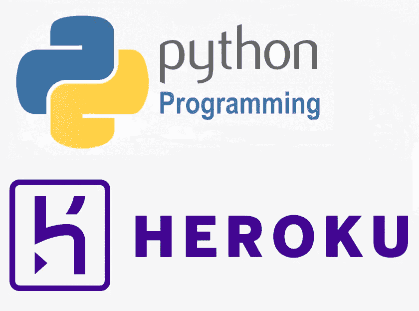

# **背景**

在这个新冠肺炎·疫情时期，加密硬币在社会中的受欢迎程度大幅提高。社会中的大多数人都被孤立在自己的家中，他们中的大多数人倾向于关注网上收入。九分之十的人会对加密货币交易感兴趣，因为流行硬币的价格一天天越来越高。

这些天我正在做一个与加密货币交易平台相关的项目。我的公司已经创建了一个网络爬虫，能够从著名的加密交易平台抓取加密硬币表。我进去后，我的主管给我分配了一个任务，每五分钟抓取一次 crypto coin 表数据，并将其存储在 MySQL 表中(每五分钟，应该会有一个新表)。之后，将项目部署到 Heroku 中，并使其在没有人工交互的情况下运行。

我搜索了分配给我的相同主题，并找到了由 Sathindu Kavnath 先生撰写的中型帖子([)https://medium . com/analytics-vid hya/schedule-a-python-script-on-heroku-a 978 B2 f 91 ca 8](/analytics-vidhya/schedule-a-python-script-on-heroku-a978b2f91ca8))。从他的故事中得到一些启发后，我另辟蹊径，找到了更好的零成本完成任务的方法。让我们开始把我的观察定义为一个教程。

# **第一步(创建一个 GitHub 库)**

在我们开始之前，你必须有一个 Heroku 帐号和一个 GitHub 帐号。最好也下载并安装 Heroku CLI。

*   **Heroku CLI**->[https://dev center . Heroku . com/articles/Heroku-CLI #下载并安装](https://devcenter.heroku.com/articles/heroku-cli#download-and-install)

对于 python 开发，我使用了 PyCharm。在您的 python 项目中，必须有三个重要的文件。

1.  **过程文件**
2.  **Requirements.txt**
3.  **Runtime.txt**
4.  当然，还有你的 python 脚本。

在 GitHub 中创建资源库时，您可以将其创建为**公共**或**私有**。这不会影响你的 Heroku 部署。

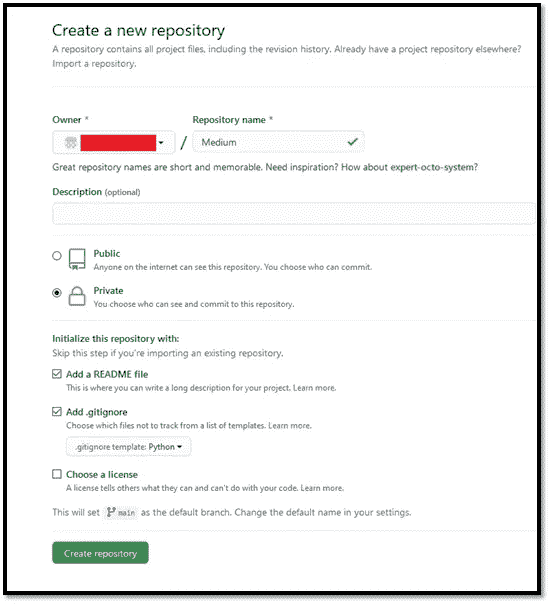

# **第二步(定义必要文件)**

1.  **Python 脚本**

我在下面使用了简单的 Hello world python 脚本，并计划每 1 分钟打印一次 Hello world。在我的例子中，我使用“start”作为我的 python 文件名，但是您可以使用任何您想要的名称。

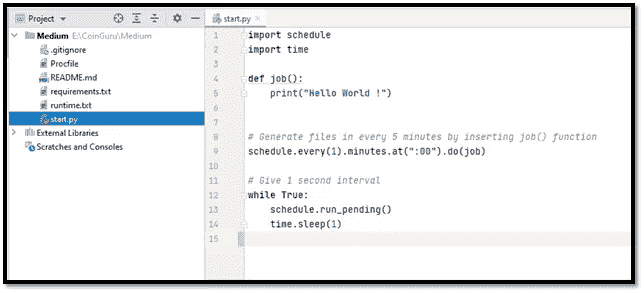

**2。过程文件**

简单地说，Procfile 用于存储类似 Heroku 平台上的 dyno 的命令。在 Heroku，dynos 作为容器工作。您可以根据需要激活或禁用 dyno。当您激活一个 dyno 时，它将执行您在 Procfile 中定义的命令。在 Procfile 中可以看到两个主要的进程。

1.  Web -:在部署 Web 应用程序或 HTTP 请求相关脚本时使用。
2.  Worker -:在部署普通脚本时使用(在我的例子中，我使用了 Worker)。

请记住，Procfile 不是文本文件。它只是一个文件。在我的例子中，我的 python 文件的名称是“start”。因此，我使用了命令“ **python start.py** ”来执行我的代码。

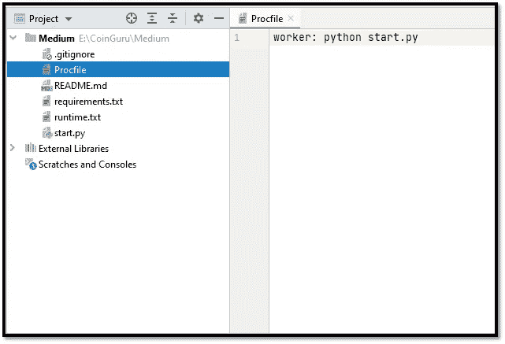

**3。requirement . txt**

在这里，我们可以用我们在项目中使用的版本来定义我们的库。在我的例子中，我使用了一个名为 schedule 的主库。

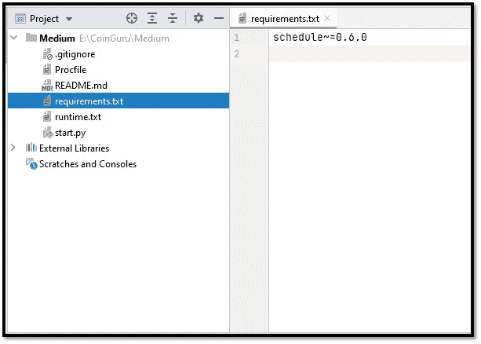

**4。Runtime.txt**

在这里，我们可以定义将在项目中使用的 python 版本。在我的例子中，我使用了" **python 3.8.8** "但是你可以根据自己的选择使用任何版本。

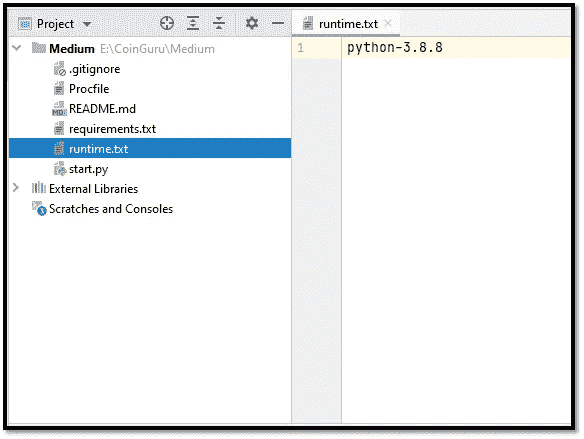

# **步骤 3(将脚本部署到 Heroku)**

完成以上场景后，您可以将您的项目添加到 GitHub 中。

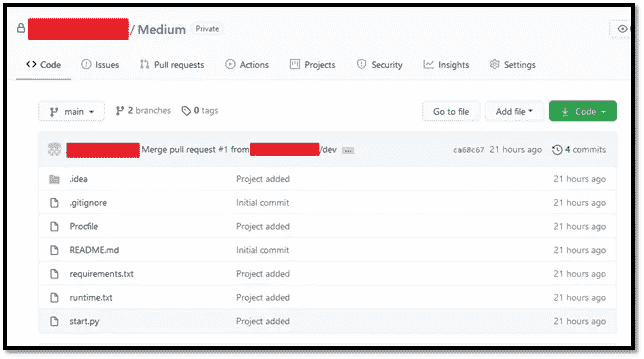

在那之后，我们现在可以进入 Heroku。设置好你的账户后，你可以看到如下界面。在那里，选择“新建”，然后选择“创建新管道”

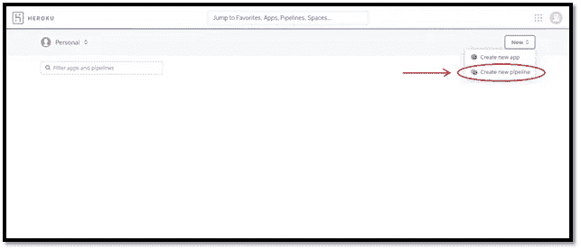

创建管道时，您必须给管道命名，并将 GitHub 库与管道连接起来。给管线命名时，必须只输入小写字母。在我的例子中，我使用了" **medium** "作为我的管道名。然后你必须给出你的库名，Heroku 显示项目，你可以点击 connect 在 GitHub 和 Heroku 之间添加连接。

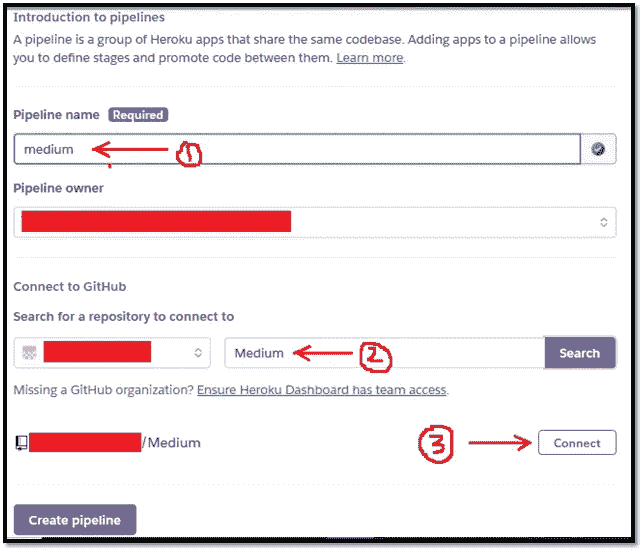

现在点击**创建管道**按钮。

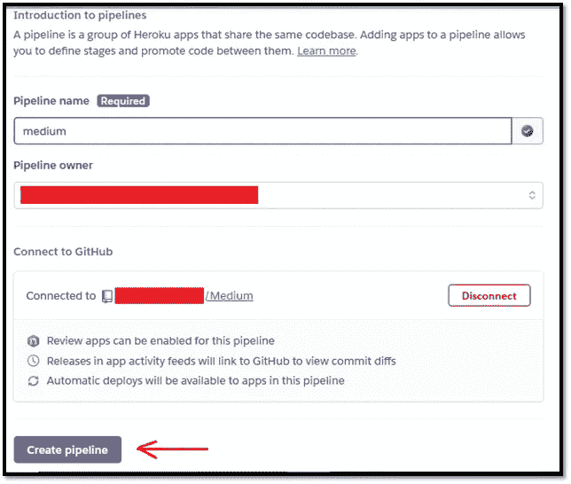

现在，您可以看到管道的接口。现在，我们正在着手实施我们的项目。在我们开始之前，您需要在设置中启用“**审核应用**”(可以为在 GitHub 上打开的拉式请求创建审核应用)功能。

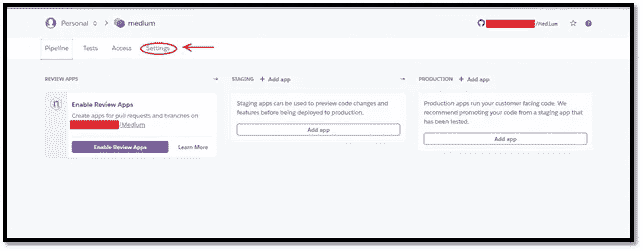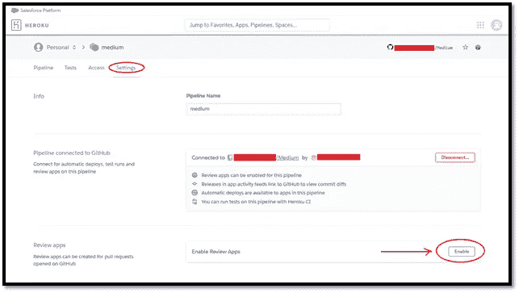

无需勾选任何点，只需点击**启用审核申请**

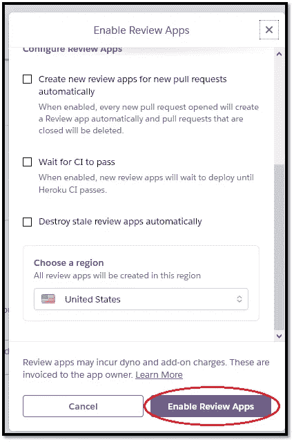

现在，再次转到 pipeline 并单击“**添加应用程序**”按钮。

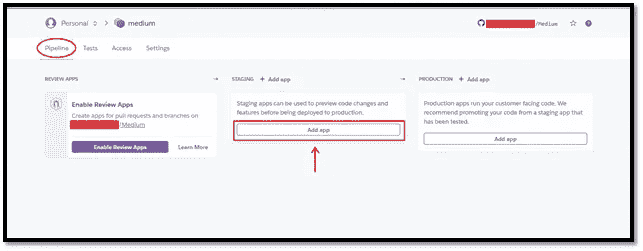

现在根据说明给你的应用命名。我给我的应用程序命名为“ **medium-m**

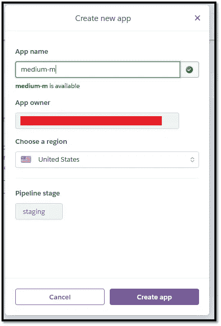

创建应用程序后，您现在可以部署它。就像我的一样跟着走。

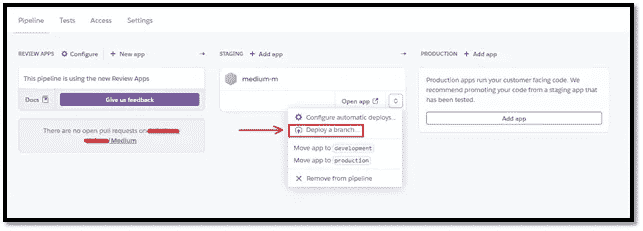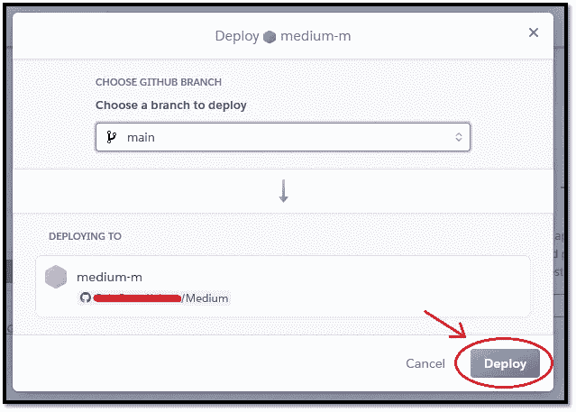

现在点击“**查看日志**”查看部署过程如何工作，并检查是否有任何问题？

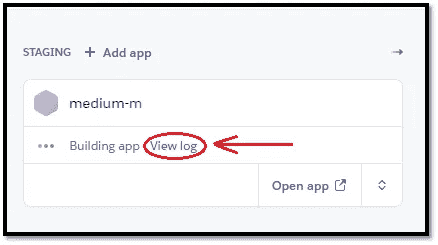

你可以看到我们的 **Procfile、requirement.txt 和 runtime.txt** 都是在 log 中执行的。

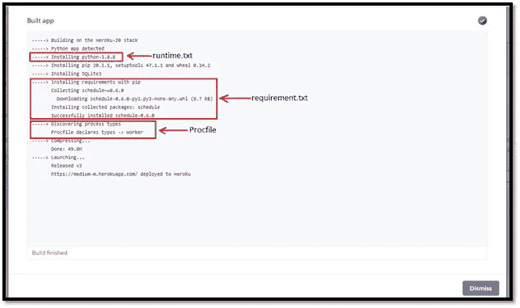

# **第四步(执行 app)**

在执行应用程序之前，我已经要求您下载并安装 Heroku CLI。现在，让我们尝试进入 Heroku CLI 一点。在那里，我们可以在执行应用程序时观看实时日志。在那里，我们可以查看结果、执行错误等。跟着我。

1.  键入“ **heroku 登录**”。然后遵循 cmd 中的给定指令。

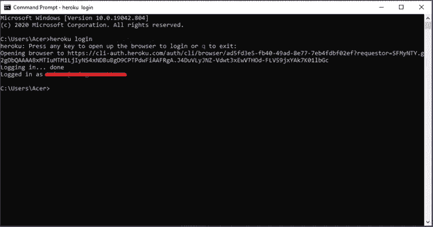

2.接下来，您可以输入“**heroku logs-app<您的 app 名称>-tail**”。在我的例子中，我使用了“**heroku logs–app medium-m-tail**”。您可以看到应用程序部署日志已经存在。

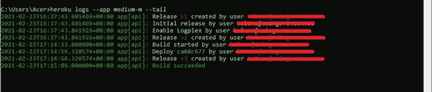

现在我们进入我们的动态。要运行应用程序，我们必须激活我们的动态。因此，和我一样做。

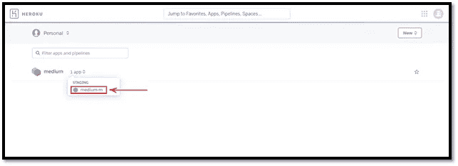

点击“ **medium-m** ”后，导航至“Resources”选项卡，您可以看到我们的 dyno 尚未激活。

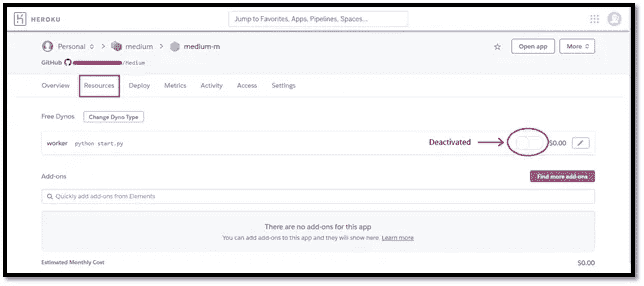

要激活它，请单击红色圆圈图标旁边的钢笔图标，并单击一次，然后您会看到它将被着色。然后点击确认按钮来执行我们的脚本。

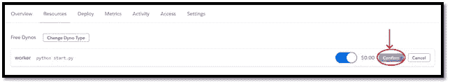

现在让我们看看我们的命令提示符，看看我们的结果。

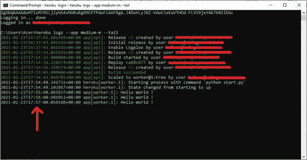

您可以看到我们的脚本成功运行。脚本每 1 分钟执行一次。如果你想停止脚本执行，只需关闭动态。

**项目链接->**[https://drive . Google . com/drive/folders/1 capinhzb 5 nzpsysziqtljepyhcw 2g 8 XV？usp =共享](https://drive.google.com/drive/folders/1cAPINhZb5nzpsysziqtljePyhCw2g8xv?usp=sharing)

# **结论**

同样，您可以在 Heroku 上部署任何 python 脚本(有数据库连接，没有数据库连接)。请记住，如果您愿意将数据库与您的项目连接，请不要使用 Heroku 数据库插件，因为这些提供商提供的服务成本很高。我建议使用 AWS RDS，而不是其他云数据库，因为我们可以在 AWS 免费层做很多事情。

大多数 Heroku 用户在使用 Heroku 时都面临时区问题。如果您正在处理基于区域的项目，并且您无法根据您的时区生成，只需遵循以下步骤。

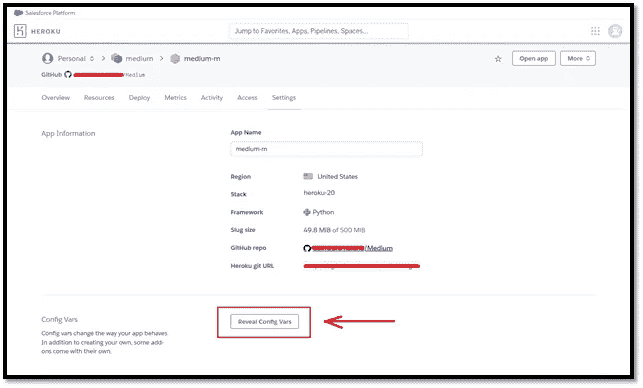

我希望这个教程能在你将来实现目标时有所帮助。稍后我会提出另一篇有用的文章。谢谢大家！