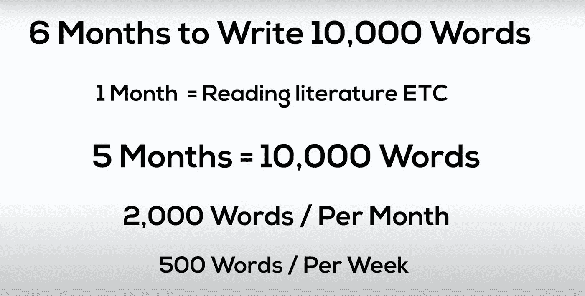

# 如何给你的论文打一等分？

> 原文：<https://medium.com/analytics-vidhya/how-to-score-a-first-class-for-your-dissertation-e8d508fab9a1?source=collection_archive---------28----------------------->

所以这是一年中每个学生都在强调的一件事，这就是为你的学位写一篇最大的论文，不管你是本科生还是研究生，论文是非常冗长的东西，我已经为我的本科学位和硕士学位读了两次。

所以，如果你还在为此感到压力，那么让我分享 3 个技巧来减轻你的压力，这将更好地帮助你准备你的论文，并帮助我获得一个荣誉，我的金融本科学位和商业分析研究生学位。

# 1.选择正确的主题

写论文最需要考虑的是题目！！！这对你的论文来说是最重要的，因为你要写 10，000-20，000 字，所以确保你选择了一个你真正想谈论的话题！！！现在，当你选择题目时，有两件事你应该考虑

1.  为了挑选一个现有的主题并使其更好，例如在我的案例中，我选择写推荐系统，因为这是我很好奇的事情，也因为我想改善现有的错误率，将其从 95%降低到 84%，所以也许你可以选择写一个你可以有自己的发现并使其更好的主题
2.  选择主题的第二种方法是写一些以前从未做过的事情，为此你可能需要找到一个你真正感兴趣的领域或主题，例如你如何通过分析使杂草的生产更可持续。

# 2.制作子问题

现在，写论文时你需要考虑的第二重要的事情是从你的主要问题中创造出各种子问题；例如，我论文的主要问题是“[使用电影数据集](https://papers.ssrn.com/sol3/papers.cfm?abstract_id=3791837)评估推荐模型”，所以我将主要问题分解为多个子问题，这些子问题将我引向主要问题，所以我的不同子问题是:

*   什么是推荐系统
*   为什么我们需要推荐系统
*   推荐系统算法背后的数学原理
*   什么是基于内容的过滤
*   什么是协同过滤

这些子问题有效地回答了我的主要论文问题。

# 3.时间管理

写论文时最重要的最后一点是时间管理！管理好你的时间是如此重要，以至于你最终能按时完成你的论文，现在你可能会问你是如何管理你的时间的？

让我通过下面的插图给你举个例子:

假设你有 6 个月的时间来写一篇 10，000 字的论文，制定一个时间表，确定你何时想要达到某些目标，假设第一个月将用于阅读相关文献，这意味着你还有 5 个月的时间，这意味着每个月你需要写 2000 字，每个星期你需要写 500 字，以满足 10，000 字的限制。当你把单词分成小块，先集中精力完成较小的任务，这将有助于你更有效地工作，从而使你更有效率，也有助于你按时完成论文。

这是帮助我获得论文第一名的 3 个重要提示，我希望你能从这个博客中获得一些有价值的东西，并将其用于你的论文，我希望这对你也有帮助！！！

如果你对科技、生产力、金融和商业等话题感兴趣，那就去看看我们的 youtube 频道吧！！！

*Youtube—*【bit.ly/2MFLIqfbit.ly/2MFLIqf】T4