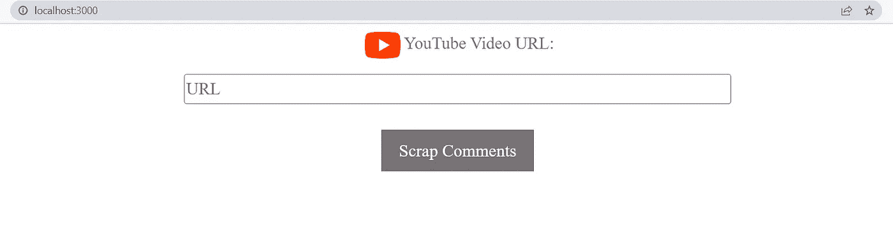

# 如何报废 YouTube 评论？

> 原文：<https://medium.com/analytics-vidhya/how-to-scrap-youtube-comments-cf6348ef9e09?source=collection_archive---------5----------------------->


**网页抓取**是将信息从网站导入保存在您电脑上的本地文件的过程。稍后，您可以使用该信息进行分析。

在这里，我们将看到如何删除 YouTube 评论，并从抓取的数据生成 csv 文件。

**1。先决条件:**

*   你会需要 **Google API Key** (可以参考这个 [**链接**](https://support.google.com/googleapi/answer/6158862?hl=en) 生成 API Key **)**
*   将钥匙放在**内。环境**文件

**2。导入所需的包:**

```
from googleapiclient.discovery import build
from urllib.parse import urlparse, parse_qs
import pandas as pd
import os
import time
from dotenv import load_dotenv
load_dotenv()
```

**3。使用 URL 获取视频 id 的函数:**

```
def get_video_id(url):
    u_pars = urlparse(url)
    quer_v = parse_qs(u_pars.query).get('v')
    if quer_v:
        return quer_v[0]
    pth = u_pars.path.split('/')
    if pth:
        return pth[-1]
```

**4。功能报废备注:**

```
def video_comments(video_id,api_key):resource = build('youtube', 'v3', developerKey=api_key)try:
        request = resource.commentThreads().list(
                            part="snippet,replies",
                            videoId=video_id,
                            maxResults= 5,
                            order='time') 

    #execute the request
        response =request.execute()
        dfa=[]while response:
            for item in response['items']:
                item_info = item["snippet"]
                topLevelComment = item_info["topLevelComment"]
                comment_info = topLevelComment["snippet"]dfa.append({
                'comment_by': comment_info["authorDisplayName"],
                'comment_text': comment_info["textDisplay"],
                'comment_date': comment_info["publishedAt"],
                'likes_count':  comment_info["likeCount"],
                })# Again repeat
            if 'nextPageToken' in response:
                response = resource.commentThreads().list(
                    part = 'snippet,replies',
                    videoId = video_id,
                    maxResults= 100,
                    pageToken=response['nextPageToken']  #get 100 comments
                ).execute()
            else:
                break

        pd.DataFrame(dfa, columns=('comment_by', 'comment_text', 'comment_date', 'likes_count'))df = pd.DataFrame(dfa)path = "Data/"+video_id+".csv"
        full_path = os.path.abspath(path)  # get the FULL pathdf.to_csv(path)
        return full_pathexcept:
        return False
```

**5。函数调用:**

```
api_key = os.getenv('GOOGLE_API_KEY')
url = "https://youtubeurl"video_id = get_video_id(url)video_comments(video_id,api_key)
```

6。检查输出:

*   在**数据**目录中，您将能够看到**。csv** 刮下的评论文件。



你可以从我的 GitHub 账号 [**这里**](https://github.com/priyanka-ddit/Web-Scraping) 下载**Python 后端和 React 前端的源代码。**

你可以查看我的另一篇博客，了解如何使用这些数据来探索 NLP 技术。

# 谢谢你。