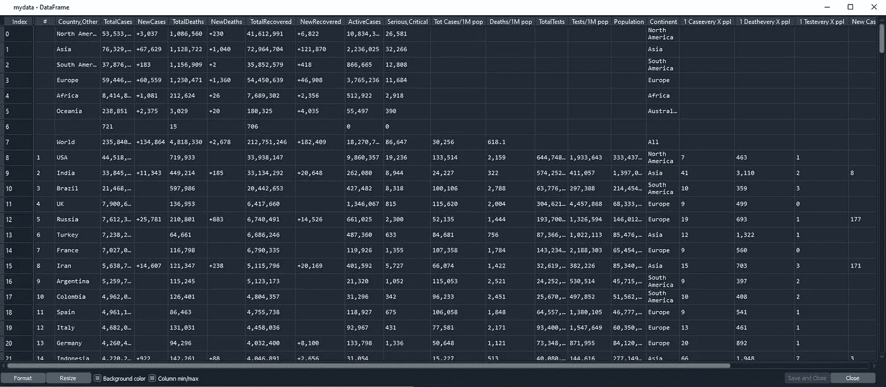

# 如何使用 Python 从网站上抓取表格

> 原文：<https://medium.com/analytics-vidhya/how-to-scrape-a-table-from-website-using-python-ce90d0cfb607?source=collection_archive---------0----------------------->

[在之前的](/analytics-vidhya/how-to-scrape-data-from-a-website-using-python-for-beginner-5c770a1fbe2d)中，我们已经了解了在网站上收集数据的基本知识，但是您知道我们还可以收集表格形式的数据吗？如果你经常上网，你可能会注意到许多网站都有数据表。例如航班时刻表、产品特性、服务差异、电视节目时间表、排名等等。


图 1 Similarweb.com 数据表

在某些情况下，不需要编码就可以很容易地将表格复制并粘贴到 excel 中，但是作为数据科学家，我们需要理解，在未来我们将处理更大的数据，而复制粘贴方法并不真正有效。所以现在我将向你展示如何从一个网站上抓取一个数据表。

**第一步。安装库**

首先，我们需要在我们的环境中安装这些必需的库:

1.  BeautifulSoup4
2.  要求
3.  熊猫
4.  lxml

如果你在这一步有困难，我推荐你阅读之前的教程[如何从网站上抓取数据给初学者](/analytics-vidhya/how-to-scrape-data-from-a-website-using-python-for-beginner-5c770a1fbe2d)。

**第二步。导入所需的库**

因此，在重要的库安装完成后，我们接下来要做的就是打开 Spyder。我使用 Spyder 的原因是它对于项目来说使用起来更舒服，但是如果你有自己的偏好也是可以的。

好了，一旦我们打开 Spyder，接下来我们可以做的就是导入所需的库:

```
# Import libraries
import requests
from bs4 import BeautifulSoup
import pandas as pd
```

**第三步。选择页面**

在这个项目中，我们将从 [Worldometers](https://www.worldometers.info/coronavirus/) 中抓取 covid 数据表。和之前的教程一样，这个网站也被认为是对初学者来说更容易理解，因为它是用 HTML 制作的。


图 2 COVID 数据表

**第四步。请求许可**

在我们选择了我们想要抓取的页面后，现在我们可以复制页面的 URL 并使用**请求**请求主机服务器允许我们从他们的站点获取数据。

```
# Create an URL object
url = '[https://www.worldometers.info/coronavirus/'](https://www.worldometers.info/coronavirus/')# Create object page
page = requests.get(url)
```

如果输出是 **<响应【200】>**这意味着服务器允许我们从他们的网站收集数据。在我们获得服务器的许可后，我们需要使用 **lxml** 来解析 HTML 代码，使其更具可读性。

```
# parser-lxml = Change html to Python friendly format
# Obtain page's information
soup = BeautifulSoup(page.text, 'lxml')
soup
```

**步骤五。检查表格元素**

在[之前的文章](/analytics-vidhya/how-to-scrape-data-from-a-website-using-python-for-beginner-5c770a1fbe2d)中，我们已经学习了如何检查网站页面中的每个元素，所以我假设你已经理解了如何使用它。为了获得信息，我们需要首先检查桌子的位置。


图 3 桌子位置

从上图中我们可以看到，那张表位于 **<表下>** 标签和**id = ' main _ table _ countries _ today '。**找到表格的位置后，我们现在可以定义变量了。在本节中，我们将表格定义为**‘table 1’**。

```
# Obtain information from tag <table>
table1 = soup.find(‘table’, id=’main_table_countries_today’)
table1
```

**第六步。创建列列表**

在**表 1** 创建完成后，我们接下来要做的就是检查每一列的位置。如果我们仔细观察每一列，我们会发现它们具有相同的特征。


图 4 列

在上图中，我们可以看到每一列的特点是它们位于标签 **< th >下。**

找到每一列的标签后，接下来我们可以做的是创建一个 for 循环，用每一列填充一个空列表。我们将空列表定义为**标题**

```
# Obtain every title of columns with tag <th>
headers = []
for i in table1.find_all(‘th’):
 title = i.text
 headers.append(title)
```

输出:


图 5 标题

在列表成功地填充了列之后，现在我们可以再次检查。让我们看看索引 13，我们找到了换行文本。当我们想用它来制作一个数据框时，像这样的换行文本可能是一个问题，所以我们需要将它转换成单行文本。

```
# Convert wrapped text in column 13 into one line text
headers[13] = ‘Tests/1M pop’
```

输出:


图 6 索引 13 已修复

**第七步。创建一个数据框**

列列表完成后，我们接下来要做的就是创建一个数据框架。我们将数据帧定义为 **mydata。**

```
# Create a dataframe
mydata = pd.DataFrame(columns = headers)
```

**第八步。创建一个 FOR 循环来填充数据帧**

创建数据框架后，我们可以在每一列中填充项目。在创建 for 循环之前，我们需要首先确定行和项列的位置。


图 7 行的位置


图 8 项目栏的位置

从上图我们可以看出，该行位于标签**<>**下，项目位于标签 **< td >** 下。这适用于表格内的所有行和项目。

找到标签后，现在我们可以为循环创建一个**。**

```
# Create a for loop to fill mydata
for j in table1.find_all(‘tr’)[1:]:
 row_data = j.find_all(‘td’)
 row = [i.text for i in row_data]
 length = len(mydata)
 mydata.loc[length] = row
```

输出:



图 9 数据框

**步骤 9。清洁数据框**

成功创建数据帧后，我们可以删除并清除不必要的行。在本节中，我们将删除索引 0–6，222–228，然后重置索引，并删除“#”列。

```
# Drop and clearing unnecessary rows
mydata.drop(mydata.index[0:7], inplace=True)
mydata.drop(mydata.index[222:229], inplace=True)
mydata.reset_index(inplace=True, drop=True)# Drop “#” column
mydata.drop(‘#’, inplace=True, axis=1)
```

输出:


图 10 最终数据帧

**第十步。导出到 CSV 并尝试运行它**

数据帧完成后，我们可以做的下一件事是将其导出为 CSV 格式。

```
# Export to csv
mydata.to_csv(‘covid_data.csv’, index=False)# Try to read csv
mydata2 = pd.read_csv(‘covid_data.csv’)
```

由于数据帧已导出为 CSV 格式，现在我们可以使用这些数据来构建数据科学项目，将其用于机器学习、数据分析项目等。

这是我给出的教程，希望对你们有用，尤其是对正在学习网络抓取的人。下一个项目再见。