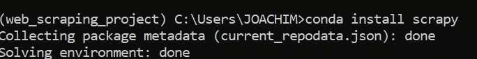
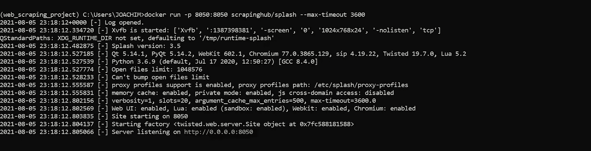

# 如何用 python 抓取所有类型的网站—第 1 部分

> 原文：<https://medium.com/analytics-vidhya/how-to-scrape-all-types-of-websites-with-python-part-1-552aafd93884?source=collection_archive---------0----------------------->

关于我如何用 scrappy 和 splash 刮了 19000 个中等帖子的综合指南。


内森·杜姆劳在 [Unsplash](https://unsplash.com?utm_source=medium&utm_medium=referral) 上的照片

你可能已经听说过一句流行语“**数据是新的石油**”或者新的流行语“**数据经济**”。无论哪种方式，这些短语都是由行业专家创造的，用来描述数据在我们的经济中的重要性和价值。

同样，所有的石油，数据是新的石油，概念化的事实是，数据本身是没有价值的，直到它以一种结构良好的形式被准确和完整地收集，然后它成为一个强大的决策机制来推动业务增长。

现在的问题是，我们在哪里找到这些数据？简单来说，在**互联网上！！**。
我知道这个答案并不意外，但为什么**互联网？**

请允许我吊起你的胃口

1.全球每天发送 187 亿条短信。

2.每 24 小时，推特上发布 5 亿条推文。

3.4pb 是脸书日报生成的新数据量的估计值。

4.到 2025 年，全球数据领域将有 175 的数据。
*我知道这理解起来很疯狂，但就是忽略这个数字:)*

5.事实上，在 2020 年初，数字宇宙中的字节数比可观测宇宙中的恒星数大 40 倍。

我想这已经足够了，因为名单还在继续。

好了，我们现在知道了数据的价值以及在哪里可以找到数据，但是猜猜下一个最紧迫的问题是什么...

**怎么才能得到呢？**

这就是 web 抓取应用程序的用武之地。

**网页抓取**基本上就是从一个网站中提取信息和数据，将网页上的信息转化为结构化数据以供进一步分析的过程。

这是任何现代数据科学家、商业智能分析师和所有机器学习从业者的必备技能。这正是本文所要讨论的。

**项目目标:**设置网页抓取项目的环境。

下一部分是实际工作开始的地方

**目标**

1.  下载并安装 Anaconda Navigator 和 Docker。
2.  知道如何安装 scrappy 和 splash。

# **下载安装 Anaconda 和 scrappy**

Anaconda 是一个发行版，它有许多内置的包和库来帮助数据项目。从这里 下载您的特定安装程序 [**，然后按照安装向导完成它。**](https://www.anaconda.com/products/individual)


[蟒蛇安装程序](https://www.anaconda.com/products/individual)

**安装完成后，按照以下步骤启动并创建新的虚拟环境。**

1.  找到搜索空间，在任何操作系统上输入' **anaconda navigator** '，我用的是 windows。启动 anaconda navigator，如下所示。


2.点击**环境**，然后点击**创建**


3.为您的环境键入一个名称，然后单击**创建**。在我的例子中是“web_scraping_project”。这就是使用 anaconda 创建新的虚拟环境的全部内容。


4.让我们继续安装 Scrapy。

Scrapy 是一个开源的协作框架，用于从网站中提取你需要的数据。 [**你可以在这里阅读更多。**](https://scrapy.org/)

导航到我们创建的虚拟环境，单击播放按钮，然后单击弹出菜单上的'**打开终端**'打开项目终端。


5.在终端' **conda install scrapy** '中输入以下命令安装 scrapy。



我们已经完成了在 anaconda 中安装和创建虚拟环境以及安装 Scrapy 的工作。

# 下载并安装 docker 和 splash

[**Docker**](https://docs.docker.com/get-started/overview/) 是一个用于开发、发布和运行应用程序的开放平台。Docker 提供了在松散隔离的环境(称为容器)中打包和运行应用程序的能力。

**以下是安装过程。**

1.  从这里 下载您的操作系统支持的安装程序 [**，并遵循默认安装过程。
    安装过程有时会有些棘手，如果在过程中遇到任何困难，请随时参考**](https://docs.docker.com/get-docker/) **[**本指南**](https://docs.docker.com/docker-for-windows/install/)**


2.现在让我们安装 splash。

如果您是 windows 用户，只需打开您的命令提示符并键入命令`pip install splash`，然后使用此命令`docker pull scrapinghub/splash`提取 splash 存储库

对于其他操作系统用户，作为参考， [**访问官方文档网站获取更多安装指南。**](https://splash.readthedocs.io/en/stable/install.html)

3.要运行 splash 容器，请打开 windows 命令行并键入:

```
docker run -p 8050:8050 scrapinghub/splash --max-timeout 3600
```

*您应该会得到类似下面*的输出



4.docker 服务器将在默认端口`8050`上运行，你可以键入`[http://localhost:8050/](http://localhost:8050/)` 在浏览器中打开 splash。浏览器应该如下所示打开


# 结论

这是一个漫长的旅程，但我们已经成功地设置了我们的环境，并为下一个旅程做好了准备；网络报废。

[**点击此链接，进入本教程的第 2 部分**](https://kuleafenu.medium.com/how-to-scrape-all-types-of-websites-with-python-part-2-7014c614f8d) ，开始实际工作。