# 如何用 python 抓取所有类型的网站—第 2 部分

> 原文：<https://medium.com/analytics-vidhya/how-to-scrape-all-types-of-websites-with-python-part-2-7014c614f8d?source=collection_archive---------1----------------------->

关于我如何用 scrappy 和 splash 刮了 19000 个中等帖子的综合指南。


照片由[内森·杜姆劳](https://unsplash.com/@nate_dumlao?utm_source=medium&utm_medium=referral)在 [Unsplash](https://unsplash.com?utm_source=medium&utm_medium=referral) 上拍摄

[**在上一篇文章(本教程的第 1 部分)**](https://kuleafenu.medium.com/how-to-scrape-all-types-of-websites-with-python-part-1-552aafd93884) 中，我们学习了如何为这个项目设置环境。我们下载并安装了 Anaconda navigator、Scrapy、Docker 和 Splash。

如果你已经安装了这些设置，瞧！否则，请花几分钟时间浏览一下 [**之前关于环境设置的帖子**](https://kuleafenu.medium.com/how-to-scrape-all-types-of-websites-with-python-part-1-552aafd93884) 。

现在让我们开始吧！！

**项目目标:**从《走向数据科学》刮出数千篇中型文章

**要学的东西**

1.  学习如何用 VS 代码编程
2.  编写 Splash 脚本
3.  用 Scrapy 提取图案
4.  以 CSV、JSON 和 XML 格式存储数据

# **创建新项目**

a.启动 anaconda navigator 并点击`environment`

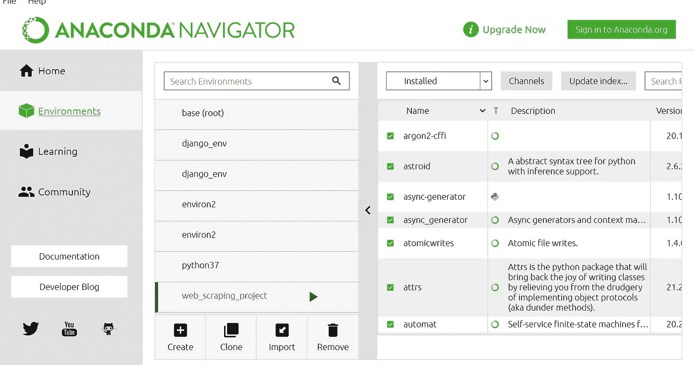

b.点击我们在上一个教程中创建的右边环境的 play 按钮，在我的例子中是`web_scraping_project`并运行终端

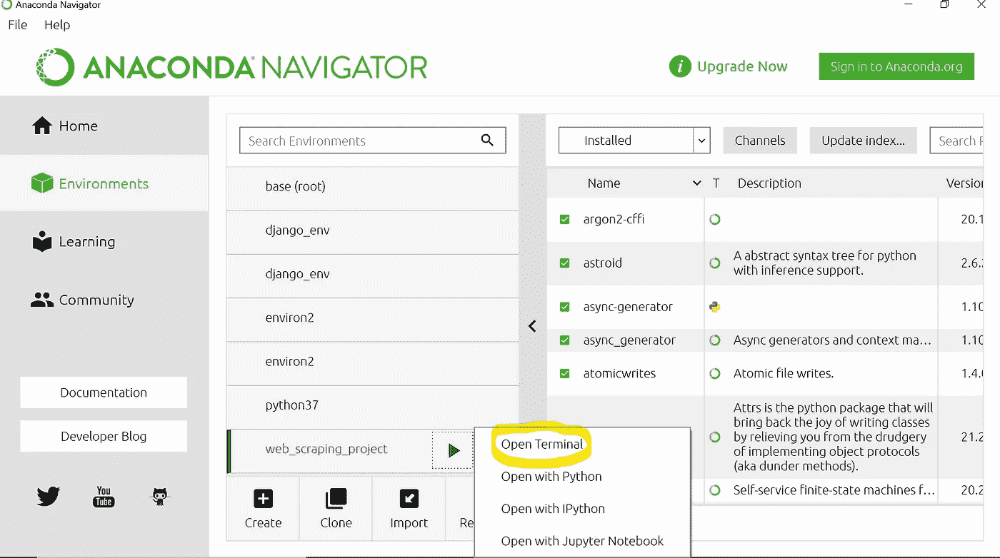

c.用`mkdir`创建一个新目录，然后将该目录更改为用`cd`【目录名】创建的新目录。

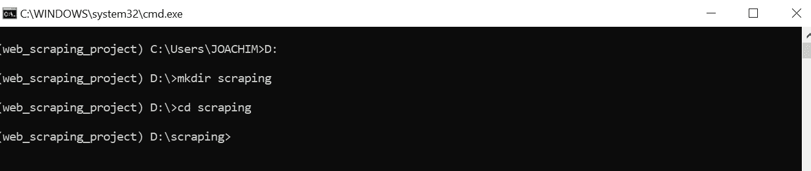

d.用 Scrapy 命令 `scrapy`创建一个新项目`startproject [project_name].`

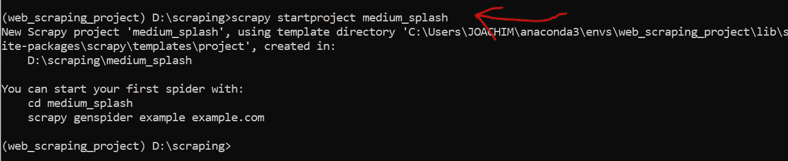

e.在你的桌面上打开文件夹`medium_splash` ，你会看到以下文件和子文件夹。

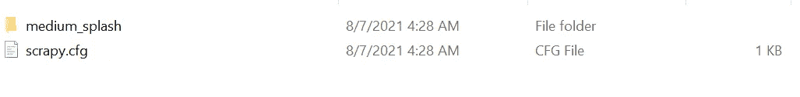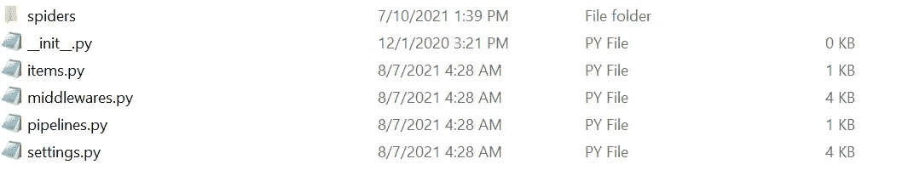

**让我们了解一些关于各种文件的事情**

这有助于我们部署蜘蛛。

这个文件夹是我们编写蜘蛛脚本的地方。

`items.py`用于存储我们将要创建的一些字段中的抓取数据。

`middlewares.py`这是负责请求和响应的对象。别担心，我们会一路了解这两个物体。

`pipelines.py`我们用它来存储我们在数据库中抓取的项目。

我们可以在这里配置我们的项目设置。

f.将目录切换到项目文件夹，用
`scrapy genspider [spider_name] [page_link]`
`spider_name`生成我们的蜘蛛，蜘蛛名称是我的案例`md`。
`page_link`是对页面的链接进行抓取。

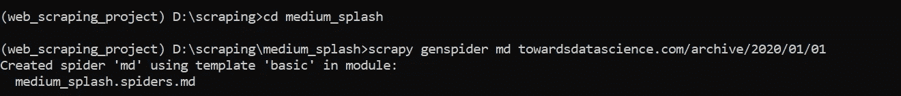

g.安装 scrapy-splash 软件包。这使我们能够从 Scrapy 脚本发送 splash 请求。

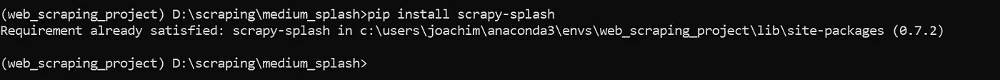

h.启动 anaconda navigator 并运行 VS 代码。如果你启动 anaconda navigator，而不是你看到 install 的 *launch* 按钮，点击它来 *install* 它，然后你启动它。

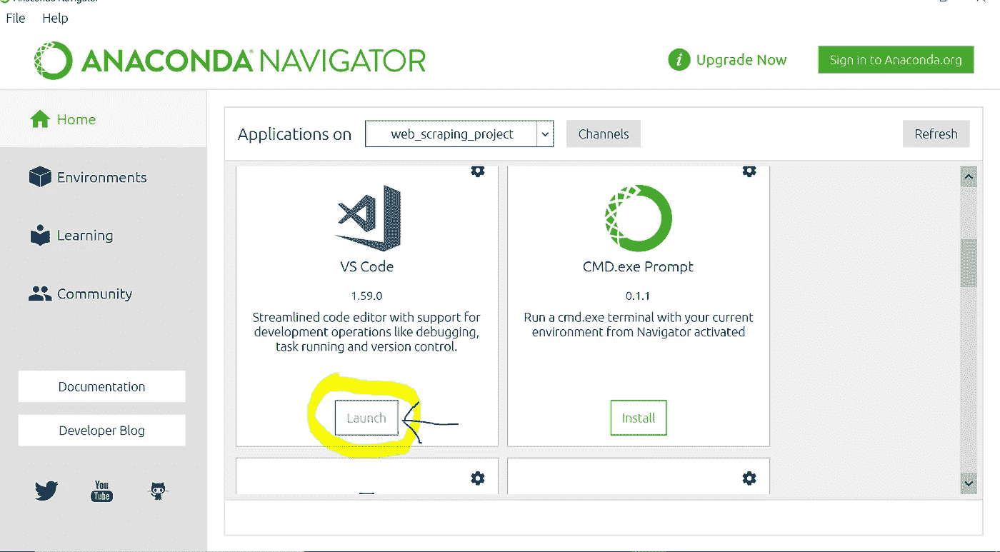

一、点击*打开文件夹*，导航到您的项目目录，选择我们创建的文件夹，如果您继续操作，那么您必须选择名为`*medium_splash*` *的文件夹。*

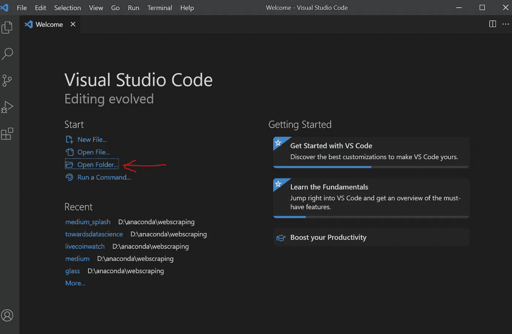

j.该项目应该打开如下，我们目前在*蜘蛛> md.py* 文件。这是我们写所有代码的地方。

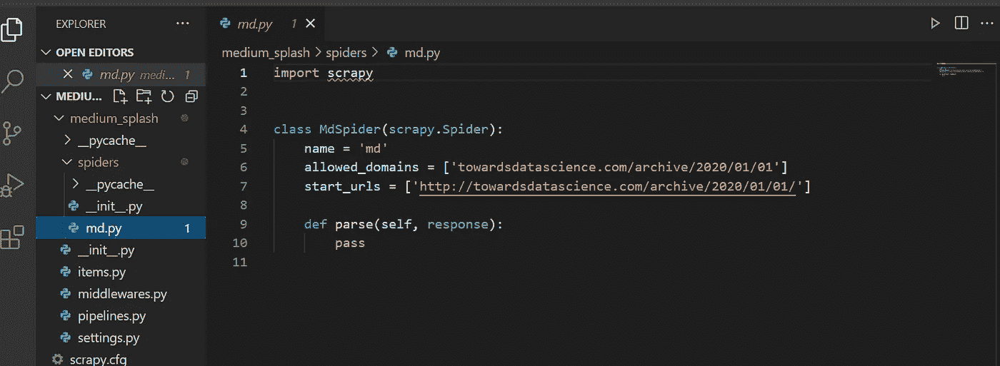

现在我们已经成功地创建了一个新项目，并在 VS 代码中启动了它。

在本节中，我们将学习:

*   如何配置我们的项目设置？
*   编写我们的报废脚本
*   运行它来提取我们的数据集。

a.打开 *settings.py* 文件

这是一个被许多网站用来拒绝访问 Scrapy 的文件。

改变:

收件人:

b.如果检测到 Scrapy 的默认用户代理，一些网站会迅速阻止你访问他们的网站。所以改成你的浏览器用户代理。

你只要在谷歌搜索`*my user agent*`就可以知道你的用户代理。
*记得换成自己的用户代理*

改变:

收件人:

c.这些改动可以在 [**官方 Scrapy-splash GitHub 资源库**](https://github.com/scrapy-plugins/scrapy-splash) **中找到。我鼓励你去看看。**

改变:

收件人:

改变:

收件人:

d.在 *setting.py* 文件的基础上添加以下脚本，最后保存。

```
SPLASH_URL = 'http://localhost:8050'
```

这是 URL，端口 splash 将在浏览器中打开。

# 编写我们的代码

a.在蜘蛛文件夹内打开蜘蛛文件，在我们的 `md.py`

默认情况下，我们已经有:

我们将导入 scrapy_splash 库

```
from scrapy_splash import SplashRequest
```

当你查看“朝向数据科学”的主要档案时

```
[https://towardsdatascience.com/archive](https://towardsdatascience.com/archive)
```

你可以看到每一页都包含一个文章列表，也可以通过添加年、月、日作为`[https://towardsdatascience.com/archive](https://towardsdatascience.com/archive)/2020/01/01`来访问

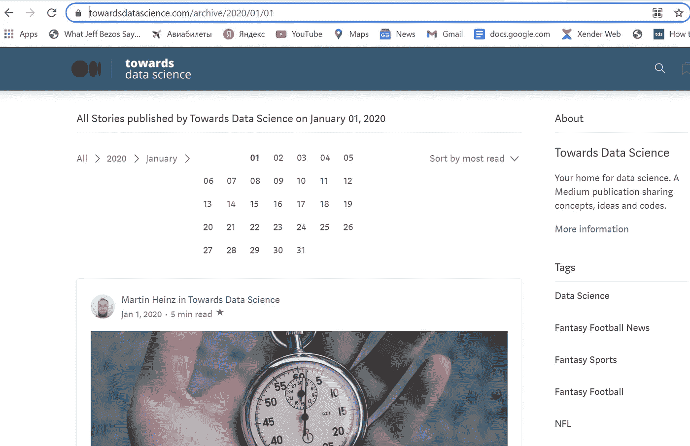

b.因此，让我们生成所有的主页链接，如下所示

c.当你运行一个蜘蛛时，Scrapy 会搜索两个函数，`start_requests`和`parse`函数。

让我们来创造它们

*第 1–26 行是 splash 代码。对此的解释已经作为评论注入其中。*

`[XPath](https://www.w3.org/TR/xpath/all/)`是一种在 XML 文档中选择节点的语言，也可以和 HTML 一起使用。

模式 `.//div[@class=’postArticle-readMore’]/a/@href`基本上是页面上列出的每篇文章的链接路径。这个路径可以通过使用开发者工具 *( ctrl +shift +i)* 命令得知。

我强烈推荐你在这里做一个关于如何使用 XPath 和 CSS 选择器的快速参考。

d.我们将创建一个函数，从 splash 脚本返回的 HTML 响应中提取我们的项目。

把所有东西放在一起；脚本应该是这样的。

# 运行我们的蜘蛛

a.启动 docker 桌面

b.打开命令提示符发出以下命令来运行 docker 服务器:

```
docker run -p 8050:8050 scrapinghub/splash --max-timeout 3600
```

c.在 VS 代码内的选项卡上，点击*视图*，然后点击*终端、*打开 VS 代码内的终端。

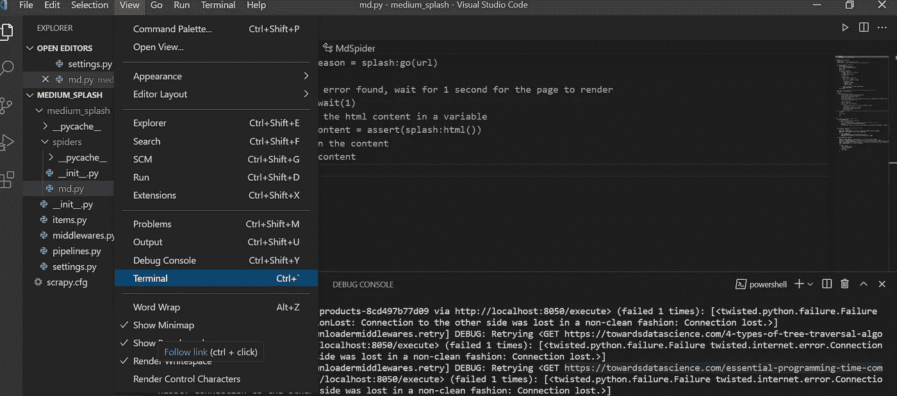

d.在终端内运行脚本`scrapy crawl md`

e.要在文件中存储报废的项目，只需

`scrapy crawl md -o [filename].[json or csv or XML]`

让我们以 JSON 格式存储数据

`scrapy crawl md -o mydata.json`

现在我们的蜘蛛应该运行良好。

# 结论

1.  在本教程中，我们学习了如何用 Scrapy 和 Splash 编写和运行简单的 spider
2.  将数据存储在 CSV、JSON 或 XML 中

3.抓取的项目有标题、副标题、文章内容、点击次数和标签。

你可以在 [**我的 Github 库**](https://github.com/kuleafenu/web_scraping) **上获取完整代码。**