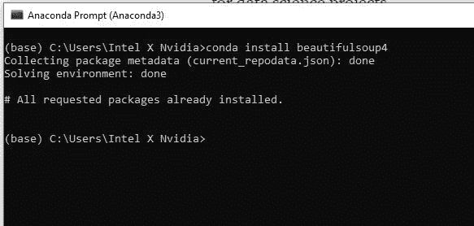
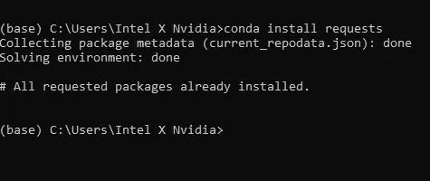
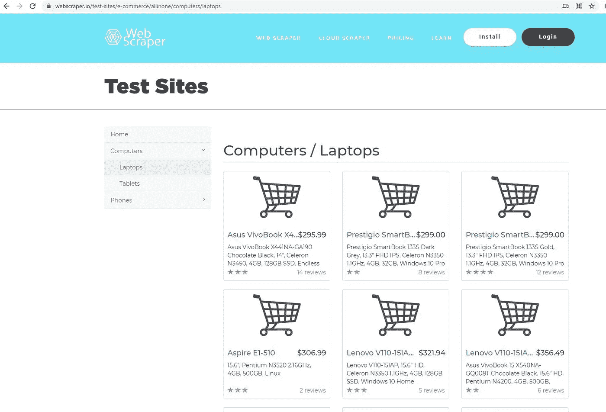
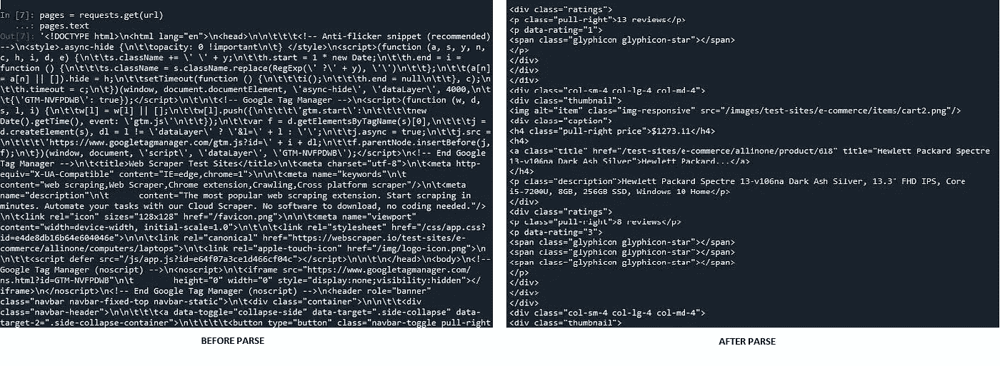
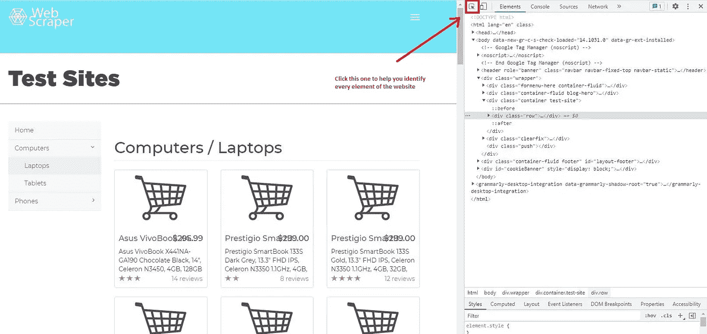
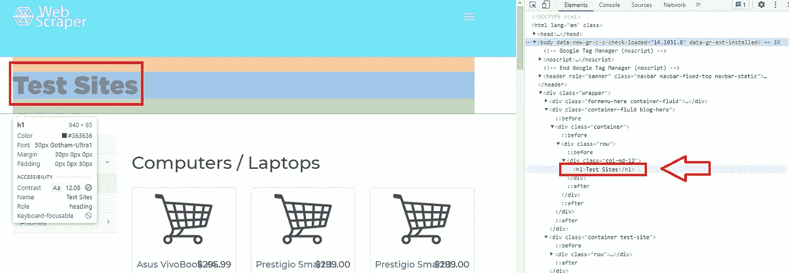
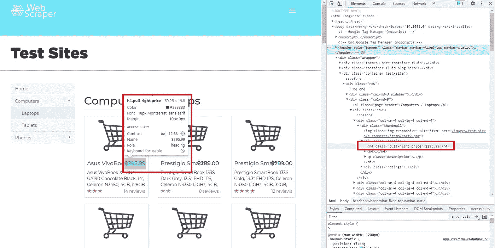
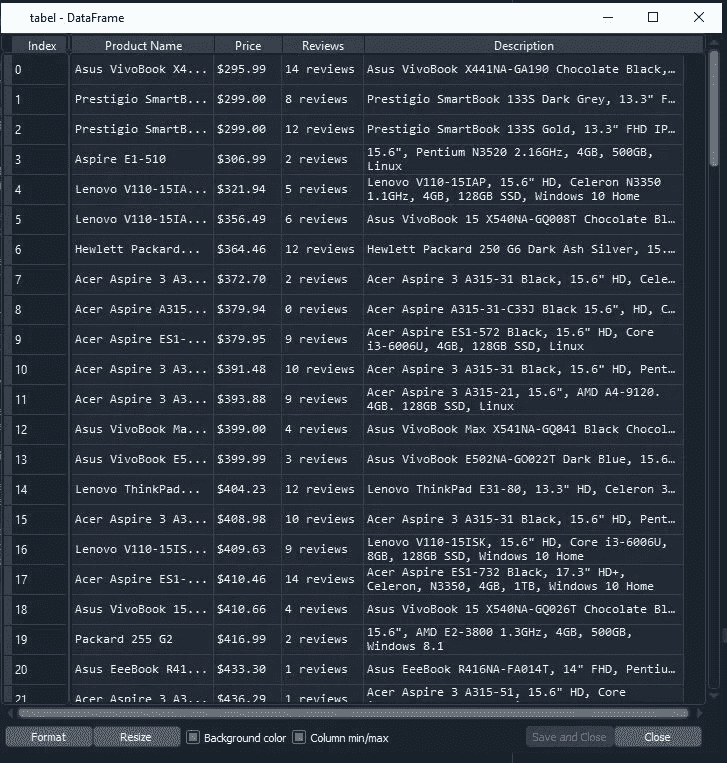

# 初学者如何使用 Python 从网站上抓取数据

> 原文：<https://medium.com/analytics-vidhya/how-to-scrape-data-from-a-website-using-python-for-beginner-5c770a1fbe2d?source=collection_archive---------0----------------------->

在数据科学领域，我们总是依赖于数据。有许多方法可以收集数据。众多来源之一是来自网站的数据。网站也可以是数据的第二来源，有许多这样的网站的例子，例如:数据聚合网站(例如。w[orldometer](https://www.worldometers.info/))、新闻网站(例如美国消费者新闻与商业频道)、社交媒体(例如 Twitter)、电子商务(例如。Shopee)，等等。这些网站非常有用，为他们提供了数据科学项目所需的数据。


图 1 网络报废([来源:数据科学中心，2020](https://www.datasciencecentral.com/profiles/blogs/what-is-web-scraping-and-how-does-it-work)

但是如何收集数据呢？我们不能用手一个接一个地复制和粘贴，对吗？所以解决方案是使用 Python。在 Python 中，有一个强大的库叫做 BeautifulSoup 和 Selenium。数据科学家经常使用它们来收集多种格式的数据。在本节中，我们将首先介绍 BeautifulSoup。

**第一步。安装库**

首先，我们需要安装所需的库，例如:

1.  BeautifulSoup4
2.  要求
3.  熊猫
4.  lxml

要安装一个库，您可以简单地使用 **pip install [library name]** 或**conda install[library name]**进行安装，如果您使用的是 Anaconda 提示符。首先，我们要安装 BeautifulSoup4。



图 2 安装 bs4

在我们安装了 **BeatifulSoup4 (bs4)** 之后，我们可以做的下一件事就是安装' **requests'** 。**Requests’**是一个库，如果我们想从他们的网站获取数据，它的任务是请求主机服务器的许可。然后，我们还需要安装 **pandas** 来创建 dataframe 和 **lxml** 来将 HTML 格式转换成 Python 友好的格式。



图 3 安装“请求”

**步骤二。导入库**

因此，在重要的库安装完成后，我们接下来要做的就是打开您最喜欢的环境。在本教程中，我们建议您使用 Spyder 4.2.5，因为对于某些步骤，我们会遇到较长的输出，所以 Spyder 比 Jupyter Notebook 使用起来更舒适。

好了，一旦我们打开 Spyder，接下来我们可以做的就是导入所需的库:

```
# Import library
**from** bs4 **import** BeautifulSoup
**import** requests
```

**第三步。选择页面**

在这个项目中，我们将使用 [webscraper.io](https://webscraper.io/) 。因为这个网站是用 HTML 制作的，所以更容易阅读代码，适合初学者。现在，在本节中，我们将抓取这一页:



图 Fig.4 Webscrapper.io

这个页面是一个电子商务网站的原型。在这个项目中，我们将收集计算机和笔记本电脑的数据，如产品名称、价格、描述和评论。

**第四步。请求许可**

在我们选择了我们想要抓取的页面后，现在我们可以复制页面的 URL 并使用**请求**请求主机服务器允许我们从他们的站点获取数据。

```
# Define URL
url = ‘[https://webscraper.io/test-sites/e-commerce/allinone/computers/laptops'](https://webscraper.io/test-sites/e-commerce/allinone/computers/laptops')# Ask hosting server to fetch url
requests.get(url)
```

如果输出是<response>，这意味着服务器允许我们从他们的网站收集数据。为了验证我们可以在文本中定义 request.get 函数。</response>

```
pages = requests.get(url)
pages.text
```

如果运行这段代码，输出将是混乱的脚本代码，它对 Python 不友好。我们需要使用一个解析器，这样我们可以使它更具可读性。

```
# parser-lxml = Change html to Python friendly format
soup = BeautifulSoup(pages.text, ‘lxml’)
soup
```



图 5 使用 Parse 之前和之后

**第五步。检查元件**

对于每个网络报废项目，我们建议你使用谷歌浏览器，因为它非常方便易用。现在我们将学习如何使用 Chrome 检查网站的脚本代码。首先，您需要右键单击您想要检查的页面，然后单击**检查**，之后您将看到:



图 6 检查元件

然后可以点击**选择页面中的一个元素进行检查。**单击后，您会注意到，如果您将光标移动到页面的每个元素，元素菜单将为您提供所选元素的脚本信息。



图 7 示例

例如，如果我们将光标移动到**测试点**，该元素将通知您**测试点**位于标签 **h1 中。在 Python 中，如果你想检查一个网站的元素，你可以调用标签。标签的特点是总是以 **<** 为前缀，并且经常是紫色的。**

**第六步。访问标签**

例如，我们想使用 Python 访问 **h1** 的元素，我们可以简单地输入:

```
# Access h1 tag
soup.h1
```

输出将是:

```
soup.h1
Out[11]: <h1>Test Sites</h1>
```

不仅单行标签你还可以访问类标签，例如:

```
# Access header tag
soup.header# Access div tag
soup.div
```

记得之前定义好 **soup** ，因为把 HTML 改成 Python 友好的格式很重要。

您可以从嵌套标签中访问特定标签。**嵌套标签是指标签内的标签**。例如标签 **< p >** 位于标签 **<头>** 内。但是当你从 **<头>** 中访问一个特定的标签时，Python 总是从第一个索引开始显示结果。稍后我们将学习如何从嵌套标签中访问多个标签。

```
# Access string from nested tags
soup.header.p
```

输出:

```
soup.header.p
Out[10]: <p>Web Scraper</p>
```

您也可以从嵌套标签中的特定标签访问字符串。您可以简单地在代码中添加一个**字符串**。

```
# Access string from nested tags
soup.header.p
soup.header.p.string
```

输出:

```
soup.header.p
soup.header.p.string
Out[12]: ‘Web Scraper’
```

好了，现在我们了解了如何从嵌套标签中访问标签。所以接下来我们要学习的是如何访问标签中的属性。为此我们可以使用 **attrs，**这是**beautiful soup 的特性。**属性**的输出是一个字典。**

```
# Access ‘a’ tag in <header>
a_start = soup.header.a
a_start# Access only the attributes using attrs
a_start.attrs
```

**输出:**

```
Out[16]: 
{‘data-toggle’: ‘collapse-side’,
 ‘data-target’: ‘.side-collapse’,
 ‘data-target-2’: ‘.side-collapse-container’}
```

**我们可以访问一个特定的属性，记住 Python 把属性当作一个字典，所以我们把**数据切换**、**数据目标**和**数据目标-2** 当作一个**键**。例如，现在我们将访问**的数据目标**:**

```
a_start[‘data-target’]
```

**输出:**

```
a_start[‘data-target’]
Out[17]: ‘.side-collapse’
```

**我们还可以添加一个新的属性，记住这些变化只会影响网站的局部，而不会影响网站本身的全局。**

```
a_start[‘new-attribute’] = ‘This is the new attribute’
a_start.attrs
a_start
```

**输出:**

```
a_start[‘new-attribute’] = ‘This is the new attribute’
a_start.attrs
a_start
Out[18]: 
<a data-target=”.side-collapse” data-target-2=”.side-collapse-container” data-toggle=”collapse-side” new-attribute=”This is the new attribute”>
<button aria-controls=”navbar” aria-expanded=”false” class=”navbar-toggle pull-right collapsed” data-target=”#navbar” data-target-2=”.side-collapse-container” data-target-3=”.side-collapse” data-toggle=”collapse” type=”button”>
...
</a>
```

****第七步。访问标签的特定属性****

**我们已经知道在一个标签中可以有许多子标签，例如，如果我们运行 **soup.header.div** 在< div >下有许多子标签，记住我们只调用< header >下的< div >，所以< header >下的其他标签将不包括在内。**

**输出:**

```
soup.header.div
Out[26]: 
<div class=”container”>
<div class=”navbar-header”>
<a data-target=”.side-collapse” data-target-2=”.side-collapse-container” data-toggle=”collapse-side” new-attribute=”This is the new attribute”>
<button aria-controls=”navbar” aria-expanded=”false” class=”navbar-toggle pull-right collapsed” data-target=”#navbar” data-target-2=”.side-collapse-container” data-target-3=”.side-collapse” data-toggle=”collapse” type=”button”>
...
</div>
```

**因此，正如我们看到的，一个标签下有许多属性，问题是如何只访问我们想要的属性。在 BeautifulSoup 中有一个函数叫做**‘查找’**和**‘查找 _ 全部’**。为了更清楚，我们将向您展示如何使用这两种功能以及它们之间的区别。作为一个例子，我们将找到每个产品的价格。要识别什么是价格代码，你只需将光标移到价格指示器上。**

**移动光标后，我们可以发现价格位于标签 **h4** 和类别**右拉价格****

****

**图 8 价格指数**

**现在我们想使用 find 搜索 h4 的字符串:**

```
# Searching specific attributes of tags
soup.find(‘h4’, class_= ‘pull-right price’)
```

**输出:**

```
Out[28]: <h4 class=”pull-right price”>**$295.99**</h4>
```

**我们可以看到 **$295.99** 是 **h4** 的属性(字符串)。但是如果我们使用 find_all。**

```
# Using find_all
soup.find_all(‘h4’, class_= ‘pull-right price’)
```

**输出:**

```
Out[29]: 
[<h4 class=”pull-right price”>$295.99</h4>,
 <h4 class=”pull-right price”>$299.00</h4>,
 <h4 class=”pull-right price”>$299.00</h4>,
 <h4 class=”pull-right price”>$306.99</h4>,
 <h4 class=”pull-right price”>$321.94</h4>,
 <h4 class=”pull-right price”>$356.49</h4>,
 ....
</h4>]
```

**你注意到 **find** 和 **find_all** 的区别了吗？**

**是的，你是正确的， **find** 是用于如果你想搜索特定的属性，因为它只产生一个结果。但是，如果您想收集大量数据(例如价格、产品名称、描述等)。)使用 **find_all** 才是正道。**

**我们还可以对 find_all 的结果进行切片，例如，在这种情况下，我们只想看到索引 3 到 5。**

```
# Slicing the results of find_all
soup.find_all(‘h4’, class_= ‘pull-right price’)[2:5]
```

**输出:**

```
Out[32]: 
[<h4 class=”pull-right price”>$299.00</h4>,
 <h4 class=”pull-right price”>$306.99</h4>,
 <h4 class=”pull-right price”>$321.94</h4>]
```

**[!]记住在 Python 中索引从 0 开始，最后一个索引不包括在内**

****第八步。使用过滤器****

**我们还可以找到多个标签:**

```
# Using filter to find multiple tags
soup.find_all(['h4', 'a', 'p'])
soup.find_all(['header', 'div'])
soup.find_all(id = True) # class and id are special attribute so it can be written like this
soup.find_all(class_= True)
```

**因为 class 和 id 是特殊属性，所以您可以写 class_ and id 而不是' class '或' id '**

**通过使用过滤器，我们可以从网站上收集我们想要的数据，在本例中，我们想要收集名称、价格、评论和描述。所以我们需要先定义变量。**

```
# Filter by name
name = soup.find_all(‘a’, class_=’title’)# Filter by price
price = soup.find_all(‘h4’, class_ = ‘pull-right price’)# Filter by reviews
reviews = soup.find_all(‘p’, class_ = ‘pull-right’)# Filter by description
description = soup.find_all(‘p’, class_ =’description’)
```

**按名称输出:**

```
[<a class=”title” href=”/test-sites/e-commerce/allinone/product/545" title=”Asus VivoBook X441NA-GA190">Asus VivoBook X4…</a>,
 <a class=”title” href=”/test-sites/e-commerce/allinone/product/546" title=”Prestigio SmartBook 133S Dark Grey”>Prestigio SmartB…</a>,
 <a class=”title” href=”/test-sites/e-commerce/allinone/product/547" title=”Prestigio SmartBook 133S Gold”>Prestigio SmartB…</a>,
 ...
</a>]
```

**按价格输出:**

```
[<h4 class=”pull-right price”>$295.99</h4>,
 <h4 class=”pull-right price”>$299.00</h4>,
 <h4 class=”pull-right price”>$299.00</h4>,
 <h4 class=”pull-right price”>$306.99</h4>,
 ...
 </h4>]
```

**评审输出:**

```
[<p class=”pull-right”>14 reviews</p>,
 <p class=”pull-right”>8 reviews</p>,
 <p class=”pull-right”>12 reviews</p>,
 <p class=”pull-right”>2 reviews</p>,
 ...
 </p>]
```

**按描述输出:**

```
[<p class=”description”>Asus VivoBook X441NA-GA190 Chocolate Black, 14", Celeron N3450, 4GB, 128GB SSD, Endless OS, ENG kbd</p>,
 <p class=”description”>Prestigio SmartBook 133S Dark Grey, 13.3" FHD IPS, Celeron N3350 1.1GHz, 4GB, 32GB, Windows 10 Pro + Office 365 1 gadam</p>,
 <p class=”description”>Prestigio SmartBook 133S Gold, 13.3" FHD IPS, Celeron N3350 1.1GHz, 4GB, 32GB, Windows 10 Pro + Office 365 1 gadam</p>,
 ...
</p>]
```

****第九步。过滤器的清洗输出结果****

**正如我们所看到的，输出的结果仍然是 HTML 格式，所以我们需要清理它，只得到字符串。为此，我们可以简单地使用**文本**功能。**

****文本**可以用来过滤 HTML 代码中的字符串，但是我们需要定义一个新的变量，例如:**

```
# Try to call price
price1 = soup.find(‘h4’, class_ = ‘pull-right price’)
price1.text
```

**结果:**

```
Out[55]: ‘$295.99’
```

**正如我们所看到的，输出结果只是代码中的字符串，但这还不够。下一步，我们将学习如何将所有字符串刮入列表中。**

****第十步。创建一个 FOR 循环，将字符串放入列表****

**这是有趣的部分，要将所有字符串放入列表中，我们需要为循环创建一个。**

```
# Create for loop to make string from find_all list
product_name_list = []
for i in name:
 name = i.text
 product_name_list.append(name)price_list = []
for i in price:
 price = i.text
 price_list.append(price)

review_list = []
for i in reviews:
 rev = i.text
 review_list.append(rev)

description_list = []
for i in description:
 desc = i.text
 description_list.append(desc)
```

****第十一步。从列表**创建一个数据帧**

**好了，我们创建了一个 for 循环，所有的字符串都添加到了列表中，所以最后一步是从列表中创建一个 dataframe。为了创建一个数据框架，我们需要导入熊猫。**

```
# Create dataframe
# Import library
import pandas as pdtabel = pd.DataFrame({‘Product Name’:product_name_list,
 ‘Price’: price_list,
 ‘Reviews’:review_list,
 ‘Description’:description_list})
```

**在数据框架被创建之后，我们可以使用这些数据来做一个数据科学项目，我们可以把它放入机器学习，从中获得有价值的见解，或者任何东西。**

****

**图 9 数据框**

**这是我给出的教程，希望对你们有用，尤其是对正在学习网络抓取的人。下一个项目再见。**