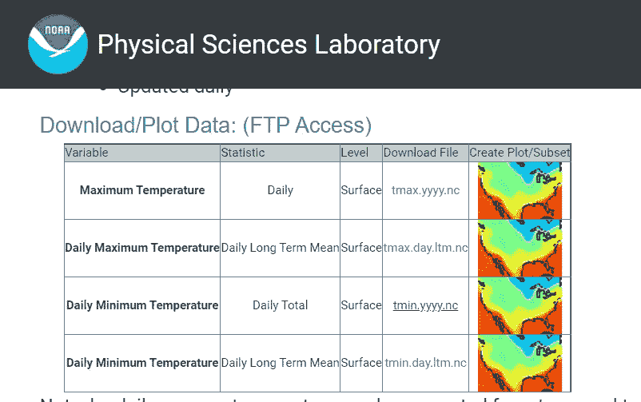

# 如何废弃 4 个不同来源的气候数据？

> 原文：<https://medium.com/analytics-vidhya/how-to-scrapping-data-of-climate-from-4-different-source-b9efc984ef2e?source=collection_archive---------5----------------------->


马丁·桑切斯在 [Unsplash](https://unsplash.com/s/photos/map?utm_source=unsplash&utm_medium=referral&utm_content=creditCopyText) 上的照片

# 介绍

气候是平均天气，其中天气是在某一时间点的大气状态。气候被定义为在一段时间内(从几个月到几年或几百万年)某些变量(如温度、降水或风)的相关量的平均值和可变性的量度。气候变化是由于其组成部分与火山爆发、阳光变化等外部因素以及土地使用和化石燃料使用变化等人类活动引起的因素之间的相互作用而持续发生的。

在本文中，我们将讨论一些可靠的气候数据来源。我们如何收集数据？

# **报废 DAT**

在这次废弃中，我们将使用 R 编程语言、climate 包和 CHIRPS 包。climate R 包是一个从公共存储库中自动下载气象和水文数据的包。在开始报废之前，我们会先下载所需的软件包，使用控制台进行操作。

```
install.packages("climate")
install.packages("chirps")
```

或者


作者截图


作者截图

安装软件包后，导入软件包:

```
library(
```

有 4 个可用的气候数据来源:

## 1.包装气候

这个包分为几个数据字段，即气象、水文单站信息。

## a.气象的

从 ogimet.com 网站上的天气观测站下载气象数据，数据可以是每小时/每天
天气观测站是世界气象组织下属的所有气象站。报废的结果会得到 18 列。

```
data_meteo = meteo_ogimet(date = c(Sys.Date() - 5, Sys.Date() - 1), 
                 interval = "daily",
                 coords = FALSE, 
                 station = 12330)
head(data_meteo)
```


作者截图

下一个猜测将从 danepubliczne.imgw.pl 上的可用站获取来自 SYNP/CLIMATE/PRECIP 的 Meteorca \ data。来自此源的数据包含许多列。

```
m = meteo_imgw(interval = "daily", rank = "synop", year = 2000,  coords = TRUE)
head(m)
```


作者截图

接下来，我们将废弃莫纳罗亚天文台每月的二氧化碳数据。

```
c = meteo_noaa_co2( )
head(c)
```


作者截图

## b.水文学的

从 danepubliczne.imgw.pl 中删除水文每小时、每天和每月的天气/气候/价格站数据。

```
h = hydro_imgw(interval = "semiannual_and_annual", year = 2010:2011)
head(h)
```


作者截图

## c.车站信息

我们可以废弃不同来源的数据站。首先，我们将从 ogimet 集合中收集数据。如果在 R studio 中运行，输出可以自动显示来自数据的地图。

```
nso <- nearest_stations_ogimet(country = "United+Kingdom",
                        date = Sys.Date(),
                        add_map = TRUE,
                        point = c(-1, 53),
                        no_of_stations = 100)
head(nso)
```


作者截图


作者图片

除此之外，我们还可以从 NOAA ISH 气象知识库中收集站点数据。

```
nsn <-  nearest_stations_nooa(country = "UNITED KINGDOM",
                              date = Sys.Date(),
                              add_map = TRUE,
                              point = c(-1, 53),
                              no_of_stations = 100)
head(nsn)
```


作者截图

并且仍然有来自几个不同来源的大量台站数据，例如波兰的 IMGW-PIB 台站。

## 2.包装啁啾声

气候灾害分组红外降水与台站数据(CHIRPS)是一个陆地降雨数据库，它是三种降雨信息的组合，即全球气候学、基于卫星的降雨量估计和现场观测的降雨量。CHIRPS 数据可以作为长系列极端降雨研究的解决方案。

```
library(chirps)
lonlat <- data.frame(lon = c(-55.0281,-54.9857),
                     lat = c(-2.8094, -2.8756))
dates <- c("2017-12-15", "2017-12-31")
dt <- get_chirps(lonlat, dates)
head(dt)
```


作者截图

## 3.网络物理科学实验室


作者截图

web 是数据存储方面最好的 web 之一。该网站提供了几类数据，如地表、温度、陆地、海洋等。在这个网站上，数据可以手动废弃，也可以使用代码自动废弃。使用代码下载示例。首先点击表中的某个数据集，例如，我们可以点击" CMAP 降水量"。

[https://psl.noaa.gov/data/gridded/](https://psl.noaa.gov/data/gridded/)


作者截图

并找到下载功能和复制链接地址。这是格式代码:

```
download.file(url = <link.download>, destfile=<namefile>,mode= "mb")
```

示例:

```
download.file(url = '[https://downloads.psl.noaa.gov/Datasets/cmap/std/precip.mon.mean.nc'](https://downloads.psl.noaa.gov/Datasets/cmap/std/precip.mon.mean.nc'), destfile = 'precipmeanmonthly.nc',mode = "wb")
```

结果已保存在您的本地存储中。使用代码下载看起来比较复杂，那么使用代码下载有什么好处呢？当我们有大量数据需要废弃时，使用代码下载的好处。让我们看看下面的例子。查看数据集中的最后一个列表，您可以找到数据集，即“CPC 全球温度”,然后单击。然后找到“下载文件”并选择“每日最低温度”(点击“tmin.yyyy.nc”)。


作者截图



作者截图


作者截图

这里有许多数据集，如果你手动下载，将需要很长时间，很累。所以通过编码自动制作。结果已保存在您的本地存储中。

```
#download data CPC Daily Minimum Temperature
for (i in 2018:2019) {
  string_date <- as.character(i)
  myfile <- paste0("tmin_",string_date,".nc")
  myurl <- paste0("ftp://ftp.cdc.noaa.gov/Datasets/cpc_global_temp/","tmin.",string_date,".nc") #bisa disesuaikan; tmax or tmin
  download.file(url = myurl, destfile = myfile, mode = "wb")
}
```

4.Himawari-8 号卫星

Himawari-8 是 JMA 发射的一颗卫星，于 2015 年开始运行，作为 MTSAT 卫星的继任者，该卫星有 16 个频道，每 10 分钟产生一次数据。Himawari 卫星携带 AHI(高级 Himawari 成像仪)传感器。这颗卫星的地球静止轨道高度为 35，791 公里。Himawari-8 数据的空间分辨率为 0.5 公里(波段 3)、1 公里和 2 公里。Himawari-8 数据被用于监测降雨量、云顶温度和海面温度。

```
#### Download data Himawari LAPAN
  #sumber data: [http://modis-catalog.lapan.go.id/monitoring/#](http://modis-catalog.lapan.go.id/monitoring/#)
  #hanya tersedia beberapa hari terakhir saja 

  rm(list = ls())
#ext= brick("./compile/Himawari_IND_start2020-07-01.nc")
#date.ex=seq(as.Date("2021-09-01"),length.out = nlayers(ext),by='day')from=as.Date("2021-09-05")
date=seq(from,Sys.Date(),by="day")
hr=sprintf("%02d", 0:23)download_size <- function(url) as.numeric(httr::HEAD(url)$headers$`content-length`)
for (tgl in 1:length(date)) {
  #tgl=1
  string_date=date[tgl]

  for (i in 1:length(hr)) {
    #i=1

    myfile <- paste0("C:/","himawari_",string_date,"-",as.character(hr[i]),".tif")  #save in your directory 
    myurl <- paste0("[http://modis-catalog.lapan.go.id/himawari-8/GeoTIFF/](http://modis-catalog.lapan.go.id/himawari-8/GeoTIFF/)",string_date,"/",hr[i],"-00/produkRFR2.tif")

    if (file.exists(myfile)==F) {
      tryCatch(download.file(url = myurl,destfile = myfile,mode = "wb", quiet = FALSE), 
               error = function(e) print(paste0("precip_",string_date,"-",as.character(hr[i]),".tif = did not exist")))

      if (file.exists(myfile)==T) {
        while (file.info(myfile)$size < download_size(myurl)) {
          download.file(url = myurl,destfile = myfile,mode = "wb", quiet = FALSE)
        }
        print(paste0("precip_",string_date,"-",as.character(hr[i]),".tif = OK"))
      }
    }
  }
}
```

上面的文章是气候数据的 4 个来源，希望它能增加知识并对世界上的数据有用。感谢您的阅读

## 参考资料:

[https://psl.noaa.gov/data/gridded/data.cpc.globaltemp.html](https://psl.noaa.gov/data/gridded/data.cpc.globaltemp.html)
[https://downloads.psl.noaa.gov/Datasets/cpc_global_temp/](https://downloads.psl.noaa.gov/Datasets/cpc_global_temp/)
[http://modis-catalog.lapan.go.id/monitoring/](http://modis-catalog.lapan.go.id/monitoring/)
[https://www . rdocumentation . org/packages/climate/versions/1 . 0 . 1](https://www.rdocumentation.org/packages/climate/versions/1.0.1)
[https://www . rdocumentation . org/packages/chimps/versions/0 . 1 . 2/topics/chimps](https://www.rdocumentation.org/packages/chirps/versions/0.1.2/topics/chirps)
power-point 练习 4、课程方法论计算的数据气候访问 IPB。