# 如何选择最佳特征来提高机器学习模型的准确性

> 原文：<https://medium.com/analytics-vidhya/how-to-select-best-features-to-improve-the-accuracy-of-your-machine-learning-model-1c5e49f09518?source=collection_archive---------2----------------------->

## 使用相关矩阵选择最佳特征以提高机器学习模型的准确性

图片由来自 [Pixabay](https://pixabay.com/?utm_source=link-attribution&utm_medium=referral&utm_campaign=image&utm_content=5928043) 的 [Seksak Kerdkanno](https://pixabay.com/users/kerdkanno-1334070/?utm_source=link-attribution&utm_medium=referral&utm_campaign=image&utm_content=5928043) 提供

E 你有没有在冰淇淋店选择你最喜欢的口味时感到失落**或**你有没有想象过足球俱乐部老板在选择国际球员时的困境。

今天我想分享我在类似情况下的经历-

> 如何从众多可用特征中为你的机器学习模型选择最好的特征(或味道)——只有一个目标:**提高预测精度。**

# 要使用哪个数据集？

我们将使用来自**的**预测心力衰竭**数据集，该数据集可从 [**此处**](https://www.kaggle.com/andrewmvd/heart-failure-clinical-data) 下载**

****

**照片由[马雷克·斯图津斯基](https://unsplash.com/@jccards?utm_source=unsplash&utm_medium=referral&utm_content=creditCopyText)在 [Unsplash](https://unsplash.com/s/photos/heart?utm_source=unsplash&utm_medium=referral&utm_content=creditCopyText) 上拍摄**

## **关于数据集**

> **心血管疾病(心脏病)是全球头号死亡原因，估计每年夺走 1790 万条生命，占全球所有死亡的 31%。**
> 
> **心力衰竭是由心血管疾病引起的常见事件，该数据集包含 12 个可用于预测心力衰竭死亡率的特征。**

****总结一下** —创建一个模型来评估因心力衰竭事件死亡的可能性。**

****益处—** 这可用于帮助医院评估心血管疾病患者的严重程度。**

****先看数据:**总共 299 行 13 列。这些列包含糖尿病、高血压、此人是否吸烟、血小板数量、性别等的详细信息，其中**目标列**为**【死亡事件】**，即此人**在给出 12 个特征的情况下是存活还是死亡****

****

**12 个预测变量和一个目标变量(即死亡事件)**

# **我们想达到什么目的**

**如何从数据集中的可用**【N】**特征中选择顶部的**【T】**特征(即列)以获得最大的预测精度**

# ***方法 1* :选择所有可用的“N”个特征进行预测**

********

****图片由[吉尔·威灵顿](https://pixabay.com/users/jillwellington-334088/?utm_source=link-attribution&utm_medium=referral&utm_campaign=image&utm_content=2057745)从 [Pixabay](https://pixabay.com/?utm_source=link-attribution&utm_medium=referral&utm_campaign=image&utm_content=2057745) 拍摄****

*   ******分离分类&数字列******

*   ******探索数值列******

****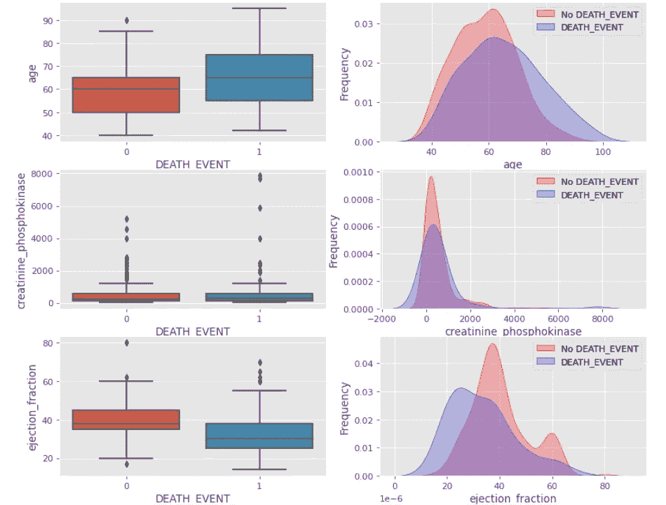****

****死亡事件与‘年龄’、‘肌酸酐磷酸激酶’和‘射血分数’****

> ****死亡人口(55-75 岁)的年龄大于活着的人口(50-66 岁)****
> 
> ****死亡与存活患者肌酸酐磷酸激酶无明显差异****
> 
> ****对于死亡的人:射血分数(25-40)低于活着的人(35-45)****

****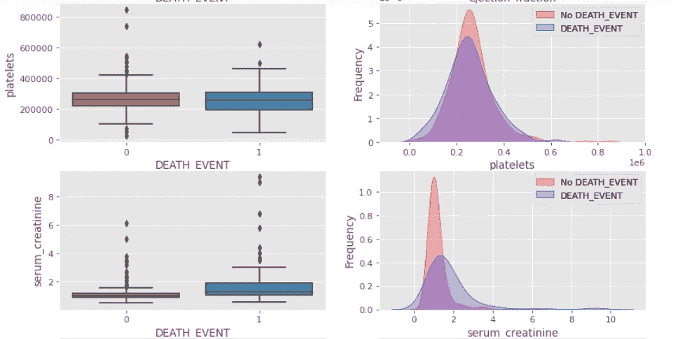****

****死亡事件与“血小板”和“血清肌酐”****

> ****死亡:血小板-(200000–310000)略高于活着的(210000–300000)****
> 
> ****死亡:血清肌酐(1.6-2)高于存活(1-1.1)****

****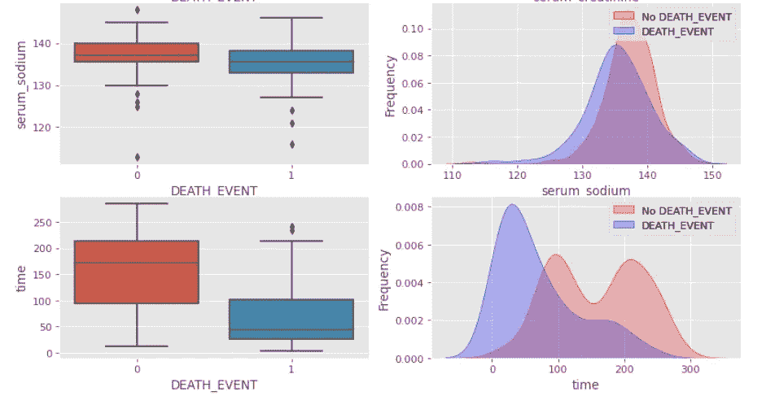****

****死亡事件与血清钠和时间****

> ****死亡:血清钠(132-138)低于存活(135-140)****
> 
> ****死亡:时间(25-100)远低于活着的时间(100-210)****

*   ****探索分类变量:高血压+死亡事件+吸烟+性别****

****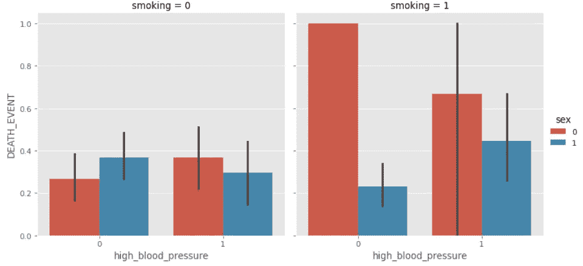****

> ****无论是否患有 HBP，女性吸烟者发生死亡事件的概率高于男性****
> 
> ****患有 HBP 病的不吸烟男性比不吸烟女性的死亡几率低****
> 
> ****没有 HBP 的不吸烟男性比没有 HBP 的不吸烟女性有更高的死亡几率****

*****吸烟+死亡 _ 事件+性+糖尿病*****

****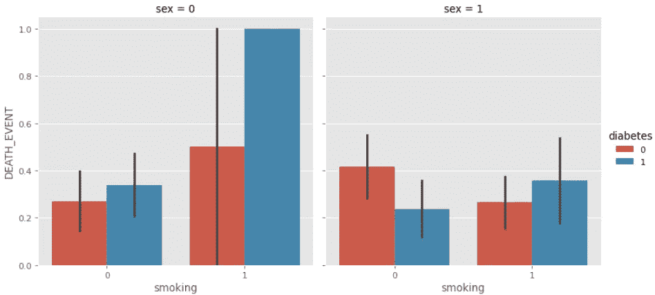****

> ******女:**死亡事件概率****
> 
> ****患有糖尿病的不吸烟女性比没有糖尿病的不吸烟女性有更高的死亡概率。****
> 
> ****患有糖尿病的吸烟女性比没有糖尿病的吸烟女性有更高的死亡概率****
> 
> ******男:**死亡事件概率****
> 
> ****患有糖尿病的不吸烟男性比没有糖尿病的不吸烟男性的死亡概率低****
> 
> ****患有糖尿病的吸烟男性比没有糖尿病的吸烟男性有更高的死亡概率****

*   ****训练-测试分割(80%(样本数:239)来自训练，20%(样本数:60)用于测试)样本总数:299****

*   ******模型建立-******

****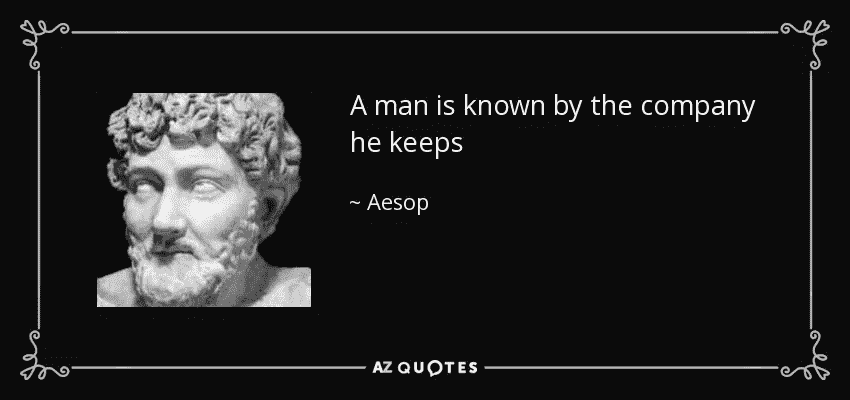****

****https://www.azquotes.com/quote/732346****

****我们将使用**K-最近邻** **(KNN)算法**进行预测，因为数据集非常小(即只有 299 行)****

********

****k=3 和 k=7 的 k-最近邻分类示例****

> ****k-最近邻是基于**监督学习**技术的最简单的机器学习算法之一。K-NN 算法假设新案例与可用案例之间的相似性，并将新案例放入与可用案例最相似的类别中。****

****让我们为 K=1 到 12 选择 K 的最佳值(即最近邻)****

*   ******观察:******

****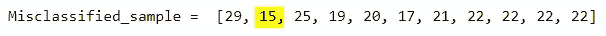****

****对于 K=2，我们可以看到 15(即最小的误分类样本)****

****因此，在用于测试数据的 60 个样本中，KNN 分类器正确预测了 45 个样本，但是它错误地对 K=2 的 15 个样本进行了分类(即最近邻=2)，从而实现了**预测准确度为** **75%******

# ****方法 2:选择前三个特征进行预测****

********

****图片由[s . Hermann&f . Richter](https://pixabay.com/users/pixel2013-2364555/?utm_source=link-attribution&utm_medium=referral&utm_campaign=image&utm_content=1777815)来自 [Pixabay](https://pixabay.com/?utm_source=link-attribution&utm_medium=referral&utm_campaign=image&utm_content=1777815)****

## ****如何使用相关矩阵识别数据集中的顶级特征****

****让我们打印相关矩阵，看看特性之间的相互依赖关系****

****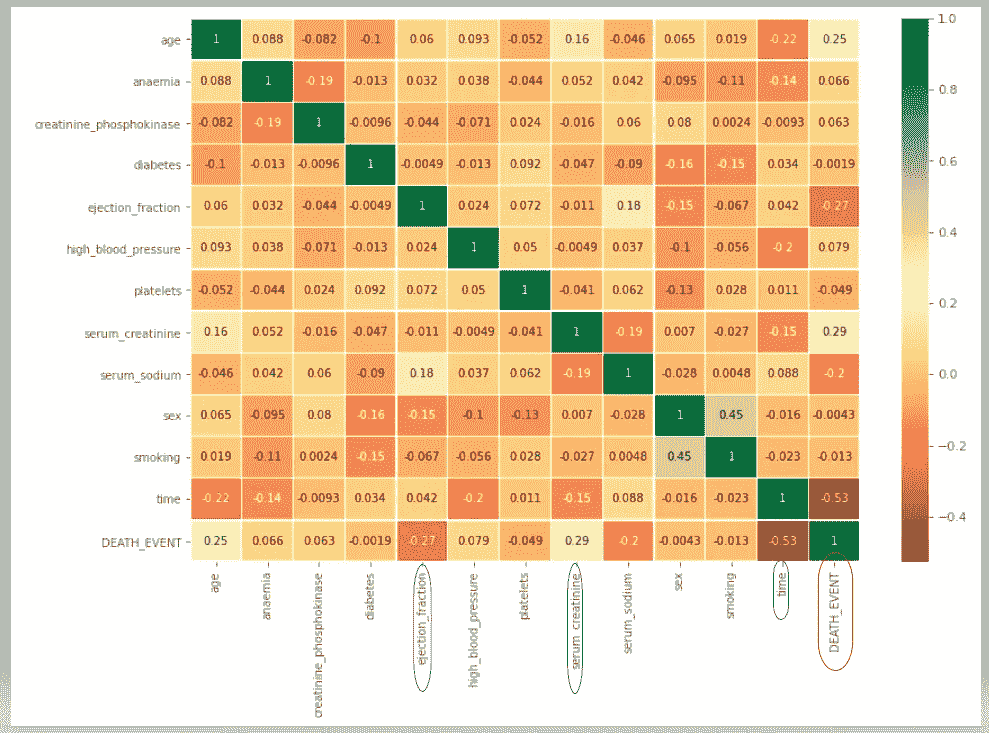****

****蓝色圆圈中的前三个预测值和红色圆圈中的目标变量****

******观察和推断** —解释目标变量(即死亡事件)中最大方差的前三个预测变量。****

*   ****时间:负协方差 **-0.53******
*   ****血清肌酐: **0.29** 的正协方差****
*   ****射血分数:负协方差 **-0.27******

****让我们使用**额外树分类器**算法的特征重要性参数来验证上述相关值****

****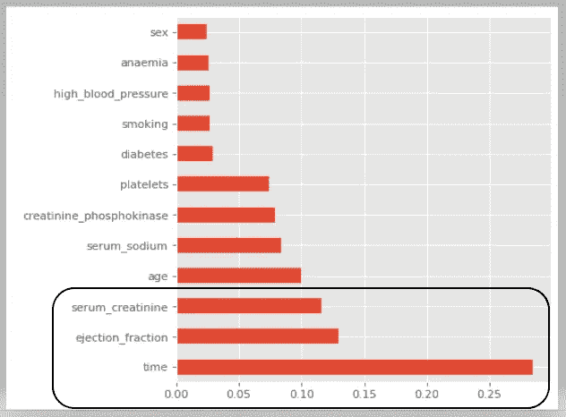****

****时间、射血分数和血清肌酐是前三个特征****

****上图证实了我们对前三个特征的分析****

****因此，让我们仅使用上述三个特征来构建**模型。******

*   ****让我们为 K=1 到 12 选择 K 的最佳值(即最近邻)****

*   ****让我们打印全部错误分类的样本****

****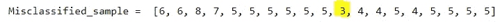****

****对于 K=11，我们可以看到 3(即最小的误分类样本)****

****因此，在用于测试数据的 60 个样本中，KNN 分类器正确预测了 57 个样本&对于 K=11(即最近邻=11)，它仅错误地分类了 3 个样本，实现了 **95%** 的**预测准确度******

*   ****让我们建立 K=11 的最终模型&打印混淆矩阵****

****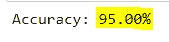****

****准确率从 75%提高到 95%****

*   ****混淆矩阵****

****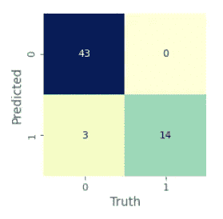****

****在总共 60 个测试样本中，正确预测的样本数量从 45 个增加到 57 个****

# ****结论和要点****

*   ****仅选择重要的特征并丢弃不需要的特征将分类模型的准确度从**的 75%提高到 95%******
*   ****我们可以尝试选择前 5 个特征(而不是前 3 个)，并检查它是否进一步提高了准确性。****
*   ****删除特征不一定会提高准确性，需要根据具体情况进行验证****
*   ****通过使用特征工程添加新特征，可以进一步提高精度。****
*   ****在这里，我们学习了如何使用额外树分类器的相关矩阵和特征重要性参数来检查重要特征。****

****干杯，感谢阅读！😃****

****你可以在我的 [**Github**](https://github.com/rahul-pednekar/Heart-Failure) 库中找到完整的 Python 代码。****

**** [## Rahul-pednekar/心力衰竭预测

### 在 GitHub 上创建一个帐户，为 Rahul-pednekar/心力衰竭预测的发展做出贡献。

github.com](https://github.com/rahul-pednekar/Heart-Failure-Prediction/) 

> 如有任何疑问，请随时在 [LinkedIn](https://www.linkedin.com/in/pednekar-rahul/) 、[Medium](/@rahul.pednekar)&[ka ggle](https://www.kaggle.com/rahulpednekar)上联系我，我将很乐意提供支持。****