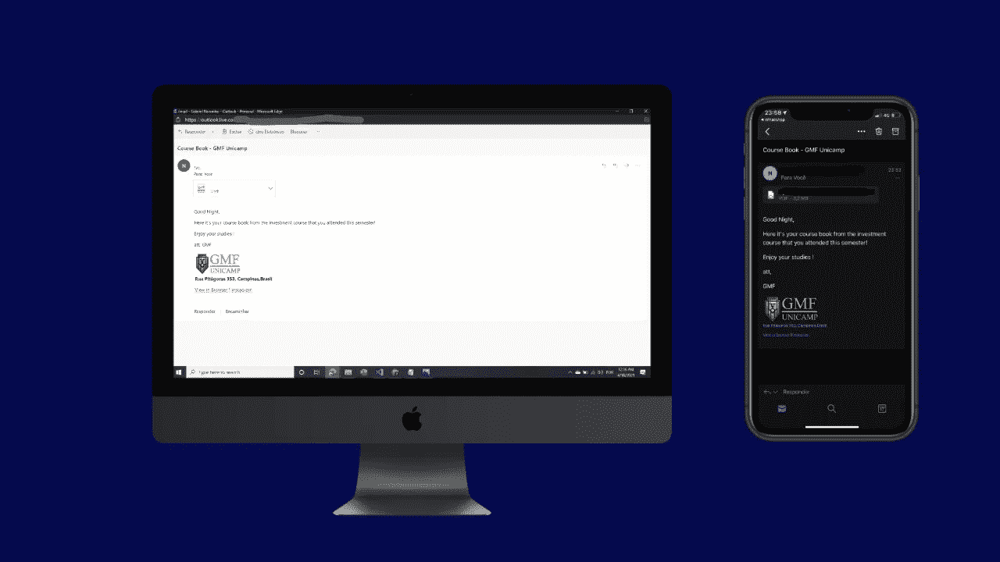

# 如何使用 python 发送许多带有 pdf 附件的自定义电子邮件

> 原文：<https://medium.com/analytics-vidhya/how-to-send-many-custom-emails-with-pdf-attachments-using-python-ba86bfd757f3?source=collection_archive---------2----------------------->

所以把你自己放在一个地方，你必须发送带有 pdf 附件的个人电子邮件，但每个 pdf 都是不同的，因为它是为每个人定制的。所以 python 有一个简单的方法来解决这个问题，并且会让你的生活变得容易很多。

寻找方法来解决我面临的问题，我确实找到了许多用 python 发送电子邮件的方法，每个代码的逻辑都是一样的，但有一个人解释得非常好，所以他的名字叫 Corey，你可以关注他的 youtube 频道:

[(50)科里·斯查费——YouTube](https://www.youtube.com/channel/UCCezIgC97PvUuR4_gbFUs5g)

在我们学习如何发送电子邮件的基础知识之前，在你的谷歌账户中做一件特定的事情是很重要的。我们需要打开不太安全的应用程序..

更改此设置的链接如下:

https://www.google.com/settings/security/lesssecureapps

## 解释什么是 SMTP 服务器

SMTP 是什么意思？SMTP 意味着简单的消息传输协议，它是以发送和接收电子邮件为主要目的的协议。打个比方，它就像足球中的中场，接收球，并与前锋联系。

*   **它是如何工作的？**

一旦你点击发送电子邮件，你的电子邮件被转换成一个字符串代码，并被发送到一个 SMTP 服务器，将处理代码和发送邮件给收件人，如果它不存在，电子邮件将在翻译中丢失。

*   **我们将如何使用**

SMTP 有不同的服务器，所以我们将使用 smtp@gmail.com，因为我们使用 gmail 帐户，SMTP 有不同的端口，我们将使用 465 端口，它有 SSL 加密(我稍后会尝试解释 SSL 的意思*)。

## 让我们来看看代码:

对于这段代码，我使用 google colab 来运行。我确实开始使用 jupyter 笔记本，但我在一次尝试中遇到了一些输出问题，所以一个人推荐我使用 google colab，我真的很喜欢它。

**第一步**您需要创建一个 excel 文件，我建议您使用 excel，而不是 python 中的直接列表，我的意思是它会工作，但当我编码时，我在我的空间中找到了一些/xa0，这在读取 pdf 文件时会影响您的代码，尽管您可以通过列表中的一次迭代来解决这个问题。在你的**第一页**中应该是你将要发送给接收者的文件的名称，在**第二页**中，你需要放置接收者的电子邮件。

这里需要注意的一点是，我们将使用 pandas data frame 来读取我们的 excel 文件，因此我建议 excel 表中的第一行是列的名称，以使您的工作更容易，例如，对于第一个表，您可以写“文件名”。

*   **导入文件**

```
from google.colab import files
uploaded = files.upload()
```

您必须导入将要发送的文件(pdf 文件)和将要使用的 excel 文件。

*   **导入库**

```
import pandas as pd
import smtplib
from email.message import EmailMessage
```

库导入后，我们必须将数据框架转换成列表，以使其能够迭代，因此代码如下:

```
#Sheet4 is where the emails are located
data = pd.read_excel('EXCELFILE.xlsx', sheet_name='Sheet4')
#Sheet3 is the name of the pdf files
data1 = pd.read_excel('EXCELFILE.xlsx', sheet_name='Sheet3')
#translating into lists
emails = data.values.tolist()
pdf_file = data1.values.tolist()
```

*   **启动邮件代码**

对于**的电子邮件代码**，我将分成两种代码，第一种是简单的带有 pdf 附件的电子邮件，第二种是 HTML 代码，以使它看起来更好，更专业(注意:我以前从未接触过 HTML，所以目前我写这个代码时我不太擅长)。

## 没有 HTML 部分的简单电子邮件

```
sender = 'SENDEREMAIL'
password = 'yourpassword' count = 1for i in range(len(emails)):
   receiver = emails[i][0]
   msg = EmailMessage()
   msg['Subject'] = 'Course Book - GMF Unicamp'
   msg['From'] = sender
   msg['To'] = receiver
   msg.set_content('Good Night, \n Here it is your course book from                 our investment course. \n Att, \n Team GMF') file = pdf_file[i][0]
   with open(file,'rb') as f:
      file_data = f.read()
      file_name = f.name
      msg.add_attachment(file_data, maintype='application', subtype = 'octet-stream', filename=file_name) with smtplib.SMTP_SSL('smtp.gmail.com', 465) as smtp:
      smtp.login(sender, password)
      smtp.send_message(msg)
      print(count)
      count = count+1
```

稍微解释一下代码:

1.  第一步是定义谁在发送电子邮件，以及您的密码。
2.  然后，我们用一个简单的“for”打开一个迭代，其范围覆盖列表中的所有电子邮件。
3.  现在我们定义电子邮件变量和文件变量。
4.  “With open”表示我们允许打开 pdf，“rb”表示读取和二进制，“msg.add_attachment”表示将我们的 pdf 添加到我们的电子邮件中。
5.  最后，我们打开与 SMTP 服务器的联系，输入我们的登录名和密码，最后发送电子邮件。

注意:我创建了变量 count，以便在发生错误时知道我的代码在列表中的位置。

*SSL 是一种加密协议，我们使用端口 465，因为加密会在 SMTP 通信之前自动开始，以确保我们的消息在到达收件人之前不会被拦截或更改。

## 用 HTML 发送更“专业”的电子邮件

好的，上面的代码是有效的，它已经可以帮助发送邮件给多人，但是你可以做得更好。我不得不说，我不太擅长设计，所以实际上我试图让它变得漂亮。HTML 很容易操作，所以首先我会展示基本代码，显示 HTML 将进入的地方，然后我会解释 HTML 代码。

```
from email.message import EmailMessage
sender = "SENDEREMAIL"
password = "PASSWORD"
for i in range(2):
   receiver = emails[i][0]
   msg = EmailMessage()
   msg['Subject'] = 'Course Book - GMF Unicamp'
   msg['From'] = sender
   msg['To'] = receiver
   msg.set_content('This is a plain text email')
   msg.add_alternative("""\
   **HTML code will be here**
   """, subtype='html')
   file = pdf_file[i][0]
   with open(file,'rb') as f:
      file_data = f.read()
      file_name = f.name
      msg.add_attachment(file_data, maintype='application', subtype = 'octet-stream', filename=file_name)
   with smtplib.SMTP_SSL('smtp.gmail.com', 465) as smtp:
   smtp.login(sender, password)
   smtp.send_message(msg)
```

对于我的电子邮件，我希望它看起来简单而漂亮。所以为了让它看起来更好，我决定把我是会员的金融俱乐部的标志，地址和两个超链接，一个是我们的 instagram 页面，一个是我们的网站。

要使用一张图片，我发现了一种快速获取你想要的图片的方法，你必须在谷歌图片中搜索图片，然后用右键单击并复制 html 代码，这使我的生活更容易。此外，使用 HTML 你可以把超链接放在你的网站/instagram 和任何你想要的链接上，这很酷。

下面是**的 HTML 代码**:

```
<!DOCTYPE html><html><body>
   <tr>
      <td>
         <table>
         <tr>
            <p>Good Night,</p>
            <p>Here it's your course book from the investment course that you attended this semester!</p>
            <p>Enjoy your studies !</p>
            <p>att, GMF</p>
         </tr>
         </table>
      </td>
   </tr><table>
   <td align = 'left'>
      <th></th>
   </td>
</table><table>
   <table>
      <tr>
         <td align="left">
            <b>Adress here</b>
            <p><a href="https://www.gmfunicamp.com/">View in Browser</a> | <a href="https://www.instagram.com/gmf_unicamp/">Instagram</a></p>
         </td>
      </tr>
</table></body>
</html>
```

## HTML 的基础

HTML 与表格一起工作，所以想象你的屏幕是一个空白页，你可以创建一些表格，你可以在这些表格中写东西。

1.  是定义单据正文内容。
2.  定义行“tr =表格行”
3.  定义数据“td =表格数据”
4.  对于写作，你可以用

    打开，用
    换行(我没有用这些)。

5.  要使文本加粗，请使用
6.  **要使用链接，请使用“href”。**

**正如你所看到的，这很简单，但这是一种很好的编码语言，我会努力把它学得更好。**

**将 HTML 代码放入 python 代码后，您的电子邮件应该看起来像这样，注意您的电子邮件在手机和笔记本上看起来是否相似，因为当我测试时，我必须修复一些东西。**

****

**我不使用 IMAC，但我在这个网站上找不到同样尺寸的笔记本**

**注意:我不知道你想要发送多少封电子邮件，但是为了让你有一个感觉，当我在工作的时候，我发送了大约 180 封电子邮件，花了大约 1 个半小时，这需要很长时间，但是如果你自己发送的话会更快，也不会那么无聊。我记得你每天最多能发 500 封邮件。**

**感谢您的阅读，如果您对我的解释有任何意见，请在下面留下，我会尽力回答。**