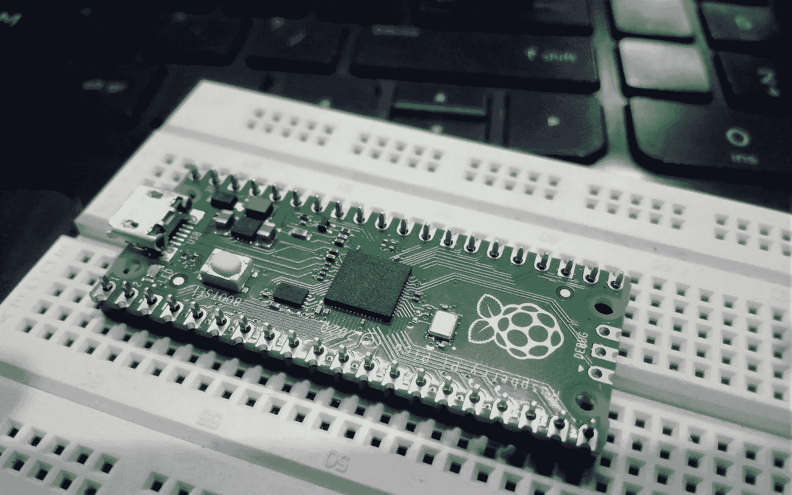
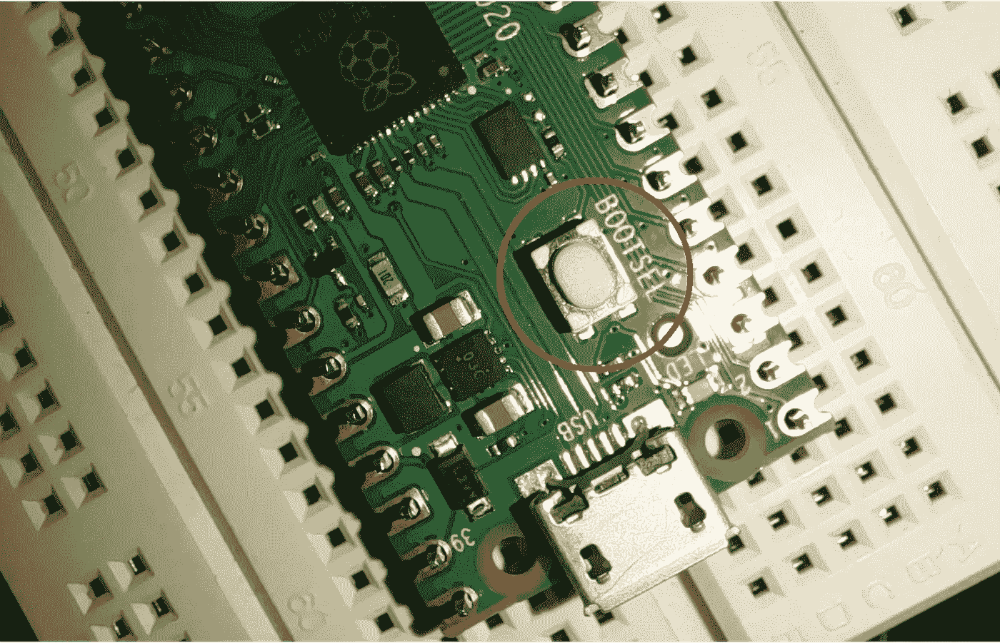
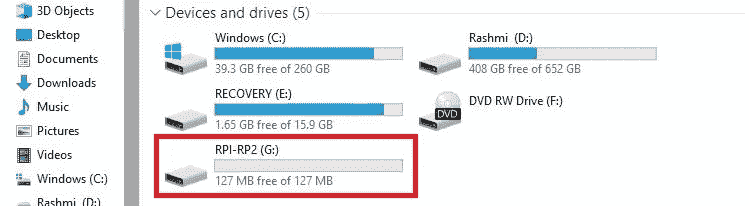
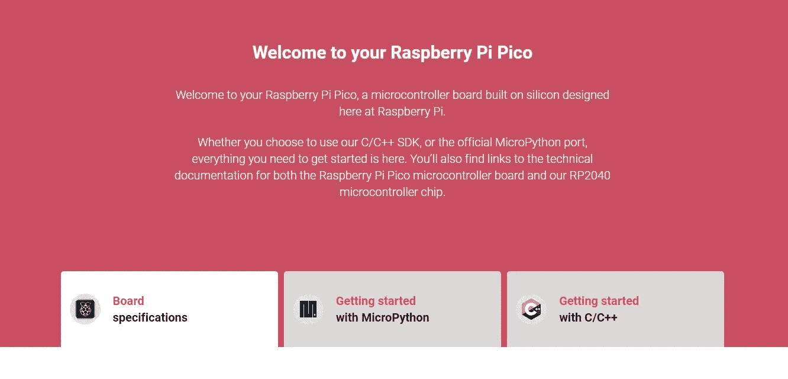
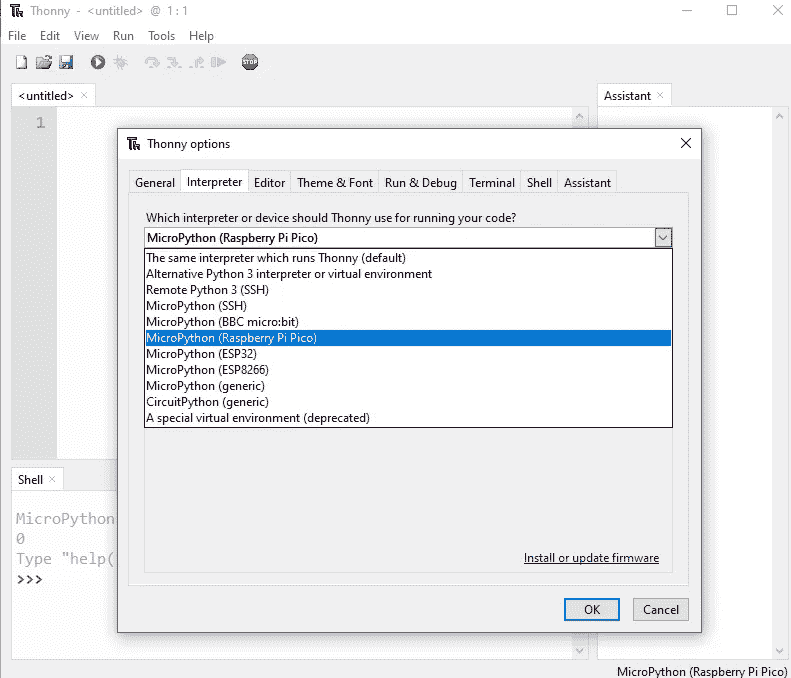
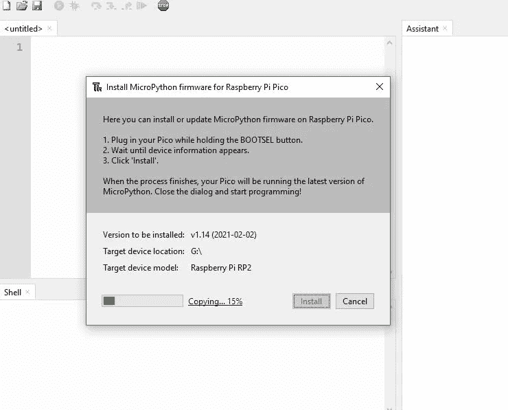
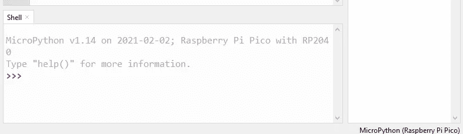
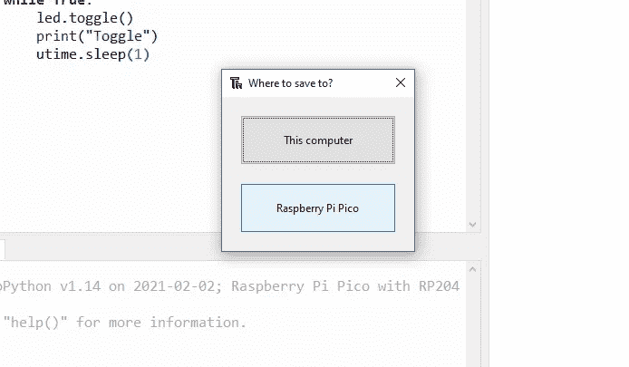
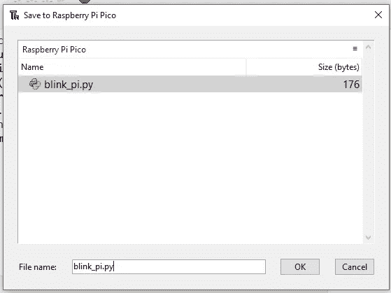
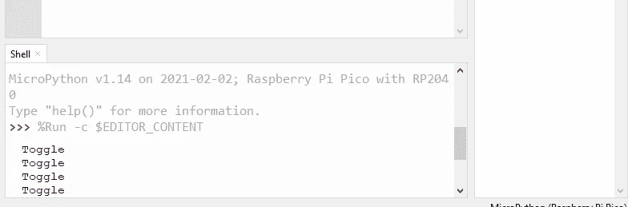

# 如何设置和编程树莓 Pi Pico

> 原文：<https://medium.com/analytics-vidhya/how-to-set-up-and-program-raspberry-pi-pico-58f5c75c382a?source=collection_archive---------6----------------------->

aspberry Pi Pico 是一个微型奇迹，将支撑从智能家居系统到工业工厂等一切的相同技术放在你的手掌中。无论你是想学习 **MicroPython** 编程语言，迈出物理计算的第一步，还是想构建一个硬件项目，Raspberry Pi Pico 及其令人惊叹的社区将为你提供全程支持。



(图片来源——Aniket Arya)

Raspberry Pi Pico 被称为微控制器开发板，简单地说，它是一个印刷电路板，内置一种为物理计算设计的特殊类型的处理器:微控制器。一根口香糖大小的 Raspberry Pi Pico 拥有惊人的功率，这要归功于电路板中心的芯片:一个 **RP2040 微控制器。**

# **RP2040 控制器**

它采用双核 Arm Cortex-M0+处理器，具有 264KB 内部 RAM，支持高达 16MB 的片外闪存。各种灵活的 I/O 选项包括 I2C、SPI 和独特的可编程 I/O (PIO)。这些支持这种小型和负担得起的封装的无限可能的应用。Raspberry Pi Pico 是一款低成本、高性能微控制器板，具有灵活的数字接口。

从控制电器到操作灯光显示器，Raspberry Pi Pico 将支撑无数日常操作的技术交到您的手中。

Pico 可在 C 和 MicroPython 中编程，适用于各种应用程序和技能水平，入门就像拖放文件一样简单。更有经验的用户可以利用 Raspberry Pi Pico 丰富的外设集，包括 SPI、I2C 和八个可编程 I/O (PIO)状态机，用于自定义外设支持。

# 如何设置树莓 Pi Pico

1.  按住 Pico 上的 **BOOTSEL** 按钮，然后用微型 USB 线连接到电脑。一旦驱动器 RPI-RP2 出现在您的计算机上，就释放 BOOTSEL。



(图片来源- Aniket Arya)

2.打开出现在驱动器选项卡中的 RPI-RP2 驱动器，点击打开**INDEX.htm**文件，它将在浏览器中打开 raspberry pi 网站。



3.这里您可以看到 pico 的两种编程方式，MicroPython 和 C/C++。



(图片—树莓派网站)

4.从 [MicroPython 选项卡下载 **MicroPython UF2** 文件。](https://pico.raspberrypi.org/getting-started/)

**5。将 UF2 文件**拖放到 RPI-RP2 驱动器上。Raspberry Pi Pico 将重新启动，现在将运行 MicroPython。

要编写自己的程序，你需要软件来与 pico 通信并在其上编写程序，对于 MicroPython，我们将使用 **Thonny，**通过以下步骤开始使用 **Thonny IDE 进行 pico 编程。**

1.  **为你的操作系统(Windows、MAC 或 Raspbian 操作系统)下载并安装 Thonny** 。可以从 [Thonny 网站](https://thonny.org/)免费抢。

2.将 Raspberry Pi Pico 连接到您的计算机，然后进入*工具>选项*并点击解释器选项卡。从解释器下拉列表中，选择**MicroPython(Raspberry Pi Pico)**。可以留下端口下拉菜单来自动检测 Pico。单击确定关闭。



3.当您插入 pico 板时，会出现一个用于 raspberry pi pico 的**固件**安装选项卡，*点击安装*，这将安装与 pico 进行 **Thonny** 通信所需的文件。



4.成功安装后，MicroPython 版本和覆盆子板将出现在 **Python Shell** (也称为 REPL、读取、评估、打印、循环)现在将更新以显示 Pico 已连接并工作。



5.为了测试，我们可以编写一个快速打印函数来说" *Hello World* "按 Enter 键运行代码。

```
print(“Hello World”)
```

当您按下 enter 键时，您可以看到程序正在使用 pico 板实时执行，输出在 Python Shell 中可见。

# 为 pico 的板载 LED 编写闪烁程序

为 pico 编写程序类似于编写 python 程序，您需要导入一些文件，这些文件将用于配置引脚和使用硬件工作的功能。

1.  复制以下代码并粘贴到*编辑器选项卡中。*

```
from machine import Pin
import utime
led = Pin(25, Pin.OUT)
led.low()
while True:
    led.toggle()
    print("Toggle")
    utime.sleep(1)
```

2.将程序保存在 pico 中，并给出一个唯一的名称(避免使用 main.py 或 info.py)



3.程序将运行，您可以看到电路板上的 LED 开关以及 Python shell 中的输出。



我们已经成功测试了我们的 Raspberry Pi Pico，现在我们可以开始另一个项目了。例如学习如何使用传感器与树莓皮微微。保持联系，我会在 PICO 计划上发布更多内容。