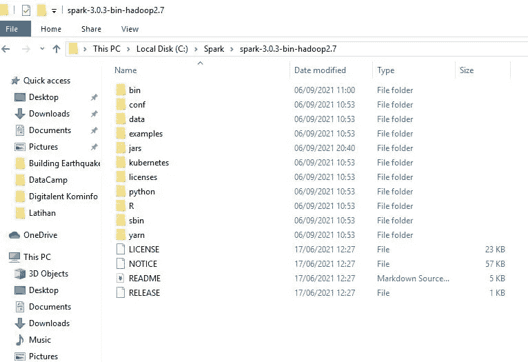
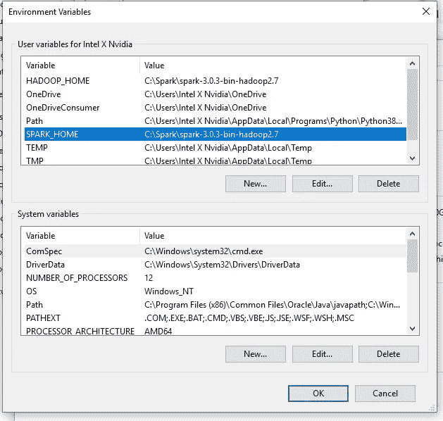
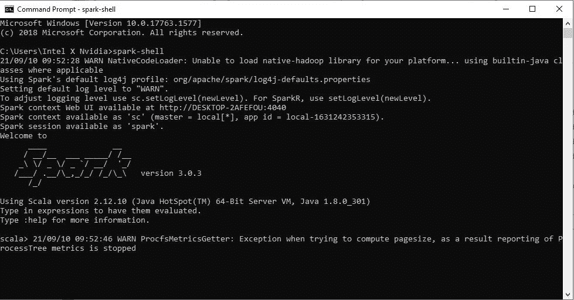
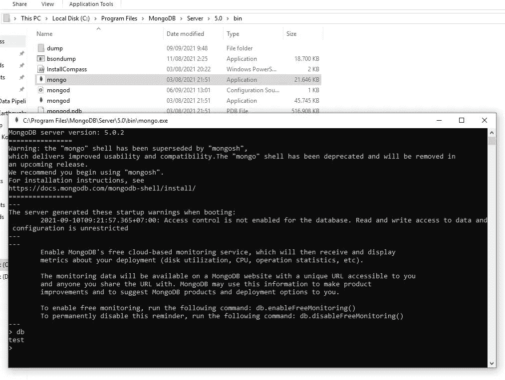
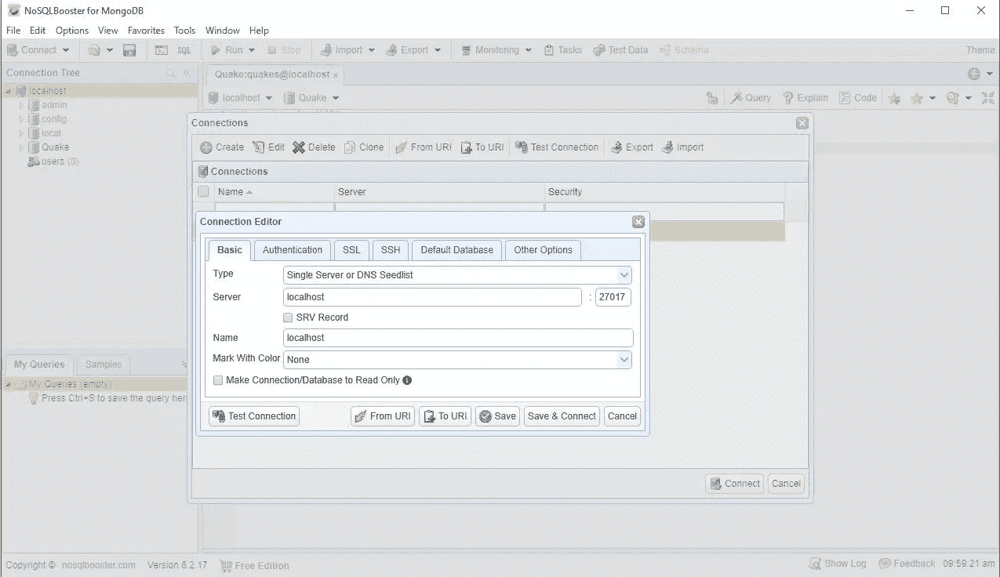
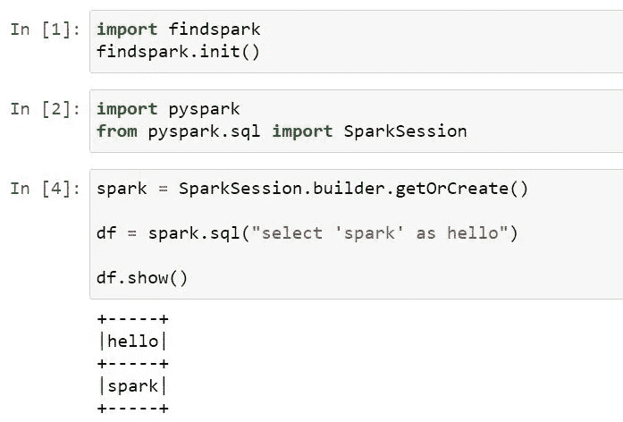

# 如何设置 PySpark 和 MongoDB 来构建数据管道

> 原文：<https://medium.com/analytics-vidhya/how-to-setup-pyspark-and-mongodb-for-building-data-pipeline-b528f56b30aa?source=collection_archive---------1----------------------->

**概述**

你以前听说过数据管道吗？如果没有，让我给你解释一下数据管道的简单定义。数据管道也可以称为 ETL 管道，它是一组将原始数据转换为业务问题的可操作答案的过程。数据科学管道使数据验证过程自动化；提取、转换、加载([ETL](https://www.snowflake.com/data-warehousing-glossary/etl/))；机器学习和建模；改版；并输出到数据仓库或可视化平台(Snowflake，n.d .)。

图 0 Spark + MongoDB(来源:【https://www.mongodb.com/integrations/mongodb-spark】T4)

好了，现在我将向您展示如何使用 PySpark 和 MongoDB 建立一个数据管道架构。

**设置和安装**

1 .首先我们需要安装 FindSpark、PySpark、PyMongo 等第三方库。您可以使用命令 pip install library-name 或 conda install library-name(如果您使用的是 Anaconda 提示符)来安装库。

2.其次，我们需要安装 Apache Spark，你可以从[这里](https://dlcdn.apache.org/spark/spark-3.0.3/spark-3.0.3-bin-hadoop2.7.tgz)安装。之后，在 C://目录下创建一个名为“Spark”的新文件夹，并将该文件夹复制粘贴到您下载到 Spark 文件夹的 zip 文件中。

图 Spark 文件夹内

3.在我们安装了 Apache Spark 之后，现在我们需要配置 Spark home 环境，以便在 windows 中运行 Spark。首先进入这台 PC->属性->高级系统设置->环境变量，然后点击新建，新建一个变量名为 SPARK_HOME，变量值为 SPARK 文件的目录，例如:“C:\ SPARK \ SPARK-3 . 0 . 3-bin-Hadoop 2.7”。之后，单击变量“Path”，创建一个新变量%SPARK_HOME%\bin，然后单击确定。

图 2 设置环境

4.在我们配置了 Spark home 之后，现在我们需要配置我们的 Hadoop home。我们需要做的第一件事是从这里的[下载文件“winutils . exe”](https://github.com/steveloughran/winutils/raw/master/hadoop-2.7.1/bin/winutils.exe)在 windows 中运行 Hadoop 需要这个文件。下载文件后，将其复制并粘贴到 Spark 文件夹内的“bin”文件夹中。现在回到这台 PC- >属性- >高级系统设置- >环境变量点击新建，创建一个新的变量名为 HADOOP_HOME 变量值与 SPARK_HOME 相同。之后，单击变量“Path”，创建一个新变量%HADOOP_HOME%\bin，然后单击确定。

5.一旦我们安装了 Spark 和 Hadoop，我们现在可以做的下一件事就是从[这里](https://www.oracle.com/java/technologies/javase/javase-jdk8-downloads.html#license-lightbox)安装 Java 8 JDK。

6.在我们安装了 Spark 和 Java 之后，现在是时候检查我们的 Spark 是否安装和配置正确了。以管理员身份打开命令提示符，然后键入“spark-shell”。如果我们看到一个欢迎信息，祝贺 Spark 成功安装在我们的机器上。如果没有，请在 C://中创建一个名为“tmp”的新文件夹，然后在其中创建一个名为“hive”的新文件夹，如果您使用的是旧版本的 Spark，这是可选的。

图 3 火花外壳

7.在 Spark 成功运行后，我们需要做的下一件事是下载 [MongoDB](https://www.mongodb.com/try/download/community) ，并选择一个社区服务器。在这个项目中，我使用的是 MongoDB 5.0.2 for Windows。当你安装 MongoDB 时，你会遇到一个服务器定制设置，供个人使用，只需将其设为默认设置，不要做任何更改。安装 MongoDB 后，打开安装目录，然后打开 Mongo.exe，然后键入“DB”。如果输出是“test ”,这意味着 MongoDB 安装成功。

图 4 测试 MongoDB

8.只要我们知道如何与 MongoDB 接口，我们所能做的就是使用命令行，这不是真正的用户友好，因此我们需要一个工具来处理这种情况。我们将使用的软件是 [NoSQLBooster](https://s3.mongobooster.com/download/releasesv6/nosqlbooster4mongo-6.2.17.exe) ，但是如果你喜欢使用命令行也没问题。一旦我们已经安装了 NoSQLBooster，接下来我们需要做的就是建立连接，打开 NoSQLBooster- >文件- >连接- >创建- >默认设置- >测试连接。连接成功运行后，我们需要在 localhost 下创建一个数据库。您必须右击本地主机，然后创建一个数据库。您可以随意命名您的数据库，在本例中，我为下一个项目将我的数据库命名为“Quake”。

图 5 NoSQLBooster 连接设置

MongoDB 安装完成后，我们接下来可以用 Jupyter 笔记本测试 PySpark。您可以简单地这样做:

图 6 用 Jupyter 笔记本测试 PySpark

如果您看到“hello spark”消息，您可以验证 PySpark 与 Jupyter 笔记本成功配合工作。

好了，一旦我们的数据管道架构安装完成，PySpark 与 Jupyter 笔记本集成，现在我们可以做我们的数据科学项目了。

我希望我的文章能帮助你完成成为一名专业数据科学家的旅程。

谢谢大家！

编制人:Vandany Lubis

非常感谢 [EBISYS](https://github.com/EBISYS) 教我如何做到这一点