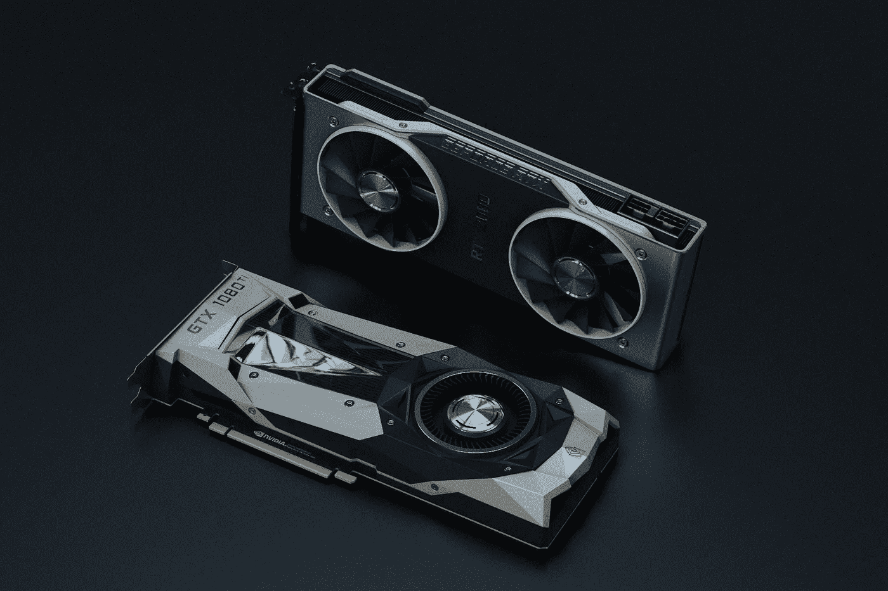

# 2021 年在 Windows 上设置 TensorFlow 2 GPU

> 原文：<https://medium.com/analytics-vidhya/how-to-setup-tensorflow-2-gpu-on-windows-in-2021-db9ca411f1df?source=collection_archive---------3----------------------->

## 机器学习**很复杂——但是安装不应该是最简单的部分吗？**



照片由来自 Pexels 的 Nana Dua 拍摄

我对 [TensorFlow](https://www.tensorflow.org/) 有一种又爱又恨的关系，但我想这些年来，这种关系随着每一个新版本的发布而增长和改善。TensorFlow 是一个非常强大的机器学习平台，这就是为什么我真的很喜欢他们正在做的事情。当我第一次尝试在有 GPU 支持的 Windows 上安装我的本地 TensorFlow V1 环境时，我的关系中令人讨厌的部分出现了，我花了一天多的时间让它有点工作。我明白，机器学习**很复杂——但是安装不应该是最简单的部分吗？**

在本指南中，我将努力使这个过程尽可能无痛，这样你就可以从一开始就与 TensorFlow 建立爱的关系！

[**TensorFlow 2(仅限 CPU)**](#cb51)
∘[anaconda for python 安装](#7ab0)
∘[tensor flow 2 in anaconda 安装](#bfec)
[**tensor flow 2 with GPU 支持**](#e4d4)
∘ [检查兼容性](#8ebb)
∘ [Nvidia CUDA 工具包安装](#6357)
∘ [Nvidia](#da91)

# TensorFlow 2(仅限 CPU)

## Python 安装的 Anaconda:

如果您还没有安装 Anaconda，我强烈推荐您安装它，因为它在管理软件包和创建虚拟环境方面非常出色，这对于下一步安装 Tensorflow 非常重要。

1.  **下载** [**蟒蛇个人版**](https://www.anaconda.com/products/individual)
2.  **运行可执行安装程序，浏览各个步骤←** 默认设置通常就足够了。如果您的 PC 上还没有安装 python 的冲突发行版，您可以“将 Anaconda3 添加到我的路径环境变量中”。

## Anaconda 安装中的 TensorFlow 2:

1.  **打开一个** `**Anaconda Prompt (Anaconda3)**` **终端←** 在开始菜单中搜索“Anaconda Prompt”会弹出窗口并读取`(base) C:\Users\name>`
2.  **运行:** `conda create -n tf pip python=3.9` ←告诉 Anaconda 创建一个名为“tf”的新虚拟环境，该环境将使用 Python 版本
3.  **运行:** `activate tf` ←告诉 Anaconda 在虚拟环境“tf”中运行，并将读取`(tf) C:\Users\name>`
4.  **运行:** `pip install --ignore-installed --upgrade tensorflow==2.5.0` ←安装 TensorFlow 版本 2.5.0 包，现在也包括 GPU 支持(查看最新的[稳定版本](https://www.tensorflow.org/versions))

# 支持 GPU 的 TensorFlow 2

到目前为止，这份指南与互联网上的其他指南非常相似，而且非常简单明了。我们现在有一个 Tensorflow 环境安装，如果你只想用你的 CPU 训练你的机器学习模型，它就足够好了。对于一些人来说，这可能没问题，但众所周知，机器学习在使用 GPU 进行训练时效果最好，因为它比只使用 CPU 快得多。

有鉴于此，我们将在下一节中介绍为 TensorFlow 2 启用 GPU 支持的过程。

## 检查兼容性:

[**TensorFlow GPU 兼容性列表**](https://www.tensorflow.org/install/source_windows#gpu) ← TensorFlow 有特定的软件兼容性要求，因此确保您在接下来的步骤中下载正确的版本非常重要。

对于`**TF 2.5.0**`，`**CUDA 11.2**`和 `**cuDNN 8.1**`已经通过 TensorFlow 验证。

## Nvidia CUDA 工具包安装:

1.  **下载**[**CUDA Toolkit 11.2**](https://developer.nvidia.com/cuda-11.2.2-download-archive?target_os=Windows&target_arch=x86_64&target_version=10&target_type=exenetwork)←如果需要针对不同 TensorFlow 版本的不同版本的 CUDA，可以在 [CUDA Toolkit 档案](https://developer.nvidia.com/cuda-toolkit-archive)中找到
2.  **运行可执行安装程序，浏览各个步骤←** 默认值通常就足够了

## **Nvidia cuDNN 设置:**

1.  **为下载 cuDNN 所需的**[**Nvidia Developer Progam Membership**](https://developer.nvidia.com/login)←创建一个帐户
2.  **登录并下载**[**cuDNN 8.1 for Windows**](https://developer.nvidia.com/compute/machine-learning/cudnn/secure/8.1.0.77/11.2_20210127/cudnn-11.2-windows-x64-v8.1.0.77.zip)←如果您需要不同版本的 cud nn 用于不同的 TensorFlow 版本，请在 [cuDNN 存档](https://developer.nvidia.com/rdp/cudnn-archive#a-collapse810-111)中找到
3.  **提取** `**C:\Users\name\Downloads\cudnn-11.2-windows-x64-v8.1.0.77.zip\cuda**` **文件夹到** `**C:\Program Files\NVIDIA GPU Computing Toolkit\CUDA\v11.2**` **文件夹**

## Nvidia GPU 驱动程序更新:

1.  **打开 Nvidia 的 Geforce Experience** ←你只要在开始搜索栏输入“Geforce Experience”就会弹出一个 app
2.  **点击“驱动程序”选项卡**
3.  **在“可用”下，一个驱动程序可能准备好安装**，如果没有，点击“检查更新”,然后查看是否有任何驱动程序更新

## 环境变量设置:

1.  **打开“系统属性”** ←从开始菜单中搜索“编辑系统环境变量”
2.  **点击右下角“高级”标签下的“环境变量…”**←
3.  **在“系统变量”部分下找到并编辑** `**Path**` **变量** ←
4.  **添加以下五个新的** `**Path**` **值:**

```
C:\Program Files\NVIDIA GPU Computing Toolkit\CUDA\v11.2\binC:\Program Files\NVIDIA GPU Computing Toolkit\CUDA\v11.2\libnvvpC:\Program Files\NVIDIA GPU Computing Toolkit\CUDA\v11.2\includeC:\Program Files\NVIDIA GPU Computing Toolkit\CUDA\v11.2\cuda\binC:\Program Files\NVIDIA GPU Computing Toolkit\CUDA\v11.2\extras\CUPTI\lib64
```

## **验证全张量流安装:**

1.  **打开新的** `**Anaconda Prompt (Anaconda3)**` **端子**
2.  **运行:**
3.  **正确的输出应该有“成功打开动态库”和“已创建张量流设备”标志，看起来如下:**

```
(tf) C:\Users\name>**python -c "import tensorflow as tf;print(tf.reduce_sum(tf.random.normal([1000, 1000])))"**
2021-07-02 20:19:44.622280: I tensorflow/stream_executor/platform/default/dso_loader.cc:53] **Successfully opened dynamic library** cudart64_110.dll
2021-07-02 20:19:48.037812: I tensorflow/stream_executor/platform/default/dso_loader.cc:53] **Successfully opened dynamic library** nvcuda.dll
2021-07-02 20:19:48.158677: I tensorflow/core/common_runtime/gpu/gpu_device.cc:1733] Found device 0 with properties:
pciBusID: 0000:2d:00.0 name: NVIDIA GeForce RTX 2070 SUPER computeCapability: 7.5
coreClock: 1.785GHz coreCount: 40 deviceMemorySize: 8.00GiB deviceMemoryBandwidth: 417.29GiB/s
2021-07-02 20:19:48.158984: I tensorflow/stream_executor/platform/default/dso_loader.cc:53] **Successfully opened dynamic library** cudart64_110.dll
2021-07-02 20:19:48.632718: I tensorflow/stream_executor/platform/default/dso_loader.cc:53] **Successfully opened dynamic library** cublas64_11.dll
2021-07-02 20:19:48.632851: I tensorflow/stream_executor/platform/default/dso_loader.cc:53] **Successfully opened dynamic library** cublasLt64_11.dll
2021-07-02 20:19:48.939031: I tensorflow/stream_executor/platform/default/dso_loader.cc:53] **Successfully opened dynamic library** cufft64_10.dll
2021-07-02 20:19:48.971598: I tensorflow/stream_executor/platform/default/dso_loader.cc:53] **Successfully opened dynamic library** curand64_10.dll
2021-07-02 20:19:49.202579: I tensorflow/stream_executor/platform/default/dso_loader.cc:53] **Successfully opened dynamic library** cusolver64_11.dll
2021-07-02 20:19:49.416235: I tensorflow/stream_executor/platform/default/dso_loader.cc:53] **Successfully opened dynamic library** cusparse64_11.dll
2021-07-02 20:19:50.335902: I tensorflow/stream_executor/platform/default/dso_loader.cc:53] **Successfully opened dynamic library** cudnn64_8.dll
2021-07-02 20:19:50.336366: I tensorflow/core/common_runtime/gpu/gpu_device.cc:1871] Adding visible gpu devices: 0
2021-07-02 20:19:50.338899: I tensorflow/core/platform/cpu_feature_guard.cc:142] This TensorFlow binary is optimized with oneAPI Deep Neural Network Library (oneDNN) to use the following CPU instructions in performance-critical operations:  AVX AVX2
To enable them in other operations, rebuild TensorFlow with the appropriate compiler flags. 
2021-07-02 20:19:50.341514: I tensorflow/core/common_runtime/gpu/gpu_device.cc:1733] Found device 0 with properties:
pciBusID: 0000:2d:00.0 name: NVIDIA GeForce RTX 2070 SUPER computeCapability: 7.5
coreClock: 1.785GHz coreCount: 40 deviceMemorySize: 8.00GiB deviceMemoryBandwidth: 417.29GiB/s
2021-07-02 20:19:50.341677: I tensorflow/core/common_runtime/gpu/gpu_device.cc:1871] Adding visible gpu devices: 0
2021-07-02 20:19:51.176159: I tensorflow/core/common_runtime/gpu/gpu_device.cc:1258] Device interconnect StreamExecutor with strength 1 edge matrix:
2021-07-02 20:19:51.176333: I tensorflow/core/common_runtime/gpu/gpu_device.cc:1264]      0
2021-07-02 20:19:51.177492: I tensorflow/core/common_runtime/gpu/gpu_device.cc:1277] 0:   N
2021-07-02 20:19:51.179734: I tensorflow/core/common_runtime/gpu/gpu_device.cc:1418] **Created TensorFlow device** (/job:localhost/replica:0/task:0/device:GPU:0 with 5973 MB memory) -> physical GPU (device: 0, name: NVIDIA GeForce RTX 2070 SUPER, pci bus id: 0000:2d:00.0, compute capability: 7.5)
tf.Tensor(1009.2107, shape=(), dtype=float32)
```

…我们完成了！这就是设置 TensorFlow 2 所需要做的全部工作！每当您想使用这个环境时，只需打开一个新的`Anaconda Prompt (Anaconda3)`终端并运行:`activate tf`

# 下一步是什么？

在我的下一篇文章中，我将介绍使用 TensorFlow 的对象检测 API 创建您自己的自定义对象检测模型的安装和设置。我会仔细检查我需要解决的所有代码修正和调整，这样你就不用这么做了！

我强烈推荐看 [TensorFlow 2 对象检测 API 教程](https://tensorflow-object-detection-api-tutorial.readthedocs.io/en/latest/index.html)，因为它有一些更深入的解释，是我迄今为止找到的最好的资源之一。在这一系列文章中，我将经历与他们的教程相似的步骤，但是在这个过程中会帮助修复一些关键的代码。