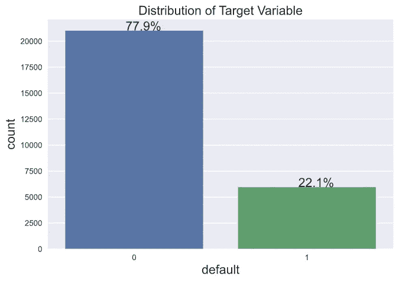
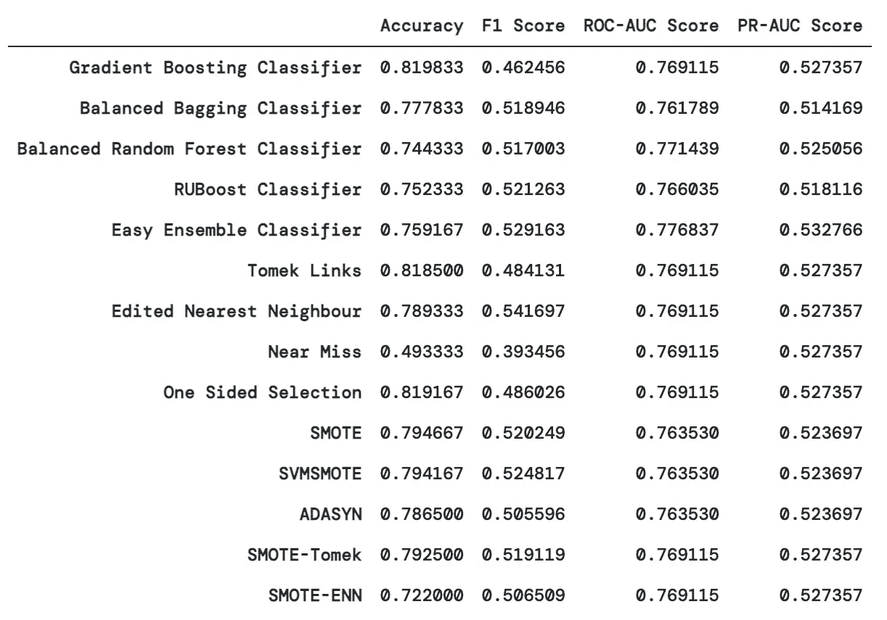

# 如何展示你的少数民族阶级急需的 TLC

> 原文：<https://medium.com/analytics-vidhya/how-to-show-your-minority-class-much-needed-tlc-44f8670268f6?source=collection_archive---------14----------------------->

## 关于类不平衡的综合实践教程，并附有 Python 代码示例

照片由[伊万娜拉](https://unsplash.com/@ivanana?utm_source=unsplash&utm_medium=referral&utm_content=creditCopyText)在 [Unsplash](https://unsplash.com/s/photos/care?utm_source=unsplash&utm_medium=referral&utm_content=creditCopyText) 上拍摄

在纽约市和美国，最糟糕的情况已经过去的后电晕时代，我们应该首先花些时间给自己一些早该有的 TLC，但是一旦该说的都说了，该做的都做了，让我们谈谈如何在你的下一个分类项目中给你的少数民族班级一些适当的 TLC。

在我 Flatiron 项目后半段的大部分时间里，我感兴趣的每一个话题都毫无例外地以失衡告终。第三阶段，我想从事一个尽可能远离我专业领域的课题，即金融。我偶然发现了一个 Kaggle 数据集，用于开发一个分类模型来预测信用卡持有人是否会拖欠即将到来的付款。所有金融术语都有一个学习曲线，但我不知道这将是我通过几个不平衡数据集的旅程的开始，即第 4 阶段的仇恨推文和顶石的黑色素瘤图像。

在这篇博客中，我将深入探讨如何使用台湾信用卡数据集来处理你下一个机器学习项目中的类别不平衡问题。关于 Kaggle 数据集的完整代码，请参考下面列出的 Jupyter 笔记本:

 [## datassisteven/Medium-博客

### 我的中型博客的代码库。通过在…上创建一个帐户，为 datassisteven/Medium-Blogs 的发展做出贡献

github.com](https://github.com/datascisteven/Medium-Blogs/blob/main/Class_Imbalance.ipynb) 

为了运行本报告中提供的代码，您需要安装`imbalanced-learn`包，这需要以下依赖项:

*   python (>=3.6)
*   numpy (>=1.13.3)
*   scipy (>=0.19.1)
*   scikit-learn (>=0.23)

安装完依赖项后，使用以下终端命令之一安装`imbalanced-learn`包:

*   `pip install -U imbalanced-learn`
*   `conda install -c conda-forge imbalanced-learn`

前一个命令可以用于任何 Python 安装，而后一个命令用于 conda 环境中的安装。

# 什么是不平衡数据集？

照片由 [*芭芭拉·霍恩*](https://unsplash.com/@designschnecke?utmsource=unsplash&utmmedium=referral&utmcontent=creditCopyText) *在*的 Unsplash 上拍摄

如果不同分类类别的比例不相等，则认为数据集不平衡。期望真实数据完全平衡甚至有些平衡是不现实的。作为数据科学家，我们经常会面对一个数据集，这个数据集是通过我们自己的努力填充的，或者是由一个类(多数类)的许多实例组成的，但我们感兴趣的实例却很少，即少数类。

目标变量“默认”分布的条形图

对于信用卡默认数据集，这是用于说明目标变量分布的可视化，它表明该客户群中有 22.1%属于少数族裔。根据谷歌的机器学习课程，具有 20%-40%少数民族类别的数据集被认为是轻度不平衡的，1%-20%是中度不平衡的，任何低于 1%的都是极度不平衡的。

## 显示不平衡分布的代码

要运行该代码，您需要导入数据集并执行 80/20 的训练验证分割。在训练模型之前，我选择不做任何预处理或特征工程。

# 为什么我们需要从解决不平衡开始？

不平衡数据集对数据科学家提出了挑战，因为大多数机器学习算法都期望平衡的类分布，并在这样的分布下最佳地执行。如果一个阶层的代表性过高，模型就会偏向多数阶层，将少数阶层视为数据中的噪音。我们作为标准承担者所依赖的指标，如准确性，变得毫无意义。

让我们想象一个场景，其中我们有一个 10，000 个客户的数据集，其中有 9，500 个非违约者和 500 个违约者，我们将 9250 个正确地识别为非违约者(真阴性)，25 个正确地识别为违约者(真阳性)，475 个错误地识别为非违约者(假阴性)，250 个错误地识别为违约者(假阳性)。我们可能会倾向于满足于我们的模型达到 92.75%的准确率，但仔细观察，尽管准确率如此之高，我们的模型只能识别 500 个少数案例中的 25 个。如果我们仅仅依赖准确性作为我们的绩效指标，我们会被误导，认为我们的模型能够正确预测违约者。如果我们试图识别癌症检测呈阳性的患者，我们会意识到无法识别少数群体(即癌症检测呈阳性的患者)的潜在负面影响。

# 处理阶级不平衡的工具有哪些？

1.  对训练样本进行不同的加权
2.  为更多少数类实例合并附加数据集
3.  对训练数据集进行重采样

在这篇博客中，我将只关注重采样方法。诚然，Flatiron 的 doxology 使我偏向于项目的选项 2 和 3，但时间不允许我为项目合并另一个数据集。

# 绩效指标审查

我们之前看到了准确性如何提供模型性能的误导性指示，因此我们必须在训练过程中寻找一些其他指标来评估具有不平衡数据集的模型。让我们来看看我在评估模型时使用的指标:

## 精确度和召回率

如果我们看一下精度公式(TP / TP + FP)和召回公式(TP / TP + FN ),我们会注意到这两个指标明显忽略了真正的否定。Precision 告诉我们，在所有我们预测为阳性的阳性结果(即 TP 和 FP)中，我们正确预测并真正为阳性的百分比是多少。相反，回忆(或 TPR)告诉我们，在所有阳性实例(即 TP 和 FN)中，我们预测有多少是阳性的。

如果我们更仔细地观察这两个公式，一个最小化假阳性的模型会有更高的精确度，一个最小化假阴性的模型会有更高的召回率。随着 FP 的接近零，精度变得越来越接近简化为分数 TP/TP，换句话说，接近 1。类似地，当 FN 接近 0 时，回忆接近 1。

从上面的场景中，让我们回忆一下 TP 的数量是 25，FP 的数量是 250，FN 的数量是 475，这给了我们 9%的精确度和 5%的召回率，这对于识别违约者来说不是一个好兆头。这强调了衡量标准而不是准确性的重要性。

## F1 分数

这是召回率和精确度的调和平均值，所以它同时考虑了假阳性和假阴性。由于我们希望最小化 FP 和 FN，最大化 F1 分数将是选择最佳模型的有用指标。就像偏差和差异一样，回忆和精确也有类似的相互作用，提高一个是以牺牲另一个为代价的。

## ROC 曲线和 ROC-AUC 评分

这是最常用于比较不平衡数据集的不同模型的指标，而不是准确性。它在 x 轴上绘制 FPR，在 y 轴上绘制 TPR。TPR(或回忆)不在正面类中，我们正确预测了多少，而 FPR 不在负面类(FP 和 TN)中，我们错误预测了多少。因此，这里我们有一个情况，我们想要最大化一个和最小化另一个，即最大化 TPR 和最小化 FPR。

值得注意的是，ROC-AUC 分数为 0.5 的基线模型表明该分类器没有任何辨别能力，这对应于度量图中从左下到右上的对角线。这可能是两种情况之一，要么是模型预测每个数据点的随机类，要么是常数类。也就是说，例如，在右上角，当 TPR 和 FPR 都等于 1 时，阳性类的每个成员都被正确分类，而阴性类的每个成员都被错误分类。

直到最近，我还没有太多考虑 ROC-AUC 分数为 0 意味着什么，但这意味着所有积极的类实例都被预测为消极的，所有消极的都被预测为积极的。当 AUC 在 0.5 和 1 之间时，我们的模型能够检测到比 FN 和 FP 更多的 TP 和 TN，因此能够更好地区分阳性和阴性类别。

## PR 曲线和 PR-AUC 评分

PR 曲线在 x 轴上绘制回忆，在 y 轴上绘制精度。基线取决于数据集的分布。对于完美分布的数据集，基线为 50%。随机估计值的 PR-AUC 分数等于数据集中阳性实例的百分比。对于具有 10%阳性实例的数据集，基线 PR-AUC 得分为 0.10，因此高于基线的数字将构成得分的改善。对于我们目前的数据集，基线 PR-AUC 评分约为 0.22。

虽然我在项目期间使用 PR-AUC 作为衡量标准，但从那时起，我的理解是，它在高度不平衡的数据集或比较具有类似极端不平衡的模型时更有用。

## 评估模型性能的代码

# 重采样方法概述

为了对训练数据集进行重采样，模块`imbalanced-learn`为手头的任务提供了四种不同类别的方法或技术:

1.  欠采样方法
2.  过采样方法
3.  组合方法
4.  集成方法

这里有一个不同类别的快速回顾，因为全面的讨论本身就是一篇博文。欠采样包括从多数类中移除实例，过采样包括添加少数类的实例，组合方法对两个类进行重采样，目的都是为了创建两个类的更均匀分布。我认为我们在 Flatiron 时已经意识到过采样比欠采样更好用，因为我们可能会因为欠采样而丢失重要信息。然而，前者有其自身的缺陷，包括复制无信息实例的可能性。

欠采样方法分为两类:固定欠采样和清洁欠采样。固定欠采样方法是指在数据集达到平衡之前移除少数实例的方法，而清理方法是基于某种标准或算法来清理要素空间。在我们实施的方法中，单侧选择、编辑过的最近邻和 Tomek 链接将被视为清理方法，而如果您在重采样后查看多数类和少数类的分布，则接近失误将被视为固定的。

过采样方法包括复制少数实例的技术，如随机过采样，或基于某些算法生成合成实例的技术，如 SMOTE。通过对少数类进行过采样，我们的模型了解了少数类的具体情况，但它无法很好地进行概括。为了抵消这种过度拟合的趋势，SMOTE 沿着特征空间中连接两个相邻少数实例的线段随机生成新的样本。最终，它已经成为产生 SMOTE 变体整个家族的过采样的首选方法之一。

说到这里，组合方法将两个世界的优点结合在一起，试图解决 SMOTE 的缺点，包括它通过盲目选择最近邻居而产生额外噪声和重叠类的趋势。ENN 和托梅克链接各自在 SMOTE 过程之后实现，作为减轻一些缺点的过滤手段。

最后，集成方法分为两大类:boosting 和 bagging。提升包括按顺序或系列训练分类器，所有训练样本的权重相等，并且在每次迭代后，模型误分类的样本的权重增加。Bagging 或 bootstrap 聚合涉及在原始数据集的子集上拟合基本分类器，然后通过平均或投票来聚合预测。

## 模型训练代码

我们希望使用下面的参数`strategy=most_frequent`运行一个分类器`DummyClassifier()`来确定我们的基线分数。这意味着什么呢？分类器预测训练集中最频繁的标签，即预测每个实例的 0 或多数类。在这种情况下，我们的精确度是多少？我们将得到一个等于多数类的比例或 78.12%的准确度。

至于 PR-AUC 得分，它将等于少数民族类的比例(21.88%)，对于 ROC-AUC，它应等于 0.5，这对应于没有我们之前建立的辨别能力。

下面是运行 SMOTE 的过采样方法的代码，但是我们将实例化一个不同的重采样方法，但是运行插入新方法的`run_resampling`函数。这可以应用于所有欠采样、过采样和组合重采样方法。

提醒一下，我们在数据集上执行了 80/20 分割，从目标(`y`)变量中分割特征(`X`)变量，在训练(`X_train`)集上运行`fit_transform`，在测试集(`X_valid`)上只运行`transform`。对训练数据运行几个模型，并且在重采样之前确定最佳模型。因为我们在进程中间跳转，这就是我们如何到达代码中的`GradientBoostingClassifier()`。

我们用`StandardScaler()`对数据集进行了规范化，但是作为提醒，我们希望在训练集上运行`.fit()`和`.transform()`，但是在测试或验证集上只运行`.transform()`。这就是上面函数中的`X_train_norm`和`X_valid_norm`。

## 关于原始项目的最终想法

最初，我不太愿意总结我的第三阶段项目的结果，因为我预计重新采样会在指标方面产生一些实质性的变化。它们都不能产生比基本分类器更高的准确度，但是 Tomek 链接和单边选择是最接近的。SMOTE 以准确性为代价产生了更高的 F1 分数，而 Tomek Links 具有类似的准确性，F1 分数略有提高。我无法提高 PR-AUC 或 ROC-AUC 评分，它们基本上始终保持不变。

最终，在我的项目中，通过微调超参数，我能够提高我的准确性和 ROC-AUC 分数。

这是我最初项目的数据框架:

回想起来，基线准确率为 78%，我仍然认为还有潜在的改进空间。我可以容忍 ROC-AUC 或 F1 评分增加的准确性下降。

在不平衡数据集的大计划中，我认为这个数据集只是轻度不平衡，因此重采样方法可能不那么有效，甚至可能对它们有害。在回顾一些 Kaggle repos 时，似乎我在提高准确性和 ROC-AUC 分数方面的努力并非没有先例。然而，这值得进一步研究，因为 Alam 等人使用 K-Means SMOTE 过采样的 GBDT 模型产生了 89%的准确性，而 Islam 等人使用他们的*机器学习方法*产生了 95%的准确性。

博客的代码是我的原始项目的简化版本，位于以下位置:

 [## datassisteven/Taiwan-CC-Default-Prediction

### 项目作者:Steven Yan 项目顾问:李芳芳、约书亚茨马诺夫斯基一家总部位于美国的信用卡发行商

github.com](https://github.com/datascisteven/Taiwan-CC-Default-Prediction) 

## 资源:

**谷歌的机器学习速成班:**https://developers.google.com/machine-learning/crash-course T2

不平衡学习用户指南:[https://imbalanced-learn.org/stable/user_guide.html](https://imbalanced-learn.org/stable/user_guide.html)

**娜塔莉·霍克汉姆:不平衡数据集的机器学习:**[https://www.youtube.com/watch?v=X9MZtvvQDR4](https://www.youtube.com/watch?v=X9MZtvvQDR4)

## 参考资料:

Alam，T.M .，Shaukat，k .，Hameed，I .，Luo，s .，Sarwar，M.U .，Shabbir，s .，Li，j .，& Khushi，M. (2020)。不平衡数据集中信用卡违约预测的研究。 *IEEE 访问，8* ，201173–201198。[https://doi.org/10.1109/ACCESS.2020.3033784](https://doi.org/10.1109/ACCESS.2020.3033784)

马，于(2020)。信用卡账单违约概率的预测。*商业与管理开放期刊，08* ，231–244。[https://doi.org/10.4236/ojbm.2020.81014](https://doi.org/10.4236/ojbm.2020.81014)

新泽西州激流市、佐治亚州维萨尼市和东巴格里市(2020 年)。PSD2 可解释的人工智能信用评分模型。 *ArXiv，abs/2011.10367* 。[https://arxiv.org/pdf/2011.10367.pdf](https://arxiv.org/pdf/2011.10367.pdf)

lematre，g .，Nogueira，f .，和 Aridas，C.K. (2017 年)。不平衡学习:一个 Python 工具箱来解决机器学习中不平衡数据集的诅咒。 *ArXiv，abs/1609.06570* 。[https://jmlr.org/papers/v18/16-365.html](http://jmlr.org/papers/v18/16-365.html)

Galar，m .，Fernández，a .，Tartas，e .，Bustince，h .，和 Herrera，F. (2012 年)。类不平衡问题的集成综述:基于 Bagging、Boosting 和 Hybrid 的方法。IEEE 系统、人和控制论汇刊，C 部分(应用和评论)，42 ，463–484。[https://doi.org/10.1109/TSMCC.2011.2161285](https://doi.org/10.1109/TSMCC.2011.2161285)

加西亚，v .，桑切斯，j .，和莫琳达，R.A. (2010 年)。探索类不平衡问题重采样策略的性能。国际能源机构/AIE。[https://doi.org/10.1007/978-3-642-13022-9*54*](https://doi.org/10.1007/978-3-642-13022-9_54)

伊斯拉姆，埃伯勒，w .，&加福尔，S. (2018)。结合机器学习和启发式方法的信用违约挖掘。 *ArXiv，abs/1807.01176* 。https://arxiv.org/pdf/1807.01176.pdf