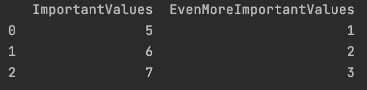
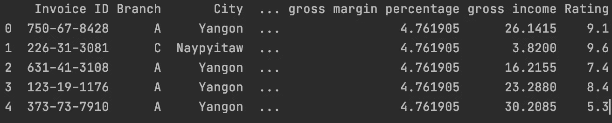
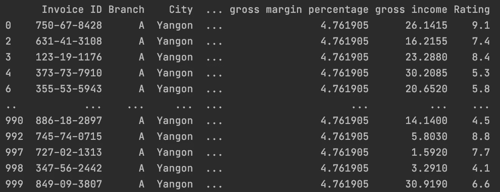
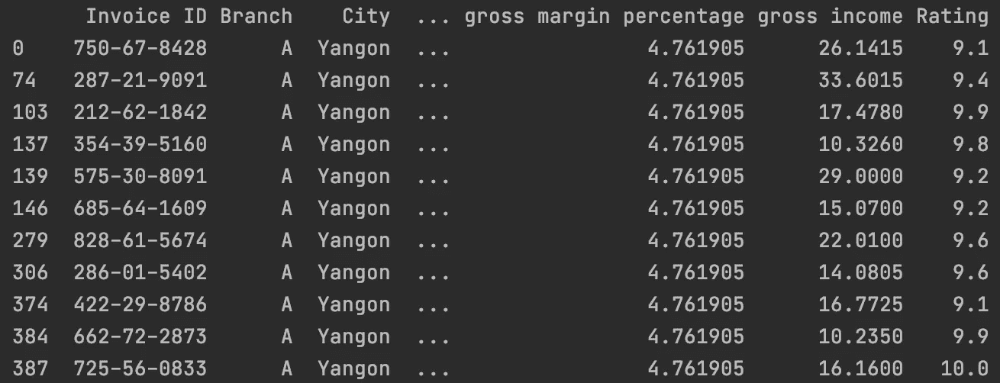

# 如何快速解决数据任务——熊猫简介

> 原文：<https://medium.com/analytics-vidhya/how-to-solve-data-tasks-quickly-an-introduction-to-pandas-a5838c219484?source=collection_archive---------14----------------------->


卢克·切瑟在 [Unsplash](https://unsplash.com?utm_source=medium&utm_medium=referral) 上的照片

数据科学最重要的工具之一:熊猫——在短时间内学习最常用的函数，以及如何快速得到结果。你从一个大的数据集开始:你如何读取它，清理它，并适当地评估它？我将向您展示最重要的功能。

**但首先:什么是熊猫，它什么时候被使用？** Pandas 是一个基于 Python 的开源分析和操纵工具。它是为了在 Python 中实现实际的、真实的数据分析而构建的。优点是它的灵活性和易用性。在本文中，我将展示处理大数据集任务时的常见步骤、最重要的功能，并解释如何使用它们来开始您的第一个项目。

**熊猫基本知识:** 主要是熊猫用的物件有两类:
1。 **DataFrame** :包含独立条目数组的表格。这些可以是整数或字符串。因此熊猫可以被广泛用于各种任务。为了创建一个 DataFrame 对象，我们使用函数:pd。DataFrame()
2。**系列**:另一方面，系列不是表格而是列表，可以直接从一个简单的列表中创建。

**创建数据帧的例子:**

首先，我们要进口熊猫:

```
import pandas as pd
from pandas import DataFrame
```

用一些随机值创建数据帧:

```
df = DataFrame({'ImportantValues':[5,6,7],'EvenMoreImportantValues':[1,2,3]})
```

枚举(从 0 开始)会自动生成并显示在左侧。使用 print(df ),我们可以看到数据帧的输出:



数据帧输出

知道基础是如何工作的很好，但是，对于未来的项目，我们将不会手动输入数据，而是从源中提取数据并导入。对于导入，我们使用读取 CSV(逗号分隔值)文件的函数:pd.read_csv()。对于本文，我将使用一个随机数据集作为例子。这里我使用 Kaggle 的超市数据集[并将其重命名为一个更短的文件名“super”。](https://www.kaggle.com/aungpyaeap/supermarket-sales)

```
supermarkt_data = pd.read_csv("../path_to_file/super.csv")
```

处理:我们已经导入了表格，下一步是什么？
由于我们将要处理的数据集非常大，把它们作为一个整体输出会很混乱。为了尽可能高效地处理大型数据集，我们使用一些函数来获得数据的概览，并对某些领域进行更详细的描述。为了对数据有一个简短的了解，我们可以使用下面的函数，它给出了前 5 个条目:

```
print(supermarkt_data.head())
```



Supermarkt.csv 负责人

要从表中输出一个特定的值(在本例中，只有它的第一个值)，可以调用下面的函数:

```
your_dataframe['TheColumnYouLikeToSee'][0]
```

**有用功能:**

如果我们想从几个表中创建一个表(例如，将不同 CSV 文件中每年的数字转换成一个总表)，我们可以用一个简单的循环来解决这个问题:

```
for file in files:
       df = pd.read_csv('./PATH!'+file)
       all_data = pd.concat([all])
```

现在，要将这个新表保存为新的 CSV 文件，我们只需运行以下代码行:

```
all_data.to_csv("all_data.csv", index=false)
```

最后一部分“index=false”禁用自动左列，它只包含一个枚举。

**数据** **清洗**
数据科学项目中最重要的任务之一就是数据清洗。这可能是项目的一个重要部分，也是取得好结果的关键。结果只能和你的投入一样好。在一个项目中，分析后多次重新清理数据集并不罕见，因为可以从这些结果中检测到数据集中的许多错误。例如，一个机器学习算法只能和输入给它的数据一样好。你检查数据清理的第一件事:是否有任何空白或 NaN(not number)条目？为此，我们使用:“dataframe.isna()”。

```
NaN_df = your_data[your_data.isna().any(axis=1)]#check the results by running following line
NaN_df.head()
```

因此，如果我们有 NaN 值——消除它们的最简单方法是执行以下操作:

```
our_data = our_data.dropna(how='all')
```

旁注:

axis = 0 删除包含缺失值的行。

axis = 1 删除包含缺失值的列

更多关于 dataframe.isna()和 dataframe(dropna)的信息可以在[这里](https://pandas.pydata.org/pandas-docs/stable/reference/api/pandas.DataFrame.dropna.html)和[这里](https://pandas.pydata.org/pandas-docs/stable/reference/api/pandas.DataFrame.isna.html)找到。

**分析—从大型数据集提取信息**
由于读取和分析大型数据集很困难，我们使用函数为我们总结信息。最好的例子就是一个月销售数据的总收入。为了给出有关销售、损失、发展的信息，我们可以按一定的系列(如年份)对数据框架进行分类，并从中得出总数。

```
supermarkt_data.groupby(‘gross income’).sum()
```

这给了我们一个所有年份总数的概览，我们可以识别和绘制初始趋势，发现异常值并进行解释。

**过滤数据**

您经常需要过滤信息:例如，在我们的例子中，它可能是超市位置(城市)、某种产品的销售数字或购买时间。作为一个例子，我展示了如何按城市过滤数据帧。为此，我选择了“仰光”。

要创建一个只包含与我们相关的信息的新数据框架，我们可以使用 [DataFrame.loc 函数](https://pandas.pydata.org/pandas-docs/stable/reference/api/pandas.DataFrame.loc.html)。

```
new_df = our_data.loc[(our_data['City'] == 'Yangon')]
```

当我们打印出新数据帧的结果时，我们可以确保过滤有效:



使用 df.loc 按城市过滤

锁定功能不限于一个特征。因此，可以使用几个“与”和“或”函数，也可以单独调整限制，如价格> X。例如，这里有一个按仰光市过滤的函数，购物总收入高于 10，产品评级高于 9。

```
new_df = our_data.loc[(our_data['City'] == 'Yangon') & (our_data['gross income'] > 10) & (our_data['Rating'] > 9)]
```



按城市、总收入和评级过滤

使用这里介绍的函数，您可以导入 CSV 文件、读取它们、输出特定值、合并多个表并导出新表、查找并移除未填充的条目以清理数据集、自动计算总数，以及使用特定的过滤标准创建新的数据框。使用这些工具，您可以读取、解释和定位大型数据集，以获得有意义的信息。

一如既往:感谢阅读！