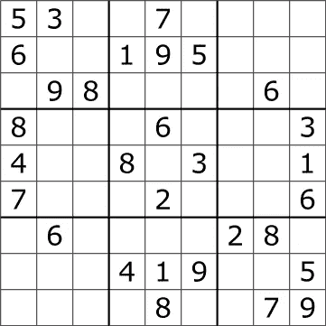

# 人工智能解决数独:卷积神经网络(CNN)。

> 原文：<https://medium.com/analytics-vidhya/how-to-solve-sudoku-with-convolutional-neural-networks-cnn-c92be8830c52?source=collection_archive---------8----------------------->

[马尔扬·布兰](https://unsplash.com/@marjan_blan)途经 [Unsplash](https://unsplash.com/)

## 利用深度学习中的关系推理解决数独。达到 93%的测试准确度。

数独是我们父母和我们曾经玩过的最常见的基于逻辑的游戏之一。让我们面对现实吧，它没有现在玩 CNN 有趣。然而，如果我们可以用 CNN 来玩数独呢？在本文中，我探索了卷积神经网络在这个古老而可爱的游戏中的应用。在我开始之前，我想承认这篇文章的灵感来自于[这个可爱的作品](https://cs230.stanford.edu/files_winter_2018/projects/6939771.pdf)，它是作为斯坦福深度学习课程的一个项目提出来的。最后但同样重要的是，我正在为分析 Vidhya 的第五次数据科学博客撰写这篇文章:)

# 介绍

蒂姆·斯泰尔马赫通过[维基媒体](https://commons.wikimedia.org/wiki/File:Sudoku_Puzzle_by_L2G-20050714_standardized_layout.svg)

基于逻辑的游戏，包括数独，被证明有助于延缓神经系统疾病，如阿尔茨海默氏症和痴呆症。数独是一个 9×9 的网格，人们需要用数字填充它，这样每一列、每一行以及组成棋盘的九个 3×3 子网格中的每一个都包含从 1 到 9 的所有数字。我介绍的工作使用两种不同类型的神经网络来解决这个问题，它们是 CNN 和 RNN。然而，作者发现基于 CNN 的架构表现得更好，达到 86%的测试准确率，而后者仅达到 47%的测试准确率。因此，我想提出前一种解决方案，并展示如何有效地使用 CNN 来解决这个问题。

# 资料组

在开始讨论我的解决方案之前，我想指出我使用的数据集可能会有所不同。此外，我的评估指标是解决的数独的数量/数独的总数，而作者计算预测与解决方案匹配的空白的数量/空白的数量。因此，很难比较我的测试结果。名为“一百万个数独游戏”的数据集在 Kaggle 上公开发布。该架构在 800，000 个数独游戏上进行训练，并在 200，000 个游戏上进行验证。

# 数据处理

考虑到我们正在将未解决的数独输入 CNN，我们将它的形状改为(1，9，9)。此外，我们通过将其除以 9 并减去 0.5 对其进行归一化，由此我们获得了零均值中心数据。神经网络通常使用以零为中心的标准化数据表现得更好。最后，我们希望我们的模型能够像在分类任务中一样预测最可能的数字。因此，想象一下，我们需要将标签 0-8 分配给相应的数字 1-9。因此，我们从它的溶液样本中减去 1。

# 模型架构

我正在使用一个非常相似的架构，在[这个作品](https://cs230.stanford.edu/files_winter_2018/projects/6939771.pdf)中有介绍。因此，作者提出了 16 层 CNN，其中前 15 层的每一层具有 512 个滤波器，最后一层是具有 9 个滤波器的 1 乘 1 卷积。因此，数独棋盘中的每个单元格都有一个长度为 9 的概率数组，其中每个元素都对应于它的标签。我附上 Pytorch 实现。请花时间去理解这个架构是如何工作的。

# 培养

我训练了 5 个纪元的网络，批次大小为 64。学习率选择为 1e-4。最后，我使用了作者提到的 Adam optimizer 和交叉熵损失。最终验证损失最终约为 0.11。

# 解决数独:问题

在测试我的模型时，我注意到它很少能完美地解决数独，因此通常会有一些错误的预测。因此，我的准确性很糟糕，因为它不到 10%。我想这就是为什么作者计算了预测与解决方案/空白数量相匹配的空白数量。所以，我尝试用不同的方法来解决这个问题。我决定试着一次填一个空格。因此，我只取 9x9 网格中概率最大的一个预测，因此我一直把它传递给模型，直到一块板完成。正因为如此，我的准确率大幅提高，达到了大约 93%。这是我的日志文件的一部分。

A *精度:1969/2112
精度:2026/2176
精度:2081/2240*

# 一些遗言

有很多方法可以解决这个问题。在这篇文章中，我想介绍其中的一个。因此，正如它所显示的，CNN 可以有效地用于解决数独游戏，我的测试准确率约为 93%。如果你有兴趣阅读更多，我强烈推荐阅读[这部激发我灵感的作品](https://cs230.stanford.edu/files_winter_2018/projects/6939771.pdf)。我认为这对任何学习 CNN 的人来说都是一个很好的练习。我的工作，是用 Pytorch 实现的，在 [GitHub](https://github.com/chingisooinar/sudoku-solver.pytorch) :)上很容易找到，最后，可以随意分享你的想法或观点。