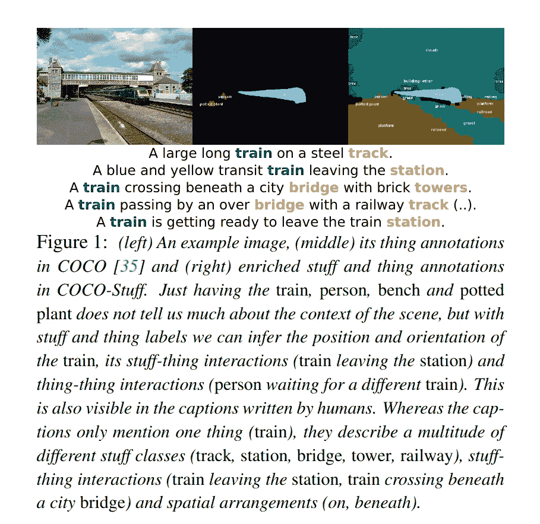
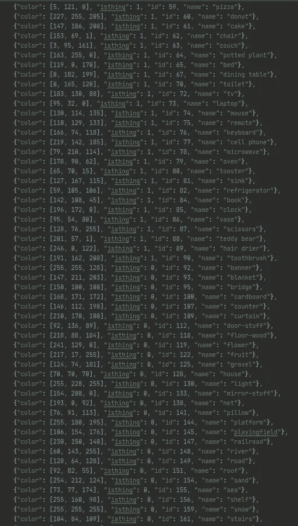

# 如何加快检测器 2 的检测速度

> 原文：<https://medium.com/analytics-vidhya/how-to-speed-up-detection-in-detectron2-263e9e1472e4?source=collection_archive---------1----------------------->

无需定制训练模型，提高 FPS 的简单提示和技巧。


马修·布罗德在 [Unsplash](https://unsplash.com?utm_source=medium&utm_medium=referral) 上的照片

# **什么是探测器 2？**

Detectron2 是由脸书人工智能研究所开发的用于目标检测的下一代软件系统。

目标检测是指识别、定位和预测图像中目标的属性。

*你可以在这里找到**[](https://github.com/facebookresearch/detectron2)**。***

**Detectron2 是一个存储库，可用于实例分割、包围盒检测、人物关键点检测和语义分割等检测任务。**

**使用的数据集是 COCO(上下文中的公共对象)，LVIS(大词汇实例分割)，CityScapes，PascalVOC。**

**探测器 2 已经很快了，推理时间更少。这可以进一步减少。**

**[**模型动物园**](https://github.com/facebookresearch/detectron2/blob/master/MODEL_ZOO.md) 中提到的推断时间是相对于为各自的配置文件指定的图像尺寸而言的。**

# ****如何加快检测速度？****

**提高 FPS 的一种方法是通过**降低** **你的图像分辨率**。图像分辨率越低，每幅图像的推断速度越快。**

**图像分辨率低于模型动物园中提到的分辨率将有助于加快进程，特别是如果你用它来视频，几毫秒的区别。**

**另一种方法是通过**跳过帧**当使用视频输入并且视频中没有快速移动时，跳过几帧不会造成伤害，因为不会丢失主要信息。**

**除了跳过帧，在读取帧时应用**线程**。确保只处理最新的帧。在 predictor.py 中进行预测之前，您可能需要在这方面做一些更改。**

**如果你想加速可视化过程，Detctron2 提供了并行处理。**

**在 predictor.py 中:
更改 **parallel=True** 以在不同的进程中运行模型。**

**你也可以在预测的时候改变颜色模式。Detectron2 为**实例可视化**提供了 3 种模式。**

1.  ****IMAGE = 0** *为每个实例随机选取一种颜色，用低不透明度叠加分割。***
2.  ****SEGMENTATION = 1** *让同一类别的实例有相似的颜色(来自 metadata.thing_colors)，用
    高不透明度叠加。这提供了对分割质量的更多关注。***
3.  ****IMAGE_BW = 2** 仅可用于绘制每个实例的遮罩预测。**

**Detectron2 涵盖了大部分类别。可能的情况是，您只想从该帧中检测几个类。**

**为了对这几个类使用现有的代码，我们首先需要获得类的列表和它们对应的类 id。**

**要获取类别列表，您可以点击[此链接，](https://detectron2.readthedocs.io/tutorials/datasets.html)并用您正在使用的数据集替换您的数据集。一般我们用 coco 2017 数据集。**

```
**from detectron2.data import MetadataCatalog
MetadataCatalog.get("coco_2017_val").thing_classes = ["person", "car"]**
```

**或者你也可以直接在数据集中寻找类**

**对我来说，我使用 detectron2 进行全景分割，我需要知道用于定制的类 id。**

**在语义类的 COCO 数据集中，我们有两个部分**

**对于像汽车或人这样具有明确形状的类，我们有**事物类**
，对于无定形的背景区域、天空、道路或草地，我们有**填充类**。**

**在 COCO- **Stuff** 数据集中，除了 COCO 中的 80 个 **thing** 类，我们还有 91 个 Stuff 类。**

**附加的东西注释使得能够研究复杂 COCO 图像中的东西之间的交互。**

****

**如果你想知道更多关于如何以及为什么考虑东西类会更好地理解场景，你可以参考 [**论文**](https://arxiv.org/abs/1612.03716) 。**

**现在，为了获得类 id、名称及其颜色的列表，我们可以参考 **builtin_meta.py** ，你可以在 datasets 文件夹中找到它。**

****

**东西类和东西类**

**一旦你有了自己的“ **category_id** ”，你就可以开始定制了。**

**为此，您可以在 **video_visualizer.py** 或 **visualizer.py** 中进行更改**

```
**for mask, sinfo in pred.semantic_masks():
    category = sinfo["category_id"]
    if category == 3:
        category_idx = sinfo["category_id"]**
```

**我在做材料类的工作，因此对我来说是=0。并且 category_id=9 表示花。**

**你也可以根据需要改变你的班级的颜色。**

**在同一个帧中使用以上所有内容，我能够在 RTX 2060 上实现 10 的 **FPS，用于检测 2 个类别，此时 COCO 全景 FPN 的全景分割基线为 **3 FPS** (所有类别)**。******

> **我是一名电子和电信工程师。我发现数据科学很迷人，这就是为什么我决定学习机器学习和大数据分析，目前担任人工智能工程师。希望能为这个不断成长的数据科学社会做点贡献。你可以在 [**LinkedIn**](https://www.linkedin.com/in/anuja-ihare-a5b622b7) 上联系我。**