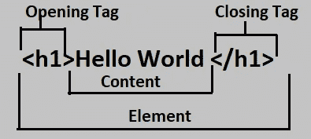
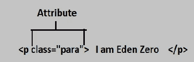
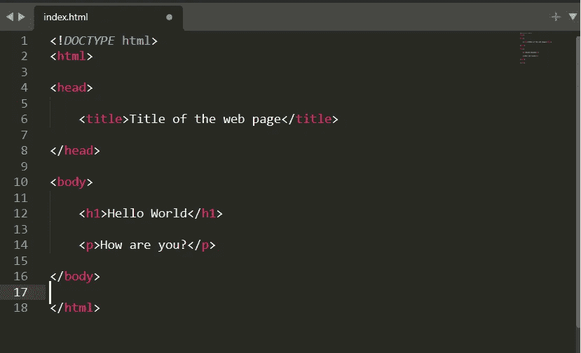

# 如何开始用 HTML 编码

> 原文：<https://medium.com/analytics-vidhya/how-to-start-coding-with-html-2d53e7440d89?source=collection_archive---------15----------------------->

## **如何开始用 HTML 编码**

在我们开始学习如何开始用 HTML 编码之前，让我们先了解和学习一下它的历史，它是做什么的，它是如何工作的，它在哪里被使用？那我们开始吧:

**什么是 HTML？**

HTML 代表**超文本标记语言**，是网站或网络应用开发中唯一使用的标记语言。它是一种编码语言，被开发人员用于网络开发。HTML 不被认为是编程语言，因为我们不能开发动态功能。相反，它用于创建和设计结构、段落、视频、链接、图像等。它也是用于**网页设计**的**第一语言**。

从代表超文本标记语言的 HTML 的完整形式来看，第一部分“**Hypertext**T”意味着它有“Text 内的 T **ext”，用于链接其他网页。第二个和第三个单词“**标记语言**告诉我们，它**格式化**并开发网站的**布局**，并帮助使**内容更具交互性**。**

现在让我们了解一下它的历史？

**HTML 历史**

HTML 是由蒂姆·伯纳斯·李爵士创造的，并于 1991 年底首次引入。直到 **1996 HTML** 没有任何规范，也没有被**万维网联盟(W3C)** 商业使用。在 2000 年，HTML 也成为了国际技术标准。

**HTML 版本**

**HTML 2:**1995 年**发布，更新至 1997 年 1 月**。****

****HTML 3:**1997 年**1 月**出版，同年**到期。****

**HTML 4: 它于 1997 年 12 月**出版，一直使用到 2000 年 5 月**。******

******HTML 5:** 发布于**2014 年 10 月**目前所有网络浏览器都在使用**最后一次更新是在 2017 年 12 月**。****

******HTML 如何使用，在哪里使用？******

****例如，当我们访问一个像雅虎这样的网站时，我们会发现很多页面都在里面，比如主页、登录页面、新闻等等。所有这些都是**使用 **HTML** 开发的**，HTML 在**不同的文件**中**单独呈现。因此，HTML 被用于**网站和网络应用开发**。******

**要开始用 HTML 写作，我们首先需要一个**代码编辑器**，我们可以在网上找到许多代码编辑器，我们可以很容易地将它们安装在我们的台式机或笔记本电脑上。下面是我推荐给你的几个代码编辑器[**Visual Studio**](https://code.visualstudio.com/download)[**崇高文本**](https://www.sublimetext.com/)[**括号**](http://brackets.io/) 和 [**原子**](https://atom.io/) 。一旦你下载并安装了你喜欢的代码编辑器，你就可以开始编写你的 HTML 代码了。**

**现在您已经完成了代码编辑器的安装，您首先需要将文件保存为**。html 扩展名**，因为只有**网络浏览器**能够**理解**这是一个 **HTML 文件**，并且能够读取内容并在浏览器上显示给用户。现在你可以开始写你的 HTML 代码了。**

****HTML 怎么写？****

**正如我们之前告诉你的，HTML 是一种由**元素**组成的**标记语言**，所有的**内容都写在**中。一个 HTML 元素总是以一个**开始标签**开始，以一个**结束标签**结束，但是也有一些**例外**，比如 **< img >标签**等等，其中**不需要**一个**结束标签**。正如你在下图中看到的，一个基本的 HTML 元素是什么样子的。**

****

****开始标签:**开始标签由元素的名称组成，这里是 h1，它包含在一个开始和结束尖括号之间。**

****结束标签:**结束标签的书写模式与开始标签相同，唯一的区别是结束标签在元素名称前有一个正斜杠。**

****内容:**它包含了我们希望在网站上显示的所有细节。**

****元素:**由开始标签、结束标签和内容组成。**

**除此之外，一个 HTML 标签还包含一个属性，它包含了文件连接中使用的额外信息。属性看起来是这样的:**

****

**正如你在上面的图片中看到的,“Class”是属性名,“para”是该属性的值，稍后用于修改 HTML 元素。**

****现在让我们写一个简单的 HTML 代码:-****

****

**这是一个 HTML 文件的结构。它由以下要素组成**

****！DOCTYPE > :** 是**文档类型**告诉浏览器 HTML 的版本。**

****< html > :** 它告诉浏览器这是一个 **HTML 文档**。并且它的末端带有一个**结束标记**在主体标记的末端。**

****< head > :** 它是第**个元素**，由标题、元数据、外部链接以及**它的**里面的很多其他元素组成。**

****<正文> :** 正文由**用户**在网站上可见的所有内容**组成。它还包含一个**结束标记**，该标记位于结束 HTML 元素之前的末尾。****

**这就是 HTML 文档的样子。**

**这里有几个网站链接，你可以从这里开始学习 HTML 并开始开发你的网站或网页: [**freecodecamp**](https://www.freecodecamp.org/) ， [**w3schools**](https://www.w3schools.com/html/) ， [**udemy**](https://www.udemy.com/) ，以及 [**courser**](https://www.coursera.org/in) 。**