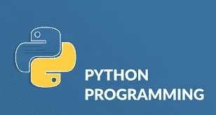

# 如何开始用 Python 编码

> 原文：<https://medium.com/analytics-vidhya/how-to-start-coding-with-python-25a5b75ea9de?source=collection_archive---------18----------------------->

Python 编程

**Python**

python 及其编码介绍。

Python 是一种广泛使用的、解释性的、面向对象的、具有动态语义的高级编程语言，用于通用编程。Python 编程语言来源于一部名为《巨蟒剧团的飞行马戏团》的 BBC 电视喜剧小品系列。

**巨蟒的目标**

*   简单直观的语言。
*   开源。
*   像普通英语一样简单易懂的代码。
*   适合日常任务。

**如何获得 Python 以及如何使用它**

根据您使用的操作系统，有几种方法可以获得您自己的 Python 3 副本。

Linux 用户很可能已经安装了 Python——这是最有可能的情况，因为 Python 的基础设施被许多 Linux 操作系统组件大量使用。

例如，一些发行商可能将他们的特定工具与系统结合在一起，其中许多工具，如包管理器，通常是用 Python 编写的。Linux 世界中可用的图形环境的某些部分也可能使用 Python。

如果您是 Linux 用户，打开终端/控制台，键入:python3

在 shell 提示符下，按 Enter 键并等待。

如果你看到类似这样的内容:Python 3.4.5(默认，2017 年 1 月 12 日 02:28:40) [GCC 4.2.1 兼容 Clang 3 . 7 . 1(tags/RELEASE _ 371/final)]在 linux 上键入“help”或“license”了解更多信息。那么您知道 Python 已经存在于您的系统中。

如果没有 python3，那么请参考您的 Linux 文档，以便找到如何使用您的包管理器来下载和安装一个新的包——您需要的包被命名为 Python 3，或者它的名称以 Python 3 开头。

所有非 Linux 用户都可以从给定的链接[https://www.python.org/downloads/](https://www.python.org/downloads/)下载 Python。

**下载并安装 Python**

当你进入网站时，浏览器会让你知道你使用的是什么操作系统，然后你唯一需要做的就是点击你想要的合适的 Python 版本。

在这种情况下，选择 Python 3。该网站总是为您提供它的最新版本。

如果您是 Windows 用户，启动下载的。exe 文件并遵循所有步骤。

暂时保留安装程序建议的默认设置，只有一个例外——查看名为“将 Python 3.x 添加到路径”的复选框并选中它。

这将使事情变得更容易。

如果您是 macOS 用户，您的计算机上可能已经预装了 Python 2 的版本，但是由于我们将使用 Python 3，您仍然需要下载并安装相关的。来自 Python 站点的 pkg 文件。

**使用 Python 开始工作**

现在您已经安装了 Python 3，是时候检查它是否工作并首次使用它了。

这将是一个非常简单的过程，但是它应该足以让您相信 Python 环境是完整的和起作用的。

利用 Python 的方法有很多，尤其是如果你想成为一名 Python 开发者的话。

要开始工作，您需要以下工具:

*   一个编辑器，它将支持你写代码(它应该有一些特殊的功能，不可用的简单工具)；这个专用编辑器会给你比标准 OS 设备更多的东西；
*   一个控制台，你可以在其中启动你新写的代码，并在它失去控制时强行停止它；
*   一个名为调试器的工具，能够一步一步地启动你的代码，并允许你在每一个执行的时刻检查它。

除了许多有用的组件，Python 3 标准安装还包含一个非常简单但非常有用的应用程序，名为 IDLE。

IDLE 是一个缩写:集成开发和学习环境。

浏览你的操作系统菜单，找到 Python 3.x 下的 IDLE 并启动它。这是你应该看到的:

# 如何编写和运行你的第一个程序

现在是时候编写和运行您的第一个 Python 3 程序了。就目前而言，这很简单。

第一步是创建一个新的源文件，并用代码填充它。点按 IDLE 菜单中的“文件”,然后选取“新建文件”。

如你所见，IDLE 为你打开了一个新的窗口。你可以用它来编写和修改你的代码。

这是**编辑器窗口**。它唯一的目的是成为一个处理源代码的工作场所。不要混淆编辑器窗口和 shell 窗口。它们执行不同的功能。

因为编辑器窗口目前是无标题的，但是从命名源文件开始工作是一个好习惯。

点按“文件”(在新窗口中)，然后点按“另存为...”，为新文件选择一个文件夹(桌面是首次尝试编程的好地方)，并为新文件选取一个名称。

**注意:-** Python 需要它的文件有*。py* 扩展名，所以你应该依赖于对话框窗口的默认值。使用标准。py 扩展名使操作系统能够正确打开这些文件。

现在您已经完成了文件的保存。是时候开始写一些 Python 代码了。那么，让我们从最简单的哪一个开始:- **“你好，世界！”**

该代码将由以下部分组成:

单词 print

左括号；

引号；

一行文字你好，世界！；

另一个引号；

右括号。

这是在编辑器中编写的代码的外观:-

现在，在菜单栏中单击 run，如果一切正常，代码中没有错误，控制台窗口将显示运行程序的效果。

现在你已经成功地编写了你的第一个 Python 代码。