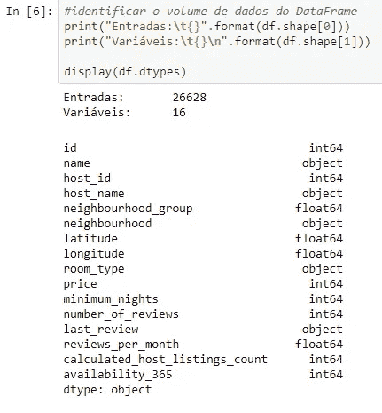
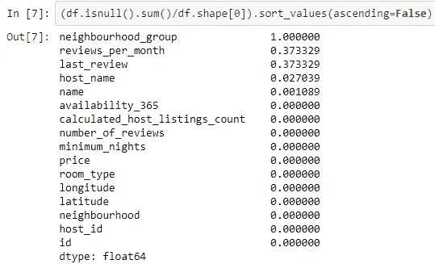
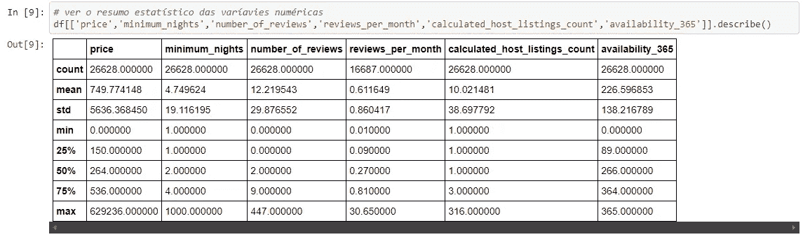
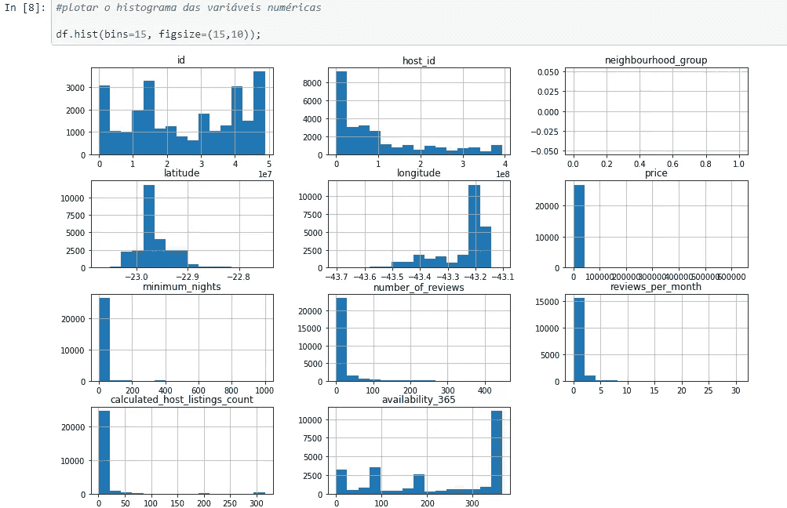

# 如何通过几个步骤开始 EDA 方法

> 原文：<https://medium.com/analytics-vidhya/how-to-start-the-eda-method-in-a-few-steps-fa38346a7066?source=collection_archive---------8----------------------->

让我们想象一下，你带着新冠肺炎疫苗，想去美丽的里约热内卢。但是在你去旅行之前，首先你必须决定一些信息，比如你想住在哪里，比如附近，价格，住宿天数和其他事情？

要做到这一点，你可以查看一些有效的应用程序，以芯片价格找到住宿的地方，并尝试找到旅行的最佳交易，但你从应用程序中获得的答案与你的想法不符，所以现在你想挖掘更多关于如何以低成本和最佳视角进行最佳旅行或住宿的信息。

现在要做到这一点，你可以访问其中一个应用程序的数据，并查看他们网站上的数据。对于这个例子，我将使用里约热内卢市 Airbnb 网站上的数据。完成这一步后，我们现在必须调查数据集，并尝试为初始提案找到最佳选项。为此，我们可以通过 EDA 方法探索数据集，探索性数据分析(EDA)，我们将回答这些问题，并帮助我们在数据集中进行更好的分析。

探索性数据分析是一种方法，它将使数据集更加清晰，并使数据在工作中更加可靠，因为这种方法通过描述数据集和使用统计工具分析原始数据集来调查数据，并通过这种方法来了解数据集的好坏。

如前所述，EDA 方法可以向我们展示数据集的质量，这是因为该方法包括检查数据集的一些点，如缺失值或 Nan 值、异常值、每个变量的数据类型、数据集的大小等。

现在，我将展示并解释这项调查工作的一些部分，首先，我们需要知道哪些变量可以使用或不可以使用，为此，我们必须知道数据的类型，如下图所示:

在上图中，我们有描述工作，因为我们首先想知道的是变量的类型。在发现每个变量的类型后，我们可以检查它在数据中没有任何问题。上图没有问题，但即使没有问题，这也是我们必须做的一部分，帮助我们检查数据集的质量。现在完成了这些，我们将寻找在我们的数据集中哪里有**缺失数据**或 **Nan 值**，每个变量的权重是多少，如下图所示。

正如我们所看到的，在上图中，我们对每个变量的 Nan 值或缺失值的数量进行了调查，这有助于我们决定项目可以采用哪些列，以及哪些列更好使用或不使用。因此，在完成这两个步骤后，现在我们可以开始查看数据，并采取一些统计措施来了解数据的分布情况，如平均值、众数、标准方差，因为如果有意义，我们可以使用这些措施之一来填补缺失值，这将比处理缺失点或 Nan 值对分析造成的损害更小。

所以看上面的图，我们可以注意到几个点，比如列*价格*的最大值远高于 75%最大值，所以这可能意味着我们这里有一个异常值，我们可以看到的另一件事是在列 *minimum_night* 中，最大值是 1000，这是一个错误的数据，因为一年中的最大天数是 365 或 366，所以这可能是一个错误的数据，我们必须避免使用它。

现在完成了这两个步骤，如果您想检查或验证数据集中的其他点，您可以绘制直方图，如下图所示。

在这里，我们可以看到所有列的直方图，并通过它来决定使用哪个变量，因为关于变量*价格*的直方图有一些问题，比如异常值，异常值改变了数据的真实含义。同样的事情发生在变量*最小夜晚*上，我们可以看到同样的事情，但是比例不同。

可以肯定的是，你可以在你的数据集中挖掘更多的东西，并改进分析，这就是 EDA 方法的魅力所在。我们可以使用所有这些统计工具来改进分析，从而更准确地制定商业计划。

这篇文章只是第一篇关于如何看待你的数据和做一些重要的笔记。我在这篇文章中使用的图片来自我做的关于数据科学的第一个项目，如果你想要这里的，请放心检查。