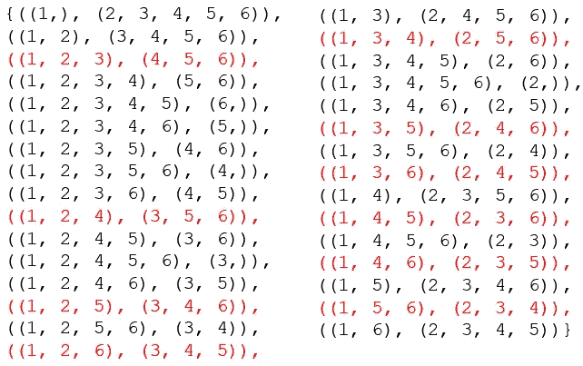

# 如何计算忽略元素顺序将一个项目列表划分成相同大小的子集的方法

> 原文：<https://medium.com/analytics-vidhya/how-to-the-count-number-of-ways-that-a-list-of-items-can-be-partitioned-into-identical-sized-8be50c2757ae?source=collection_archive---------1----------------------->

也就是组合学的乐趣…

这篇文章最初是想并入我写的另一篇关于婚礼座位问题的文章。

[](/analytics-vidhya/building-a-wedding-seating-plan-using-probabilistic-methods-simulated-annealing-8f31d8987026) [## 使用概率方法和模拟退火建立婚礼座位计划

### 本文涵盖了婚礼座位计划问题，这是一个组合难题，如何最好地分配客人…

medium.com](/analytics-vidhya/building-a-wedding-seating-plan-using-probabilistic-methods-simulated-annealing-8f31d8987026) 

不幸的是，数学变得有点多，我想放一篇小文章的标题，准确地描述这是如何帮助其他有同样问题的人轻松找到解决方案的。

所以问题陈述是“有多少种方法可以将一个 M 项的列表划分成大小为 N 的均匀大小的集合？”我应用这一方法的实际例子是，计算出给定客人名单和设定的桌子大小可能有多少座位安排(在我们允许空座位的条件下，即如果我们有 45 人和 8 人/桌，我们将需要 6 张桌子和 3 个空座位)

对堆栈溢出的快速检查给了我一些接近的东西，但并不完全是我想要的

[](https://stackoverflow.com/questions/312443/how-do-you-split-a-list-into-evenly-sized-chunks) [## 如何将一个列表分割成大小相等的块？

### 我有一个任意长度的列表，我需要把它分成大小相等的块并对其进行操作。有一些…

stackoverflow.com](https://stackoverflow.com/questions/312443/how-do-you-split-a-list-into-evenly-sized-chunks) 

起初这听起来很简单，但在尝试用纸和笔“推理”之后，我意识到我高中的组合数学可能有点生疏了。

因此，我不得不后退一步，从计算元素在给定的一组约束条件下的组合方式的角度，挑选一些基本的构建模块…

[](https://towardsdatascience.com/combinatorics-permutations-combinations-and-dispositions-46604da34882) [## 组合学:排列、组合和处置

### 组合学是数学的一个领域，主要研究对一个或多个集合中的元素进行计数。它可以…

towardsdatascience.com](https://towardsdatascience.com/combinatorics-permutations-combinations-and-dispositions-46604da34882) 

上面的文章很好地涵盖了这些。TLDR 的版本是，对于排列-顺序很重要，在组合中-它们不重要(即[A，B，C]被认为与[C，B，A]相同，与[B，A，C]相同)(现在让我们忽略那些只是*排列的排列，其中我们想要挑选的对象的数量少于对象的总数*)

现在，如果这只是一个简单的问题，问你有多少种方法可以安排一张桌子的座位(例如，nCr，其中 n=45 人，r=每张桌子 8 人)，我们可以忽略座位顺序(即，客人坐在桌子的哪个座位无关紧要)，我们可以这样计算

```
import mathdef nCr(n,r):
    f = math.factorial
    return f(n) / f(r) / f(n-r)nCr(n,r)
```

幸运的是，在最新版本的数学库(Python 3.8 以后)中，这变得非常简单，其中已经有一个预构建的函数 math.comb 做同样的事情。

```
math.comb(n,r)
```

现在的问题是，当你得到一个大的数字时，这种计算往往需要很长时间，所以 Quora 上的这位用户建议使用对数来加速计算过程

[](https://www.quora.com/What-are-the-method-to-calculate-nCr-in-Python-for-large-values-of-r-and-n) [## 对于 r 和 n 的大值，Python 中计算 nCr 的方法有哪些？

### 回答(第 1 题，共 2 题):这取决于你是需要确切的数字(即知道每个位置的数字)还是仅仅…

www.quora.com](https://www.quora.com/What-are-the-method-to-calculate-nCr-in-Python-for-large-values-of-r-and-n) 

```
def log_fact(n): return sum(math.log10(i) for i in range(1, n+1))def big_nCr(n, r): a, b, c = log_fact(n), log_fact(r), log_fact(n-r) return 10**(a-b-c)big_nCr(n,r)
```

这一切都很好，但不幸的是，对于手头的问题，这不仅仅是估计一张桌子可能的组合，而是我们有多少种方法可以让所有不同的客人坐在所有不同的桌子上。

进一步的挖掘让我想到了有趣的斯特林数(第二类)的概念，这是将一组 *n* 对象划分为 *k* 非空子集的方法的数量，用 S(n，k)表示

[](https://en.wikipedia.org/wiki/Stirling_numbers_of_the_second_kind) [## 第二类斯特灵数-维基百科

### 在数学中，特别是在组合学中，第二类斯特林数(或斯特林分割数)是…

en.wikipedia.org](https://en.wikipedia.org/wiki/Stirling_numbers_of_the_second_kind) 

啊哈！就是这个！不幸的是，这个公式并不简单，而且涉及到递归函数。谢天谢地，也有一些关于如何使用 Python 计算英镑数字的在线实现

不幸的是，看着它产生的结果，感觉有点不对劲——如果你有 6 个条目(1，2，3，4，5，6)和 2 个分区(即每个分区每个应该是 3 个字符)，斯特林数(第二种)达到 31，感觉太多了…

我发现了一段[代码，它列举了](https://codereview.stackexchange.com/questions/1526/finding-all-k-subset-partitions)所有可能的集合，这时我意识到大小不均匀的子集也包括在计数中。



S(6，2)的第二类 Stirling 数—我只是在寻找红色，它是 31 中的 10

我所追求的原则上应该更简单，因为我只是在寻找那些大小均匀的。

首先，我想看看能不能写一个脚本来过滤掉所有其他没有相同大小分区的集合，但是我很幸运地发现了这篇 StackOverflow 文章:

[](https://stackoverflow.com/questions/14559946/producing-all-groups-of-fixed-length-combinations) [## 产生所有组的固定长度组合

### 我在寻找一种算法和/或 Python 代码来生成所有可能的方式分割成一组 n 个元素…

stackoverflow.com](https://stackoverflow.com/questions/14559946/producing-all-groups-of-fixed-length-combinations) 

```
from itertools import combinationsdef partitions(s, r):
    s = set(s)
    assert(len(s) % r == 0)
    if len(s) == 0:
        yield ()
        return
    first = next(iter(s))
    rest = s.difference((first,))
    for c in combinations(rest, r - 1):
        first_subset = (first,) + c
        for p in partitions(rest.difference(c), r):
            yield (first_subset,) + p
```

因此，利用这一点，我所要做的就是

```
NoOfArrangements=len(list(partitions(s,r)))
```

唯一不好的一点是它不能很好地扩展——如果你在做 S=6，r=3 这样的事情，它可以很好地工作，但是如果你有 200 个客人和 10 张桌子，那么它将永远需要**运行，因为它试图枚举所有可能的安排。**

我在这里找到了另一个解决方案，它不需要列举答案，只需要计算集合排列方式的总数

[](https://math.stackexchange.com/questions/507681/problem-permutation-and-combination-in-how-many-ways-can-we-divide-12-studen) [## 问题:排列组合:我们可以用多少种方法将 12 名学生分成几组…

### 从 n 个项目中选择 r 个项目的组示例:有多少种方法可以从 6 个学生中选择两个项目的组…

math.stackexchange.com](https://math.stackexchange.com/questions/507681/problem-permutation-and-combination-in-how-many-ways-can-we-divide-12-studen) 

因为它在数学堆栈交换上，所以它不是 Python，但基本思想是答案将由这个等式给出:-

n！/ ((n/k)！*(k！**(不适用))

把它变成 Python…

```
NoOfCombinations=math.factorial(noOfElements)/((math.factorial(noOfElements/r))*(math.factorial(r)**(noOfElements/r)))
```

这种方法的问题是，当数字变得太大时，它仍然会“中断”，例如 200，20，因为我得到了一个“ **OverflowError** : int 太大，无法转换为 float”

我试图找到另一种方法，并发现我可以使用下面的逻辑来估计相同的数字

对于 n，k (n 个元素和 k 个大小的分区)

安排数量

= nCr(n-k*(n/k)，k) x nCr(n-k*(n/k-1)，k)…。x nCr(k，k) / (n/k)！

用 12，3 的数字算出来

nCr(12，3) x nCr(9，3) x nCr(6，3) x nCr(3，3) / (12/3)！= 15400

基本原理是，对于第一个隔间，您有 12 个元素可供选择来填充 3 个槽，在第二个隔间中，您还有 9 个元素来填充 3 个槽，依此类推直到结束。我们除以 12/3！以消除重复的安排。

用代码写出来会给出:-

```
noOfElements=240
r=12list_for_nCr=[]
for i in range(0,int(noOfElements/r)):
    list_for_nCr.append(noOfElements-i*r)list_of_nCr_vals=[]
for element in list_for_nCr:
    list_of_nCr_vals.append(big_nCr(element,r))NoOfArrangements=
np.prod(list_of_nCr_vals)/math.factorial(noOfElements/r)
```

在下面的这款 Google Colab 笔记本上亲自尝试一下吧

[](https://colab.research.google.com/drive/1yq9B-aoSCWUzvPm4hWf6QwyJdUvduId4?usp=sharing) [## 谷歌联合实验室

### 编辑描述

colab.research.google.com](https://colab.research.google.com/drive/1yq9B-aoSCWUzvPm4hWf6QwyJdUvduId4?usp=sharing) 

就这样……(我说过这将是一个简短的……)