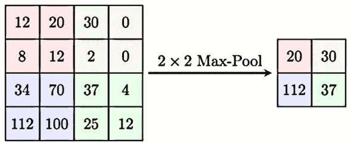

# 如何用强化学习训练 Ms-Pacman

> 原文：<https://medium.com/analytics-vidhya/how-to-train-ms-pacman-with-reinforcement-learning-dea714a2365e?source=collection_archive---------7----------------------->

## 创建一个 DQN 代理来玩雅达利游戏

作者:耶稣·埃内斯托·佩斯凯拉·瓦斯奎兹，马科斯·亚伯拉罕·桑切斯·加林多，何塞·阿尔贝托·莱瓦·孔特雷拉斯。

[索诺拉大学，计算机科学学士](https://cc.unison.mx/)，埃莫西约索诺拉。

# 摘要

Pacman 女士是 Atari 2600 的标志性游戏。随着 OpenAI 的 Gym 的创建，一个用于强化学习算法的工具包提供了为许多游戏创建代理的能力。在这个项目中，我们为 Pacman 女士创建了一个环境，并使用 DQN 网络对其进行了训练。

**Github 资源库**

 [## 星际老兵/Ms-Pacman-DQN

### 深度 Q 学习工具。为难民做准备。DQN 原始仓库(…

github.com](https://github.com/StarVeteran/Ms-Pacman-DQN) 

照片由 [Kirill Sharkovski](https://unsplash.com/@sharkovski?utm_source=medium&utm_medium=referral) 在 [Unsplash](https://unsplash.com?utm_source=medium&utm_medium=referral) 上拍摄

## 介绍

Atari 2600 是一款于 1977 年推出的视频游戏机，它是第一款凭借大量标志性游戏在游戏市场取得巨大成功的游戏机。Pacman 女士于 1981 年推出，是一款街机游戏，是原始 Pacman 游戏的“未经授权”的续集。随着巨大的成功，Namco 将其授权为官方名称。游戏本身和吃豆人游戏很像。不同的是，在这种情况下，主角是一个女人，它还开发了游戏和新的迷宫设计。

《吃豆人女士》中的玩法和原版吃豆人游戏类似。玩家通过吃小球和躲避鬼魂获得点数(如果吃豆小姐碰到了鬼魂，它将失去一条命)。迷宫里还有更大的球，那就是*助推器*(动力球)，让鬼魂蓝一段时间，让它们被吃掉以获得加分。

2013 年，DeepMind 发布了第一个版本的 Deep Q-Network (DQN)，这是一个计算机程序，能够在 Atari 2600 的许多经典游戏上拥有人类水平(甚至更高)的性能。在复杂的强化学习环境中，使用卷积神经网络可用于从原始视频数据中学习成功的控制策略。与人类学习一样，该算法也基于屏幕视觉。从零开始，你会发现让你达到(在很多情况下，超过)人类基准的游戏策略。

## 开放环境 Ms-Pacman-v0

OpenAI MsPacman 环境为 RL 研究人员提供了一个简单的界面，以模拟经典的 MsPacman ATARI 游戏来训练 RL 代理人。MsPacman 环境使用暴露开发者的 210 x 160 三通道 RGB 图像来表示游戏的状态。它还提供了 MsPacman 在任何给定帧中剩余的生命数以及 MsPacman 在游戏过程中积累的游戏内奖励金额的信息。在给定的帧中，MsPacman 有机会执行 9 种可能的操作之一，包括向左移动、向右移动、向上移动、向下移动、对角移动或停留在前一帧中的位置。。每个动作在 k 帧的持续时间内重复执行，其中 k 可以从 2 到 4。

由 [Flickr 上的](https://www.flickr.com/) [SteamXO](https://www.flickr.com/photos/158561476@N06) 拍摄的照片

## 卷积神经网络(CNN)如何工作

卷积网络用于图像识别，通常使用三维张量作为输入。这些图像的高度和宽度是二维的，第三维属于 RGB 颜色。

基本上，你看到的每一种颜色都是由红、绿、蓝三色组合而成的。这些输入被称为通道。

图像通过一个内核进行变换，这个内核是一个滤波器。如果您有一个 RGB 图像，那么每个滤镜都应用于图像中的每个颜色通道。内核遍历通道并计算相应值的点积。这是对所有像素进行的，其中一些像素同时移动。

一旦输入被处理，它们通常伴随着最大池层。它也有一个核大小，但它不是取核点积，而是返回核窗口的最大值，从而用几个扫描子集的最大值创建另一个新矩阵。

## 深度 Q 网络

DQN，或深度 Q 网络，用神经网络逼近 Q 学习框架中的状态值函数。在 Atari 游戏中，它将游戏的多帧作为输入状态值，将动作作为输出状态值。

一般来说，它使用一个*体验回放*将每集的步骤存储在内存中以供学习，其中许多记忆样本是从随机重复中抽取的。它存储代理观察到的转换，允许我们以后重用这些数据。Q-网络针对目标网络进行优化，该目标网络针对每 *k* 步使用最新权重进行周期性更新。通过避免移动目标的短期振荡，这使得训练更加稳定。第一个解决了在线学习中可能出现的自相关问题，重复记忆使这个问题更像是一个监督学习问题。

当代理观察到环境的当前状态并选择一个动作时，环境转换到一个新的状态并返回一个指示该动作结果的奖励。

上图展示了 DQN 的基本架构。正如你所看到的，首先一个代表游戏画面的原始像素向量被输入到一个前馈卷积神经网络。这个 CNN 用来从图像中提取抽象但重要的特征，提供一个更细致入微的游戏状态画面。在馈入一系列卷积和分组层之后，得到的张量馈入一系列完全连接的层，这些层连接到我们的最终输出层，在这种情况下，输出层包含 9 个单元，每个单元的值表示给定输入状态和网络的当前权重时 9 个动作中每个动作的 Q 值。Q 值可以通过网络简单的向前一步来计算。

## DQN 算法

Q-Learning 的主要思想是如果我们有一个函数

这可以告诉我们我们的回报是什么，如果我们在一个给定的州采取任何行动，那么我们可以很容易地建立一个政策，使我们的回报最大化:

但是我们从零开始，所以我们还没有访问 Q*的权限。然而，神经网络可以逼近值，所以我们可以简单地创建一个并训练它类似于 Q*。

对于训练更新规则，每个 Q 函数都服从贝尔曼方程:

因此，Q-网络是一种神经网络，其权重由θ表示，θ作为非线性函数逼近器来逼近 Q#。通过调整θ来训练 Q 网络，以便最小化在反向传播的每次迭代中改变的一系列损失函数。

## DQN 代理人看到了什么？

玩 Atari 的 dqn 在卷积神经网络(CNN)的帮助下利用屏幕，这是一系列卷积层，它们学会从像素值的混乱中检测相关的游戏信息。我们的模型考虑了当前和先前屏幕补丁之间的差异。在给定当前输入的情况下，网络试图预测采取每个行动的*预期回报*。

# 我们在 DQN 的代理人 Pacman 女士的结果

我们在谷歌实验室培训我们的 DQN 代理。培训进行了 50 集，以了解我们的 Pacman 女士如何发挥，结果并不像我们最初想象的那样，在前 25 集，它没有给出我们最期望的分数，它收集了大约 600 分。大约在第 35-40 集时，分数显著增加，在作为示例显示的视频中，分数为 1350 是最好的结果，虽然不多，但这是一个令人满意的进步，50 集的训练时间约为 3 小时。

DQN 代理与文献中最佳强化学习方法的比较。

看看这个用具有卷积神经网络的 DQN 训练的 Atari 游戏的对比图，可以看出 Pac-man 女士在训练时的可玩性水平方面是表现最差的。我们很可能会达到超人的游戏水平，我们将不得不训练我们的模型更长的时间，这将需要更多的计算能力或更多的时间来观察我们的 Pacman 女士如何清除迷宫的明显改善。

# 结论

尽管我们的神经网络训练没有获得最佳结果，但我们已经了解了这种类型的算法和 CNN 是如何工作的，我们不仅看到了网络的结构是如何发现的，DQN 算法是如何工作的，而且还看到了它是如何工作的。在行动中看到接受训练的代理在使用该算法进行训练时的行为

# 参考

 [## DQN 与 CNN:重现谷歌深度思维网络

### 从颜色中学习 Q 值通常，我在这个博客上不怎么从像素或图像中学习 RL，因为 1)我的研究…

www.datahubbs.com](https://www.datahubbs.com/deepmind-dqn/)  [## 强化学习(DQN)教程- PyTorch 教程 1.8.1+cu102 文档

### 作者:Adam Paszke 这个教程展示了如何使用 PyTorch 来训练一个深度 Q 学习(DQN)代理

pytorch.org](https://pytorch.org/tutorials/intermediate/reinforcement_q_learning.html)  [## 高级 DQNs:用深度强化学习玩吃豆人

### 2013 年，DeepMind 发布了其深度 Q 网络(DQN)的第一个版本，这是一个能够达到人类水平的计算机程序

towardsdatascience.com](https://towardsdatascience.com/advanced-dqns-playing-pac-man-with-deep-reinforcement-learning-3ffbd99e0814) 

这个项目是为索诺拉大学的神经网络作业而开发的。感谢 Julio Waissman 博士使这个项目成为可能。