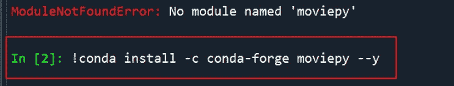
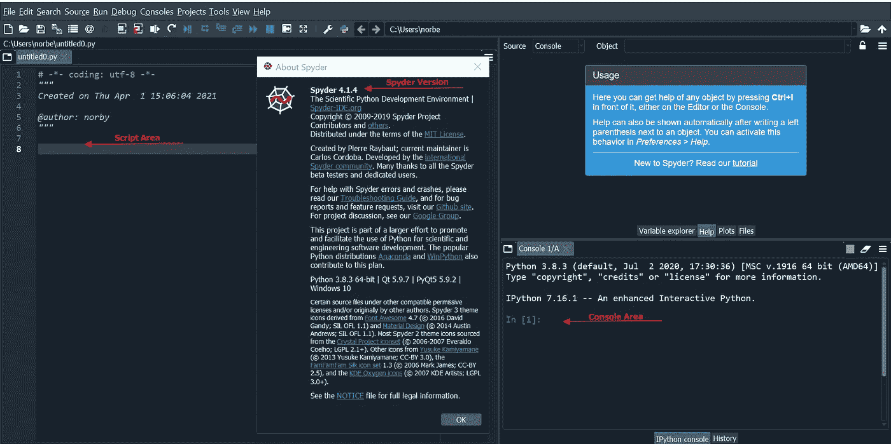
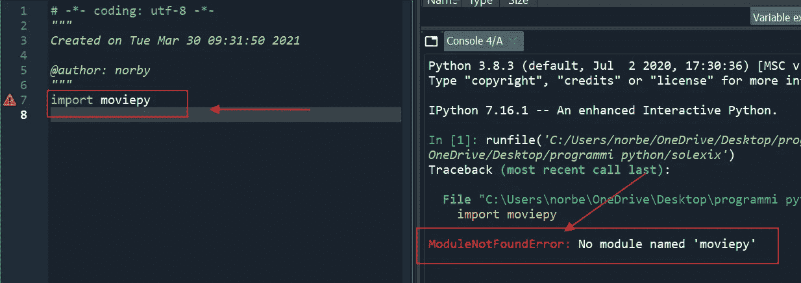
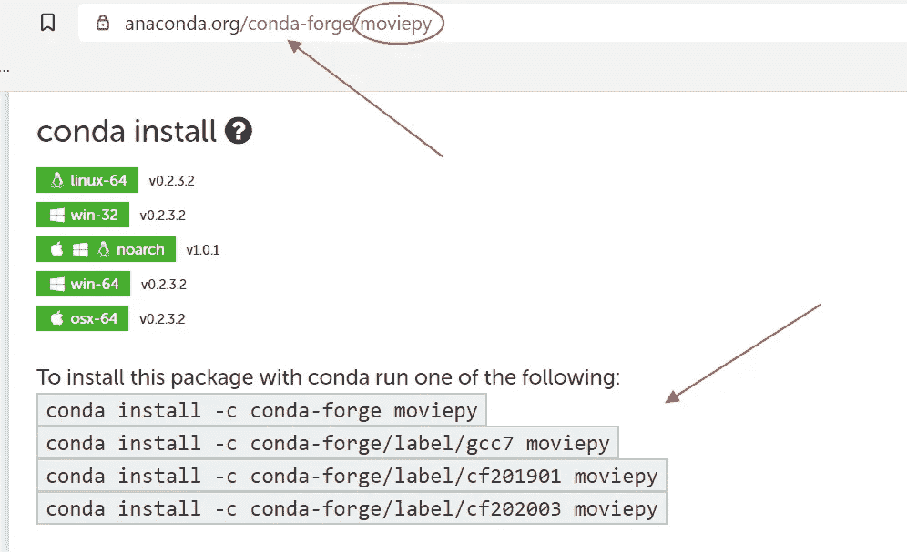
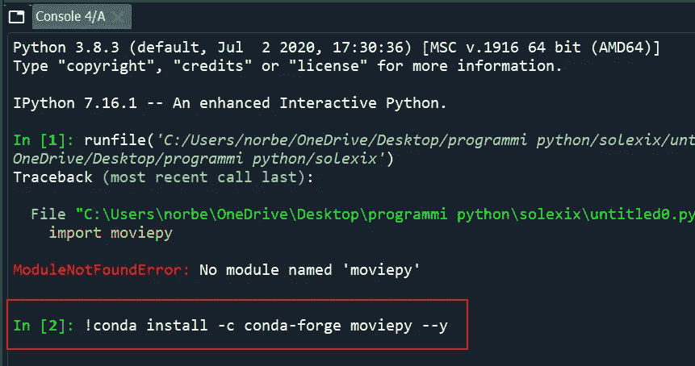
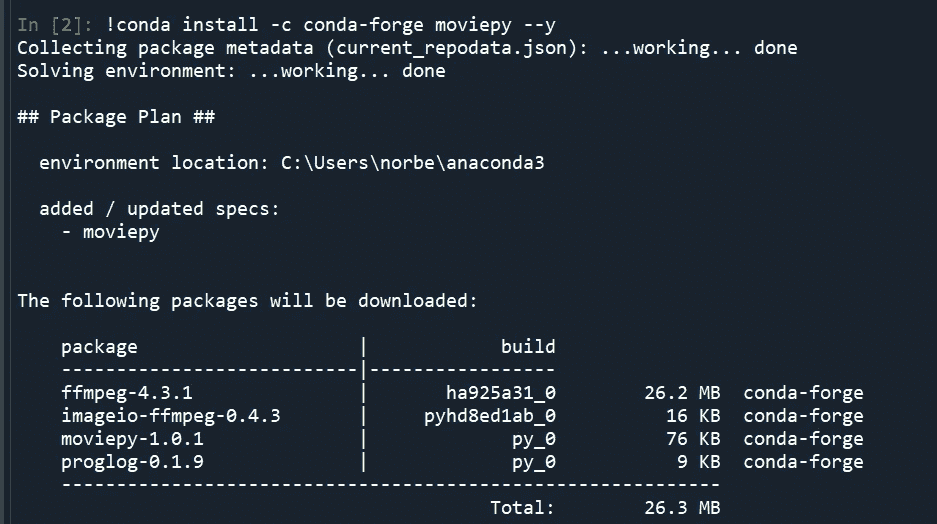
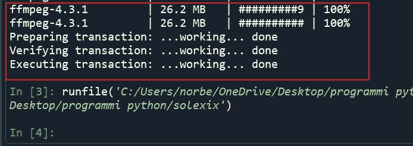

# 如何在 Spyder 上更新 Python 缺失的库——通过控制台区域使用 Conda。

> 原文：<https://medium.com/analytics-vidhya/how-to-update-python-missing-libraries-on-spyder-via-the-console-page-using-conda-41026d81d0a3?source=collection_archive---------2----------------------->

诺贝托·乔菲

— — — — — — — — — —

像许多人一样，当使用 Spyder 编写和运行 Python 脚本时，我确实想念一些标准设置中没有包含的库。

通常所有的更新都是通过 pip 命令[【1】](#_ftn1)下载和安装的。但是不管怎样，本地开发环境并没有立即与 Python 链接，这实际上决定了库在 Spyder 上是不可见的。在过去的一篇文章中，我描述了一个如何强制这个过程的快速解决方法——点击这里[【2】](#_ftn2)。

无论如何，一个更稳定和全面的方法可以通过 Conda 安装缺失的库，通过使用开发应用程序上的控制台区域。

怎么会？没有烦恼，真的易如反掌[【3】](#_ftn3)。

举个例子，我们试着安装一下**movie py**[**【4】**](#_ftn4)库——一套为 Python 上的视频编辑开发的函数。

如你所见，我有 Spyder 版本 4.1.4。另外，看一下图像，确定脚本区域(左侧)和控制台区域(右侧):

运行脚本时，控制台区域会显示缺失模块错误消息:

因此，让我们在 web 上找到包含运行 conda 过程的行代码的 Anaconda 页面:

现在，在 Spyder 控制台区域，让我们键入找到的第一个命令行，在开头添加一个感叹号“！”在"- - y" +结尾输入:

*！conda install-c conda-forge movie py--y(+ENTER)*

这可能需要几分钟的时间，但是您可以在下面查看，安装将会执行:

…

希望这能帮助那些和我一样被困的人，几天前的下午，外面阳光明媚，是散步的绝佳机会。再见:)

— — — — — — — — — — — — — — — — — — — — — — — — — — — — — — —

[【1】](#_ftnref1)一些参考资料在这里:[https://www.youtube.com/watch?v=jnpC_Ib_lbc](https://www.youtube.com/watch?v=jnpC_Ib_lbc)

[【2】](#_ftnref2)[https://medium . com/analytics-vid hya/python-on-spyder-modulenotfounderror-a-trick-51c 058129 e17](/analytics-vidhya/python-on-spyder-modulenotfounderror-a-trick-51c058129e17)

[【3】](#_ftnref3)感谢**的视频，链接如下:[https://www.youtube.com/watch?v=Yr_ihLKq_yY](https://www.youtube.com/watch?v=Yr_ihLKq_yY)**

**请在这里找到更多关于它的信息:【https://zulko.github.io/moviepy/】T2**