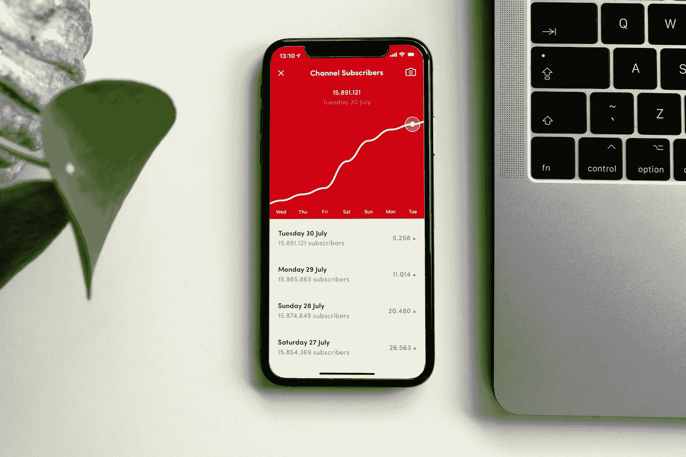

# 如何使用 DAX 中的 27+统计函数—第 13 章

> 原文：<https://medium.com/analytics-vidhya/how-to-use-27-statistical-functions-in-dax-dax-in-power-bi-chapter-13-83dab8b23436?source=collection_archive---------3----------------------->

## 我们将使用实际例子来探索 DAX 中的 28 个关键统计函数。

由 [Unsplash](https://unsplash.com/s/photos/statistics?utm_source=unsplash&utm_medium=referral&utm_content=creditCopyText) 上的 [CardMapr.nl](https://unsplash.com/@cardmapr?utm_source=unsplash&utm_medium=referral&utm_content=creditCopyText) 拍摄的照片

根据[微软文档](https://docs.microsoft.com/en-us/dax/relationship-functions-dax) n，DAX 中有不同的统计和聚合函数。